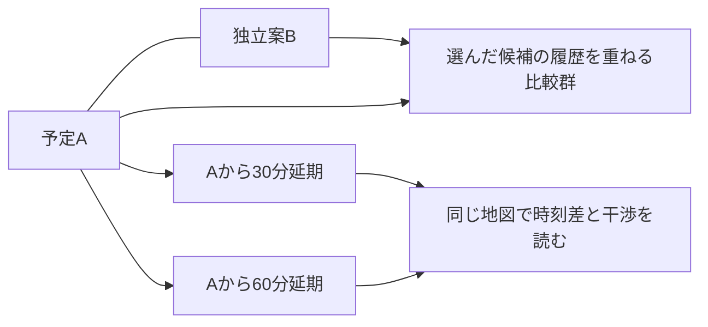

<!-- LOGIC:RESEARCH-UI:BEGIN -->
# 画面を触れない研究者のための利用行程

[更新:0.59.0] [確認:0.59.0] — RESEARCH-UI / REV-590-DEPENDENCY-RESEARCH-UI

本書は、機能一覧では伝わらない**利用者が何を見比べ、何を変え、どこへ戻って判断するか**を説明する。[BRIEF](BRIEF.md)の目的と合わせて読む。0.40.1 r2の一枚一枚の画面は、実用を想定して改善を重ねた具体的成果である。これを素材に共通platformへ統合し、入力・保存・実計算との未解決の接点を並行して直す。細部の変更はできるが、効用だけ抽出した別画面への再発明を移行とは呼ばない。変更案は元の画面・操作との対応と改善理由を示す。

0.46時点では、具体画面と実入力/固定結果/保存の接点を統合し、実n=1の候補・延期比較と写真3D→2D復帰を有限に確認した。これは本書で説明する人工分散の全機能移行や実MCの完成ではない。0.46の確認範囲は[指示書S35](../../BOOTSTRAP_RUNBOOK.html#S35)。0.47では同じ具体画面に実GFSの取得計画・明示取得/適用・入力保持を接続し、保存再閲覧を有限に確認した。0.48では固定場・一元量の仮分布から作る実標本を、経験範囲、延期と干渉群の比較、同じ群の入力/履歴、保存再閲覧へ接続した。0.49では同じ画面を使う48/192実試行の費用を測り、実JRA期間集計の年間/地域図と保存再読を接続した。年/時間帯を選ぶ過去4D場や季節飛行は未接続で、下記の原模型の全操作を実資料で再現したことにはしない。現在実物と確認範囲は[S36](../../BOOTSTRAP_RUNBOOK.html#S36)、実sourceとの対応は[SCREEN_PROVENANCE](../../frontend/SCREEN_PROVENANCE.md)へ戻る。以下の原模型の観察日はそのまま保持する。

本書の行程説明の対象はGitに保存した0.40.1 r2模型。0.46〜0.49の有限接続によって、本書の機能全体が較正済みの気象/機体MCや過去場へ接続済みになったという意味ではない。0.45の二候補n=1接続は計算/保存の有限成果で、その簡略画面を後続GUIの基準にしない（D-185）。予報の入口・条件編集・延期ダイアログ・詳細・気象4画面・季節計画への遷移は2026-09-28に主担当が実画面を読み直した。写真3DはS34の以前の観察記録と設計本文に基づき、この再読ではキー接続していない。この原模型の観察時点では、過去飛行の比較と実標本の入力分布診断は画面として成立していなかった。0.48の一元量・選択群の実診断とは時点と対象を分ける。原模型は [VISIONの保存索引](../SIMULATOR_VISION.html#model-archive)にあるZIPから戻れる。研究の開始にその展開や操作は要求しない。

**画面の人工データと本体計算を分けて想像する。** 現模型は操作の関係を試すもので、表示の即時変化は実気象MCの速度ではない。画面に残る「実計算」という表記も人工標本の再集計を指しており、実飛行核との接続済みと読まない。季節試算は放球点の人工気柱を固定する簡略計算で、飛行先の時空間場・地形着地・支持切れまで解いた結果ではない。これらの限界を実システムへどう置き換えるかが研究課題である。

## 原図を読むときの入口

初回に渡す風分析PDFでは、**物理頁35〜43の図14〜20・23**で「年間の高度差→月のプロファイル/風配→地域差」という比較の組合せを、**物理頁45・48の図25・29**で風から落下の問いへの移り方を見る。図の所在と読み方は下記第5節およびWIND_REPORT_REVIEW第11節へ対応させた。単に図の見た目を模倣するのではなく、軸・並べ方・色・要約の選択が何を発見しやすくし、何を隠すかを評価してほしい。初回に全付録を順読する必要はなく、統計代理場等を主題に選んだら原法の章へ進む。

0.40.1フィードバックPDFは入力・分布・保存への人間側の意見を図付きで示す。現在案への確定仕様ではない。UI配置の同時視認や色の重なり自体を主題に選ぶ場合は、本書だけで視覚評価したことにせず、対象を絞って模型の画面図またはHTMLを追加要求してよい。

## 1. 予定AとモデルBを同じ場所で比べる

利用者は「この場所・機体で上昇や破裂の仮定を変えると、落下域と禁止領域への干渉はどれくらい変わるか」を知りたい。AとBは、必ずしも二つの異なる打上げ企画ではない。**同じ計画に対するモデル差の比較**は主要な使い道である。一方、場所・充填・時刻自体を変更して運用候補を比べる使い方も必要になる。

現在の予報画面は、上から「共通の準備」「独立候補と比較群の選択」「注目候補の条件要約・件数・操作」「広い共有地図」「必要なら開く数値比較」の順に積む。地図の高さは画面に応じた自動値を持ち、下端を動かして変えられる。横長の地図を確保し、常時巨大な設定欄で地理を圧迫しないための案である。縦スクロールは許してよいが、条件とその結果が遠く離れて頭の中の照合を強いないかは批評対象になる。

| 同時に読むもの | 現在の表現 | 支えたい判断・残る問題 |
|---|---|---|
| どの候補を読んでいるか | A標準案、Bモデル比較、G1履歴比較等の入口。注目候補の名称・版と結果要約を地図直上に置く | 「注目」と「地図に表示」は別。他候補を残したままAの条件を読めることに価値がある |
| 着地位置の散らばり | 注目候補を50%内、50–90%、90–95%の帯で塗り、他候補は輪郭を主に表示。50/90/95%を個別切替 | 候補同士を全部濃く塗ると重なりが読めない。50/90/95%は直感的な中心情報で、平均一点だけへ縮めない。今の経験楕円が将来の数値法として採用済みではない |
| 地物との位置関係 | 通常地図／衛星・航空写真を切替。気象領域の境界、平均的な軌道・着地点、禁止領域、干渉点、停止点を関連付ける | 市街地や人工物を見る際は写真が有用。境界停止は着地と別の記号で見える必要がある |
| 数で読む必要のあるもの | 着地/全試行、干渉、停止・不明、平均着地座標や飛行時間等。詳細な分母は展開可能 | 例として人工Aは60着地/64試行、4停止。着地集合の95%域が64全体の95%を覆うとは言えない。停止を隠して狭い雲を良い結果と読ませない |

条件を開くと、現模型には名称・緯度経度・日時（JST表示）・ペイロード質量・簡易なモデル選択程度しかない。地図で地点を置く操作は通常のpan/zoomと区別し、数値入力も併用する。この少ないフォームは完成した機体入力ではない。製品データ、充填、上昇/破裂/下降の組合せ、固定値/分布、導出された量を、持っている情報に応じて使う入力設計が未了である。

**ここで研究が変え得ること。** 詳しい来歴を全欄の横へ常時並べれば正確でも、反復比較を妨げるかもしれない。逆に内部では別の入力・結果・分析だからと画面を完全に分けると、条件と分散の対応を利用者が記憶し直す。どの情報を同時に出し、どれを必要時に開き、更新中の旧結果をどう識別させるかを、例えば「Aの製品を変えて計算中にBを見る→旧Aを保存する」の場面で提案してほしい。

出典：[VISION workflow350](../SIMULATOR_VISION.html#workflow350)、[workflow390](../SIMULATOR_VISION.html#workflow390)、[接続設計 inputs](../INTEGRATION_DESIGN.html#inputs)、CONTEXT RPT-038/045/048/050/057。

## 2. 遅れたときの分散を、一つの計画から続けて見る

予定9時のAに対して、9時30分、10時…と延期した場合の落下分散と干渉を、同じ地図で次々に確認したい。毎回候補を複製して全入力を手で照合するのは煩雑で、独立案の列に並べるだけでは「親から時刻だけ違う」関係が消える。

現案ではAを親とする延期系列を作り、独立案の横の関係と、親に従属する差分の関係を分ける。ダイアログは遅れ時間の集合を選び、作成・保持・削除と再計算/再利用の見通しを示してから適用する。模型には0.5時間刻みの近傍と、より先の整数時間があるが、これはUI試行の値であり気象データ間隔が放球をこの刻みに制限するという仕様ではない。実システムは任意放球時刻を、飛行全体を支持する連続場の内挿で扱う。

この図は意味の関係を示し、画面をそのまま描いたものではない。延期子も結果・詳細・表示切替を持つが、親変更に連動するのか、個別に編集して独立化するのかは表面上の見た目だけで解けない。

物理的にも「他条件は同じ」には二通りある。既に充填した同じ個体を待たせるならガス実量を保つのが自然な場合がある。別の時刻に同じ目標浮力になるよう充填し直す計画なら、ガス量が変わり得る。気象run更新も、時刻差だけの比較とは異なる。共通乱数を使う場合も、同じ物理実量を共有するのか同じ分位を対応させるのかで差の意味が違う。現案の「コピー」をそのまま保存契約へしないで、この区別が利用者に無理なく伝わる方法を考えたい。

出典：CONTEXT RPT-051、[接続設計 input-changes](../INTEGRATION_DESIGN.html#input-changes)、[paired-meaning](../INTEGRATION_DESIGN.html#paired-meaning)。

## 3. 干渉した群へ潜り、条件を変える手掛かりを探す

概要で分散が禁止領域に近づいたら、利用者は「どの標本が干渉し、何が違うのか」を調べたい。領域はKML/GeoJSON等で指定する想定。輪郭と領域の見かけの重なりだけで干渉数を決めず、結果に対する領域判定と、その結果のID群を保って詳細へ進む。

現案は全干渉点を地図に示し、件数から同じ群を詳細へ持ち込める。以前の「干渉点をまとめて囲う」案には、囲いが未干渉の地物まで巻き込み、別の確率輪郭のように見える問題があった。この失敗は新しい囲い方を全て禁止する根拠ではない。点が多く重なって位置関係が見えない場合には別表現が勝ち得るので、**全干渉の所在を読み取ること、確率域と混同しないこと**の両方から代案を評価する。

詳細画面では他候補を一旦退け、一候補と選択群に集中する。上部に全着地/干渉/非干渉/地図で囲む選択がある。通常の「この候補を詳しく」から初めて入ると全着地、概要の干渉件数から入るとその干渉ID群を読む、という違いが重要である。地図の多角形選択は、着地地点で対象IDを選び直す操作である。時刻を動かすたびに近くの別標本へ選択がすり替わるものではない。

| 見える組合せ | 操作と読み方 | 次の問い |
|---|---|---|
| 左の地図と右の経過時間グラフ、下の共通時刻バー | 選択群の着地と、バー時刻での飛行中位置を読む。右は高度、累積横移動、東/北変位、水平/鉛直速度等を切替 | 干渉群はどの高さ・時間から違い始めるか。地理選択で偏った結果を全体へ一般化していないか |
| 左を風の分布へ切替、右の履歴と共通バーを保つ | 同じ時刻の各標本位置での風速頻度と風配図を見る。バーを動かしながら変化を追う | 終点だけで分からない風の寄与を探れるか。生存中の標本が減る効果を風自体の変化と混同しないか |
| 選択群と全体/非選択群の特徴比較 | 現模型は破裂時刻・着地時刻の平均と10–90%等の小表のみ。入力/抽選/導出量の分布診断は未実装 | どのパラメータが干渉群に多いか、その仮説を対応する再計算で確かめられるか |

時間履歴の現模型は上昇/下降を色で区別し、選択群の平均線と時刻ごとの10–90%帯を描く。これは平均推定の信頼区間ではない。着地後の標本を時間風分布から外す場合、選択群総数とその時刻での有効数を別に読む必要がある。風配は来向で、移流先の地図矢印とは向きの約束が逆になる。現模型の詳細と気象分析では静穏の閾値や分母の扱いにも違いがあり、これを完成仕様として無意識に引き継がない。

「干渉群は破裂高度が低かった」という関連だけで原因は確定しない。機体・気象・計算停止・選択の効果が重なる。それでも関連図は、次に変える仮定を選ぶ有用な手掛かりになり得る。例えば径破裂モデルの破裂高度は導出結果で、比較のためそこだけ直接上書きすると別モデルになる。ガス量や径の元入力を変える、未知の分布幅を別シナリオで試す、別気象ケースで確かめる、は異なる次の操作である。研究には、入力分布の設定自体の診断、実抽選値の診断、着地/干渉群を条件付けた診断、導出量の診断を混同せず、変更可能な条件へ戻れる構成を提案してほしい。すべてを一画面に追加することが目的ではない。

比較群G1は、複数候補の全標本の経過時間グラフを重ねる入口として考えている。A/Bの集合を自動的に一つの確率分布へ混ぜるものではない。混合を必要とするなら目的とモデル重みを別に論じる。詳細から概要へ戻ったとき、候補の注目・表示・地図の文脈を失わせないことが、反復する分析では重要になる。

出典：[VISION analysis](../SIMULATOR_VISION.html#analysis)、[landing-constraints](../SIMULATOR_VISION.html#landing-constraints)、[接続設計 distribution-diagnostics](../INTEGRATION_DESIGN.html#distribution-diagnostics)、CONTEXT RPT-045/048/051/067。

## 4. 写真3Dは、同じ結果と地上物を近くで読むためにある

俯瞰の2D地図で気になる場所を見つけ、写真3Dで地形・屋根・樹木の周辺へ近づき、回転・移動・拡大しながら、**地表に投影された落下域/禁止領域/軌道との関係**を読む。3Dは全体の俯瞰を飾る別画面ではない。近づくと輪郭全体は見えなくなるため、面の濃さ、境界線、候補の名前と所属を局所で読めることに意味がある。

現案は注目候補の輪郭間の帯、他候補の線、領域を同じ文脈で表示する。面内の名称hover、重なった対象を一つの吹出しで読むこと、名前の反復を避けることを試してきた。線上だけ反応し面内では分からない失敗や、3Dで確認後に2Dタイルが崩れる反証を経て修復した。成功は記録された範囲に限られ、UI全体の完全な受入ではない。

研究上大切なのは、この局所読取から2Dの候補比較や群の詳細へ同じ対象のまま戻れること。表示meshは、積分の着地判定に使う地形や気象の下端支持とは別である。屋根へ色が載ったことを物理的な衝突計算ができた証拠にしない。Googleキー/写真接続は任意で、基本解析を有料背景必須にしない。3Dの細部の再実装を今回研究へ必須にする意図もない。

出典：[VISION workflow401](../SIMULATOR_VISION.html#workflow401)、[workflow390](../SIMULATOR_VISION.html#workflow390)、S34の実写真/人間hover報告と訂正記録、CONTEXT RPT-063〜067。

## 5. 風そのものを読み、場所・季節の仮説を立てる

「この地域で、いつ・どの層の風が強く、向きが揃うか」を先に知りたい。機体がまだ決まっていなくても、風の分析だけで図を持ち帰ってよい。画面は共通の年範囲・気象時刻mask・領域を上に持ち、その母集団を保ちながら四つの問いを切り替える。現在の2020–2025年・JST03/09/15/21時・9格子は人工模型の例であり、本番の固定制限ではない。

| 問い | 同時に読む図・操作 | 読みたい差と、まとめ方の理由 |
|---|---|---|
| 年間の高度構造 | 横が暦の一年、縦が概算高度で、風速平均・平均風向・定常度・地点間の平均風速の幅を同じ軸で上下に並べる。月内4/2区分を切替 | 強いが向きが揃わない層と、強く一方向へ吹く層を混同しない。月目盛と同じ縦位置が図同士を結ぶ。各図を別のドロップダウンへ隠すとこの対応を失う |
| 季節による分布 | 月別高度プロファイルを12枚、共通軸で並べる。風配へ切替えると代表元格子と気圧面を選び、12月の極座標分布を同じ半径尺度で見る。月/半月/季節区分も検討 | 7月だけの詳細に入る前に、通年の特色と変化点を一目で捉える。気圧バーで層を変えても、月の並びを記憶し直さず追える |
| 地域差 | 同じ地理範囲の月別地図12枚。風速カラーマップ＋等長の平均移流方向矢印、または定常度。気圧面バーを全図で共有 | 大小の矢印へ風速を兼用させず、色と向きの役割を分ける。共通色尺度は月や高度の比較を支え、現在高度だけの尺度は小さい場所差を読みやすくする。切替時に尺度の意味が読める必要がある |
| 打上げへの影響 | 同一の人工飛行仮定で複数地点から平均到達点への直線を描く。色は到達点のRMS幅、選択地点だけ50/90/95%域。月/半月をバーで変える | 場所を粗く絞る場面。平均への直線は飛翔経路ではない。試算点を増やすNは、元気象格子の精細化と別。任意地点も地図/座標で指定し、個別計画へ進む |

この構成は風統計資料の図14/15/16/17/19/20/23/25/29を、問いの手本として読んだ結果である。元資料の研究目的・放球条件・数値・誤差モデルをそのまま採用する要求ではない。よい可視化とはグラフ種類を多く用意することではなく、比較すべき軸を揃え、違いを読むための操作と尺度を選ぶことだと解釈している。

現模型のプロファイルは前半/後半中央値と月全体10–90%帯、風配は来向16方位×速度階級、地域図の矢印は移流先、という別の集計を使う。これらの定義も研究対象である。平均スカラー風速、平均ベクトルの大きさ、方向の定常度、空間の幅、時間の幅を名前だけで一つにしない。元資料には説明と数値実体の不一致もあり、[風資料レビュー](../../references/WIND_REPORT_REVIEW.md)の効用と限界を併読する。

**残る設計問題。** 夜/朝/昼/夕の区切りを固定JSTで作るか日照条件へ結ぶか、データの時間間隔とどう折り合うかは未決。正確な連続年や時間maskを使うために、まず重い全取得を強制するのも負担になる。安い概要で仮説を絞り、必要な原日時・層・場所へ進める設計を、気象場の取得/保存費用と合わせて考えたい。

出典：CONTEXT RPT-045/049/050/051、[VISION needs360](../SIMULATOR_VISION.html#needs360)、[風レビュー§10–13](../../references/WIND_REPORT_REVIEW.md)。

## 6. 予報のない今年7月に、既知の機体を飛ばしたらどうなるか

この問いには、風を先に調べる人と、既に機体・場所が決まっていて直接分散を見たい人の両方がいる。前節の地点を選んで季節計画へ進めるが、風の全画面を必須の通過点にはしない。共通計画画面へ入り、月/半月をバーで変えて同地点の季節差を読む。

季節の違いを見る間は、地図の視点・尺度と地点・機体など比較したい軸以外を保ち、分散がどちらへどれだけ動くかを追いたい。月ごとに自動で拡大率を変える案は、同じバーを備えていても比較を難しくする。これはRPT-062の必要に基づく設計条件であり、全画面遷移での視点保持を今回再検証済みという意味ではない。

本体では、準備済みの時期別結果をめくる操作と、新しい条件で計算を要求する操作をどう結ぶかが研究対象になる。バーを動かすたびに取得・MC待ちを強制する案と、全期間を無条件に先計算する案の両方に代償がある。気になる範囲だけ準備する、操作が止まってから計算する等も候補として、滑らかに変化を追う効用と待ち時間・保存量を比べてほしい。未計算を隣月の実結果であるかのように補間することは避ける。

気象画面からの遷移で、現模型は地点・年・気象集計時刻・選択季節を来歴として渡す。放球時刻は別に未設定である。例えば9時validの風を見ていたから9時に放球する、という自動変換はしない。元の気象図へ戻れることと、飛行計画を独立に保存・変更できることの両方が必要になる。

現模型の季節図が即時に動くのは人工の固定気柱を使うため。目指す実システムでは、過去年から選んだ**連続した原日時窓**を通じて飛ばす参照法と、時空間・層の関連を残した軽い代理法を比較したい。気圧面ごとの分布から独立に風を引けば簡単だが、不自然な層構造や時間変化を作り、落下域を過小/過大にする可能性がある。逆に10年×全窓×機体MCを常に全部解くと、粗い候補選定に過大な費用を掛けるかもしれない。

年を等重みにするか観測時刻を等重みにするか、欠測年の扱い、気象ケース内の機体MC数、放球時刻maskと飛行中に参照する全時刻の関係は、結果を何の分布として読むかに直結する。ここを保存設計の末端へ追いやらず、利用者へ何を見せたいかと一緒に決めたい。既存の層間相関による移動分散の式・二層例は[climate-path290](../SIMULATOR_VISION.html#climate-path290)にあり、Q420-00とQ410-02の束にも含める。平均の一致だけで軽量化を受け入れない出発点として使える。長期経路案は[climate-path290](../SIMULATOR_VISION.html#climate-path290)と[long-samples](../INTEGRATION_DESIGN.html#long-samples)へ戻る。

## 7. 過去飛行と照合し、次の計画へ知見を戻す

ここは完成UIがなく、研究で補ってほしい空白である。「予報とほぼ同じ画面に再解析を足す」は出発案にすぎない。既知の放球条件と観測軌道を軸に、当時取得できた予報による予想と、ERA5/JRA-3Q等の再解析を用いる予想を比べる。事後に知った破裂高度や実上昇率も置き換えるなら、気象差だけの比較ではなくなる。

例えば、情報締切を持つ当時予想、同じ機体条件で気象だけを替えた診断、観測に合わせて破裂条件等を更新した事後診断を並べると、別の問いに答えられる。ただし三列を常に強制する仕様は未採用。観測の欠落や粗いログをどう示すか、時刻・地理・高度・イベントをどの図で比べれば次の改善を選べるか、モデルの当てはめと検証をどう分けるかを提案してほしい。再解析を真値として全誤差を機体へ帰属しない。

**既存記録の実例。** 原Excel分析ZIPの `revised_01a0b429/existing_data/workbook_audit.md` は、15便を生GNSS軌跡ではなく要約表として監査している。例えばG8には上昇「2.45 m/s、36→1065 m」があり、列見出しの10分を使うと1.715 m/sになる。監査は逆算420秒を実観測へ置き換えず、不整合のまま残した。また放球時刻は6便に時分があるがタイムゾーンがなく、ガス欄のmLと重量の範囲も未確定である。回収場所を着地点へ無条件に置き換えられない。これは今回原Excelを再計算した結果ではなく、保存済み監査本文を再読した具体例である。

したがって最初の過去照合案が「連続軌道を地図に重ね、予報と再解析の位置RMSEを出す」だけなら、現在ある情報では始められない。一方、この粗い記録だけを将来UIの上限にしてもいけない。原記録を欠落・単位仮説付きで保持し、比較可能な高度区間などへ限定する入口と、将来の時刻付き軌跡を受け入れる入口をどう両立させるかが具体的な設計課題になる。[Excelレビュー§2–5](../../references/EXCEL_ANALYSIS_REVIEW.md)から原ZIPと監査本文へ戻れる。

研究を始めるために追加飛行や高精度な同定実験を要求しない方針がある。手元記録と公開知見で何が分かり、何が識別不能かを示し、識別不能なら複数仮定のまま次の判断を支える道を考える。

## 8. 図を渡す、条件を使い回す、計画全体を再開する

これらは同じ保存ではない。利用者は図を資料へ貼り、他人がブラウザだけで保存結果を読み、後日自分は条件を少し変えて計算し直したい。配布物で自由に囲み直して再集計することまでは必須ではないが、図の保存は必要とされている。

現模型にはPNG/SVG等の図保存、KML、保存候補を読む入口がある。それだけでproject・実気象・実標本・workerを含む保存/再開が完成したことにはならない。結果とそのときの条件を固定して読むのか、条件だけ再利用して新結果を作るのかを区別する。新予報に更新した後も旧図が当時の意味で読めること、別PCに移して不足した原場や履歴が分かることが、三用途を一つのプロジェクトとして使うために効く。

一方、内部の版ID・hash・job状態を全て常時UIに露出させても使いやすくならない。取消要求と実停止、編集中条件と表示結果、領域改訂による再判定は内部で正確に扱い、人間には今の判断に必要な差を見せたい。保存方式やフレームワークを推すときは、少数標本だけでなく「10年の場を参照し、複数モデルを比べ、図だけ他人へ渡し、翌月再開する」場面で費用と失敗を考えてほしい。

出典：CONTEXT RPT-047/067、[接続設計 save-and-reopen](../INTEGRATION_DESIGN.html#save-and-reopen)、[lifetime](../INTEGRATION_DESIGN.html#lifetime)、[service-boundary](../INTEGRATION_DESIGN.html#service-boundary)。

## この説明に対しても、足りないものを指摘してほしい

本書はUIを操作できない読者へ意味を伝える編集であり、実物の全視覚品質や全状態遷移を再現していない。原模型の観察時点では、過去照合の画面、モデル組合せに応じた入力、入力/導出分布の診断、重い実計算の待機と漸進表示、全体project保存が空白だった。0.48でその一部を有限に接続した後も、製品/結合入力・導出量の診断、気象/過去場の実標本、三用途の大規模実行と持出しを含む保存は未完である。「書かれた画面を実装するだけ」ではこれらは埋まらない。

逆に、すべての不足を一度に完成させる必要もない。どの不足が次の設計を誤らせるのか、安く確かめられる提案は何か、既存案を捨てる利益が移行費用を上回るのはどこかを考える。[課題一覧](TASKS.md)を再編してもよいので、具体的な場面で利用者の判断を一つ以上前進させる研究を求める。
<!-- LOGIC:RESEARCH-UI:END -->
