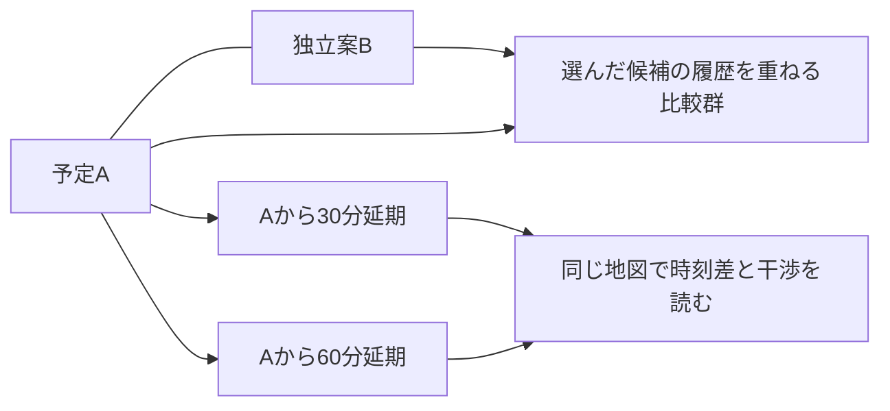

# Q410-01 調査用の読み物

依頼版：0.55.0。基準main：`4e3e4db0d047af9479bcd68bfc2553eeb71efcc9`。
これは採用済みmainの比較基準で、下記抜粋は今回の候補本文です。未統合候補の比較元と、最終保存/統合SHAは区別してください。SHAが不明でも本文を読めますが、最新mainを確認したとは扱いません。

**今回の焦点は Q410-01 です。共通入口の初回開始例は、別の課題へ切り替える指示ではありません。全体の目的を踏まえ、必要なら問いの分割や優先順にも異論を返してください。**

これは自動生成された課題別の読書束です。現在の正本は記載した元パス。MarkdownのリンクはGit内の資料束の位置から辿れるように変換しています。単独添付では未同梱先へアクセスできると仮定せず、元パスから必要資料を求めてください。図の文字説明は含みますが、画面の操作確認や原図の視認を代替しません。


---

## 根拠：docs/research/README.md — ## どう読むと研究の判断材料が得られるか

## どう読むと研究の判断材料が得られるか

資料束にはこの節と次のPR13差分、[BRIEF](../BRIEF.md)の目的と判断条件、[UI_WALKTHROUGH](../UI_WALKTHROUGH.md)の行程、今回の問い、具体材料、返却の助けを収録する。発行・Git管理の手順は本READMEに置き、研究本文の前へ全て複写しない。共通本文を全課題へ含めるのは、入力だけ、気象だけ、保存だけを最適化して用途を壊すことを防ぐためである。原ニーズと現在案を分け、原図や原Excelが必要な結論は追加実体へ戻る。

例えばQ01ではWeibullの一般解説より、既存の製品径と膜厚幾何の不一致が何を意味し、同じ計画のモデル比較をどう変えるかを調べる。Q03では95%楕円を描くだけでなく、少数標本や多峰性で禁止域への関係がどう読めるかを考える。Q05ではDBの選定だけでなく、新予報で更新した後に旧図を読み直す人が何を再現できるかを設計する。原案を守るために問題を狭くする依頼ではない。


---

## 根拠：docs/research/README.md — ## PR13から来た読者へ：何が変わったか

## PR13から来た読者へ：何が変わったか

現在の採用mainはPR29統合後のM420 `4e3e4db0d047af9479bcd68bfc2553eeb71efcc9`。0.43は参考FE/BEの器を比較する設計候補で、現private repoを実装正本とし、参考構成を取り入れる。public参考先の許可branchへの反映は人間が手動commitする。0.43時点では実装移行は未着手だった。0.45ではReact/TypeScript/Viteと薄いPython APIをprivate正本に追加し、直接入力・保存GFSによる二つのn=1の比較と保存再閲覧を接続した。0.46ではD-185により、0.45の簡略な比較画面を後続UIの基準にせず、育ててきた0.40.1 r2の打上げ計画・詳細・気象分析・季節検討の具体的な画面を共通platformへ持ち込み、入力・保存・実計算との接点を同時に修正した。0.47ではその画面を保ち、実GFSの配布観測・取得計画・明示取得/適用・取得中の入力保持を接続し、一飛行の保存再閲覧まで有限に確認した。0.48では固定した一つの気象場と一元量の仮分布から、対応標本・延期比較・経験50/90/95%範囲・全着地点の禁止域判定・同じ群の入力/履歴・保存再閲覧をつないだ。これは仮定した入力幅への感度試算であり、較正済みの気象/機体誤差や三用途全体の完成ではない。原画面を抽象的な効用へ置き換える作業でも、全画面の無変更移植を実接続の前提にする作業でもない。現行操作はCOMMANDS C-09、実APIはIMPLEMENTATION_NOTES、現在の有限受入と未確認はS36、0.46までの記録はS35へ戻る。公開へ渡す差分と科学採用は別に確かめる。現在の接続方針は[接続設計7.3](../../INTEGRATION_DESIGN.html#gui-integration460)、器の比較は[7.2](../../INTEGRATION_DESIGN.html#framework-candidate)へ戻る。0.44でQ420-00 rev7の2MDと完全ZIPを受領した。報告が明記する依頼0.42・固定M420と、実配布した添付集合全体の独立確認は区別する。採否と有限検証は[Codexの受領評価](../../../references/research_returns/Q420-00/2026-09-29-r7/CODEX_REVIEW.md)から辿る。現行生成束は未発行候補で、既発行束を置き換えたと推定しない。以下のM401/C2は0.42研究束の作成時の比較元で、現在の統合SHAや実配布基準と混同しない。

0.42作成当時の基準mainはPR28統合後の `55100867df2bef615c3131228c7c75adf31c9833`、未統合の比較元は0.41/PR29 C2 `d8aa7ed7c385616824121f3f234ad5c9226ba782`だった。0.42候補はその依頼内容を改めたもので、当時に未来の保存/統合SHAを先取りしていなかった。

| 以前の理解から変えるところ | 現在の意味と読む場所 |
|---|---|
| 管理を整え、GFSの小取得を始める段階だけではない | Python本体は保存GFSから一飛行を計算できる。現在の入力・モデル・数値法は[ENV-CURRENT](../../ENVIRONMENT_CONTRACT.md#ENV-CURRENT)。0.48では固定場・一元量の実標本集合を画面へ接続した。気象のばらつき、製品情報等からの結合入力、過去場は未接続 |
| 次の主成果を固定した原版比較や16飛行へ自動的に戻さない | 近未来の予報利用、過去飛行照合、数年〜十年程度の長期計画を支える完成像から次作業を選ぶ。[CONTEXT第1〜4節](../../../PROJECT_CONTEXT.md)、[PLAN第10章](../../PROJECT_PLAN.md) |
| 画面があることと、分析システムの成立を分ける | 2D/3D、候補・延期系列、詳細な群選択、図の保存を人工データで検討した。0.45で直接入力・保存GFS・二結果比較・保存再閲覧を接続した。0.46はその実接点を既存の具体画面へ統合し、0.47は実GFSの取得・明示適用を接続した。0.48では固定場・一元量の仮分布による実標本、禁止域群の詳細と保存再閲覧を接続した。人工分散との区別を維持し、入力レシピ/結合標本、較正済みの気象/機体MC、他の取得経路、三用途を通じる実計算/保存の完成は未了。[接続設計](../../INTEGRATION_DESIGN.html) |
| 上昇率を直接入れる／製品から導く、は異なる物理モデルの名前ではない | 同じモデルへ入る経路を選べる必要がある。元量と導出量を分け、必要でない入力を強制しない。製品版と直接指定の所有を残す |
| 原Excelや風資料は、採用済み科学仕様ではない | Excel原ZIP・分析、風原PDFとレビューを保存済み。式の単位・適用、同時分布を復元できない要約、旧計画の時点を確認する。研究の入口は各課題に限定して示す |
| 保存担当の旧制限を再適用しない | Codexが保存・commit・Draft PRと実績を担当し、人間がmainを統合する。Chatの研究回答は提案であり、main採用や科学受入ではない |

初期モデルは外気温追随の等温を許し、後続の熱・慣性・Re依存等を交換可能にする。等温は全飛行で温度一定という意味ではない。簡易経路を残し、得られない未知量を増やす高度化を目的にしない。無料・特別資格不要は基本の情報源要件だが、匿名限定ではなく登録・同意を区別する。Google写真3Dは任意の試作経路で、基本2Dを有料契約必須へ替えていない。


---

## 根拠：docs/research/BRIEF.md — 全文

---
document_id: BJP-RESEARCH-BRIEF
revision: 0.55.0
as_of: 2026-09-30
role: 研究担当が全体の必要と判断条件を共有する文脈
---

<!-- LOGIC:RESEARCH-BRIEF:BEGIN -->
# 何のために、このシミュレーターを作るのか

[更新:0.59.0] [確認:0.59.0] — RESEARCH-BRIEF / REV-590-DEPENDENCY-RESEARCH-BRIEF

目指すのは、**スペースバルーンのプロジェクトのあらゆる段階で役立つ分析ツール**である。軌道を一本描けることや、計算手法を多く選べることだけでは足りない。利用者が、候補の違いを理解し、気になる結果の理由へ戻り、条件を変えて再検討し、その根拠を後で読み直せるようにしたい。落下分散はその中心にある。平均的にどこへ落ちるかに加え、どの範囲へ広がり、避けたい場所へ入る標本が何によって生じ、変更によって判断がどう変わるかを知りたい。

この依頼では、Codexの案を詳しく説明し直すだけでなく、**この目的に対して何を問うべきか、今の問いや設計が適切かを、研究担当にも判断してほしい。** 既存の画面、課題分割、実装順、Codexと人間が挙げた具体案は、良い方法を探す材料である。制約や採用済み方針と区別して、別案が勝る状況まで考えてほしい。

本書は0.42.0で編集した研究文脈を保持し、科学仕様の第二の正本ではない。現在の発行・受領と実装の進展は[研究入口](../README.md)へ戻る。作成当時の比較元mainはM401 `55100867df2bef615c3131228c7c75adf31c9833`、当時の改訂前0.41候補はPR29/C2 `d8aa7ed7c385616824121f3f234ad5c9226ba782`。実際に渡されたGitコピーの統合版とは区別する。画面と操作の実像は[操作の読み物](../UI_WALKTHROUGH.md)、依頼の入口は[research/README](../README.md)。本書を読んで目的をつかみ、操作の読み物で具体的な関係を見てから、[課題と根拠](../TASKS.md)へ進む。

**0.55の生成束を読む境界：** 本書と共通の研究入口・UI説明・課題本文に残る「現在」「未接続」は、その研究文脈を編集した時点の記述である。0.55では、育てたGUIで実GFSの本命/延期・仮分布の分散/干渉・受付応答消失からの復帰・保存再訪、および統計の関心から取得済み原日時2窓と未取得1窓を区別する実飛行比較までを有限確認した。原日時2例は多年の季節分布を代表せず、任意過去取得UI・較正済みの機体/気象誤差・科学精度の採用は未了である。現行の実装・操作・確認範囲は[指示書S36](../../../BOOTSTRAP_RUNBOOK.html#s36-result550)、[実装補足](../../IMPLEMENTATION_NOTES.md)、[コマンド](../../COMMANDS.md)へ戻る。今回の6冊は元資料との同期を行う未発行候補であり、旧研究の再発行・新回答の受領・科学仕様の採用ではない。以下の原意・問い・旧模型の記録を、現行実装の機能一覧へ書き換えない。

## 原意と、この資料の編集を見比べるために

以下は[CONTEXTに保存したユーザー原文](../../../PROJECT_CONTEXT.md)の短い抜粋である。以後の行程や表はCodexによる整理を含むので、両者を同じ強さの確定仕様として読まない。

> 「どのようなツールで可視化を行い，どのようなグラフや統計的分析を提供して，どのようなモデル選択ができて，パラメーターがあって，それに対する分布などをどのように割り当て，モンテカルロシミュレーションとどうつなげるか．それらはどのような分析のためにどう役立つのか．」（RPT-043）

> 「風資料はこのシミュレータープロジェクトとは別の目的のための資料なので，その内部で目指していることをそのまま取り入れることは間違いですが，良い問いの立て方と分析の具体例を提供する資料としてCodexに見せています．」（RPT-043）

> 「この指摘は確定した修正要求としてではなく，（どこにあるかわからない）最適な設計へ至る人間とCodexの間の議論のラリーの人間側からのパスだと捉えてほしい」（RPT-052）

したがって、必要なのは指定の部品や図を集めることではなく、分析を通して何を判断できるようにするかという全体の設計である。一方、どの提案も同じ重要度で自由に捨てられるわけではない。50/90/95%の範囲、干渉の把握、簡易モデルで始める道など、明示された必要は、捨てるなら元の必要をどう満たすかという再検討を要する。

## 1. 同じ人が、違う時期に違う問いを持つ

三用途は、別々の利用者を想定した製品の三分割ではない。同じ計画と利用者が、長期の企画、予報を使う準備、当日の対応、飛行後の分析へ進む。ただし、誰もが必ずこの順をたどるわけではない。機体と地点を既に知っている人は直接計算したいし、風だけを調べて説明用の図を保存する仕事も、それ自体で完結する。

| 利用者が置かれる状況 | 知りたいことと、その後の行動 | 比較で保つ必要のある意味 |
|---|---|---|
| まだ予報がない。今年または来年の7月に、ある場所・機体で上げる計画を考える | 過去数年〜十年程度の気象条件でどんな落下分散になるか。季節・時刻帯・場所・機体の候補を絞り、必要なら年による違いへ掘り下げる | 過去条件からの計画用分布であり、その年の7月の予報ではない。気象年・原日時の場・機体の標本は異なる階層 |
| 予報が利用でき、場所や機体がある程度決まった | 時刻、充填などを変えた少数候補を比べる。新予報が出たら同じ条件を再評価し、判断が変わった理由を読む | 条件変更と予報更新は違う比較。できる限り早い予報から当日まで、任意のタイミングで更新する。全飛行を支える気象期間が必要 |
| 当日の準備が遅れそう、あるいは落下域が望ましくない | 予定時刻からの遅れに対する分散列を見て、干渉や停止がどう変わるかを調べる。必要なら場所や別条件を再検討する | 延期は親案との時刻差を持つ。充填済みの同じ機体か、各時刻に充填し直す計画かで、保つ実量が異なる |
| 飛行済みで、予想と観測のずれを理解したい | 当時の予報・再解析・観測を並べ、ずれ始める段階と改善の候補を調べる | 当時知り得た情報による予測評価と、事後に判明した条件を使う診断を分ける。再解析も完全な真値ではない |
| 地域の風の特色を調べたい | 高度・季節・場所による風速、方向、ばらつきを比較し、図を持ち帰る。必要なら選んだ時期・場所を打上げ検討へ渡す | 気象だけの分析には機体を要求しない。気象有効時刻のマスクを、放球時刻や飛行中の全時刻へ無言で転用しない |

ユーザーが明示したのは、全段階の分析、予報・過去飛行・長期計画、落下分散を用いた比較、使える予報を早期から更新して使うことなどである。上表の具体的な行程や、計画を一つの容器で育てる構成は、それらからCodexが導いた設計仮説を含む。「三用途だから全画面を三組作る」「一つのprojectだからすべてを一画面に載せる」のどちらも、ここから自動的には決まらない。

根拠は[現在の方向](../../../PROJECT_CONTEXT.md#CTX-VISION)、原要求RPT-035/043/045/048、[完成像の利用場面](../../SIMULATOR_VISION.html#purpose-design300)。場面の分類と過去案の区別はその本文を読む。同じ計画の前後関係を調べるときは[季節選定から飛行後までの例](../../INTEGRATION_DESIGN.html#project-story)へ戻る。

## 2. この研究で大切にしたい、五つの必要

### 条件と結果の対応を、利用者の頭の中だけに置かない

候補比較の重要な用途は、同じ場所・時刻・気象・機体をそろえ、モデル仮定だけを変えた落下分散を見ることである。分散の違いから、どの仮定が判断へ効くかを知りたい。場所や日時も異なる実施案の比較は別に必要だが、変更した軸を読めなければ、差の理由が分からなくなる。

個別タブと同色の分散、比較群、条件の共通/相違表示は、この対応を覚え直す負担を減らすための現在案である。タブという部品を残すこと自体が目的ではない。候補を選んだだけで他案が見えなくなる、保存名だけで内容を推測して比較へ入れる、群にまとめたらモデル差が消える、といった案では、操作数が少なくても仕事は難しくなり得る。

複数モデルをまとめて眺めたい需要もあるが、領域の和集合、モデル別の履歴比較、根拠付き重みで作る確率混合は異なる。確率混合が難しいという理由で、比較への入口や再訪するまとまりまで失ってはならない。逆に、並べるだけで十分な場面へモデル確率の入力を要求する理由もない。[同地点モデル比較](../../SIMULATOR_VISION.html#model-compare290)、[標本の対応の意味](../../INTEGRATION_DESIGN.html#paired-meaning)が、その違いを扱う。

### 落下分散と禁止領域の関係を、すぐ判断の入口にできる

概要では50/90/95%の範囲を直感的に把握したい。平均落下位置だけでは、裾の広がりや複数の山、避けたい場所への入り方が分からない。KML/GeoJSON等で指定した禁止領域との干渉は、ユーザーが最重要とした用途である。干渉件数と地図から同じ群の詳細へ入り、「この群にはどの入力や飛行履歴が多いか」「条件を変えて確かめるべき効果は何か」を調べたい。

現在は着地点の標本と領域で干渉を判定する考え方であり、輪郭同士の見た目の重なりを確率へ変換しない。停止した試行を非干渉と数えることもしない。一方、停止群の高度な統計を常に主画面へ増やす要求ではない。着地統計の対象と全試行中の停止数を理解でき、必要な群へ進めればよい。

以前の「干渉した点を囲う」案から現在の点表示へ進んだ理由には、線の重なりによる地理の隠れがある。この履歴は、以後の領域表現を禁止する規則ではない。多数候補・細い禁止域・近接表示など、どの場面で何が読めるかを比較し、よりよい表現を提案してよい。50/90/95%の必要、干渉の母数、読みたい地理との関係を満たすことが重要である。[干渉の設計](../../SIMULATOR_VISION.html#landing-constraints)、[分布と診断](../../INTEGRATION_DESIGN.html#distribution)へ戻る。

### 手持ちの情報で始められ、知っている情報も無駄にしない

対象の代表はHe充填のゴム気球、約30 km、乾燥重量10 kg未満程度であり、固定上限ではない。手元には粗い飛行記録、製品表、Excelとその分析、公開研究がある。未知の係数を増やす精密化のために新しい実飛行・同定実験を要求せず、既存資料と一般性のある知見を利用する方針である。

例えばTawhiri型の簡易経路では、上昇率や破裂高度を直接持つ人へ、製品寸法・ガス量・膜厚を追加で要求する必要はない。しかし製品と充填条件が分かる人には、その情報から整合した率や閾値を導く補助計算が便利である。同じ実行モデルでも適した入力経路は違う。入力欄が最少なら常に使いやすいとも、詳しい情報を全部入力できれば良いとも言えない。

内外等温の初期モデルは後から拡張できる設計を前提に許容され、熱感度実験を今回の着手条件へ戻さない。等温は飛行全体で温度一定という意味ではない。後続の抗力・慣性・形状・破裂・降下などの効果は、組み合わせと必要量の依存で考える。現コードの拒否条件を将来の科学的不能へ読み替えず、詳しいモデルで何が分かり、そのために何を新しく知る必要があるかを比較してほしい。

組合せの見通しとして、既存設計は段階ごとの鉛直運動を、速度則を与える経路、瞬時の力釣合いから速度を得る経路、速度を状態に持つ慣性の経路に分ける。力を扱う経路では、定Cd/Re依存Cd、外気密度、ガス・体積・形状、破裂後の質量や傘の条件などが結び付く。指定高度の破裂と径の破裂では、必要な膨張計算も異なる。上昇を詳しくしたら降下も同じ方式にしなければならないわけではないし、対地速度を直接与える式へ外気鉛直風を重ねれば二重計上になり得る。これはすべて実装済みの選択肢ではなく、入力経路の三例だけでは見えにくい将来の互換性を考える材料である。新たな選択肢には「何を比較したいから必要か」を求め、既存の同値な式へ別名を付けて精度向上と数えない。

製品の平均破裂径と、膜厚等から導く代表径は、値を得る入口の違いを含む。製品表の±を標準偏差とみなしたり、径と膜厚を独立に振ったりしてよいとは限らない。ただし分布幅の根拠が未確定でも、仮定したCV等で感度を調べることは有用である。根拠付き分布と仮の幅を区別し、入力の依存と値域を保ちながら、その仮定で結論がどれほど変わるかを見せる道を閉じない。[モデル構成](../../ENVIRONMENT_CONTRACT.md#ENV-MODELS)、[入力経路](../../INTEGRATION_DESIGN.html#inputs)、[破裂入力](../../SIMULATOR_VISION.html#burst)が根拠となる。

### 粗く見てから深く調べる流れを、情報と計算の両面で成立させる

利用者は入力を変えながら概況を知り、気になった候補や群だけ詳しく調べたい。概要/詳細という二種類へ固定する要求ではなく、知りたいことと必要な精細度に応じて負担を変えたいという要求である。保存済み標本の選択や色・視点の変更なら、飛行を計算し直す必要は通常ない。詳細な履歴がなければ再計算が必要になる場合がある。その違いを設計したい。

処理を軽くする方法にも異なる代償がある。描画を減らす、集計を再利用する、読む履歴を絞る、MCを段階的に増やす、気象場を近似する、は同じ「高速化」ではない。例えば速く終わった飛行だけを先に描けば、飛行時間や停止理由で集団が偏る可能性がある。凍結気柱や統計代理場が安価でも、候補順位や干渉の裾を変えてしまうなら、その利用場面には不十分かもしれない。

逆に、全用途で常に最も高価な場と全履歴を要求すれば、時期や場所を粗く絞る道具として使いにくい。「どの判断なら近似で足り、何が気になったら次へ進むか」を、精度・取得・計算・保存・操作負担を結んで研究してほしい。現段階で応答秒数や最適MC数を測定済みではない。[段階的な分析](../../SIMULATOR_VISION.html#progressive-ui)、[標本の追加](../../INTEGRATION_DESIGN.html#progressive-sampling)、[費用と保存](../../SIMULATOR_VISION.html#cost-and-storage)へ戻る。

### 図と操作が、問いを発展させる手掛かりになる

提供された風統計資料の価値は、グラフが多いことより、目的に沿った問いを立て、要約から差や分布へ進める構成にある。年間×高度の強さ・方向・定常度を共通軸で読むと、どの層・季節が気になるかを見つけられる。月別のプロファイルや風配は平均で隠れる分布を示し、地域図は場所による違いを示す。同尺度で並んだ月別図には、頭の中で12枚を合成せず比較できる効用がある。圧力や時期をバーで連続にめくる操作には、変化をたどって気になる位置を探す効用がある。

ただし平均速さの場所幅が小さくても、風向が反対なら一地点で地域を代表できない。定常度が低いことも、地域内の方向差か、一地点の時間変化かで意味が異なる。図を連携させるとは、全操作を一律同期させることではなく、同じ問いを深めるために何を引き継ぎ、どこで対象や尺度を変えるかを決めることである。

原資料の地域、機体、暦区分、凍結気柱、数値結果を、そのまま本プロジェクトの要件や科学的正解にしてはならない。既集計DBから任意の年・時間帯・全同時分布を復元できるわけでもない。良い問いと表現の例として使い、限界は限界として扱う。[気象分析の完成像](../../SIMULATOR_VISION.html#climate-workspace)と[風資料レビュー](../../../references/WIND_REPORT_REVIEW.md)の第10〜13節を対応させる。実際の図や画面の読み方は[操作の読み物](../UI_WALKTHROUGH.md)へ進む。

## 3. 現在何があり、どこがまだ設計なのか

| 対象 | 現在の位置 | 研究担当がそこから判断してよいこと |
|---|---|---|
| Pythonの一飛行核 | 保存GFSを読み、選んだ現行モデルで一飛行を計算する実装がある。数値積分・根探索はSciPyを利用。全将来モデルや過去場の一般接続ではない | [ENV-CURRENT](../../ENVIRONMENT_CONTRACT.md#ENV-CURRENT)から実際の入力/返値/支持を確認し、内側を変える必要と外側へ加える責務を分ける |
| 比較・詳細・気象・2D/写真3Dの操作模型 | 人工標本・模式的な履歴等を用いて、操作や見え方を検討してきた。実写真への重畳の限定確認もある | 操作の関係と過去の修復理由を材料にできる。即時再描画を本体性能、人工輪郭を実気象の統計、写真meshを計算地形の精度とはみなさない |
| 全体の接続案 | 入力経路、元量の標本化、場、固定結果、分析、保存、jobの責務を[接続設計](../../INTEGRATION_DESIGN.html#journeys)で提案している | 0.45のReact画面・薄いFastAPI・n=1保存再閲覧の有限実装は[実装補足](../../IMPLEMENTATION_NOTES.md)へ戻る。0.46では育てた0.40.1 r2の用途別の具体画面を共通platformへ統合し、入力・保存・実計算との接点を並行して修正した（D-185）。0.47では実GFSの取得・明示適用と取得中の入力保持を接続した。0.48では固定場と一元量の仮分布による対応標本、延期・干渉群の比較と保存再閲覧を接続した。現在の有限受入はS36/D-187へ戻り、較正済みの気象/機体誤差や三用途全体の受入へ広げない。三用途・分散を覆う最終schema/API全体は未確定であり、境界や優先順の研究を継続する |
| 原資料と研究知見 | 風PDF、Excel原本と分析ZIP、気象ガイド、取得観測がある | 出典・対象・確認範囲へ戻れる。小取得の成功、著者の検査、条件付きの数値を、一般運用や科学的受入へ拡張しない |

情報源は無償・特別資格不要を基本とし、匿名利用と登録/同意は分けて確認する。NOAA-GFSを予報の方針とし、ERA5/JRA-3Qや当時のGFS予報を過去用途へ検討する。日本での使いやすさと任意領域による性能設計を重視するが、日本外を内部的に禁止する要求ではない。Google写真3Dは任意の試作経路で、基本の2D利用を有料契約必須に変えるものではない。

これらの既決方針への異論が生じたら、黙って置換せず、根拠と代償を伴う再検討案として返してよい。研究回答から採用、実装、実データによる精度確認まで完了したとは扱わない。権限・返却・保存の手順は[研究入口](../README.md)に置き、本書の目的説明へ混載しない。

## 4. 問題はつながっている：何を変えると隣が変わるか

課題を分けるのは仕事を進めるためであり、境界の外を見ないためではない。次の表は、現在見えている相互依存と未決を示す。ここにない重要な問いも探してほしい。

| 起点となる判断 | 隣へ及ぶ影響と、研究したい対立 | 深掘りの入口 |
|---|---|---|
| どのモデルと入力経路を選ぶか | 直接の率なら不要だったp/T/q、質量、Cd、形状等が必要になる。細かいモデルの効果が、その情報を用意する負担に見合うか。製品・直接値・補助計算のどれを元量として扱うか | [モデル構成](../../ENVIRONMENT_CONTRACT.md#ENV-MODELS)、[入力切替](../../INTEGRATION_DESIGN.html#input-changes)、Q410-01/04 |
| 何のばらつきを表すか | 機体ばらつき、予報に条件付く誤差、季節内の気象変動、モデル差、有限標本誤差は異なる。元量と派生量を二重に振らず、同じ場実現を飛行中に保つ必要がある | [不確かさ](../../SIMULATOR_VISION.html#uncertainty)、[分布](../../INTEGRATION_DESIGN.html#distribution)、Q410-01/02/03 |
| 何を同じ条件として比較するか | 物理実量を固定する、同じ分位を異なる分布へ写す、対応のない集合を比べる、では結論が違う。延期・モデル差・新旧予報を同じseedという理由だけで対にできない | [標本の対応](../../INTEGRATION_DESIGN.html#paired-meaning)、Q410-02/03/05 |
| どんな気象場を、どこまで用意するか | 地表〜約30 kmと数値試行の余裕、任意放球時刻、全飛行の時間支持が要る。早期予報と直前、過去一便と十年分析で経路や費用が変わる。高度な場と軽い代理場をどの判断で使い分けるか | [気象の準備](../../INTEGRATION_DESIGN.html#weather)、[現行GFS](../../WEATHER_DATA_GUIDE.md#WG-CURRENT)、[分散へ必要な情報](../../WEATHER_DATA_GUIDE.md#WG-DISPERSION)、Q410-02/04 |
| 50/90/95%と干渉をどう読むか | 多峰や少標本、重み、停止が輪郭と件数の意味を変える。描画が安定したことと、入力分布の正しさは別。平均が同じでも裾や禁止域への入り方で候補選択は変わり得る | [干渉](../../SIMULATOR_VISION.html#landing-constraints)、[段階標本](../../INTEGRATION_DESIGN.html#progressive-sampling)、Q410-03 |
| 何を後から調べ、再利用したいか | 任意群の履歴は全体分位だけでは復元できない。設定再利用、検討再開、固定図の配布、再計算一式は必要な実体が違う。保存量を減らす代わりに何ができなくなるか | [保存と再開](../../INTEGRATION_DESIGN.html#save-and-reopen)、[結果の寿命](../../INTEGRATION_DESIGN.html#lifetime)、Q410-05 |
| どの処理を待たずに操作したいか | 入力変更と旧job、取消と結果確定、少数MCと大規模集計、別PCの計算を区別する。画面を閉じても意味が残る構成と、導入・維持の小ささをどう両立するか | [サービス境界](../../INTEGRATION_DESIGN.html#service-boundary)、[構成候補](../../INTEGRATION_DESIGN.html#technology)、Q410-03/04/05 |
| 過去飛行の何を評価するか | 当時予測の評価と事後診断では、使える機体情報・気象・観測の扱いが違う。風だけ変えたつもりで破裂条件も変えれば原因説明が崩れる。記録が粗いとき何をなお学べるか | [過去飛行の分析](../../SIMULATOR_VISION.html#past-flight-workspace)、[三用途](../../INTEGRATION_DESIGN.html#journeys)、Q410-02/04/05 |

例として、充填済みの機体を30分延期するだけでも、入力側ではガス実量の保持、気象側では照会時刻と支持、MC側では標本の対応、画面側では親への差分、保存側では旧結果と新条件の識別が必要になる。どれか一つだけ正しくても、この一連の比較が成立するとは限らない。

一方、風だけを調べる仕事へ同じ機体入力やjob構造を強制するのも不自然である。共有すべきなのは同じ意味を持つ処理と根拠であって、項目名や画面の数を揃えることではない。こうした横断の反例を見つけたら、自分の担当へ押し込まず、隣の問いまたは課題分割の修正として返してほしい。

### 既にある対立材料を、研究の出発点にする

入力・破裂の例では、製品表の1500形に平均破裂径10.0 m、検査時膨張径6.3 mがある。一方、原Excel Bの基準膜厚130 µm、破裂厚5.0 µmを同じものとして用いても、基準を長さ2.2 m・径1.4 mの楕円体（等体積球径1.62764 m）にするか、直径2.2 mの球にするかで、換算径は約8.29939 m／11.21784 mになる（既存独立計算、原セルと式はVISION#burst）。製品平均径とこの幾何由来の代表径を同じ統計的事実とみなせるかが未決であり、一般的なWeibull式を再説明するだけでは解けない。細かな式・母数・逆モーメントの条件はQ410-01束に同梱する。

気象の例では、ある2地点の風が全時刻でそれぞれ(u,v)=(20,0)、(-20,0) m/sなら、平均速さの地点間幅は0でも移流方向は正反対になる。風資料の「速さの空間幅が小さい」という図から地域を一気柱で代表できると一般化できない（WIND_REPORT_REVIEW§13の解析例）。長期の軽量化案を評価するとき、同じ平均を再現するだけでなく候補の順位・干渉・層や時刻の関連をどれだけ保つかという問いへ進める。

過去飛行では、生の位置時系列が全便分あるとは限らず、要約表の速度・区間高度・所要時間が食い違う例がある。将来の豊かな観測に開いた設計と、今ある粗い記録で比較できる量の両方を考える。具体原セルと情報の欠落はUI_WALKTHROUGH§7へ置いた。これらの例は優先テーマを固定するものではなく、既にある証拠と未決を使って独立した問いを選ぶ材料である。

## 5. なぜ「ニーズから問い直す」を、依頼の中心に置くのか

これは抽象的な心掛けではなく、過去に設計を変える必要が生じた理由である。

**内部の分離を、画面の分離へ短絡した。** 0.30では入力・結果・比較を区別する設計から、タブと分散の対応まで外した。「主図一つ」という簡潔さの一般論から、年間・12か月比較も失った。各部品が動く検査は通っても、利用者が同じ比較へ戻り、違いを読む仕事は難しくなった。後の修正は旧部品への無条件な復帰ではなく、何の対応や比較軸を失ったかを根拠に行った。[完成像に残した再検討](../../SIMULATOR_VISION.html#why310worked)、DECISIONS D-169/170を読む。

**具体案を前提にし過ぎ、配置そのものを疑うのが遅れた。** 縦に区切った画面の中で局所改善を続けても、地図と必要な条件を読む面積が足りない場合があった。ユーザーの指摘は「横長領域を縦に積め」という固定仕様ではなく、同時に見る関係、スクロールの負担、役割に対する面積を考え直す刺激だった。研究でも、提示された案の中だけで係数や部品を最適化していないかを疑ってほしい。[配置への再検討](../../SIMULATOR_VISION.html#workflow350)とRPT-055〜057が根拠となる。

**局所成功を、続く仕事の成立へ広げた。** 写真3Dで名称を読めるようになった後、2Dへ戻ると地図が崩れる反例が出た。名称の検出や接続維持を確かめても、利用者が戻って候補・地物を比較し続けられるとは限らなかった。研究資料でも、各課題が答えられるだけで引継ぎ全体が良いと判定してはいけない。答えがどの判断を進め、その次に何が残るかを見る。[0.40.1の境界](../../SIMULATOR_VISION.html#workflow401)、DECISIONS D-179追記に当時の確認範囲を残している。

共通原則は[DC-JUDGMENT](../../DOCUMENT_CONTROL.md#DC-JUDGMENT)である。情報を結んで明記されていない必要も推測し、人間の知識・注意・負担と仕事の流れに照らしてその推測を疑い、案を作り、当初の意図へ戻して評価する。細部を満たしても全体が不自然な場合があり、違和感の理由を完全に言語化できるまで判断を禁止することも適切ではない。どの場面で何が引っ掛かり、どの別解釈なら変わるかを、観察と仮説として述べてよい。

ただし「人間なら当然」を根拠に明示された要求や科学的事実を上書きしない。出典で確かめたこと、資料から推測した必要、まだ判断できないことを区別する。批評の回数や否定の数、返却様式の欄が埋まったことを成果にしない。自分の案にも不利な利用場面を当て、変えた案をもう一度元の目的へ戻してほしい。

## 6. Chatに期待する仕事と、具体的な成果

最初の[Q420-00](../TASKS.md#q420-00)は全体の統合研究である。Q410-01〜05は入力・気象・統計・取得・保存の深掘り材料であり、この番号順を守る工程表ではない。まず必要と相互依存を捉え、利用者の判断や後の設計コストへ効き、今の開発を進められる問いを選び直す。その上で、**重要な判断を一つ以上、具体案と根拠によって前進させる**ことを求める。目的の復唱や「後で調べるべき項目」の長い一覧だけでは足りない。

例えば、入力が最優先だと判断したなら、三経路を表へ移すだけで終えず、同じ仮想機体を直接値/製品値で扱い、モデルや分布を変えたとき何が不足し、何を保持し、どんな比較が可能になるかまで具体化できる。気象の不確かさが先だと判断したなら、根拠不明だから停止するだけでなく、長期の場の選び方と予報誤差を分け、仮定した幅で何が分かるか、何の追加情報が結論を変えるかを示せる。保存が先なら、技術名の選択ではなく、新予報→延期→図の再閲覧という行程を通して、案の利点と破綻条件を比較できる。

現案を維持する結論でも構わない。その場合は、筋の良い代案に対して、どの利用場面・費用・制約で優れるから維持するのかが必要である。逆に大きく構成を変える案は、失われる効用や移行の負担も示してほしい。現UIの全操作や全原資料を読めなければ一切考えられない、とも扱わない。読めた根拠で具体化できる部分を進め、決めるために必要な不足だけを理由付きで返す。

一回の研究量は有限でよいが、考慮する全体像は狭めない。一次資料の調査、小さい式や数値例、比較図、保存/入力の例などを、選んだ問いに合う方法で作る。未来の全schema、全モデル、全十年の計算を完成させる依頼ではない。成果を[返却形式](../RESPONSE_TEMPLATE.md)へまとめるときは、何を新しく理解し、どの設計判断が変わり、Codexが次に何を具体化できるかを先に伝えてほしい。

<!-- LOGIC:RESEARCH-BRIEF:END -->


---

## 根拠：docs/research/UI_WALKTHROUGH.md — 全文

---
document_id: BJP-RESEARCH-UI
revision: 0.49.0
as_of: 2026-09-30
role: 操作できない研究担当へ、画面の関係・操作前後・判断の理由を伝える
---

<!-- LOGIC:RESEARCH-UI:BEGIN -->
# 画面を触れない研究者のための利用行程

[更新:0.59.0] [確認:0.59.0] — RESEARCH-UI / REV-590-DEPENDENCY-RESEARCH-UI

本書は、機能一覧では伝わらない**利用者が何を見比べ、何を変え、どこへ戻って判断するか**を説明する。[BRIEF](../BRIEF.md)の目的と合わせて読む。0.40.1 r2の一枚一枚の画面は、実用を想定して改善を重ねた具体的成果である。これを素材に共通platformへ統合し、入力・保存・実計算との未解決の接点を並行して直す。細部の変更はできるが、効用だけ抽出した別画面への再発明を移行とは呼ばない。変更案は元の画面・操作との対応と改善理由を示す。

0.46時点では、具体画面と実入力/固定結果/保存の接点を統合し、実n=1の候補・延期比較と写真3D→2D復帰を有限に確認した。これは本書で説明する人工分散の全機能移行や実MCの完成ではない。0.46の確認範囲は[指示書S35](../../../BOOTSTRAP_RUNBOOK.html#S35)。0.47では同じ具体画面に実GFSの取得計画・明示取得/適用・入力保持を接続し、保存再閲覧を有限に確認した。0.48では固定場・一元量の仮分布から作る実標本を、経験範囲、延期と干渉群の比較、同じ群の入力/履歴、保存再閲覧へ接続した。0.49では同じ画面を使う48/192実試行の費用を測り、実JRA期間集計の年間/地域図と保存再読を接続した。年/時間帯を選ぶ過去4D場や季節飛行は未接続で、下記の原模型の全操作を実資料で再現したことにはしない。現在実物と確認範囲は[S36](../../../BOOTSTRAP_RUNBOOK.html#S36)、実sourceとの対応は[SCREEN_PROVENANCE](../../../frontend/SCREEN_PROVENANCE.md)へ戻る。以下の原模型の観察日はそのまま保持する。

本書の行程説明の対象はGitに保存した0.40.1 r2模型。0.46〜0.49の有限接続によって、本書の機能全体が較正済みの気象/機体MCや過去場へ接続済みになったという意味ではない。0.45の二候補n=1接続は計算/保存の有限成果で、その簡略画面を後続GUIの基準にしない（D-185）。予報の入口・条件編集・延期ダイアログ・詳細・気象4画面・季節計画への遷移は2026-09-28に主担当が実画面を読み直した。写真3DはS34の以前の観察記録と設計本文に基づき、この再読ではキー接続していない。この原模型の観察時点では、過去飛行の比較と実標本の入力分布診断は画面として成立していなかった。0.48の一元量・選択群の実診断とは時点と対象を分ける。原模型は [VISIONの保存索引](../../SIMULATOR_VISION.html#model-archive)にあるZIPから戻れる。研究の開始にその展開や操作は要求しない。

**画面の人工データと本体計算を分けて想像する。** 現模型は操作の関係を試すもので、表示の即時変化は実気象MCの速度ではない。画面に残る「実計算」という表記も人工標本の再集計を指しており、実飛行核との接続済みと読まない。季節試算は放球点の人工気柱を固定する簡略計算で、飛行先の時空間場・地形着地・支持切れまで解いた結果ではない。これらの限界を実システムへどう置き換えるかが研究課題である。

## 原図を読むときの入口

初回に渡す風分析PDFでは、**物理頁35〜43の図14〜20・23**で「年間の高度差→月のプロファイル/風配→地域差」という比較の組合せを、**物理頁45・48の図25・29**で風から落下の問いへの移り方を見る。図の所在と読み方は下記第5節およびWIND_REPORT_REVIEW第11節へ対応させた。単に図の見た目を模倣するのではなく、軸・並べ方・色・要約の選択が何を発見しやすくし、何を隠すかを評価してほしい。初回に全付録を順読する必要はなく、統計代理場等を主題に選んだら原法の章へ進む。

0.40.1フィードバックPDFは入力・分布・保存への人間側の意見を図付きで示す。現在案への確定仕様ではない。UI配置の同時視認や色の重なり自体を主題に選ぶ場合は、本書だけで視覚評価したことにせず、対象を絞って模型の画面図またはHTMLを追加要求してよい。

## 1. 予定AとモデルBを同じ場所で比べる

利用者は「この場所・機体で上昇や破裂の仮定を変えると、落下域と禁止領域への干渉はどれくらい変わるか」を知りたい。AとBは、必ずしも二つの異なる打上げ企画ではない。**同じ計画に対するモデル差の比較**は主要な使い道である。一方、場所・充填・時刻自体を変更して運用候補を比べる使い方も必要になる。

現在の予報画面は、上から「共通の準備」「独立候補と比較群の選択」「注目候補の条件要約・件数・操作」「広い共有地図」「必要なら開く数値比較」の順に積む。地図の高さは画面に応じた自動値を持ち、下端を動かして変えられる。横長の地図を確保し、常時巨大な設定欄で地理を圧迫しないための案である。縦スクロールは許してよいが、条件とその結果が遠く離れて頭の中の照合を強いないかは批評対象になる。

| 同時に読むもの | 現在の表現 | 支えたい判断・残る問題 |
|---|---|---|
| どの候補を読んでいるか | A標準案、Bモデル比較、G1履歴比較等の入口。注目候補の名称・版と結果要約を地図直上に置く | 「注目」と「地図に表示」は別。他候補を残したままAの条件を読めることに価値がある |
| 着地位置の散らばり | 注目候補を50%内、50–90%、90–95%の帯で塗り、他候補は輪郭を主に表示。50/90/95%を個別切替 | 候補同士を全部濃く塗ると重なりが読めない。50/90/95%は直感的な中心情報で、平均一点だけへ縮めない。今の経験楕円が将来の数値法として採用済みではない |
| 地物との位置関係 | 通常地図／衛星・航空写真を切替。気象領域の境界、平均的な軌道・着地点、禁止領域、干渉点、停止点を関連付ける | 市街地や人工物を見る際は写真が有用。境界停止は着地と別の記号で見える必要がある |
| 数で読む必要のあるもの | 着地/全試行、干渉、停止・不明、平均着地座標や飛行時間等。詳細な分母は展開可能 | 例として人工Aは60着地/64試行、4停止。着地集合の95%域が64全体の95%を覆うとは言えない。停止を隠して狭い雲を良い結果と読ませない |

条件を開くと、現模型には名称・緯度経度・日時（JST表示）・ペイロード質量・簡易なモデル選択程度しかない。地図で地点を置く操作は通常のpan/zoomと区別し、数値入力も併用する。この少ないフォームは完成した機体入力ではない。製品データ、充填、上昇/破裂/下降の組合せ、固定値/分布、導出された量を、持っている情報に応じて使う入力設計が未了である。

**ここで研究が変え得ること。** 詳しい来歴を全欄の横へ常時並べれば正確でも、反復比較を妨げるかもしれない。逆に内部では別の入力・結果・分析だからと画面を完全に分けると、条件と分散の対応を利用者が記憶し直す。どの情報を同時に出し、どれを必要時に開き、更新中の旧結果をどう識別させるかを、例えば「Aの製品を変えて計算中にBを見る→旧Aを保存する」の場面で提案してほしい。

出典：[VISION workflow350](../../SIMULATOR_VISION.html#workflow350)、[workflow390](../../SIMULATOR_VISION.html#workflow390)、[接続設計 inputs](../../INTEGRATION_DESIGN.html#inputs)、CONTEXT RPT-038/045/048/050/057。

## 2. 遅れたときの分散を、一つの計画から続けて見る

予定9時のAに対して、9時30分、10時…と延期した場合の落下分散と干渉を、同じ地図で次々に確認したい。毎回候補を複製して全入力を手で照合するのは煩雑で、独立案の列に並べるだけでは「親から時刻だけ違う」関係が消える。

現案ではAを親とする延期系列を作り、独立案の横の関係と、親に従属する差分の関係を分ける。ダイアログは遅れ時間の集合を選び、作成・保持・削除と再計算/再利用の見通しを示してから適用する。模型には0.5時間刻みの近傍と、より先の整数時間があるが、これはUI試行の値であり気象データ間隔が放球をこの刻みに制限するという仕様ではない。実システムは任意放球時刻を、飛行全体を支持する連続場の内挿で扱う。



この図は意味の関係を示し、画面をそのまま描いたものではない。延期子も結果・詳細・表示切替を持つが、親変更に連動するのか、個別に編集して独立化するのかは表面上の見た目だけで解けない。

物理的にも「他条件は同じ」には二通りある。既に充填した同じ個体を待たせるならガス実量を保つのが自然な場合がある。別の時刻に同じ目標浮力になるよう充填し直す計画なら、ガス量が変わり得る。気象run更新も、時刻差だけの比較とは異なる。共通乱数を使う場合も、同じ物理実量を共有するのか同じ分位を対応させるのかで差の意味が違う。現案の「コピー」をそのまま保存契約へしないで、この区別が利用者に無理なく伝わる方法を考えたい。

出典：CONTEXT RPT-051、[接続設計 input-changes](../../INTEGRATION_DESIGN.html#input-changes)、[paired-meaning](../../INTEGRATION_DESIGN.html#paired-meaning)。

## 3. 干渉した群へ潜り、条件を変える手掛かりを探す

概要で分散が禁止領域に近づいたら、利用者は「どの標本が干渉し、何が違うのか」を調べたい。領域はKML/GeoJSON等で指定する想定。輪郭と領域の見かけの重なりだけで干渉数を決めず、結果に対する領域判定と、その結果のID群を保って詳細へ進む。

現案は全干渉点を地図に示し、件数から同じ群を詳細へ持ち込める。以前の「干渉点をまとめて囲う」案には、囲いが未干渉の地物まで巻き込み、別の確率輪郭のように見える問題があった。この失敗は新しい囲い方を全て禁止する根拠ではない。点が多く重なって位置関係が見えない場合には別表現が勝ち得るので、**全干渉の所在を読み取ること、確率域と混同しないこと**の両方から代案を評価する。

詳細画面では他候補を一旦退け、一候補と選択群に集中する。上部に全着地/干渉/非干渉/地図で囲む選択がある。通常の「この候補を詳しく」から初めて入ると全着地、概要の干渉件数から入るとその干渉ID群を読む、という違いが重要である。地図の多角形選択は、着地地点で対象IDを選び直す操作である。時刻を動かすたびに近くの別標本へ選択がすり替わるものではない。

| 見える組合せ | 操作と読み方 | 次の問い |
|---|---|---|
| 左の地図と右の経過時間グラフ、下の共通時刻バー | 選択群の着地と、バー時刻での飛行中位置を読む。右は高度、累積横移動、東/北変位、水平/鉛直速度等を切替 | 干渉群はどの高さ・時間から違い始めるか。地理選択で偏った結果を全体へ一般化していないか |
| 左を風の分布へ切替、右の履歴と共通バーを保つ | 同じ時刻の各標本位置での風速頻度と風配図を見る。バーを動かしながら変化を追う | 終点だけで分からない風の寄与を探れるか。生存中の標本が減る効果を風自体の変化と混同しないか |
| 選択群と全体/非選択群の特徴比較 | 現模型は破裂時刻・着地時刻の平均と10–90%等の小表のみ。入力/抽選/導出量の分布診断は未実装 | どのパラメータが干渉群に多いか、その仮説を対応する再計算で確かめられるか |

時間履歴の現模型は上昇/下降を色で区別し、選択群の平均線と時刻ごとの10–90%帯を描く。これは平均推定の信頼区間ではない。着地後の標本を時間風分布から外す場合、選択群総数とその時刻での有効数を別に読む必要がある。風配は来向で、移流先の地図矢印とは向きの約束が逆になる。現模型の詳細と気象分析では静穏の閾値や分母の扱いにも違いがあり、これを完成仕様として無意識に引き継がない。

「干渉群は破裂高度が低かった」という関連だけで原因は確定しない。機体・気象・計算停止・選択の効果が重なる。それでも関連図は、次に変える仮定を選ぶ有用な手掛かりになり得る。例えば径破裂モデルの破裂高度は導出結果で、比較のためそこだけ直接上書きすると別モデルになる。ガス量や径の元入力を変える、未知の分布幅を別シナリオで試す、別気象ケースで確かめる、は異なる次の操作である。研究には、入力分布の設定自体の診断、実抽選値の診断、着地/干渉群を条件付けた診断、導出量の診断を混同せず、変更可能な条件へ戻れる構成を提案してほしい。すべてを一画面に追加することが目的ではない。

比較群G1は、複数候補の全標本の経過時間グラフを重ねる入口として考えている。A/Bの集合を自動的に一つの確率分布へ混ぜるものではない。混合を必要とするなら目的とモデル重みを別に論じる。詳細から概要へ戻ったとき、候補の注目・表示・地図の文脈を失わせないことが、反復する分析では重要になる。

出典：[VISION analysis](../../SIMULATOR_VISION.html#analysis)、[landing-constraints](../../SIMULATOR_VISION.html#landing-constraints)、[接続設計 distribution-diagnostics](../../INTEGRATION_DESIGN.html#distribution-diagnostics)、CONTEXT RPT-045/048/051/067。

## 4. 写真3Dは、同じ結果と地上物を近くで読むためにある

俯瞰の2D地図で気になる場所を見つけ、写真3Dで地形・屋根・樹木の周辺へ近づき、回転・移動・拡大しながら、**地表に投影された落下域/禁止領域/軌道との関係**を読む。3Dは全体の俯瞰を飾る別画面ではない。近づくと輪郭全体は見えなくなるため、面の濃さ、境界線、候補の名前と所属を局所で読めることに意味がある。

現案は注目候補の輪郭間の帯、他候補の線、領域を同じ文脈で表示する。面内の名称hover、重なった対象を一つの吹出しで読むこと、名前の反復を避けることを試してきた。線上だけ反応し面内では分からない失敗や、3Dで確認後に2Dタイルが崩れる反証を経て修復した。成功は記録された範囲に限られ、UI全体の完全な受入ではない。

研究上大切なのは、この局所読取から2Dの候補比較や群の詳細へ同じ対象のまま戻れること。表示meshは、積分の着地判定に使う地形や気象の下端支持とは別である。屋根へ色が載ったことを物理的な衝突計算ができた証拠にしない。Googleキー/写真接続は任意で、基本解析を有料背景必須にしない。3Dの細部の再実装を今回研究へ必須にする意図もない。

出典：[VISION workflow401](../../SIMULATOR_VISION.html#workflow401)、[workflow390](../../SIMULATOR_VISION.html#workflow390)、S34の実写真/人間hover報告と訂正記録、CONTEXT RPT-063〜067。

## 5. 風そのものを読み、場所・季節の仮説を立てる

「この地域で、いつ・どの層の風が強く、向きが揃うか」を先に知りたい。機体がまだ決まっていなくても、風の分析だけで図を持ち帰ってよい。画面は共通の年範囲・気象時刻mask・領域を上に持ち、その母集団を保ちながら四つの問いを切り替える。現在の2020–2025年・JST03/09/15/21時・9格子は人工模型の例であり、本番の固定制限ではない。

| 問い | 同時に読む図・操作 | 読みたい差と、まとめ方の理由 |
|---|---|---|
| 年間の高度構造 | 横が暦の一年、縦が概算高度で、風速平均・平均風向・定常度・地点間の平均風速の幅を同じ軸で上下に並べる。月内4/2区分を切替 | 強いが向きが揃わない層と、強く一方向へ吹く層を混同しない。月目盛と同じ縦位置が図同士を結ぶ。各図を別のドロップダウンへ隠すとこの対応を失う |
| 季節による分布 | 月別高度プロファイルを12枚、共通軸で並べる。風配へ切替えると代表元格子と気圧面を選び、12月の極座標分布を同じ半径尺度で見る。月/半月/季節区分も検討 | 7月だけの詳細に入る前に、通年の特色と変化点を一目で捉える。気圧バーで層を変えても、月の並びを記憶し直さず追える |
| 地域差 | 同じ地理範囲の月別地図12枚。風速カラーマップ＋等長の平均移流方向矢印、または定常度。気圧面バーを全図で共有 | 大小の矢印へ風速を兼用させず、色と向きの役割を分ける。共通色尺度は月や高度の比較を支え、現在高度だけの尺度は小さい場所差を読みやすくする。切替時に尺度の意味が読める必要がある |
| 打上げへの影響 | 同一の人工飛行仮定で複数地点から平均到達点への直線を描く。色は到達点のRMS幅、選択地点だけ50/90/95%域。月/半月をバーで変える | 場所を粗く絞る場面。平均への直線は飛翔経路ではない。試算点を増やすNは、元気象格子の精細化と別。任意地点も地図/座標で指定し、個別計画へ進む |

この構成は風統計資料の図14/15/16/17/19/20/23/25/29を、問いの手本として読んだ結果である。元資料の研究目的・放球条件・数値・誤差モデルをそのまま採用する要求ではない。よい可視化とはグラフ種類を多く用意することではなく、比較すべき軸を揃え、違いを読むための操作と尺度を選ぶことだと解釈している。

現模型のプロファイルは前半/後半中央値と月全体10–90%帯、風配は来向16方位×速度階級、地域図の矢印は移流先、という別の集計を使う。これらの定義も研究対象である。平均スカラー風速、平均ベクトルの大きさ、方向の定常度、空間の幅、時間の幅を名前だけで一つにしない。元資料には説明と数値実体の不一致もあり、[風資料レビュー](../../../references/WIND_REPORT_REVIEW.md)の効用と限界を併読する。

**残る設計問題。** 夜/朝/昼/夕の区切りを固定JSTで作るか日照条件へ結ぶか、データの時間間隔とどう折り合うかは未決。正確な連続年や時間maskを使うために、まず重い全取得を強制するのも負担になる。安い概要で仮説を絞り、必要な原日時・層・場所へ進める設計を、気象場の取得/保存費用と合わせて考えたい。

出典：CONTEXT RPT-045/049/050/051、[VISION needs360](../../SIMULATOR_VISION.html#needs360)、[風レビュー§10–13](../../../references/WIND_REPORT_REVIEW.md)。

## 6. 予報のない今年7月に、既知の機体を飛ばしたらどうなるか

この問いには、風を先に調べる人と、既に機体・場所が決まっていて直接分散を見たい人の両方がいる。前節の地点を選んで季節計画へ進めるが、風の全画面を必須の通過点にはしない。共通計画画面へ入り、月/半月をバーで変えて同地点の季節差を読む。

季節の違いを見る間は、地図の視点・尺度と地点・機体など比較したい軸以外を保ち、分散がどちらへどれだけ動くかを追いたい。月ごとに自動で拡大率を変える案は、同じバーを備えていても比較を難しくする。これはRPT-062の必要に基づく設計条件であり、全画面遷移での視点保持を今回再検証済みという意味ではない。

本体では、準備済みの時期別結果をめくる操作と、新しい条件で計算を要求する操作をどう結ぶかが研究対象になる。バーを動かすたびに取得・MC待ちを強制する案と、全期間を無条件に先計算する案の両方に代償がある。気になる範囲だけ準備する、操作が止まってから計算する等も候補として、滑らかに変化を追う効用と待ち時間・保存量を比べてほしい。未計算を隣月の実結果であるかのように補間することは避ける。

気象画面からの遷移で、現模型は地点・年・気象集計時刻・選択季節を来歴として渡す。放球時刻は別に未設定である。例えば9時validの風を見ていたから9時に放球する、という自動変換はしない。元の気象図へ戻れることと、飛行計画を独立に保存・変更できることの両方が必要になる。

現模型の季節図が即時に動くのは人工の固定気柱を使うため。目指す実システムでは、過去年から選んだ**連続した原日時窓**を通じて飛ばす参照法と、時空間・層の関連を残した軽い代理法を比較したい。気圧面ごとの分布から独立に風を引けば簡単だが、不自然な層構造や時間変化を作り、落下域を過小/過大にする可能性がある。逆に10年×全窓×機体MCを常に全部解くと、粗い候補選定に過大な費用を掛けるかもしれない。

年を等重みにするか観測時刻を等重みにするか、欠測年の扱い、気象ケース内の機体MC数、放球時刻maskと飛行中に参照する全時刻の関係は、結果を何の分布として読むかに直結する。ここを保存設計の末端へ追いやらず、利用者へ何を見せたいかと一緒に決めたい。既存の層間相関による移動分散の式・二層例は[climate-path290](../../SIMULATOR_VISION.html#climate-path290)にあり、Q420-00とQ410-02の束にも含める。平均の一致だけで軽量化を受け入れない出発点として使える。長期経路案は[climate-path290](../../SIMULATOR_VISION.html#climate-path290)と[long-samples](../../INTEGRATION_DESIGN.html#long-samples)へ戻る。

## 7. 過去飛行と照合し、次の計画へ知見を戻す

ここは完成UIがなく、研究で補ってほしい空白である。「予報とほぼ同じ画面に再解析を足す」は出発案にすぎない。既知の放球条件と観測軌道を軸に、当時取得できた予報による予想と、ERA5/JRA-3Q等の再解析を用いる予想を比べる。事後に知った破裂高度や実上昇率も置き換えるなら、気象差だけの比較ではなくなる。

例えば、情報締切を持つ当時予想、同じ機体条件で気象だけを替えた診断、観測に合わせて破裂条件等を更新した事後診断を並べると、別の問いに答えられる。ただし三列を常に強制する仕様は未採用。観測の欠落や粗いログをどう示すか、時刻・地理・高度・イベントをどの図で比べれば次の改善を選べるか、モデルの当てはめと検証をどう分けるかを提案してほしい。再解析を真値として全誤差を機体へ帰属しない。

**既存記録の実例。** 原Excel分析ZIPの `revised_01a0b429/existing_data/workbook_audit.md` は、15便を生GNSS軌跡ではなく要約表として監査している。例えばG8には上昇「2.45 m/s、36→1065 m」があり、列見出しの10分を使うと1.715 m/sになる。監査は逆算420秒を実観測へ置き換えず、不整合のまま残した。また放球時刻は6便に時分があるがタイムゾーンがなく、ガス欄のmLと重量の範囲も未確定である。回収場所を着地点へ無条件に置き換えられない。これは今回原Excelを再計算した結果ではなく、保存済み監査本文を再読した具体例である。

したがって最初の過去照合案が「連続軌道を地図に重ね、予報と再解析の位置RMSEを出す」だけなら、現在ある情報では始められない。一方、この粗い記録だけを将来UIの上限にしてもいけない。原記録を欠落・単位仮説付きで保持し、比較可能な高度区間などへ限定する入口と、将来の時刻付き軌跡を受け入れる入口をどう両立させるかが具体的な設計課題になる。[Excelレビュー§2–5](../../../references/EXCEL_ANALYSIS_REVIEW.md)から原ZIPと監査本文へ戻れる。

研究を始めるために追加飛行や高精度な同定実験を要求しない方針がある。手元記録と公開知見で何が分かり、何が識別不能かを示し、識別不能なら複数仮定のまま次の判断を支える道を考える。

## 8. 図を渡す、条件を使い回す、計画全体を再開する

これらは同じ保存ではない。利用者は図を資料へ貼り、他人がブラウザだけで保存結果を読み、後日自分は条件を少し変えて計算し直したい。配布物で自由に囲み直して再集計することまでは必須ではないが、図の保存は必要とされている。

現模型にはPNG/SVG等の図保存、KML、保存候補を読む入口がある。それだけでproject・実気象・実標本・workerを含む保存/再開が完成したことにはならない。結果とそのときの条件を固定して読むのか、条件だけ再利用して新結果を作るのかを区別する。新予報に更新した後も旧図が当時の意味で読めること、別PCに移して不足した原場や履歴が分かることが、三用途を一つのプロジェクトとして使うために効く。

一方、内部の版ID・hash・job状態を全て常時UIに露出させても使いやすくならない。取消要求と実停止、編集中条件と表示結果、領域改訂による再判定は内部で正確に扱い、人間には今の判断に必要な差を見せたい。保存方式やフレームワークを推すときは、少数標本だけでなく「10年の場を参照し、複数モデルを比べ、図だけ他人へ渡し、翌月再開する」場面で費用と失敗を考えてほしい。

出典：CONTEXT RPT-047/067、[接続設計 save-and-reopen](../../INTEGRATION_DESIGN.html#save-and-reopen)、[lifetime](../../INTEGRATION_DESIGN.html#lifetime)、[service-boundary](../../INTEGRATION_DESIGN.html#service-boundary)。

## この説明に対しても、足りないものを指摘してほしい

本書はUIを操作できない読者へ意味を伝える編集であり、実物の全視覚品質や全状態遷移を再現していない。原模型の観察時点では、過去照合の画面、モデル組合せに応じた入力、入力/導出分布の診断、重い実計算の待機と漸進表示、全体project保存が空白だった。0.48でその一部を有限に接続した後も、製品/結合入力・導出量の診断、気象/過去場の実標本、三用途の大規模実行と持出しを含む保存は未完である。「書かれた画面を実装するだけ」ではこれらは埋まらない。

逆に、すべての不足を一度に完成させる必要もない。どの不足が次の設計を誤らせるのか、安く確かめられる提案は何か、既存案を捨てる利益が移行費用を上回るのはどこかを考える。[課題一覧](../TASKS.md)を再編してもよいので、具体的な場面で利用者の判断を一つ以上前進させる研究を求める。
<!-- LOGIC:RESEARCH-UI:END -->


---

## 根拠：docs/research/TASKS.md — ## Q410-01：持っている情報から、整合した一標本を作る

## Q410-01：持っている情報から、整合した一標本を作る

**答えで変える設計：** 利用者が持つ情報から、同じ計画のモデル差や機体条件差を、落下分散とその理由の比較へつなげる入力を選ぶ。モデル選択・製品・補助式・MCの結び方も検討対象で、現案の三経路を完成させること自体は目的ではない。物理核に不要な製品情報を必須化せず、製品が分かる人には上昇率・破裂高度の手計算を強制しない。

**既知と未決：** 直接の定上昇率＋高度破裂＋基準下降速度は残す。等温浮力ではガス/膜/搭載質量とCd等を使う。製品径・直接径・膜厚由来径は同じ径閾値に到達すれば同じイベントへ接続できる。ただし現実装の定速上昇＋径破裂は未対応。製品の平均径、±表記、基準形状と膜厚、補助式の適用域、どの元量へ分布を置くかは未決で、平均径だけから標準偏差は得られない。

**研究の出発例：** 現案の①直接入力、②製品＋充填条件から定速用の値を導出、③同じ機体から等温浮力へ入力、を、実際に何を比較したいかへ戻して評価する。②で代表破裂高度を作る必要はあるか、目標速度から充填量を逆算する方が自然な場面はないか、運動則と膨張/径イベントを先に分ける方がよいかも問う。表を作るなら量・単位/基準状態・出典・直接/導出・依存・不足時・分布の根拠を追えるようにするが、その全欄を利用者へ常時表示する必要はない。将来の製品やモデルを見通しつつ、一回の研究で全DB・全物理を完成させる必要はない。

**既にある具体材料：** [VISION§6「製品表をどう使えるか」「膜厚を入力根拠に選んだ場合の計算」](../../SIMULATOR_VISION.html#burst)は、製造元表の1500形の平均破裂径10.0 mと検査時膨張径6.3 mを区別している。同節では原Excel B「破裂高度計算・統合（変更不可）」の基準厚130 µm・破裂厚5 µmについて、楕円体経路E29のC7=長さ2.2 m/D7=径1.4 mから等体積球径を介した8.29939 m、球経路E33のC15=2.2 mから11.21784 mを導出している。10.0/8.29939/11.21784 mは同じ事実の三表示ではなく、出典と幾何の異なる候補である。対応する高度は原Excelのキャッシュで再計算値ではない。同節に平均/CVからの径Weibull設定、厚み換算CVとの対応、逆モーメントの存在条件と数値診断がある。これらを既知の検討として独立に点検し、一般式を再発見するだけで終えない。製品の「平均」と等体積球径の対応、試験条件、幅の根拠はなお未確認である。

**比較候補と研究する問い：**

- 計画として変えられる条件、実物のばらつき、まだ知らない係数/分布を分けるには何が必要か。ガス質量を核の共通量とする変換層、物質量を共通量とする案、入力法ごとの補助計算を残す案は比較候補であり、保存すべき元情報や利用者の操作をこの三択で先に決めない。等組成の換算を、全て独立入力できる自由度へ増やさない。
- 製品径と膜厚・形状による径の違いを、どこまで入力経路の差、どこから別の仮定として比較するか。固定、範囲を変える感度、Weibull、対数正規、経験分布等の価値を、平均/CVや正値性だけでなく、裾・干渉群・候補判断の変化と入力負担で評価する。分布族が未決でも進められる設計を考える。
- 既存の平均/CV・厚み換算の式を、原式・単位・存在条件へ戻って点検する。新しい数値例は、既存例では分からなかった判断に結び付ける。非線形変換後の平均/CVの変化や二重抽選は出発反例であり、推奨そのものを崩す別の反例も探す。
- 充填済みの30分延期と各時刻の再充填は何を固定する比較か。製品変更時には直接上書きを黙って消さず、同時に古い実測/仮定の適用先が変わって無効になる場合も扱う。保持した値が有効かを誰がどの情報で判断するか。

**実読する資料：** 共通背景に加え、[接続設計§2・3](../../INTEGRATION_DESIGN.html#inputs)、[VISION§3・4・6・7.1](../../SIMULATOR_VISION.html#burst)、[ENV-CURRENTのモデルと入力境界](../../ENVIRONMENT_CONTRACT.md#ENV-CURRENT)、[Excelレビュー§4・5](../../../references/EXCEL_ANALYSIS_REVIEW.md)、[DECISIONS D-139・D-148・D-167・D-168](../../DECISIONS.md)。現実装は `balloon_sim/flight/config.py` と `balloon_sim/flight/models.py`。原式/セルの判断には[Excel原ZIP](../../../references/user_supplied/excel_analysis_20260920.zip)内 `revised_01a0b429/balloon_handbook.html` 2〜5・8・13・16章と `cell_audit.html`、原本 `references/user_supplied/ascent_burst_gas_a.xlsx` / `ascent_burst_gas_b.xlsx` の必要箇所へ戻る。これは最低限の読込先の案内であり、他の有力資料を排除しない。原著者の式や修正版をそのまま採用しない。

**返してほしい具体物：** 一つの機体・比較目的について、推奨と代案の入力→導出→実行→判断を読める具体例。三経路を維持する場合も組み替える場合も、必要入力、共有できる量、分からないまま残す量、製品/モデル変更時の振る舞いを示す。依存図・数値例・上書き例は結論に効くものを選ぶ。数値は説明例/文献値/再計算値を区別し、推奨を変える反例とENV/接続設計の変更先候補を付ける。

**一回の返却の目安：** 入力の所有と比較の意味について具体的な選択を提案でき、不足が影響する結論を分けられたところ。代表高度等を無理に埋めず、ある経路を省く方がよいと分かったことも成果とする。新実験や全製品の校正を開始条件にせず、仮の感度幅で何を判断できるか示す。次に調べる製品/補助式は、調査量の少なさだけでなく結論を変える価値から選ぶ。

<a id="q410-02"></a>


---

## 根拠：docs/SIMULATOR_VISION.html — models

03 / PHYSICAL CHOICES
## モデルは、比較したい効果に合わせて組み合わせる

「簡単／高度」の一つの切替では足りない。熱の閉じ方、抗力則、鉛直運動、破裂、降下を、成立する組合せの中で選ぶ。選択したモデルが必要な気象量・状態・入力を宣言し、不足を黙って別モデルで埋めない。

現行の入口と、完成像に含める改良幅
 | 選ぶ効果 | 現在の一飛行核で選べるもの | 後続の候補・設計上の条件

 | 簡易な飛行 | 実装あり一定上昇速度、指定破裂高度、密度補正した基準降下速度。Tawhiri型の簡易経路。 | 比較基準・少ない入力での検討に残す。原版と完全同一の計算だとは主張しない。

 | 浮力・抗力の上昇 | 実装あり内外等温・等圧、固定ガス量、球形、湿潤密度、定Cd、準定常。 | 候補定Cd／Re依存、準定常／慣性ありを独立の軸として組合せる。単に式を足さず状態とイベントを設計する。

 | 熱・ガスの状態 | 初期の等温近似。温度差の感度試験を着手条件にはしない。 | 候補必要になれば集中熱モデルやガス損失。必要入力・状態・物性の根拠と費用を追加して比較。空間熱分布を初期必須にしない。

 | 破裂 | 実装あり指定高度、またはガス体積からの径閾値。現行の径経路は等温上昇に限られる。 | 候補製品/直接平均径、膜厚換算から径分布、高度への直接分布を比較する。物理的元量を二重に摂動しない。

 | 降下 | 実装あり基準降下速度＋密度則、または有効質量＋CdA。 | 同じ下降特性を速度とCdAで二重指定しない。後続の展開・形状変化は別の状態/イベントとして追加する。

 | 風と地形 | 水平u/vへの追随、GFSモデル地形による終端。気象鉛直風は現行では加えない。 | 候補外気鉛直風、細密DEM、海陸・回収領域。表示地図、着地面、気象下端の地形を同一のものと扱わない。

実装ありは、モデルが実機精度として採用・検証済みという意味ではない。現在の具体選択はモデル契約 (ENVIRONMENT_CONTRACT.md#ENV-MODELS)、コードは flight/config.py と flight/models.py を参照する。


---

## 根拠：docs/SIMULATOR_VISION.html — burst

06 / INPUTS, EVENTS & UNCERTAINTY
## 知っている機体情報から、破裂の設定へ進む

製品の平均破裂径が分かる利用者へ、膜厚への逆変換を要求する理由はない。RPT-048を受け、破裂を判定する量、代表値の根拠、ばらつきの設定を分ける。径平均の主入口を膜厚換算に寄せた0.28の推奨を改める。これにより、製品表・Excel・過去推定値を根拠に応じて使い、同じ径イベントで比較できる。

判定量径に到達／高度に到達

代表値の根拠製品表・直接入力・膜厚換算

幅と分布固定／仮定・推定した幅／実測分布

一回の実現値単位と根拠を保存して抽選

一飛行のイベント同じ閾値を飛行中保持

選択肢を増やす軸と、重複を増やさない境界
 | 入口 | 何を使い、何へ変換するか | 比較時の意味

 | 製品平均径／直接平均径 | 品名・出典と平均径 μD [m]。手入力なら出典と推定/仮定を保持。 | 同じ径判定への入力経路。二つの異なる運動モデルを作る必要はない。

 | 膜厚から平均径 | 基準幾何と基準破裂厚から μD を換算。旧式とExcelセルは下の詳細へ。 | 製品径と違えば、その差を隠さず代替仮定として比較。

 | 高度を直接指定 | 高度基準と固定値／分布。単純な鉛直則でも使用可能。 | 別のイベントモデル。指定機体・気象を変えたときの転用範囲を明示。

 | 幅と分布の選択 | 固定、径CVによるWeibull、厚み換算CVによる径Weibullを候補にする。将来の実測分布は独立の入口。 | 固定を「実物のばらつき0」と断定しない。分布に幅が含まれる場合へ、同じ幅を再追加しない。

### 製品表をどう使えるか

提供画像と製造元の公開表[25]は、1500形に平均破裂径10.0 m、1000形に8.2 m、2000形に11.3 mを示す。同表の「膨張径（検査時）」は別の量で、1500形では6.3 m。充填時の径へ読み替えない。原画像は参考ZIPの burst-options/user-product-table.png に保存する。

製品の「平均」をモデルの E[D] として使うのは、出典を伴う入力仮定である。表だけでは試験条件、標本数、径の幾何的定義、標準偏差・分布型は確定しない。モデルのDは等体積球径なので、この対応も未確認とする。重量欄の±値から破裂径のCVを推定しない。

1500形の平均径10 mを使う入力例。幅はすべて説明用の仮定
 | 設定 | 導かれる径の幅 | これで決まらないこと

 | 幅を設定しない | 固定10 m | 実物の幅、破裂高度の保証

 | 径CV=10%・径Weibull | k=12.1534、λ=10.4304 m、中央90%は8.169〜11.416 m | 10%が製品に適する根拠

 | 厚み換算CV=20%・径Weibull | k=14.5261、径CV=8.434%、中央90%は8.449〜11.179 m | 絶対膜厚。Aがなければ H=A/D² の絶対値は不明

直接の径CVは正モーメントで設定するため k>0。厚みの有限な分散へ合わせる場合だけ k>4 が必要になる。CV=20%という同じ数でも、径に与えるか厚みに与えるかで幅は異なる。科学的に幅を選ぶ仕事を、入力画面の選択肢を作る仕事と区別する。

本体へつなぐ境界：単位・出典・分布を正規化する層が、試行ごとに径または高度の具体値を一度生成し、一飛行核へ渡す。ODEやイベント照会のたびに抽選しない。現行実装は固定径/高度までで、径は等温上昇を要求する。放球時に径閾値へ既に達する場合は時刻0で破裂→降下へ進む。今回の設計試験は本体へMCや製品プリセットを追加したものではない。

膜厚経路を選ぶ場合：0.28の原Excel・換算式と、膜厚自体を分布化する代案

### 膜厚を入力根拠に選んだ場合の計算

RPT-046の狙いを、使い慣れた膜厚の設定から代表径を保ち、一つの幅の入力で落下分散へ接続することと捉える。この案は成立する。従来の「膜厚自体をWeibull化する」案と分け、径を直接Weibull化する案を、膜厚由来の代表径を使う場合の候補として具体化する。直接破裂高度の簡易経路も残す。以下は分布入力の設計案であり、実気球へのWeibull適合や標準のばらつき値を採用したものではない。

狭い画面では表を横にスクロールできます。

利用者が決める値と、計算側で導く値
 | 設定 | 意味・使い方 | 画面で確認する結果

 | 機体の基準幾何 | 基準厚 h_(ref) と基準の等体積球径 D_(ref)。根拠を持つ機体プリセットから読み、同じ量を何度も入力させない。 | 元Excelのどの幾何へ対応するか

 | 基準破裂厚 h_(0) [µm] | この厚みで決まる径を、破裂径分布の平均 D_(0) とする。誘導される厚み分布の平均とは区別する。 | 平均破裂径 D_(0) [m]

 | 厚みの相対標準偏差 c_(H) [%] | 提案では、径から誘導される厚み H の σ_(H)/E[H] に対応させる。0%は固定径。値の出典、推定か仮定かを保存する。 | 径の相対標準偏差と中央90%区間。shape/scaleは詳細に置く。

相似形状、一様厚、膜材積一定の近似なら H=A/D^(2)、A=h_(ref)D_(ref)^(2)、D_(0)=D_(ref)√(h_(ref)/h_(0)) と書ける。ここでDは等体積球径。球殻の膜質量・密度からAを定める表現も可能だが、原Excelにない物性を今回の必須入力へ増やす必要はない。膨張計算で得る径が、試行ごとの破裂径へ最初に到達したとき破裂させる。

「Excelに近い」を具体化する：原Excelには異なる二つの膜厚経路がある

原Excel Bの「破裂高度計算・統合（変更不可）」では、Q列の標準厚130 µmとC20の破裂厚5 µmを使う。現在の品名1500に対応する幾何から計算すると、次の違いがある。

 | 原経路 | 基準の幾何 | 導く平均径 D_(0) | 対応する高度の保存値

 | ①楕円体・膜厚（E29） | C7=長さ2.2 m、D7=径1.4 m。等体積球径D_(ref)=1.62764 m | 8.29939 m | 27.7 km

 | ⑤球・膜厚（E33） | C15=2.2 mを球径D_(ref)とする | 11.21784 m | 33.45 km

高さは原本のキャッシュで、今回Excelを再計算した値ではない。C21の「平均破裂径10 m」は別表に基づく別経路であり、この二つの厚み経路とも自動的には一致しない。①と⑤の幾何差を明示する。0.28で①を接続比較候補とした経緯を保つが、0.29では製品平均径の入口も対等に扱う。どちらの科学的妥当性も、この代数照合だけでは決まらない。

幅の換算を、利用者の操作を増やさずに正確にする

小さなばらつきなら、厚みの相対変化が径の相対変化の−2倍なので、径CV≈厚みCV/2となる。幅が大きい場合にも同じ意味を保つため、厚み換算CVを選んだ場合は、誘導厚みのCVを一致させる換算を計算側で行う。

設定方法の違いを示す数値診断。実気球の推定値ではない。
 | 入力する厚みCV | 径CVの一次近似 | 厳密対応する径CV | 誘導平均厚み / 基準厚

 | 0% | 0% | 0%（固定値） | 1.0000

 | 10% | 5.00% | 4.59% | 1.0068

 | 20% | 10.00% | 8.43% | 1.0246

 | 40% | 20.00% | 14.26% | 1.0792

例として①のD_(0)=8.29939 m、厚みCV=20%を仮定すると、径の中央90%区間は約7.012〜9.278 mとなる。径の平均を保つことで代表条件と幅の関係が読みやすくなる。破裂高度の平均までExcelに一致するとは限らない。高さへの変換は気体量と気象場にも依存して非線形だからである。幅を0に戻したときは選んだ幾何の固定径へ戻る。

換算式・中心の意味・分布の裾

Dを位置0、shape k、scale λのWeibull分布とする。平均径E[D]=D_(0)を保つには次を用いる。[13–15]

λ = D_(0) / Γ(1+1/k)
c_(D)^(2) = Γ(1+2/k) / Γ(1+1/k)^(2) − 1
c_(H)^(2) = Γ(1−4/k) / Γ(1−2/k)^(2) − 1　(k>4)

入力c_(H)からkを求めてλを決める。c_(H)=0は固定径として別扱いにする。数値診断ではSciPyのlog-Gamma・brentqと分布モーメントを使い、別の数値積分でも照合した。

誘導厚みH=A/D^(2)の平均は、E[H]/h_(0)=Γ(1+1/k)^(2)Γ(1−2/k)となり、幅が非ゼロなら1より大きい。このためh_(0)の表示は「基準破裂厚」とする。平均厚みと平均径を、同じ変換式で得た二つの値へ同時に固定することはできない。

径Weibullから誘導する厚みの平均にはk>2、分散にはk>4が必要。上の厳密CV対応はこの条件を満たす。放球時径以下の破裂径を黙って再抽選しない。現行核は時刻0で破裂し降下へ移る。MCで初期不成立に分類するかは別の結果契約として定め、条件付き抽選ならその条件を記録する。切断すると平均とCVが変わるため、その場合は別の較正が必要になる。径・厚み・破裂高度へ同じ不確かさを独立に三重追加しない。

原Excelは読取り専用で、式・入力・保存値の照合に限る。今回の診断は入力の数学的意味と原幾何への対応を確認し、実飛行での分布適合、原Excel高度の再計算、本番の径イベントとの結合は確認していない。

比較のために残す代案：膜厚そのものをWeibull化する場合

以下は0.26〜0.27で具体化した別案。今回の径Weibullと同じ分布にはならない。原セル/式の根拠と比較時の限界を保持するために残す。両方を独立に適用する指定ではない。

「破裂計算Excelから代表値を得て、相対標準偏差とWeibull分布を与える」という提案は、今から検討すべき具体案である。ただし、Excelの値が何を表し、どの量を期待値としてモデル化して分布を置くかを確定しなければ実装仕様にならない。

### 経路1：破裂高度へ直接分布

高度の根拠と分布を明示し、実現値ごとに高度閾値を与える。既存の高度破裂経路へ接続しやすい。

代償：機体・充填・気象を変えたときに同じ分布を転用できるとは限らず、物理的な従属関係を表現しにくい。

### 経路2：膜厚等から破裂を派生

例えば破裂時の膜厚閾値を分布化し、膜質量・材料密度等から径へ変換する。膨張する気球が閾値へ達した時点を計算する。

代償：膜の幾何・物性・破裂法則、入力相関と適用範囲を確認する必要がある。新しい物理を既存高度入力に偽装しない。

原Excel Bで確認できることと、分布設定へ足りないこと
 | 原本の位置 | 今回の読取り | まだ推定できないこと

 | 「破裂高度計算・統合（変更不可）」B20:D20 | C20は5.0 µmの固定膜厚閾値 | 母平均を推定した値であるという根拠、標準偏差、分布型

 | H20:I25、C21 | 品名別の「平均破裂径」表と、その参照 | 表の統計母集団、試験条件、ばらつき

 | O3:AD4、B27:F34 | 膨張→表面積/膜厚→閾値判定、球/楕円体等の6候補高度 | 6候補は異なる近似の決定論的結果であり、同一モデルの確率標本ではない

原本：破裂計算Excel B (../references/user_supplied/ascent_burst_gas_b.xlsx)。数式・ラベル・保存値を読んだ範囲で、原本への保存やExcel再計算は行っていない。まずどの式とセルを公称値の根拠にするかを対応付け、既存記録や製造元情報から推定した平均・ばらつきと区別する。

2パラメータWeibullを、平均と相対標準偏差から設定する候補式

正の等価膜厚閾値 H_(b) [m] を例に、位置を0に固定したWeibull分布の形状を k>0、尺度を λ>0 とする。平均を μ [m]、相対標準偏差を c=σ/μ [−] と置く。[13–14]

F(h) = 1 − exp[−(h/λ)^(k)]　(h ≥ 0)
μ = λ Γ(1 + 1/k)
c^(2) = Γ(1 + 2/k) / Γ(1 + 1/k)^(2) − 1
k をこの式から求め、λ = μ / Γ(1 + 1/k)

尺度 λ は平均 μ ではない。c>0ならlog-Gammaで式を安定に評価し、SciPyの brentq 等で根を求め、weibull_min(c=k, loc=0, scale=λ) 等で生成する候補にできる。c=0は固定値の別分岐とする。既存ライブラリへ委ねる数値機能と、気球に合う分布を選ぶ科学判断を分ける。[14–15]

演算だけの例：平均を1へ規格化し、CV=0.20を仮定すると、k≈5.7974、λ/μ≈1.0800となる。これは平均と尺度が異なることの数式診断であり、実気球のCV推定・推奨標準値ではない。SciPyによる平均/σの逆照合を行った。

膜厚から、径・体積・破裂高度へつなぐ候補と限界

薄い球殻・一様厚・膜材積一定という候補近似なら、有効膜質量 m_(f) [kg]、材料密度 ρ_(f) [kg m^(−3)] から次を導ける。

H(D) = m_(f) / (ρ_(f)πD^(2))
D_(b) = √[m_(f)/(ρ_(f)πH_(b))]
V_(b) = πD_(b)^(3)/6

等温・等圧・固定ガス量なら V(t)=nR_(u)T_(a)(t)/p_(a)(t) と接続し、D(t)=D_(b)の最初の到達を破裂イベントにする。ここで n は物質量 [mol]、R_(u) は気体定数 [J mol^(−1) K^(−1)]、T_(a) は外気温 [K]、p_(a) は外気圧 [Pa]。等温は内外温度を等しいとする意味で、全飛行の温度を一定にする意味ではない。有効膜質量は口部を含む公称気球質量と自動一致せず、等価閾値も局所欠陥の実測膜厚と同一ではない。

平均膜厚から計算した径・高度と、標本を変換した後の平均は一般に異なる。E[g(H_(b))] ≠ g(E[H_(b)])。 元膜厚がWeibullでも、径や高度を同じ型とせず、高度の平均をExcelの代表値へ合わせたいなら、対象条件を定めた別の較正が必要になる。

0へ近づく膜厚を許す裾にも注意がいる。この球殻式では径平均にk>1/2、体積平均にk>3/2が必要。物理下限で切断するなら平均/CVが変わるため、設定をやり直す。放球時から破裂条件を満たす標本も黙って再抽選しない。現行核の時刻0破裂と、将来MCでの分類・条件付き抽選を区別する。

基準膜厚×基準面積とm_(f)/ρ_(f)を同時に入力するなら整合させる。膜厚・径・高度へ独立に同じ不確かさを加えない。今回の球殻式が原Excelの全形状近似と同一であるとは主張しない。

科学的採用は未決。 ここで用意するのは、元量・単位・変換・分布・相関・結果の意味を論じられる案。原Excelの代表値や過去便の推定値を、根拠なしに母平均・σ・分布型へ読み替えない。


---

## 根拠：docs/INTEGRATION_DESIGN.html — inputs

## 2. 同じモデルへ、持っている情報から入る

「定上昇率を使う」は実行モデルの選択、「上昇率を直接入力する」は入力経路の選択である。製品選択を必須の入口にせず、既知の値を直接使う経路と、機体情報から導く経路を並べる。

自分が与える値補助計算で得る値実行核が使う値

A · 上昇率と破裂高度を知っている
直接 上昇率、破裂高度ASL、下降基準速度。簡易密度か実気象密度かを選ぶ。

渡し先 constant_speed＋altitude＋rated_speed。

製品、膜厚、ガス量は不要。模型例の5 m/s・30,000 m・5 m/sは説明用値であり推奨条件ではない。

B · 製品と充填条件から簡易値を得る
元情報 製品版、膜/搭載質量、ガス、状態を伴う充填量。補助式と幾何を選ぶ。

導出 ガス質量、代表上昇率 v₀、代表破裂高度 H₀。解なし/適用外なら理由を返す。

渡し先 Aと同じ定速・高度モデルへ v₀, H₀ を渡す。力を追加加算せず、元情報と導出法は来歴として残す。

C · 同じ元情報で浮力上昇を使う
共有 Bのガス質量と質量構成。Cd等の不足だけを補う。

渡し先 isothermal_buoyancy。飛行中のp/T/qから体積・密度・速度を評価する。

上昇だけを比べる例ではBと同じ高度閾値 H₀ を使う。径閾値への変更は別の比較軸にし、同時変更なら両方を表示する。

Bの補助法は未実装・未採用。カードは入力の所有と渡し先を示す設計例であり、Excelの係数や標準大気の破裂高度を実気象での精度保証にしない。補助法由来の H₀ を固定して使う計算と、飛行中に径で破裂を検出する計算は異なる。

現実装が受け取れるモデルと値（M390時点の表を現configの受入条件と照合）

 | 実行する選択肢 | 本体が現在要求する具体値 | 使いやすい入力経路案と、まだない能力

 | 上昇：一定速度 | speed_m_s。水平風u/vを使う。 | 直接入力を必ず残す。任意の機体計算補助で得た値も、補助法・版・仮定を付けて渡せる。ペイロードだけから決定しない。

 | 上昇：等温浮力・定Cd | ガス質量、膜質量、搭載質量、Cd、ガス定数。周囲p/T/q/u/v。等圧・球形・ガス質量一定・準定常の仮定。 | 製品で膜質量等を補充し、充填量または自由浮力からガス質量を解く計算補助。基準状態と質量の含め方が必要。Re抗力・慣性・熱は未実装。

 | 破裂：指定高度 | altitude_m：幾何高度ASL。放球高度を超える。 | 直接高度、または別に選んだ膨張/破裂計算法から導いた高度。海抜か放球点からの高さかを入力時に明示する。導出法は未実装。

 | 破裂：直径閾値 | diameter_m。現在のvalidatorは等温浮力上昇とだけ組合せ可。 | 製品の平均破裂径は候補値。分布の幅は別指定。将来は膨張の計算を上昇速度則から分離すれば、一定速度＋径破裂も構成できるが、現在実行可とは表示しない。

 | 降下：基準速度 | 基準速度と密度モデル。weatherなら基準密度、exponentialならスケール高度。 | 基準速度を入力した高度・密度の意味を短く示す。Tawhiri型簡易経路は経験密度、実気象密度への変更は独立比較。

 | 降下：一定CdA | 降下時の有効質量、抗力面積CdA。周囲p/T/q。 | パラシュート品目と吊下げ構成から補充できる設計。直径だけからCdAを断定しない。残膜などを上昇時の総質量へ無条件に一致させない。

実装の根拠：flight/config.py (../balloon_sim/flight/config.py)、flight/models.py (../balloon_sim/flight/models.py)、ENV-CURRENT (ENVIRONMENT_CONTRACT.md#ENV-CURRENT)。tools/compose_model.pyの広い組合せ表は静的宣言の試作で、実行モデル一覧とは別。

### 同じ飛び方から、同じ機体とは決められない

Q420-00第7巡の反例では、現行の等温・準定常モデルに同じ軌道を与える複数の質量・Cd・破裂径の組合せがあるが、同じ搭載質量を追加すると予測が分かれる。軌道への一致だけで各物理量が判明したとはせず、既知の実測入力、仮定した入力、観測から制約した組合せを区別して残す。既知のガス量や質量まで不確かに戻したり、通常の直接入力へ校正手順を要求したりしない。

補助式による逆算は、準備時点で利用者が持つ基準状態と目標から行う。将来の各気象実現へ同じ目標上昇率を当ててガス量を毎回解き直すと、同一機体のばらつきを見るつもりが「気象を知って充填し直す」比較へ変わる。推定・換算値には元の値、基準状態、方法と適用範囲を結ぶ。入力切替時の換算は2.1へ戻る。式と再現範囲は0.44研究評価 (../references/research_returns/Q420-00/2026-09-29-r7/CODEX_REVIEW.md)へ戻る。

### 製品を変えても、過去の入力と結果は書き換えない

ユーザーは製品レコードを新規登録・複製・修正できる。製造元/品名、出典、版、単位、値の意味を保存し、結果は使用した版へ固定する。個別に直接指定した値を製品更新で黙って上書きしない。導出値は読取専用とし、隣から「直接指定へ切替」ができる。

標準L、現地L、ボンベ内容積は別の量である。充填時p/T・ガス組成・揚力に含める質量を保持し、内部のガス質量等へ一度変換する。飛行中の気象p/Tと充填時の状態は別。製品表の「±」を標準偏差へ、検査時膨張径を破裂径へ読み替えない。

補助計算の目的： 利用者の転記と入力負担を減らし、同じ機体から整合した値を得ること。元Excel分析は単位・質量・式の適用域を調べる資料であり、改訂Excelをそのまま本体の計算器として採用するものではない。製品径/直接径/膜厚由来径が同じ閾値に達するなら、同じ径イベントを使う。


---

## 根拠：docs/INTEGRATION_DESIGN.html — input-changes

## 2.1 入力経路とモデルを替えると、何が不足するか

入力は「使うモデル」「値を得る経路」「元の機体情報」を近接させる。直接値の画面を最小に保つ一方、製品を持つ人には補助計算を隣に置く。製品を選んだだけで科学式を自動採用せず、選んだ補助法、使用する元値、得られた実行値を一枚の要約で確認できるようにする。

 | 操作 | 変える・残す入力 | 不足時の振る舞い

 | 直接上昇率から製品による補助計算へ | 直接値を控えとして残し、製品版・充填時の状態・搭載質量・補助法を元入力にする。導出した速度だけを現行の定速モデルへ渡す。 | Cd/形状/単位の意味が足りなければ導出を未確定にする。直接経路へ戻れる。Excelの保存値を不足した観測や係数へ自動転用しない。

 | 定速から等温浮力上昇へ | 同じ機体のガス量・膜/搭載質量を利用し、実行モデルのCd等を補う。補助計算の速度は入力から外し、出所を残す。 | 必要p/T/qが未取得なら、機体入力の不足と場の準備不足を分けて示す。気象の不足を別の密度則で埋めない。

 | 高度破裂から径破裂へ | 製品/直接径/膜厚換算から閾値を解決し、飛行中に体積を得るモデルを要求する。昔の高度値は控えとして残す。 | 現validatorは定速＋径を拒否する。将来の独立膨張との組合せを設定形式から消さず、現在は実行不可と理由を出す。

 | 下降基準速度からCdAへ | 基準密度・有効質量・速度と密度則の定義を確かめ、同値な仮定なら換算する。同じ自由度を二重指定しない。 | 基準状態や残存質量が不明なら換算を確定しない。weatherとexponential等の異なる密度則への変更は単なる表示単位の切替としない。

補助計算にも場が要る場合がある。現地p/Tを使う充填と標準状態の体積換算、標準大気の代表破裂高度と実気象中の径イベントを区別する。取得前に決まる値は先に確認し、場を待つ値は「何を待つか」を示す。補助計算が予報更新のたびに再評価される設計は、充填済みの実量を勝手に変える反例を生むため、準備時の状態と飛行中の場を別参照にする。

入力経路を替えても、分布を無言で移さない。 直接上昇率の平均/CVから製品・充填による導出へ切り替える場合、旧直接値の分布は元の経路に属する控えとして不活性に残す。導出率へ同じCVを自動付与せず、元量の分布から導く。さらに率の残差幅を加えるなら独立した仮定として明示する。逆に直接経路へ戻るときも、以前の分布を復元するのか、導出結果を固定値として使うのかを選び、その意味を表示する。

例えば同じ準定常・基準密度の仮定なら、正の基準下降速度から CdA = 2 m g / (rho_ref v_ref²) へ換算できる。しかし速度の代表値を換算しただけでは、CdAの平均や分布は得られない。元の質量・速度等の結合標本を変換する経路と、代表値だけを初期候補として渡して分布を再指定する経路を区別する。非線形変換へ同じCVをコピーせず、換算の仮定・依存・有効値域が不足する場合は分布を未確定として保存する。物理実量を共有する比較か、分布を変更した比較かは次節の対応規則へ渡す。

現configを製品全体の仕様にしない。 現在はガス情報がascentに格納されるが、models.compile_modelsはgas_stateを径イベントへ別に渡している。ENVの段階・運動・気体状態・イベントという構成方針を保ち、UIの保存は入力経路とモデル選択を識別し、実行直前に対応するconfigへ展開する。任意の数式を入力できる汎用依存解決器を今作るのではなく、上の有限な切替例で所有と失効を確かめる。


---

## 根拠：docs/INTEGRATION_DESIGN.html — distribution

## 3. 元量を一度標本化し、比較の対応を保つ

[図の説明] 入力レシピから元量を結合規則に従い標本化し、従属量と具体的な飛行入力を導き、共通の意味を持つ標本を比較する

sample IDとseedが等しいだけでは対照にならない。例えば、追加Cdの抽選で後の径乱数がずれないよう、標本と量の役割で生成を安定させる。具体方式は接続試作で検査する。

 | 入力経路 | 標本化する元量の例 | 同じ標本から導くもの

 | A：率・高度を直接指定 | 選んだ率・高度の分布。未使用の機体情報は振らない。 | 軌道、飛行時間、落下位置。

 | B/C：機体から導出 | 充填量、質量、Cd、破裂閾値等。依存があれば結合規則を使う。 | ガス量・体積・浮力・速度を整合させる。導出率へさらにCVを掛けるなら、別の残差仮定と明示。

 | 気象の実現 | member、原日時の連続場、検証対象の統計場。1飛行を通じて同じ実現を使う。 | 移動先の時空間に応じた必要量。各層・時刻・成分の独立乱数を連続した実大気と称さない。

遅延の反例： 「充填済みの現地X L」を子の新しい放球時p/Tで再換算すると、時刻だけでなくガス量も変わり得る。通常の遅延比較は充填時の状態から確定したガス実現値を固定する。「各時刻に充填し直す」は別の運用比較として選ぶ。気象の照会時刻は遅延に合わせて動く。

未測定でも仮のCV/分布による感度試算は可能とする。「固定／根拠付き分布／仮の感度幅」と、独立を仮定した箇所を残す。CVは平均に対する標準偏差の比で、ゼロ付近や符号付き量へ一律に使わない。切断・棄却・初期不成立を黙って再抽選や0への丸めで隠さない。

径Weibull、径CVと誘導厚みCV、平均径を固定する意味はD-167 (DECISIONS.md)/D-168 (DECISIONS.md)の検討を引き継ぐ。固定値・経験分布・対数正規等は比較候補であり、正値という理由だけで採用しない。製品値/膜厚換算→代表径と、分布の幅は別に選ぶ。

結合した行を保存する。 同じ各列の平均/CVや周辺分布でも、質量・Cd・径の組合せを組み替えると結果が変わる。元実現値は結合した行と安定したID、重み、生成/推定法、適用条件を保持する。保存や別モデルへの展開で各列を独立に抽選し直さない。既存の結合標本を読み込む経路と、依存を表す少数の共有変数から生成する経路を候補にし、全利用者へ相関行列の入力を要求しない。

### 同じ標本番号でも、何が共通かは違う

 | 比較の意味 | 固定するもの | 反例と扱い

 | 物理量を固定 | 同じ充填済みガス質量・破裂径等の実値を使い、時刻や運動則を替える。 | 時刻変更先のp/Tで充填量を再換算すれば条件差が増える。比較欄に固定した実値と変更軸を残す。

 | 共通の分位で対応 | 同じ一様乱数の位置を異なる平均/CVの分布へ写す等、対応規則を共有する。 | 製品や幅を替えれば実際の径は異なる。「同じ気球個体」とは呼ばない。依存を持つ複数量では結合方式も必要。

 | 独立、または対応不能 | 各結果の対象集合と重みをそれぞれ保つ。分布同士は比較できる。 | 新旧予報の同じmember番号、事後に読み込んだ別結果に、番号一致だけで標本ごとの差を出さない。

これは三つの固定UIボタンや最終schemaを決める表ではない。比較したい効果から共有する量と意味を決め、モデル固有量・変更された分布・対応不能の部分を宣言する。実行後に同じseedだったことだけを調べて、対照比較だったと推定しない。

モデル間の対応と、気象窓間の抽選は別に決める。 同じ物理実現をモデルA/Bへ渡すことと、同じK個の機体標本をM個の気象窓で繰り返し使うことは異なる。後者の全直積は有用だが、窓ごとに機体を独立抽選する分散式を流用できない。Kが固定なら機体側の標本誤差が、窓を増やしても残る場合がある。標本計画に共有範囲を残し、費用配分・誤差表示はその計画に合う式で評価する。共通乱数による差の精度改善も一律の保証にしない。

### 速く見る標本も、完了順だけで選ばない

例えば長い飛行ほど計算時間が掛かる条件では、先に完了した飛行だけの雲は短い飛行へ偏る可能性がある。「暫定」の注記だけでは、計画した母集団の小標本にならない。予め標本IDと重みを決めた小バッチを終端まで処理して表示し、同じ計画へ追加する案を第一の検証候補にする。別案は進捗・既知の停止数だけを先に示し、予定集合の終端まで輪郭を待つことである。

少数から50/90/95%の変化を読める利点と、遅い標本一つが表示を待たせる代償を実測する。長期では年/窓の配分、気象memberでは選択された集合を保つバッチが必要であり、単純な全飛行数だけで追加量を決めない。取消・crash・未実行を物理停止や非干渉へ数えず、計算に掛かった順序と標本計画を分離する。逐次追加の停止条件・分位領域の推定法は研究課題として残す。

### 詳細画面で「飛行履歴／入力・導出量」を切り替える

抽選は設定どおりか
無条件の全抽選値と設定密度/CDFを比較。試行数・無効数・重みを示す。干渉群だけを母分布に照合しない。

結果はどう分かれたか
破裂高度・飛行時間等を表示。未破裂/未着地を除外した分母を明記し、変換後の形を元の理論分布と断定しない。

選択群に何が多いか
地図の任意群/干渉群と全体を同じ軸・ビン・重みで比較。散布図へ掘り下げられる。関連を原因の証明としない。

入口の提案：概要の各候補にある「詳細」から、最上段で「飛行履歴」と「入力・導出量」を切り替える。MC設定の横の「抽選を確かめる」も同じ画面を全抽選集合で開く。地図の干渉群から来た場合は、その群と全体の比較を初期表示し、母分布の点検へ切り替えると全抽選集合を使うことを明示する。深い別画面をもう一つ作る案より、今選んだ群と入力の関係を保ちやすいという推奨で、実物評価は未実施。

入力の分布では「設定CDF/密度と全抽選値」、導出量では「破裂高度等の経験分布」、選択群では「同じ軸・ビンで全体と群」を示す。未実行でも抽選済みなら入力点検には含められるが、未破裂の標本には破裂高度を創作しない。どの欄へCVを付けられるかは元入力の所有と結合規則から決め、導出値へ自動的な独立分布欄を増やさない。固定・根拠付き分布・仮の感度幅は選べ、値域違反の件数と扱いを結果へ残す。

診断用の履歴・イベントと、地図へ描くための間引き線を分ける。高度帯/上下降別の東西・南北変位や滞在時間は、同じ始終点を持つ間引きでも変わり得る。層別の内訳を原因の寄与率とは呼ばず、気になった入力を変える対照計算へ戻す。条件変更後は元の全対象で比較し、元の干渉群の変化と新しく干渉した標本を別に追う。固定した群を時刻バーで追うときは選択IDを保ち、その時刻の有効数・重みを別に示す。

概要の50/90/95%輪郭は維持し、対象の着地集合、重み、領域法、全試行/停止母数を保存する。多峰を無条件に楕円で埋めない。干渉は現模型では点で表示する。以前の包絡は地理を隠し、確率域のように誤読されるため不採用としたが、これは将来の別表現を禁止する条件ではない。多数の点で所在が読めない場面などでは、同じニーズに対する代案を比較し、全干渉の位置と母数を誤読せず示せるかで選び直す。有限標本の経験被覆と較正済み予測確率は別である。


---

## 根拠：docs/ENVIRONMENT_CONTRACT.md — ### 本体が扱うモデルと未達の境界

### 本体が扱うモデルと未達の境界

水平運動は東西/南北風への追従、幾何高度と球面上の経緯度で積分する。上昇は一定速度、または内外等温・内外等圧・固定ガス質量・球形・定Cdの準定常浮力/抗力。破裂は指定高度、または気体体積を使う径閾値。降下は有効mass/CdA、または基準降下速度と密度比で指定し、後者は気象密度または指数密度の簡易経路を明示して選ぶ。比湿を使う空気密度は `rho=p/[T(Rd(1-q)+Rv q)]`。これらの式・係数の精度、ガス/膜/パラシュートの実条件は別途検証する。

**0.20時点の未達記録（履歴）：** 保存された同一場からの再実行、地表〜30kmの照会、具体的な2地点の全飛行を候補として確認する一方、385h以降、長期leadでのこの全量/全飛行の実取得、モデル面の本体接続、全球seam、細密DEM、気象鉛直風、慣性/Re依存/熱モデル、予報と機体のばらつきは未達である。構成検査に列挙された全経路を本体が実装したとは扱わない。続きの作業はこれらを実際の軌道結果へ及ぼす効果と費用で順位付けし、元データ・設定・コード版・結果を結んで比較する。

**現在の境界：** JRAモデル面はstrictと明示B再構成を同じ核へ接続し、限定した地上全飛行・原UTC窓のGUI比較まで進んだ。外側の集合層では固定気象場と、理由を明示した機体パラメータの仮幅による感度を接続している。これらを一般の全製品/全領域の支持、細密DEM、将来の慣性/Re/熱モデル、校正済みの気象/機体誤差や科学精度の受入にはしない。現在の受入/残件はD-191〜194、S36、T-005/T-016/U-017/U-021に戻す。


---

## 根拠：docs/ENVIRONMENT_CONTRACT.md — ### 操作模型から一標本の実入力へ進む境界

### 操作模型から一標本の実入力へ進む境界

[更新:0.48.0] [確認:0.59.0] — ENV-INPUT-BRIDGE / 現validatorとの対応

模型でペイロードやモデル名を選べることは、本体の入力が揃うことではない。現 `flight/config.py` の `validate_config` は、分布を含む計画ではなく、次の具体値を持つ一飛行設定を受ける。表は現在の必須量と組合せを読む入口であり、全ての数値範囲・既定値・拒否条件は同コードと[実装ノート](../../IMPLEMENTATION_NOTES.md)で照合する。

| 現在の選択 | 渡す具体値と単位 | 組合せ・不足の扱い |
|---|---|---|
| 放球 `launch` | 明示UTC日時、緯度/経度[degree]、幾何高度ASL[m] | 全経路で必要。地図の経緯度だけでは高度が閉じず、AGLや気象地形への変換を黙って補わない |
| 上昇 `constant_speed` | `speed_m_s` [m/s] | 正の上昇率。ペイロード質量だけから上昇率は決まらない |
| 上昇 `isothermal_buoyancy` | ガス・膜・搭載の質量[kg]、Cd、ガス定数[J/(kg K)] | ガス定数は既定値あり。体積・自由浮力からの導出入力は現validatorにない |
| 破裂 `altitude` | `altitude_m`：幾何高度ASL[m] | 放球高度より高い具体値。両上昇経路と組合せ可 |
| 破裂 `diameter` | `diameter_m` [m] | 正の径。現在は `isothermal_buoyancy` とのみ組合せ可 |
| 降下 `constant_cda` | 降下時の有効質量[kg]、`drag_area_m2` [m²] | 両方正。上昇時の搭載質量やパラシュート径そのものとは別 |
| 降下 `rated_speed` | 基準速度[m/s]、密度モデル。weatherは基準密度[kg/m³]、exponentialはスケール高度[m] | 密度モデルと対応する量を一組にする。基準密度/スケール高度は既定値あり |

モデルが受ける値と、利用者が値を得る経路を分ける。例えば定上昇率は直接入力でき、将来は別の計算補助から導いた値も渡せるが、補助式を使ったことによって飛行中の運動則が浮力モデルへ変わるわけではない。0.48では外側の集合層が、対応する一元量の明示した一様仮分布を標本化し、各標本をこの具体値configへ解決する。対応量とモデルの組合せを限定し、使わない量の抽選を受け入れない。製品表・自由浮力・膜厚等から結合規則に従って導く経路は未実装であり、現configへ未知のfieldを付けて対応済みとはしない。固定場の入力感度試算と、較正済みの気象/機体誤差分布を区別する（[接続設計7.3](../../INTEGRATION_DESIGN.html#gui-integration460)、S36/D-187）。特に一定上昇率＋径破裂は現validatorが拒否するため、設計上想定した組合せを実行可能と表示しない。

出力側にも変換が要る。上記の `records` は不等間隔で、破裂では同じUTCの上昇/下降が二行になり得る。模型の同じ配列indexを同じ経過分とみなす平均や、同時刻行の一律重複削除をそのまま使わない。表示adapterは、元の時刻・相・イベント・終了理由を保持し、時間履歴を揃える規則と時刻ごとの対象数を別に定める。相の進行率を揃えた平均形状は、実時間で平均した一飛行とは別の表示である。

本節の責務は「具体値＋一つの場→一飛行の記録」までである。入力経路・標本ID・保存単位・実行待ち/取消/再開・表示の提案は[接続設計](../../INTEGRATION_DESIGN.html)、順序と受入は[PLAN第10.6節](../../PROJECT_PLAN.md)に戻す。これらを現 `simulate` の実装済み機能へ読み込まない。


<a id="ENV-DISPERSION"></a>


---

## 根拠：references/EXCEL_ANALYSIS_REVIEW.md — ## 4. backend設計へ移す知見

## 4. backend設計へ移す知見

| 問い | 資料の具体的な根拠 | 現プロジェクトでの設計方向 |
|---|---|---|
| ガス量・速度・浮力をどう入力するか | Handbook2–5/13章：標準L、現地L、ボンベ内容積は別。A順算/B逆算は同じ式の向きを変えるだけ | 入力経路を選ぶ。ガス量を与える／目標速度から求める等の元量を保存し、残りは派生量にする。温度・圧力・組成・単位/状態を導出来歴として持つ |
| 全入力欄を同時に自由化できるか | Handbook4/10.4/16.3章：nと体積、総揚力と自由浮力、ガス量と速度/破裂高度は従属 | UI欄の個数を物理自由度の数と誤認しない。権威ある元入力と読取専用の導出値を区別し、直接指定への切替も保存する。MCでも元量を1回抽選し、同じ標本内で全派生量を計算 |
| 内部で何を保存するか | Handbook5章はmolを推奨。現在`flight/config.py:82`以降はgas_mass_kgと比気体定数、`models.py:40`はそれからVを計算 | 無条件に核をmolへ変更しない。一定組成なら物質量と質量は換算可能なので、UI/初期化層で状態付き体積→nまたは質量へ一度だけ変換し、核の既存契約へ接続。n/質量/体積を独立可変の三入力にしない |
| 同温近似が何を決めるか | Handbook3.3/7章：機械的準定常と熱追随は独立。Tgas=Tambientは飛行全体の温度一定ではない | D-139/148を維持。熱閉じ方・内圧・ガス保存・形状・抗力・鉛直運動は別の選択/依存。旧資料の熱感度実験を今回必須へ戻さない |
| 破裂入力がモデルごとに何を意味するか | Handbook8章：六表示は五つの体積閾値、AA2/AE2は同一。膜厚130→5 μmは保存則だけでは普遍破断法則にならない | D-167/168に接続。製品径/直接径/膜厚由来径は代表値の入口の違いであり、同じ径に着けば同じイベントへ渡す。直接高度との違いは保持。平均径の表記、期待値、基準膜厚、分布の平均を混同しない |
| メーカー径・膜厚・形状をどう比べるか | Handbook8.3–8.4：同じ130 μmでも基準形状面積が違い材料量1.767倍。平均径を長短軸へ適用すると別体積 | 製品/原セル/換算幾何を来歴として保持。膜厚経路を全面削除したり、新たな実測膜密度を先に必須化したりしない。比較可能範囲と未校正の形状仮定を示す |
| 下降の入力をどう選ぶか | Handbook16.1、D-148：密度基準速度とCdA/mは同じ準定常式の代替パラメータ化になり得る | `rated_speed`の基準密度と`constant_cda`の質量・CdAを明示。対地率を使う有効係数か対気率かを区別し、同じ自由度を二重指定しない。残存膜/傘/搭載物の意味を保存 |
| 物理モデルのUI選択を実行可能と呼べるか | 現`config.py:101–102`は定速上昇＋径破裂を拒否。D-148では速度指定でも独立体積計算を持つ組合せを設計している | 既存核の実装制限と将来の組合せを区別する。模型の選択肢がそのまま動くように見せない。backend接続時に必要能力、実装有無、変換を受入表へ具体化 |
| 誤差や幅に何を割り当てるか | Handbook10.4/14.3/17.4/22章：感度幅、型式ばらつき、測定不確かさ、モデル差、予報誤差は別 | 数値とともに根拠種別を保存。製品表の平均からCVを生成しない。データ不足なら仮定した分布/シナリオと分かる設計にし、MC実行禁止へ一般化しない。有限標本50/90/95%輪郭と実測の被覆率保証を区別 |
| 閾値高度を前計算すれば軌道へ使えるか | Handbook6/8/13章の高度は標準大気の形式的な閾値解。実際の時変気象による飛行ではない | 放球前の説明用導出値と、実際のweather.sampleから進行中に求めるイベントを分ける。gpm/幾何高度/AGL/楕円体高を入口と出力で明記 |
| 飛行評価の真値と情報締切 | Handbook18–22章：区間表、GNSS全ログ、着地/着水/漂流/回収、校正/評価、当時予報/再解析を区別 | 既存三用途へ接続。入力/結果に観測時刻と当時利用可否を持つ。過去飛行診断へ事後情報を使えても放球前予報の性能へ移さない |


---

## 根拠：references/EXCEL_ANALYSIS_REVIEW.md — ## 5. 結論を採用せず残すべき境界

## 5. 結論を採用せず残すべき境界

- 著者のA質量参照不整合の指摘は具体セルへ戻れる。Kや23.6の由来、実験速度への適合は別で、23.6を18.9737へ即置換する根拠にはならない。
- 4便のMAE（校正共通式0.297、平均基準0.187 m/s）、9便25組の10分先高度MAE（214.2→182.6 m）は著者の限定解析結果。入力の意味/600秒/標準大気等の仮定を含み、着地点や全型式の精度ではない。今回再計算はしていない。
- Handbookの旧P0–P5、18–21章の「観測後更新を先に」は現在の工程を上書きしない。D-164/165以降は三用途の完成像から次の技術検証を選ぶ。15便を先に主成果へ固定しない。
- 同Handbook12章の追加測定案、technical_report10節の試験推奨を新しい実験依頼として採用しない。今回ユーザーが求めたのは手入力/導出とモデル接続の材料整理である。
- Kaymont表と今回プロジェクトの製品表を重さだけで同製品と結び付けない。径CV、膜CV、型式、試験条件の未確認を残す。
- Handbook17章の「積分器は置換しない」は当時の一般案。現本体はD-163によりSciPyで積分・根探索を行う。説明や比較コードをそのまま本体へ移植しない。
- 原著者の再現記録にはMicrosoft Excel本体と全HTML実表示/印刷の未確認がある。今回の保存/hash/リンク確認でその未確認を解消したとしない。


---

## 根拠：balloon_sim/flight/config.py — 全文

```python
"""Validate the existing flight/1 input; no environment or solver dependency."""
from __future__ import annotations
from copy import deepcopy
from datetime import datetime, timedelta, timezone
import math
import sys

EARTH_RADIUS_M = 6_371_000.0
GRAVITY_M_S2 = 9.80665
DRY_AIR_GAS_CONSTANT = 287.05
VAPOUR_GAS_CONSTANT = 461.5

class FlightError(ValueError):
    """A reproducible model, input or support failure with a machine code."""

    def __init__(self, code, message):
        super().__init__(message)
        self.code = code


def _number(value, name, *, minimum=None, positive=False):
    if isinstance(value, bool) or not isinstance(value, (float, int)):
        raise FlightError("INVALID_CONFIG", f"{name} must be a finite number")
    try:
        value = float(value)
    except (ValueError, OverflowError):
        raise FlightError("INVALID_CONFIG", f"{name} is not representable") from None
    if not math.isfinite(value) or (positive and value <= 0) or (
            minimum is not None and value < minimum):
        raise FlightError("INVALID_CONFIG", f"{name} is outside its valid range")
    return value


def _utc(value):
    if isinstance(value, str):
        try:
            value = datetime.fromisoformat(value.replace("Z", "+00:00"))
        except ValueError:
            raise FlightError("INVALID_CONFIG", "launch.time_utc is not ISO8601") from None
    if not isinstance(value, datetime) or value.tzinfo is None or value.utcoffset() != timedelta(0):
        raise FlightError("INVALID_CONFIG", "launch.time_utc must explicitly be UTC")
    return value.astimezone(timezone.utc)


def _known_fields(value, allowed, section):
    unknown = set(value) - set(allowed)
    if unknown:
        raise FlightError("UNSUPPORTED_CONFIG_FIELD", f"{section}: unknown fields {sorted(map(str, unknown))}")


def validate_config(config):
    """Return a detached, default-expanded JSON-compatible configuration.

    Coordinates and all launch/burst heights are geometric ASL.  An initial
    above-ground check requires the selected environment and occurs in simulate.
    Extra top-level metadata is retained; unimplemented model modes are errors.
    """
    if not isinstance(config, dict):
        raise FlightError("INVALID_CONFIG", "configuration must be an object")
    c = deepcopy(config)
    if c.get("schema", "balloon.flight.config/1") != "balloon.flight.config/1":
        raise FlightError("INVALID_CONFIG", "unsupported config schema")
    c["schema"] = "balloon.flight.config/1"
    for name in ("launch", "ascent", "burst", "descent"):
        if not isinstance(c.get(name), dict):
            raise FlightError("INVALID_CONFIG", f"{name} must be an object")
    launch = c["launch"]
    _known_fields(launch, ("time_utc", "latitude_deg", "longitude_deg", "altitude_m"), "launch")
    launch["time_utc"] = _utc(launch.get("time_utc")).isoformat()
    for name in ("latitude_deg", "longitude_deg", "altitude_m"):
        launch[name] = _number(launch.get(name), "launch." + name)
    if not -90 < launch["latitude_deg"] < 90:
        raise FlightError("INVALID_CONFIG", "launch latitude must lie strictly between poles")
    if not -180 <= launch["longitude_deg"] <= 180:
        raise FlightError("INVALID_CONFIG", "launch longitude must be in [-180,180]")
    if launch["altitude_m"] <= -EARTH_RADIUS_M:
        raise FlightError("INVALID_CONFIG", "launch radius must be positive")
    ascent = c["ascent"]
    if ascent.get("mode") == "constant_speed":
        _known_fields(ascent, ("mode", "speed_m_s"), "ascent")
        ascent["speed_m_s"] = _number(ascent.get("speed_m_s"), "ascent.speed_m_s", positive=True)
    elif ascent.get("mode") == "isothermal_buoyancy":
        _known_fields(ascent, ("mode", "gas_mass_kg", "envelope_mass_kg", "payload_mass_kg",
                              "drag_coefficient", "gas_constant_j_kg_k"), "ascent")
        for name in ("gas_mass_kg", "drag_coefficient"):
            ascent[name] = _number(ascent.get(name), "ascent." + name, positive=True)
        for name in ("envelope_mass_kg", "payload_mass_kg"):
            ascent[name] = _number(ascent.get(name), "ascent." + name, minimum=0)
        ascent["gas_constant_j_kg_k"] = _number(ascent.get("gas_constant_j_kg_k", 2077.1),
                                               "ascent.gas_constant_j_kg_k", positive=True)
    else:
        raise FlightError("UNSUPPORTED_MODEL", "unknown ascent.mode")
    burst = c["burst"]
    if burst.get("mode") == "altitude":
        _known_fields(burst, ("mode", "altitude_m"), "burst")
        burst["altitude_m"] = _number(burst.get("altitude_m"), "burst.altitude_m")
        if burst["altitude_m"] <= launch["altitude_m"]:
            raise FlightError("INVALID_CONFIG", "burst altitude must exceed launch altitude")
    elif burst.get("mode") == "diameter":
        _known_fields(burst, ("mode", "diameter_m"), "burst")
        if ascent["mode"] != "isothermal_buoyancy":
            raise FlightError("UNSUPPORTED_MODEL", "diameter burst requires gas-volume ascent")
        burst["diameter_m"] = _number(burst.get("diameter_m"), "burst.diameter_m", positive=True)
    else:
        raise FlightError("UNSUPPORTED_MODEL", "unknown burst.mode")
    descent = c["descent"]
    if descent.get("mode") == "constant_cda":
        _known_fields(descent, ("mode", "mass_kg", "drag_area_m2"), "descent")
        for name in ("mass_kg", "drag_area_m2"):
            descent[name] = _number(descent.get(name), "descent." + name, positive=True)
    elif descent.get("mode") == "rated_speed":
        descent["reference_speed_m_s"] = _number(descent.get("reference_speed_m_s"),
                                                 "descent.reference_speed_m_s", positive=True)
        descent.setdefault("density_model", "weather")
        if descent["density_model"] == "weather":
            _known_fields(descent, ("mode", "reference_speed_m_s", "density_model",
                                   "reference_density_kg_m3"), "descent")
            descent["reference_density_kg_m3"] = _number(descent.get("reference_density_kg_m3", 1.225),
                                                        "descent.reference_density_kg_m3", positive=True)
        elif descent["density_model"] == "exponential":
            _known_fields(descent, ("mode", "reference_speed_m_s", "density_model", "scale_height_m"), "descent")
            descent["scale_height_m"] = _number(descent.get("scale_height_m", 8400.0),
                                               "descent.scale_height_m", positive=True)
        else:
            raise FlightError("UNSUPPORTED_MODEL", "unknown descent.density_model")
    else:
        raise FlightError("UNSUPPORTED_MODEL", "unknown descent.mode")
    c.setdefault("integration", {})
    if not isinstance(c["integration"], dict):
        raise FlightError("INVALID_CONFIG", "integration must be an object")
    integration = c["integration"]
    _known_fields(integration, ("max_step_s", "max_duration_s", "event_tolerance_s", "max_steps",
                               "relative_tolerance", "absolute_tolerance"), "integration")
    for name, default in (("max_step_s", 10.0), ("max_duration_s", 14400.0),
                          ("event_tolerance_s", 0.001)):
        integration[name] = _number(integration.get(name, default), "integration." + name, positive=True)
    if integration["event_tolerance_s"] < 1e-6 or integration["max_step_s"] < 1e-6:
        raise FlightError("INVALID_CONFIG", "steps and event tolerance must resolve microsecond UTC")
    count = integration.get("max_steps", 200000)
    if isinstance(count, bool) or not isinstance(count, int) or not 1 <= count <= 1000000:
        raise FlightError("INVALID_CONFIG", "integration.max_steps must be an integer in [1,1000000]")
    integration["max_steps"] = count
    integration["relative_tolerance"] = _number(integration.get("relative_tolerance", 1e-9),
                                                "integration.relative_tolerance", positive=True)
    if integration["relative_tolerance"] < 100 * sys.float_info.epsilon:
        raise FlightError("INVALID_CONFIG", "relative_tolerance is below SciPy's double-precision floor")
    absolute = integration.setdefault("absolute_tolerance", {})
    if not isinstance(absolute, dict):
        raise FlightError("INVALID_CONFIG", "integration.absolute_tolerance must be an object")
    _known_fields(absolute, ("latitude_deg", "longitude_deg", "altitude_m"), "integration.absolute_tolerance")
    for name, default in (("latitude_deg",1e-9),("longitude_deg",1e-9),("altitude_m",1e-3)):
        absolute[name] = _number(absolute.get(name,default), "integration.absolute_tolerance."+name, positive=True)
    try:
        _utc(launch["time_utc"]) + timedelta(seconds=integration["max_duration_s"])
    except (ValueError, OverflowError):
        raise FlightError("INVALID_CONFIG", "simulation end time is not representable") from None
    return c

```


---

## 根拠：docs/SIMULATOR_VISION.html — sources

12 / SOURCES & BOUNDARIES
## 出典と、今回確認した範囲

製品仕様は公式資料を2026-09-23 UTC（作業は2026-09-24 JSTへ継続）に閲覧した。0.28の有限試作の同梱版/操作確認を第8節へ追加した。製品の導入・実気象性能・PDF出力の実証・背景地図レイヤ採用は未実施。モデル表は固定main eb53fe37954f58b26771cc2f5437d46ee3f32fcd のコードとENVを読んだ範囲であり、科学的な精度認定ではない。

- [1] Plotly: Interactive HTML Export (https://plotly.com/python/interactive-html-export/) — 対話HTMLとJS同梱。

- [2] Plotly: write_html API (https://plotly.com/python-api-reference/generated/plotly.io.write_html.html) — 自己完結/共通JSファイルの出力。

- [3] Plotly: Tile Map Layers (https://plotly.com/python/tile-map-layers/) — MapLibre、背景、外部HTTPを使わないwhite-bg。

- [4] Dash: Interactive Graphing (https://dash.plotly.com/interactive-graphing) — 図の選択/クリック/表示範囲イベント。

- [5] Dash: Background Callbacks (https://dash.plotly.com/background-callbacks) — 長い処理と追加backend。

- [6] Plotly: Static Image Export (https://plotly.com/python/static-image-export/) — Kaleido、Chrome、SVG/PDF出力依存。

- [7] Matplotlib: Backends (https://matplotlib.org/stable/users/explain/figure/backends.html) — PNG/PDF/SVG等の出力。

- [8] Streamlit: Caching and state (https://docs.streamlit.io/develop/api-reference/caching-and-state) / Architecture (https://docs.streamlit.io/develop/concepts/architecture/architecture) — 再実行と状態の寿命。

- [9] Leaflet API (https://leafletjs.com/reference.html) — GeoJSON、SVG/Canvas、地図操作。

- [10] MapLibre: Large GeoJSON datasets (https://maplibre.org/maplibre-gl-js/docs/guides/large-data/) — 大量データの表示方法。

- [11] OSM Tile Usage Policy (https://operations.osmfoundation.org/policies/tiles/) — 公開ラスタtileの取得/オフライン条件。

- [12] 地理院タイル一覧 (https://maps.gsi.go.jp/development/ichiran.html) / 測量成果利用の入口 (https://www.gsi.go.jp/LAW/2930-index.html) — 個別レイヤ選定時の条件確認先。

- [13] NIST: Weibull Distribution (https://www.itl.nist.gov/div898/handbook/eda/section3/eda3668.htm) — Gammaを用いる平均/標準偏差/CV。膜厚への適合根拠ではない。

- [14] SciPy: weibull_min (https://docs.scipy.org/doc/scipy/reference/generated/scipy.stats.weibull_min.html) — shape/loc/scale、分布評価と乱数生成。

- [15] SciPy: brentq (https://docs.scipy.org/doc/scipy/reference/generated/scipy.optimize.brentq.html) — 符号が異なる区間からの根探索。

- [16] NOAA EMC: GEFS (https://www.emc.ncep.noaa.gov/emc/pages/numerical_forecast_systems/gefs.php) — ensembleと再予報/校正の考え方。現在の全配信支持は別途実測する。

- [17] ECMWF: ERA5 uncertainty estimation (https://confluence.ecmwf.int/spaces/CKB/pages/111158117/ERA5+uncertainty+estimation) — 再解析のEDAと解像度/誤差表現の限界。

- [18] NumPy: Parallel random number generation (https://numpy.org/doc/stable/reference/random/parallel.html) — IDとseedによる再現可能な系列。物理的独立の根拠ではない。

2026-09-24 UTCの追加確認： [19] Hyndman (1996), HDR (https://robjhyndman.com/publications/computing-and-graphing-highest-density-regions/) と SciPy gaussian_kde (https://docs.scipy.org/doc/scipy/reference/generated/scipy.stats.gaussian_kde.html)：多峰と密度推定の制約。[20] ECMWF ERA5の有効時刻 (https://confluence.ecmwf.int/spaces/CKB/pages/85402030/ERA5+terminology+analysis+and+forecast+time+and+steps+instantaneous+and+accumulated+and+mean+rates+and+min+max+parameters)：製品別の時間間隔。風向は ECMWFのu/vと風向の定義 (https://confluence.ecmwf.int/spaces/CKB/pages/133262398/ERA5+How+to+calculate+wind+speed+and+wind+direction+from+u+and+v+components+of+the+wind)へ対応。原風PDF指定9図の描画と本文方法/付録Dを照合し、頁と統計定義を7.4へ記録した。四つの太陽相対時間帯の研究根拠は今回確定していない。
既存の資料：分散の用途契約 (ENVIRONMENT_CONTRACT.md#ENV-DISPERSION)、気象データガイド (WEATHER_DATA_GUIDE.md)、風資料の受入レビュー (../references/WIND_REPORT_REVIEW.md)。原Excelの今回の読取り範囲と演算例の証拠はS34/REFERENCE_LOGへ記録する。

2026-09-24の追加一次資料：[21] Leaflet配布版 (https://leafletjs.com/download.html)、dash-leaflet公式repo (https://github.com/emilhe/dash-leaflet) と EditControl実装 (https://raw.githubusercontent.com/emilhe/dash-leaflet/master/src/ts/components/EditControl.tsx)。[22] Dash clientside callbacks (https://dash.plotly.com/clientside-callbacks)、background callbacks (https://dash.plotly.com/background-callbacks)。[23] MDN same-originとfile URL (https://developer.mozilla.org/en-US/docs/Web/Security/Defenses/Same-origin_policy)。公式の機能と本プロジェクトの負担見積りを区別する。有限操作試作の版/hash/ライセンス/試験条件は試験ZIP、式はNIST/SciPy[13–15]の密度/モーメント定義と原Excelから独立に導出した。閲覧docsの版と実行SciPy 1.17.1は同一とみなさない。[24] Plotly.js: Static Image Export (https://plotly.com/javascript/static-image-export/)（2026-09-24閲覧）— downloadImageのPNG/SVG出力。SVGの全図種が完全ベクトルであるとは限らず、今回のscatter/bar/barpolarによる有限出力と区別する。

2026-09-24の確認：[25] 製造元の気象観測用ゴム気球規格表 (https://www.weatherballoon.co.jp/pages/japanese/standard%20list.html)と製品説明 (https://www.weatherballoon.co.jp/pages/japanese/1cosmo.html)。平均径と検査時径を区別し、未記載の幅を推定しない。[26] Clark et al., Schaake Shuffle (2004) (https://www.usgs.gov/publications/schaake-shuffle-a-method-reconstructing-space-time-variability-forecasted)、[27] Schefzik et al., Ensemble Copula Coupling (2013) (https://arxiv.org/abs/1302.7149)は依存保持の参考で、気球への有効性を実証したものではない。[28] 気象庁JRA-3Qモデル格子仕様 (https://www.data.jma.go.jp/jra/html/JRA-3Q/document/JRA-3Q_TL479_format_v1_ja.pdf)。原風資料の方法・付録Dを再読し、相関反例と入力仕様を照合。操作試作・数値診断の詳細と限界は参考ZIP内のREADME/review/resultsへ。本体モデルの今回の照合基準はmain M280 f4b6bb317499bb2ac4676ecd5567485e21bc4921。


---

## 根拠：docs/research/RESPONSE_TEMPLATE.md — 全文

---
document_id: BJP-RESEARCH-RESPONSE
revision: 0.42.0
as_of: 2026-09-28
role: 研究結果を設計判断へ受け入れる返却形式
---

<!-- LOGIC:RESEARCH-RESPONSE:BEGIN -->
# 研究結果の返し方

[更新:0.42.0] [確認:0.42.0] — RESEARCH-RESPONSE / REV-420-RESEARCH

返却物は、**利用者の必要をどう捉え、何を根拠に、どの設計をどう進めるか**が読める研究本文にする。以下は書き方の例であり、全欄を埋める採点表ではない。見出しや順番は変えてよく、同じ説明を繰り返す欄や不要な表は省く。来歴、重要な根拠、未読/未実行の区別は残す。図・小計算・コードは判断に役立つものを添え、秘密・APIキー・第三者の背景タイルは含めない。

Q420-00では、全体像の復唱や調査リストで終えず、自分で選んだ焦点について少なくとも一つの実質的な設計判断を具体案・代案・場面比較で進める。Q410-01〜05でも、与えられた小問の順番に従う必要はない。問いの分け方が適切でないなら、その理由と組み替えた問いを、今回進める設計へつなぐ。現案や人間の具体案を選ぶ場合も、その効用と代償を自分の根拠で説明する。

```markdown
# [課題ID]：今回進めた設計判断を表す題名

- 課題ID・依頼版：Q420-00 または Q410-01〜05 / 0.42.0
- 回答版・作成日：回答1 / YYYY-MM-DD
- 受け取った資料束：ファイル名、manifestにある内容識別（読めなければ未確認）
- 資料束の作成基準：採用済みmain、比較対象の未統合候補、依頼版（資料の記載から転記）
- 人間から渡されたGitコピーの統合SHA：値または未確認
- 実際に読めたもの：パス/節、原資料/派生抜粋の別
- 読めなかったもの・実行範囲：不足パス、Web/コード/画像確認の有無

## 1. 今回進める判断と、その理由

どの利用者の場面をどう改善する案か、今回の答えを先に述べる。
目的や不満の意味をどう理解したか、なぜその焦点が全体に効くかを具体的に説明する。
既存の問い・課題分割を変えた場合は、何を捉え損ねていたためかを示す。
保持した要求と科学上の区別、改訂した提案、まだ置いている仮定を分ける。
推奨が変わる条件は結論と近い場所へ書き、案を採用済み仕様とは扱わない。

## 2. 具体案を通して比較する

入力から分析・保存・次の判断まで、必要な範囲を一つの場面で通す。
現在案と有力な代案では、同じ場面で何が良くなり、どんな負担や不足が生じるかを比べる。
技術名や抽象的な利点だけでなく、利用者が見るもの、変えるもの、計算/保存するものを具体化する。
三用途すべてを同じ分量で説明する必要はないが、他用途や隣接設計への重要な影響は示す。

比較表、依存図、場面図、式、数値例は結論を説明しやすいものを選ぶ。
出題者の指定例を満たすだけで終えず、自分の推奨が負ける有力な反例にも当てる。
その結果どこを修正し、何がなお弱いかを述べる。未実行の設計例は実証と区別する。

## 3. 根拠と、戻す変更

重要な主張の近くに出典と確認範囲を示す。分量が多ければ根拠表を用いてよい。
repoは基準版とパス/節、原ZIPはmember名、PDFは物理頁と印刷頁を区別する。
Webは一次資料を優先し、該当位置・対象版・参照日を残す。
既存文書の記述、原資料で確かめた事実、自分の推論・仮定・計算を混ぜない。
数式・数値には単位・入力・仮定を添え、人工値と観測値を区別する。

どの担当本文や実装責務をどう変えるとよいか、今回の結論と対応させる。
同じ内容を変更一覧で繰り返す必要はない。現案を維持する判断にも理由を示す。
回答時点でrepoを変更/採用したとは書かず、現行版との差と採否はCodexへ戻す。
既定方針へ異論があれば明示し、黙って方針を変更しない。

## 4. 残る不確かさと再現

不足情報は、それによって保留する結論と、なお進められる判断に分ける。
次の調査が必要なら、何を調べるとどの案の優劣が変わるかを示す。
人間に情報を求める場合も、その情報を必要とする理由と具体対象を明示する。
付属物があればファイル名、生成方法、依存、実行/未実行を記す。なければ省略してよい。
実行していないコードから成功数を作らず、独立計算とExcel本体の再計算など異なる確認を分ける。
```

Codex側の受領後の確認は[研究入口](../README.md)に従う。返却文そのもの、根拠検査、採否、担当本文への反映は別の段階である。論文の発見や整理だけを、物理モデルの妥当性・現在コードへの適合・運用受入に置き換えない。同様に、指定した形式や既知の反例を満たしたことだけで、独立した設計研究が成立したとは判定しない。
<!-- LOGIC:RESEARCH-RESPONSE:END -->


## 必要になった場合に追加する原資料

次の資料はこの一冊に同梱したとみなさないでください。読めない場合は必要な箇所を要求します。

- references/user_supplied/excel_analysis_20260920.zip (README.html → balloon_handbook.html / cell_audit.html / technical_report.html; references/excel_analysis_manifest.jsonに内部path一覧)
- references/user_supplied/ascent_burst_gas_a.xlsx
- references/user_supplied/ascent_burst_gas_b.xlsx
- references/user_supplied/feedback_v_0_40_1.pdf p2–3
