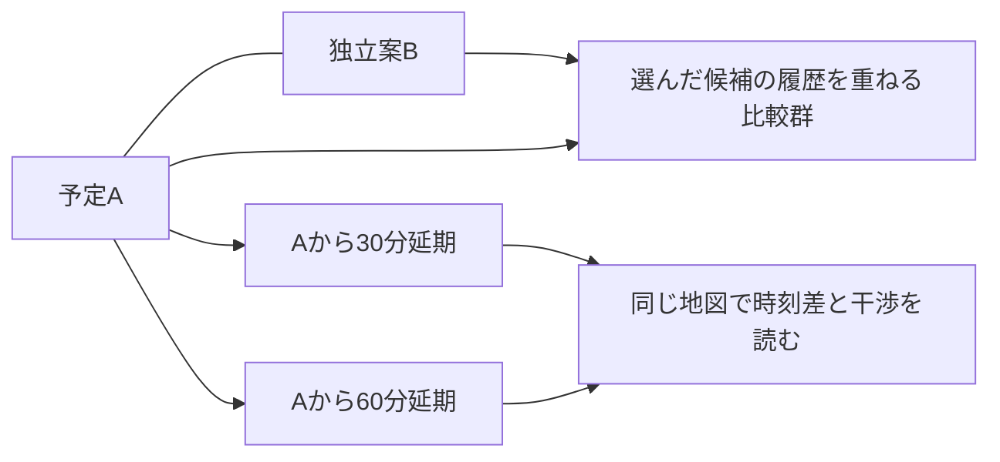

# Q410-04 調査用の読み物

依頼版：0.55.0。基準main：`4e3e4db0d047af9479bcd68bfc2553eeb71efcc9`。
これは採用済みmainの比較基準で、下記抜粋は今回の候補本文です。未統合候補の比較元と、最終保存/統合SHAは区別してください。SHAが不明でも本文を読めますが、最新mainを確認したとは扱いません。

**今回の焦点は Q410-04 です。共通入口の初回開始例は、別の課題へ切り替える指示ではありません。全体の目的を踏まえ、必要なら問いの分割や優先順にも異論を返してください。**

これは自動生成された課題別の読書束です。現在の正本は記載した元パス。MarkdownのリンクはGit内の資料束の位置から辿れるように変換しています。単独添付では未同梱先へアクセスできると仮定せず、元パスから必要資料を求めてください。図の文字説明は含みますが、画面の操作確認や原図の視認を代替しません。


---

## 根拠：docs/research/README.md — ## どう読むと研究の判断材料が得られるか

## どう読むと研究の判断材料が得られるか

資料束にはこの節と次のPR13差分、[BRIEF](../BRIEF.md)の目的と判断条件、[UI_WALKTHROUGH](../UI_WALKTHROUGH.md)の行程、今回の問い、具体材料、返却の助けを収録する。発行・Git管理の手順は本READMEに置き、研究本文の前へ全て複写しない。共通本文を全課題へ含めるのは、入力だけ、気象だけ、保存だけを最適化して用途を壊すことを防ぐためである。原ニーズと現在案を分け、原図や原Excelが必要な結論は追加実体へ戻る。

例えばQ01ではWeibullの一般解説より、既存の製品径と膜厚幾何の不一致が何を意味し、同じ計画のモデル比較をどう変えるかを調べる。Q03では95%楕円を描くだけでなく、少数標本や多峰性で禁止域への関係がどう読めるかを考える。Q05ではDBの選定だけでなく、新予報で更新した後に旧図を読み直す人が何を再現できるかを設計する。原案を守るために問題を狭くする依頼ではない。


---

## 根拠：docs/research/README.md — ## PR13から来た読者へ：何が変わったか

## PR13から来た読者へ：何が変わったか

現在の採用mainはPR29統合後のM420 `4e3e4db0d047af9479bcd68bfc2553eeb71efcc9`。0.43は参考FE/BEの器を比較する設計候補で、現private repoを実装正本とし、参考構成を取り入れる。public参考先の許可branchへの反映は人間が手動commitする。0.43時点では実装移行は未着手だった。0.45ではReact/TypeScript/Viteと薄いPython APIをprivate正本に追加し、直接入力・保存GFSによる二つのn=1の比較と保存再閲覧を接続した。0.46ではD-185により、0.45の簡略な比較画面を後続UIの基準にせず、育ててきた0.40.1 r2の打上げ計画・詳細・気象分析・季節検討の具体的な画面を共通platformへ持ち込み、入力・保存・実計算との接点を同時に修正した。0.47ではその画面を保ち、実GFSの配布観測・取得計画・明示取得/適用・取得中の入力保持を接続し、一飛行の保存再閲覧まで有限に確認した。0.48では固定した一つの気象場と一元量の仮分布から、対応標本・延期比較・経験50/90/95%範囲・全着地点の禁止域判定・同じ群の入力/履歴・保存再閲覧をつないだ。これは仮定した入力幅への感度試算であり、較正済みの気象/機体誤差や三用途全体の完成ではない。原画面を抽象的な効用へ置き換える作業でも、全画面の無変更移植を実接続の前提にする作業でもない。現行操作はCOMMANDS C-09、実APIはIMPLEMENTATION_NOTES、現在の有限受入と未確認はS36、0.46までの記録はS35へ戻る。公開へ渡す差分と科学採用は別に確かめる。現在の接続方針は[接続設計7.3](../../INTEGRATION_DESIGN.html#gui-integration460)、器の比較は[7.2](../../INTEGRATION_DESIGN.html#framework-candidate)へ戻る。0.44でQ420-00 rev7の2MDと完全ZIPを受領した。報告が明記する依頼0.42・固定M420と、実配布した添付集合全体の独立確認は区別する。採否と有限検証は[Codexの受領評価](../../../references/research_returns/Q420-00/2026-09-29-r7/CODEX_REVIEW.md)から辿る。現行生成束は未発行候補で、既発行束を置き換えたと推定しない。以下のM401/C2は0.42研究束の作成時の比較元で、現在の統合SHAや実配布基準と混同しない。

0.42作成当時の基準mainはPR28統合後の `55100867df2bef615c3131228c7c75adf31c9833`、未統合の比較元は0.41/PR29 C2 `d8aa7ed7c385616824121f3f234ad5c9226ba782`だった。0.42候補はその依頼内容を改めたもので、当時に未来の保存/統合SHAを先取りしていなかった。

| 以前の理解から変えるところ | 現在の意味と読む場所 |
|---|---|
| 管理を整え、GFSの小取得を始める段階だけではない | Python本体は保存GFSから一飛行を計算できる。現在の入力・モデル・数値法は[ENV-CURRENT](../../ENVIRONMENT_CONTRACT.md#ENV-CURRENT)。0.48では固定場・一元量の実標本集合を画面へ接続した。気象のばらつき、製品情報等からの結合入力、過去場は未接続 |
| 次の主成果を固定した原版比較や16飛行へ自動的に戻さない | 近未来の予報利用、過去飛行照合、数年〜十年程度の長期計画を支える完成像から次作業を選ぶ。[CONTEXT第1〜4節](../../../PROJECT_CONTEXT.md)、[PLAN第10章](../../PROJECT_PLAN.md) |
| 画面があることと、分析システムの成立を分ける | 2D/3D、候補・延期系列、詳細な群選択、図の保存を人工データで検討した。0.45で直接入力・保存GFS・二結果比較・保存再閲覧を接続した。0.46はその実接点を既存の具体画面へ統合し、0.47は実GFSの取得・明示適用を接続した。0.48では固定場・一元量の仮分布による実標本、禁止域群の詳細と保存再閲覧を接続した。人工分散との区別を維持し、入力レシピ/結合標本、較正済みの気象/機体MC、他の取得経路、三用途を通じる実計算/保存の完成は未了。[接続設計](../../INTEGRATION_DESIGN.html) |
| 上昇率を直接入れる／製品から導く、は異なる物理モデルの名前ではない | 同じモデルへ入る経路を選べる必要がある。元量と導出量を分け、必要でない入力を強制しない。製品版と直接指定の所有を残す |
| 原Excelや風資料は、採用済み科学仕様ではない | Excel原ZIP・分析、風原PDFとレビューを保存済み。式の単位・適用、同時分布を復元できない要約、旧計画の時点を確認する。研究の入口は各課題に限定して示す |
| 保存担当の旧制限を再適用しない | Codexが保存・commit・Draft PRと実績を担当し、人間がmainを統合する。Chatの研究回答は提案であり、main採用や科学受入ではない |

初期モデルは外気温追随の等温を許し、後続の熱・慣性・Re依存等を交換可能にする。等温は全飛行で温度一定という意味ではない。簡易経路を残し、得られない未知量を増やす高度化を目的にしない。無料・特別資格不要は基本の情報源要件だが、匿名限定ではなく登録・同意を区別する。Google写真3Dは任意の試作経路で、基本2Dを有料契約必須へ替えていない。


---

## 根拠：docs/research/BRIEF.md — 全文

---
document_id: BJP-RESEARCH-BRIEF
revision: 0.55.0
as_of: 2026-09-30
role: 研究担当が全体の必要と判断条件を共有する文脈
---

<!-- LOGIC:RESEARCH-BRIEF:BEGIN -->
# 何のために、このシミュレーターを作るのか

[更新:0.59.0] [確認:0.59.0] — RESEARCH-BRIEF / REV-590-DEPENDENCY-RESEARCH-BRIEF

目指すのは、**スペースバルーンのプロジェクトのあらゆる段階で役立つ分析ツール**である。軌道を一本描けることや、計算手法を多く選べることだけでは足りない。利用者が、候補の違いを理解し、気になる結果の理由へ戻り、条件を変えて再検討し、その根拠を後で読み直せるようにしたい。落下分散はその中心にある。平均的にどこへ落ちるかに加え、どの範囲へ広がり、避けたい場所へ入る標本が何によって生じ、変更によって判断がどう変わるかを知りたい。

この依頼では、Codexの案を詳しく説明し直すだけでなく、**この目的に対して何を問うべきか、今の問いや設計が適切かを、研究担当にも判断してほしい。** 既存の画面、課題分割、実装順、Codexと人間が挙げた具体案は、良い方法を探す材料である。制約や採用済み方針と区別して、別案が勝る状況まで考えてほしい。

本書は0.42.0で編集した研究文脈を保持し、科学仕様の第二の正本ではない。現在の発行・受領と実装の進展は[研究入口](../README.md)へ戻る。作成当時の比較元mainはM401 `55100867df2bef615c3131228c7c75adf31c9833`、当時の改訂前0.41候補はPR29/C2 `d8aa7ed7c385616824121f3f234ad5c9226ba782`。実際に渡されたGitコピーの統合版とは区別する。画面と操作の実像は[操作の読み物](../UI_WALKTHROUGH.md)、依頼の入口は[research/README](../README.md)。本書を読んで目的をつかみ、操作の読み物で具体的な関係を見てから、[課題と根拠](../TASKS.md)へ進む。

**0.55の生成束を読む境界：** 本書と共通の研究入口・UI説明・課題本文に残る「現在」「未接続」は、その研究文脈を編集した時点の記述である。0.55では、育てたGUIで実GFSの本命/延期・仮分布の分散/干渉・受付応答消失からの復帰・保存再訪、および統計の関心から取得済み原日時2窓と未取得1窓を区別する実飛行比較までを有限確認した。原日時2例は多年の季節分布を代表せず、任意過去取得UI・較正済みの機体/気象誤差・科学精度の採用は未了である。現行の実装・操作・確認範囲は[指示書S36](../../../BOOTSTRAP_RUNBOOK.html#s36-result550)、[実装補足](../../IMPLEMENTATION_NOTES.md)、[コマンド](../../COMMANDS.md)へ戻る。今回の6冊は元資料との同期を行う未発行候補であり、旧研究の再発行・新回答の受領・科学仕様の採用ではない。以下の原意・問い・旧模型の記録を、現行実装の機能一覧へ書き換えない。

## 原意と、この資料の編集を見比べるために

以下は[CONTEXTに保存したユーザー原文](../../../PROJECT_CONTEXT.md)の短い抜粋である。以後の行程や表はCodexによる整理を含むので、両者を同じ強さの確定仕様として読まない。

> 「どのようなツールで可視化を行い，どのようなグラフや統計的分析を提供して，どのようなモデル選択ができて，パラメーターがあって，それに対する分布などをどのように割り当て，モンテカルロシミュレーションとどうつなげるか．それらはどのような分析のためにどう役立つのか．」（RPT-043）

> 「風資料はこのシミュレータープロジェクトとは別の目的のための資料なので，その内部で目指していることをそのまま取り入れることは間違いですが，良い問いの立て方と分析の具体例を提供する資料としてCodexに見せています．」（RPT-043）

> 「この指摘は確定した修正要求としてではなく，（どこにあるかわからない）最適な設計へ至る人間とCodexの間の議論のラリーの人間側からのパスだと捉えてほしい」（RPT-052）

したがって、必要なのは指定の部品や図を集めることではなく、分析を通して何を判断できるようにするかという全体の設計である。一方、どの提案も同じ重要度で自由に捨てられるわけではない。50/90/95%の範囲、干渉の把握、簡易モデルで始める道など、明示された必要は、捨てるなら元の必要をどう満たすかという再検討を要する。

## 1. 同じ人が、違う時期に違う問いを持つ

三用途は、別々の利用者を想定した製品の三分割ではない。同じ計画と利用者が、長期の企画、予報を使う準備、当日の対応、飛行後の分析へ進む。ただし、誰もが必ずこの順をたどるわけではない。機体と地点を既に知っている人は直接計算したいし、風だけを調べて説明用の図を保存する仕事も、それ自体で完結する。

| 利用者が置かれる状況 | 知りたいことと、その後の行動 | 比較で保つ必要のある意味 |
|---|---|---|
| まだ予報がない。今年または来年の7月に、ある場所・機体で上げる計画を考える | 過去数年〜十年程度の気象条件でどんな落下分散になるか。季節・時刻帯・場所・機体の候補を絞り、必要なら年による違いへ掘り下げる | 過去条件からの計画用分布であり、その年の7月の予報ではない。気象年・原日時の場・機体の標本は異なる階層 |
| 予報が利用でき、場所や機体がある程度決まった | 時刻、充填などを変えた少数候補を比べる。新予報が出たら同じ条件を再評価し、判断が変わった理由を読む | 条件変更と予報更新は違う比較。できる限り早い予報から当日まで、任意のタイミングで更新する。全飛行を支える気象期間が必要 |
| 当日の準備が遅れそう、あるいは落下域が望ましくない | 予定時刻からの遅れに対する分散列を見て、干渉や停止がどう変わるかを調べる。必要なら場所や別条件を再検討する | 延期は親案との時刻差を持つ。充填済みの同じ機体か、各時刻に充填し直す計画かで、保つ実量が異なる |
| 飛行済みで、予想と観測のずれを理解したい | 当時の予報・再解析・観測を並べ、ずれ始める段階と改善の候補を調べる | 当時知り得た情報による予測評価と、事後に判明した条件を使う診断を分ける。再解析も完全な真値ではない |
| 地域の風の特色を調べたい | 高度・季節・場所による風速、方向、ばらつきを比較し、図を持ち帰る。必要なら選んだ時期・場所を打上げ検討へ渡す | 気象だけの分析には機体を要求しない。気象有効時刻のマスクを、放球時刻や飛行中の全時刻へ無言で転用しない |

ユーザーが明示したのは、全段階の分析、予報・過去飛行・長期計画、落下分散を用いた比較、使える予報を早期から更新して使うことなどである。上表の具体的な行程や、計画を一つの容器で育てる構成は、それらからCodexが導いた設計仮説を含む。「三用途だから全画面を三組作る」「一つのprojectだからすべてを一画面に載せる」のどちらも、ここから自動的には決まらない。

根拠は[現在の方向](../../../PROJECT_CONTEXT.md#CTX-VISION)、原要求RPT-035/043/045/048、[完成像の利用場面](../../SIMULATOR_VISION.html#purpose-design300)。場面の分類と過去案の区別はその本文を読む。同じ計画の前後関係を調べるときは[季節選定から飛行後までの例](../../INTEGRATION_DESIGN.html#project-story)へ戻る。

## 2. この研究で大切にしたい、五つの必要

### 条件と結果の対応を、利用者の頭の中だけに置かない

候補比較の重要な用途は、同じ場所・時刻・気象・機体をそろえ、モデル仮定だけを変えた落下分散を見ることである。分散の違いから、どの仮定が判断へ効くかを知りたい。場所や日時も異なる実施案の比較は別に必要だが、変更した軸を読めなければ、差の理由が分からなくなる。

個別タブと同色の分散、比較群、条件の共通/相違表示は、この対応を覚え直す負担を減らすための現在案である。タブという部品を残すこと自体が目的ではない。候補を選んだだけで他案が見えなくなる、保存名だけで内容を推測して比較へ入れる、群にまとめたらモデル差が消える、といった案では、操作数が少なくても仕事は難しくなり得る。

複数モデルをまとめて眺めたい需要もあるが、領域の和集合、モデル別の履歴比較、根拠付き重みで作る確率混合は異なる。確率混合が難しいという理由で、比較への入口や再訪するまとまりまで失ってはならない。逆に、並べるだけで十分な場面へモデル確率の入力を要求する理由もない。[同地点モデル比較](../../SIMULATOR_VISION.html#model-compare290)、[標本の対応の意味](../../INTEGRATION_DESIGN.html#paired-meaning)が、その違いを扱う。

### 落下分散と禁止領域の関係を、すぐ判断の入口にできる

概要では50/90/95%の範囲を直感的に把握したい。平均落下位置だけでは、裾の広がりや複数の山、避けたい場所への入り方が分からない。KML/GeoJSON等で指定した禁止領域との干渉は、ユーザーが最重要とした用途である。干渉件数と地図から同じ群の詳細へ入り、「この群にはどの入力や飛行履歴が多いか」「条件を変えて確かめるべき効果は何か」を調べたい。

現在は着地点の標本と領域で干渉を判定する考え方であり、輪郭同士の見た目の重なりを確率へ変換しない。停止した試行を非干渉と数えることもしない。一方、停止群の高度な統計を常に主画面へ増やす要求ではない。着地統計の対象と全試行中の停止数を理解でき、必要な群へ進めればよい。

以前の「干渉した点を囲う」案から現在の点表示へ進んだ理由には、線の重なりによる地理の隠れがある。この履歴は、以後の領域表現を禁止する規則ではない。多数候補・細い禁止域・近接表示など、どの場面で何が読めるかを比較し、よりよい表現を提案してよい。50/90/95%の必要、干渉の母数、読みたい地理との関係を満たすことが重要である。[干渉の設計](../../SIMULATOR_VISION.html#landing-constraints)、[分布と診断](../../INTEGRATION_DESIGN.html#distribution)へ戻る。

### 手持ちの情報で始められ、知っている情報も無駄にしない

対象の代表はHe充填のゴム気球、約30 km、乾燥重量10 kg未満程度であり、固定上限ではない。手元には粗い飛行記録、製品表、Excelとその分析、公開研究がある。未知の係数を増やす精密化のために新しい実飛行・同定実験を要求せず、既存資料と一般性のある知見を利用する方針である。

例えばTawhiri型の簡易経路では、上昇率や破裂高度を直接持つ人へ、製品寸法・ガス量・膜厚を追加で要求する必要はない。しかし製品と充填条件が分かる人には、その情報から整合した率や閾値を導く補助計算が便利である。同じ実行モデルでも適した入力経路は違う。入力欄が最少なら常に使いやすいとも、詳しい情報を全部入力できれば良いとも言えない。

内外等温の初期モデルは後から拡張できる設計を前提に許容され、熱感度実験を今回の着手条件へ戻さない。等温は飛行全体で温度一定という意味ではない。後続の抗力・慣性・形状・破裂・降下などの効果は、組み合わせと必要量の依存で考える。現コードの拒否条件を将来の科学的不能へ読み替えず、詳しいモデルで何が分かり、そのために何を新しく知る必要があるかを比較してほしい。

組合せの見通しとして、既存設計は段階ごとの鉛直運動を、速度則を与える経路、瞬時の力釣合いから速度を得る経路、速度を状態に持つ慣性の経路に分ける。力を扱う経路では、定Cd/Re依存Cd、外気密度、ガス・体積・形状、破裂後の質量や傘の条件などが結び付く。指定高度の破裂と径の破裂では、必要な膨張計算も異なる。上昇を詳しくしたら降下も同じ方式にしなければならないわけではないし、対地速度を直接与える式へ外気鉛直風を重ねれば二重計上になり得る。これはすべて実装済みの選択肢ではなく、入力経路の三例だけでは見えにくい将来の互換性を考える材料である。新たな選択肢には「何を比較したいから必要か」を求め、既存の同値な式へ別名を付けて精度向上と数えない。

製品の平均破裂径と、膜厚等から導く代表径は、値を得る入口の違いを含む。製品表の±を標準偏差とみなしたり、径と膜厚を独立に振ったりしてよいとは限らない。ただし分布幅の根拠が未確定でも、仮定したCV等で感度を調べることは有用である。根拠付き分布と仮の幅を区別し、入力の依存と値域を保ちながら、その仮定で結論がどれほど変わるかを見せる道を閉じない。[モデル構成](../../ENVIRONMENT_CONTRACT.md#ENV-MODELS)、[入力経路](../../INTEGRATION_DESIGN.html#inputs)、[破裂入力](../../SIMULATOR_VISION.html#burst)が根拠となる。

### 粗く見てから深く調べる流れを、情報と計算の両面で成立させる

利用者は入力を変えながら概況を知り、気になった候補や群だけ詳しく調べたい。概要/詳細という二種類へ固定する要求ではなく、知りたいことと必要な精細度に応じて負担を変えたいという要求である。保存済み標本の選択や色・視点の変更なら、飛行を計算し直す必要は通常ない。詳細な履歴がなければ再計算が必要になる場合がある。その違いを設計したい。

処理を軽くする方法にも異なる代償がある。描画を減らす、集計を再利用する、読む履歴を絞る、MCを段階的に増やす、気象場を近似する、は同じ「高速化」ではない。例えば速く終わった飛行だけを先に描けば、飛行時間や停止理由で集団が偏る可能性がある。凍結気柱や統計代理場が安価でも、候補順位や干渉の裾を変えてしまうなら、その利用場面には不十分かもしれない。

逆に、全用途で常に最も高価な場と全履歴を要求すれば、時期や場所を粗く絞る道具として使いにくい。「どの判断なら近似で足り、何が気になったら次へ進むか」を、精度・取得・計算・保存・操作負担を結んで研究してほしい。現段階で応答秒数や最適MC数を測定済みではない。[段階的な分析](../../SIMULATOR_VISION.html#progressive-ui)、[標本の追加](../../INTEGRATION_DESIGN.html#progressive-sampling)、[費用と保存](../../SIMULATOR_VISION.html#cost-and-storage)へ戻る。

### 図と操作が、問いを発展させる手掛かりになる

提供された風統計資料の価値は、グラフが多いことより、目的に沿った問いを立て、要約から差や分布へ進める構成にある。年間×高度の強さ・方向・定常度を共通軸で読むと、どの層・季節が気になるかを見つけられる。月別のプロファイルや風配は平均で隠れる分布を示し、地域図は場所による違いを示す。同尺度で並んだ月別図には、頭の中で12枚を合成せず比較できる効用がある。圧力や時期をバーで連続にめくる操作には、変化をたどって気になる位置を探す効用がある。

ただし平均速さの場所幅が小さくても、風向が反対なら一地点で地域を代表できない。定常度が低いことも、地域内の方向差か、一地点の時間変化かで意味が異なる。図を連携させるとは、全操作を一律同期させることではなく、同じ問いを深めるために何を引き継ぎ、どこで対象や尺度を変えるかを決めることである。

原資料の地域、機体、暦区分、凍結気柱、数値結果を、そのまま本プロジェクトの要件や科学的正解にしてはならない。既集計DBから任意の年・時間帯・全同時分布を復元できるわけでもない。良い問いと表現の例として使い、限界は限界として扱う。[気象分析の完成像](../../SIMULATOR_VISION.html#climate-workspace)と[風資料レビュー](../../../references/WIND_REPORT_REVIEW.md)の第10〜13節を対応させる。実際の図や画面の読み方は[操作の読み物](../UI_WALKTHROUGH.md)へ進む。

## 3. 現在何があり、どこがまだ設計なのか

| 対象 | 現在の位置 | 研究担当がそこから判断してよいこと |
|---|---|---|
| Pythonの一飛行核 | 保存GFSを読み、選んだ現行モデルで一飛行を計算する実装がある。数値積分・根探索はSciPyを利用。全将来モデルや過去場の一般接続ではない | [ENV-CURRENT](../../ENVIRONMENT_CONTRACT.md#ENV-CURRENT)から実際の入力/返値/支持を確認し、内側を変える必要と外側へ加える責務を分ける |
| 比較・詳細・気象・2D/写真3Dの操作模型 | 人工標本・模式的な履歴等を用いて、操作や見え方を検討してきた。実写真への重畳の限定確認もある | 操作の関係と過去の修復理由を材料にできる。即時再描画を本体性能、人工輪郭を実気象の統計、写真meshを計算地形の精度とはみなさない |
| 全体の接続案 | 入力経路、元量の標本化、場、固定結果、分析、保存、jobの責務を[接続設計](../../INTEGRATION_DESIGN.html#journeys)で提案している | 0.45のReact画面・薄いFastAPI・n=1保存再閲覧の有限実装は[実装補足](../../IMPLEMENTATION_NOTES.md)へ戻る。0.46では育てた0.40.1 r2の用途別の具体画面を共通platformへ統合し、入力・保存・実計算との接点を並行して修正した（D-185）。0.47では実GFSの取得・明示適用と取得中の入力保持を接続した。0.48では固定場と一元量の仮分布による対応標本、延期・干渉群の比較と保存再閲覧を接続した。現在の有限受入はS36/D-187へ戻り、較正済みの気象/機体誤差や三用途全体の受入へ広げない。三用途・分散を覆う最終schema/API全体は未確定であり、境界や優先順の研究を継続する |
| 原資料と研究知見 | 風PDF、Excel原本と分析ZIP、気象ガイド、取得観測がある | 出典・対象・確認範囲へ戻れる。小取得の成功、著者の検査、条件付きの数値を、一般運用や科学的受入へ拡張しない |

情報源は無償・特別資格不要を基本とし、匿名利用と登録/同意は分けて確認する。NOAA-GFSを予報の方針とし、ERA5/JRA-3Qや当時のGFS予報を過去用途へ検討する。日本での使いやすさと任意領域による性能設計を重視するが、日本外を内部的に禁止する要求ではない。Google写真3Dは任意の試作経路で、基本の2D利用を有料契約必須に変えるものではない。

これらの既決方針への異論が生じたら、黙って置換せず、根拠と代償を伴う再検討案として返してよい。研究回答から採用、実装、実データによる精度確認まで完了したとは扱わない。権限・返却・保存の手順は[研究入口](../README.md)に置き、本書の目的説明へ混載しない。

## 4. 問題はつながっている：何を変えると隣が変わるか

課題を分けるのは仕事を進めるためであり、境界の外を見ないためではない。次の表は、現在見えている相互依存と未決を示す。ここにない重要な問いも探してほしい。

| 起点となる判断 | 隣へ及ぶ影響と、研究したい対立 | 深掘りの入口 |
|---|---|---|
| どのモデルと入力経路を選ぶか | 直接の率なら不要だったp/T/q、質量、Cd、形状等が必要になる。細かいモデルの効果が、その情報を用意する負担に見合うか。製品・直接値・補助計算のどれを元量として扱うか | [モデル構成](../../ENVIRONMENT_CONTRACT.md#ENV-MODELS)、[入力切替](../../INTEGRATION_DESIGN.html#input-changes)、Q410-01/04 |
| 何のばらつきを表すか | 機体ばらつき、予報に条件付く誤差、季節内の気象変動、モデル差、有限標本誤差は異なる。元量と派生量を二重に振らず、同じ場実現を飛行中に保つ必要がある | [不確かさ](../../SIMULATOR_VISION.html#uncertainty)、[分布](../../INTEGRATION_DESIGN.html#distribution)、Q410-01/02/03 |
| 何を同じ条件として比較するか | 物理実量を固定する、同じ分位を異なる分布へ写す、対応のない集合を比べる、では結論が違う。延期・モデル差・新旧予報を同じseedという理由だけで対にできない | [標本の対応](../../INTEGRATION_DESIGN.html#paired-meaning)、Q410-02/03/05 |
| どんな気象場を、どこまで用意するか | 地表〜約30 kmと数値試行の余裕、任意放球時刻、全飛行の時間支持が要る。早期予報と直前、過去一便と十年分析で経路や費用が変わる。高度な場と軽い代理場をどの判断で使い分けるか | [気象の準備](../../INTEGRATION_DESIGN.html#weather)、[現行GFS](../../WEATHER_DATA_GUIDE.md#WG-CURRENT)、[分散へ必要な情報](../../WEATHER_DATA_GUIDE.md#WG-DISPERSION)、Q410-02/04 |
| 50/90/95%と干渉をどう読むか | 多峰や少標本、重み、停止が輪郭と件数の意味を変える。描画が安定したことと、入力分布の正しさは別。平均が同じでも裾や禁止域への入り方で候補選択は変わり得る | [干渉](../../SIMULATOR_VISION.html#landing-constraints)、[段階標本](../../INTEGRATION_DESIGN.html#progressive-sampling)、Q410-03 |
| 何を後から調べ、再利用したいか | 任意群の履歴は全体分位だけでは復元できない。設定再利用、検討再開、固定図の配布、再計算一式は必要な実体が違う。保存量を減らす代わりに何ができなくなるか | [保存と再開](../../INTEGRATION_DESIGN.html#save-and-reopen)、[結果の寿命](../../INTEGRATION_DESIGN.html#lifetime)、Q410-05 |
| どの処理を待たずに操作したいか | 入力変更と旧job、取消と結果確定、少数MCと大規模集計、別PCの計算を区別する。画面を閉じても意味が残る構成と、導入・維持の小ささをどう両立するか | [サービス境界](../../INTEGRATION_DESIGN.html#service-boundary)、[構成候補](../../INTEGRATION_DESIGN.html#technology)、Q410-03/04/05 |
| 過去飛行の何を評価するか | 当時予測の評価と事後診断では、使える機体情報・気象・観測の扱いが違う。風だけ変えたつもりで破裂条件も変えれば原因説明が崩れる。記録が粗いとき何をなお学べるか | [過去飛行の分析](../../SIMULATOR_VISION.html#past-flight-workspace)、[三用途](../../INTEGRATION_DESIGN.html#journeys)、Q410-02/04/05 |

例として、充填済みの機体を30分延期するだけでも、入力側ではガス実量の保持、気象側では照会時刻と支持、MC側では標本の対応、画面側では親への差分、保存側では旧結果と新条件の識別が必要になる。どれか一つだけ正しくても、この一連の比較が成立するとは限らない。

一方、風だけを調べる仕事へ同じ機体入力やjob構造を強制するのも不自然である。共有すべきなのは同じ意味を持つ処理と根拠であって、項目名や画面の数を揃えることではない。こうした横断の反例を見つけたら、自分の担当へ押し込まず、隣の問いまたは課題分割の修正として返してほしい。

### 既にある対立材料を、研究の出発点にする

入力・破裂の例では、製品表の1500形に平均破裂径10.0 m、検査時膨張径6.3 mがある。一方、原Excel Bの基準膜厚130 µm、破裂厚5.0 µmを同じものとして用いても、基準を長さ2.2 m・径1.4 mの楕円体（等体積球径1.62764 m）にするか、直径2.2 mの球にするかで、換算径は約8.29939 m／11.21784 mになる（既存独立計算、原セルと式はVISION#burst）。製品平均径とこの幾何由来の代表径を同じ統計的事実とみなせるかが未決であり、一般的なWeibull式を再説明するだけでは解けない。細かな式・母数・逆モーメントの条件はQ410-01束に同梱する。

気象の例では、ある2地点の風が全時刻でそれぞれ(u,v)=(20,0)、(-20,0) m/sなら、平均速さの地点間幅は0でも移流方向は正反対になる。風資料の「速さの空間幅が小さい」という図から地域を一気柱で代表できると一般化できない（WIND_REPORT_REVIEW§13の解析例）。長期の軽量化案を評価するとき、同じ平均を再現するだけでなく候補の順位・干渉・層や時刻の関連をどれだけ保つかという問いへ進める。

過去飛行では、生の位置時系列が全便分あるとは限らず、要約表の速度・区間高度・所要時間が食い違う例がある。将来の豊かな観測に開いた設計と、今ある粗い記録で比較できる量の両方を考える。具体原セルと情報の欠落はUI_WALKTHROUGH§7へ置いた。これらの例は優先テーマを固定するものではなく、既にある証拠と未決を使って独立した問いを選ぶ材料である。

## 5. なぜ「ニーズから問い直す」を、依頼の中心に置くのか

これは抽象的な心掛けではなく、過去に設計を変える必要が生じた理由である。

**内部の分離を、画面の分離へ短絡した。** 0.30では入力・結果・比較を区別する設計から、タブと分散の対応まで外した。「主図一つ」という簡潔さの一般論から、年間・12か月比較も失った。各部品が動く検査は通っても、利用者が同じ比較へ戻り、違いを読む仕事は難しくなった。後の修正は旧部品への無条件な復帰ではなく、何の対応や比較軸を失ったかを根拠に行った。[完成像に残した再検討](../../SIMULATOR_VISION.html#why310worked)、DECISIONS D-169/170を読む。

**具体案を前提にし過ぎ、配置そのものを疑うのが遅れた。** 縦に区切った画面の中で局所改善を続けても、地図と必要な条件を読む面積が足りない場合があった。ユーザーの指摘は「横長領域を縦に積め」という固定仕様ではなく、同時に見る関係、スクロールの負担、役割に対する面積を考え直す刺激だった。研究でも、提示された案の中だけで係数や部品を最適化していないかを疑ってほしい。[配置への再検討](../../SIMULATOR_VISION.html#workflow350)とRPT-055〜057が根拠となる。

**局所成功を、続く仕事の成立へ広げた。** 写真3Dで名称を読めるようになった後、2Dへ戻ると地図が崩れる反例が出た。名称の検出や接続維持を確かめても、利用者が戻って候補・地物を比較し続けられるとは限らなかった。研究資料でも、各課題が答えられるだけで引継ぎ全体が良いと判定してはいけない。答えがどの判断を進め、その次に何が残るかを見る。[0.40.1の境界](../../SIMULATOR_VISION.html#workflow401)、DECISIONS D-179追記に当時の確認範囲を残している。

共通原則は[DC-JUDGMENT](../../DOCUMENT_CONTROL.md#DC-JUDGMENT)である。情報を結んで明記されていない必要も推測し、人間の知識・注意・負担と仕事の流れに照らしてその推測を疑い、案を作り、当初の意図へ戻して評価する。細部を満たしても全体が不自然な場合があり、違和感の理由を完全に言語化できるまで判断を禁止することも適切ではない。どの場面で何が引っ掛かり、どの別解釈なら変わるかを、観察と仮説として述べてよい。

ただし「人間なら当然」を根拠に明示された要求や科学的事実を上書きしない。出典で確かめたこと、資料から推測した必要、まだ判断できないことを区別する。批評の回数や否定の数、返却様式の欄が埋まったことを成果にしない。自分の案にも不利な利用場面を当て、変えた案をもう一度元の目的へ戻してほしい。

## 6. Chatに期待する仕事と、具体的な成果

最初の[Q420-00](../TASKS.md#q420-00)は全体の統合研究である。Q410-01〜05は入力・気象・統計・取得・保存の深掘り材料であり、この番号順を守る工程表ではない。まず必要と相互依存を捉え、利用者の判断や後の設計コストへ効き、今の開発を進められる問いを選び直す。その上で、**重要な判断を一つ以上、具体案と根拠によって前進させる**ことを求める。目的の復唱や「後で調べるべき項目」の長い一覧だけでは足りない。

例えば、入力が最優先だと判断したなら、三経路を表へ移すだけで終えず、同じ仮想機体を直接値/製品値で扱い、モデルや分布を変えたとき何が不足し、何を保持し、どんな比較が可能になるかまで具体化できる。気象の不確かさが先だと判断したなら、根拠不明だから停止するだけでなく、長期の場の選び方と予報誤差を分け、仮定した幅で何が分かるか、何の追加情報が結論を変えるかを示せる。保存が先なら、技術名の選択ではなく、新予報→延期→図の再閲覧という行程を通して、案の利点と破綻条件を比較できる。

現案を維持する結論でも構わない。その場合は、筋の良い代案に対して、どの利用場面・費用・制約で優れるから維持するのかが必要である。逆に大きく構成を変える案は、失われる効用や移行の負担も示してほしい。現UIの全操作や全原資料を読めなければ一切考えられない、とも扱わない。読めた根拠で具体化できる部分を進め、決めるために必要な不足だけを理由付きで返す。

一回の研究量は有限でよいが、考慮する全体像は狭めない。一次資料の調査、小さい式や数値例、比較図、保存/入力の例などを、選んだ問いに合う方法で作る。未来の全schema、全モデル、全十年の計算を完成させる依頼ではない。成果を[返却形式](../RESPONSE_TEMPLATE.md)へまとめるときは、何を新しく理解し、どの設計判断が変わり、Codexが次に何を具体化できるかを先に伝えてほしい。

<!-- LOGIC:RESEARCH-BRIEF:END -->


---

## 根拠：docs/research/UI_WALKTHROUGH.md — 全文

---
document_id: BJP-RESEARCH-UI
revision: 0.49.0
as_of: 2026-09-30
role: 操作できない研究担当へ、画面の関係・操作前後・判断の理由を伝える
---

<!-- LOGIC:RESEARCH-UI:BEGIN -->
# 画面を触れない研究者のための利用行程

[更新:0.59.0] [確認:0.59.0] — RESEARCH-UI / REV-590-DEPENDENCY-RESEARCH-UI

本書は、機能一覧では伝わらない**利用者が何を見比べ、何を変え、どこへ戻って判断するか**を説明する。[BRIEF](../BRIEF.md)の目的と合わせて読む。0.40.1 r2の一枚一枚の画面は、実用を想定して改善を重ねた具体的成果である。これを素材に共通platformへ統合し、入力・保存・実計算との未解決の接点を並行して直す。細部の変更はできるが、効用だけ抽出した別画面への再発明を移行とは呼ばない。変更案は元の画面・操作との対応と改善理由を示す。

0.46時点では、具体画面と実入力/固定結果/保存の接点を統合し、実n=1の候補・延期比較と写真3D→2D復帰を有限に確認した。これは本書で説明する人工分散の全機能移行や実MCの完成ではない。0.46の確認範囲は[指示書S35](../../../BOOTSTRAP_RUNBOOK.html#S35)。0.47では同じ具体画面に実GFSの取得計画・明示取得/適用・入力保持を接続し、保存再閲覧を有限に確認した。0.48では固定場・一元量の仮分布から作る実標本を、経験範囲、延期と干渉群の比較、同じ群の入力/履歴、保存再閲覧へ接続した。0.49では同じ画面を使う48/192実試行の費用を測り、実JRA期間集計の年間/地域図と保存再読を接続した。年/時間帯を選ぶ過去4D場や季節飛行は未接続で、下記の原模型の全操作を実資料で再現したことにはしない。現在実物と確認範囲は[S36](../../../BOOTSTRAP_RUNBOOK.html#S36)、実sourceとの対応は[SCREEN_PROVENANCE](../../../frontend/SCREEN_PROVENANCE.md)へ戻る。以下の原模型の観察日はそのまま保持する。

本書の行程説明の対象はGitに保存した0.40.1 r2模型。0.46〜0.49の有限接続によって、本書の機能全体が較正済みの気象/機体MCや過去場へ接続済みになったという意味ではない。0.45の二候補n=1接続は計算/保存の有限成果で、その簡略画面を後続GUIの基準にしない（D-185）。予報の入口・条件編集・延期ダイアログ・詳細・気象4画面・季節計画への遷移は2026-09-28に主担当が実画面を読み直した。写真3DはS34の以前の観察記録と設計本文に基づき、この再読ではキー接続していない。この原模型の観察時点では、過去飛行の比較と実標本の入力分布診断は画面として成立していなかった。0.48の一元量・選択群の実診断とは時点と対象を分ける。原模型は [VISIONの保存索引](../../SIMULATOR_VISION.html#model-archive)にあるZIPから戻れる。研究の開始にその展開や操作は要求しない。

**画面の人工データと本体計算を分けて想像する。** 現模型は操作の関係を試すもので、表示の即時変化は実気象MCの速度ではない。画面に残る「実計算」という表記も人工標本の再集計を指しており、実飛行核との接続済みと読まない。季節試算は放球点の人工気柱を固定する簡略計算で、飛行先の時空間場・地形着地・支持切れまで解いた結果ではない。これらの限界を実システムへどう置き換えるかが研究課題である。

## 原図を読むときの入口

初回に渡す風分析PDFでは、**物理頁35〜43の図14〜20・23**で「年間の高度差→月のプロファイル/風配→地域差」という比較の組合せを、**物理頁45・48の図25・29**で風から落下の問いへの移り方を見る。図の所在と読み方は下記第5節およびWIND_REPORT_REVIEW第11節へ対応させた。単に図の見た目を模倣するのではなく、軸・並べ方・色・要約の選択が何を発見しやすくし、何を隠すかを評価してほしい。初回に全付録を順読する必要はなく、統計代理場等を主題に選んだら原法の章へ進む。

0.40.1フィードバックPDFは入力・分布・保存への人間側の意見を図付きで示す。現在案への確定仕様ではない。UI配置の同時視認や色の重なり自体を主題に選ぶ場合は、本書だけで視覚評価したことにせず、対象を絞って模型の画面図またはHTMLを追加要求してよい。

## 1. 予定AとモデルBを同じ場所で比べる

利用者は「この場所・機体で上昇や破裂の仮定を変えると、落下域と禁止領域への干渉はどれくらい変わるか」を知りたい。AとBは、必ずしも二つの異なる打上げ企画ではない。**同じ計画に対するモデル差の比較**は主要な使い道である。一方、場所・充填・時刻自体を変更して運用候補を比べる使い方も必要になる。

現在の予報画面は、上から「共通の準備」「独立候補と比較群の選択」「注目候補の条件要約・件数・操作」「広い共有地図」「必要なら開く数値比較」の順に積む。地図の高さは画面に応じた自動値を持ち、下端を動かして変えられる。横長の地図を確保し、常時巨大な設定欄で地理を圧迫しないための案である。縦スクロールは許してよいが、条件とその結果が遠く離れて頭の中の照合を強いないかは批評対象になる。

| 同時に読むもの | 現在の表現 | 支えたい判断・残る問題 |
|---|---|---|
| どの候補を読んでいるか | A標準案、Bモデル比較、G1履歴比較等の入口。注目候補の名称・版と結果要約を地図直上に置く | 「注目」と「地図に表示」は別。他候補を残したままAの条件を読めることに価値がある |
| 着地位置の散らばり | 注目候補を50%内、50–90%、90–95%の帯で塗り、他候補は輪郭を主に表示。50/90/95%を個別切替 | 候補同士を全部濃く塗ると重なりが読めない。50/90/95%は直感的な中心情報で、平均一点だけへ縮めない。今の経験楕円が将来の数値法として採用済みではない |
| 地物との位置関係 | 通常地図／衛星・航空写真を切替。気象領域の境界、平均的な軌道・着地点、禁止領域、干渉点、停止点を関連付ける | 市街地や人工物を見る際は写真が有用。境界停止は着地と別の記号で見える必要がある |
| 数で読む必要のあるもの | 着地/全試行、干渉、停止・不明、平均着地座標や飛行時間等。詳細な分母は展開可能 | 例として人工Aは60着地/64試行、4停止。着地集合の95%域が64全体の95%を覆うとは言えない。停止を隠して狭い雲を良い結果と読ませない |

条件を開くと、現模型には名称・緯度経度・日時（JST表示）・ペイロード質量・簡易なモデル選択程度しかない。地図で地点を置く操作は通常のpan/zoomと区別し、数値入力も併用する。この少ないフォームは完成した機体入力ではない。製品データ、充填、上昇/破裂/下降の組合せ、固定値/分布、導出された量を、持っている情報に応じて使う入力設計が未了である。

**ここで研究が変え得ること。** 詳しい来歴を全欄の横へ常時並べれば正確でも、反復比較を妨げるかもしれない。逆に内部では別の入力・結果・分析だからと画面を完全に分けると、条件と分散の対応を利用者が記憶し直す。どの情報を同時に出し、どれを必要時に開き、更新中の旧結果をどう識別させるかを、例えば「Aの製品を変えて計算中にBを見る→旧Aを保存する」の場面で提案してほしい。

出典：[VISION workflow350](../../SIMULATOR_VISION.html#workflow350)、[workflow390](../../SIMULATOR_VISION.html#workflow390)、[接続設計 inputs](../../INTEGRATION_DESIGN.html#inputs)、CONTEXT RPT-038/045/048/050/057。

## 2. 遅れたときの分散を、一つの計画から続けて見る

予定9時のAに対して、9時30分、10時…と延期した場合の落下分散と干渉を、同じ地図で次々に確認したい。毎回候補を複製して全入力を手で照合するのは煩雑で、独立案の列に並べるだけでは「親から時刻だけ違う」関係が消える。

現案ではAを親とする延期系列を作り、独立案の横の関係と、親に従属する差分の関係を分ける。ダイアログは遅れ時間の集合を選び、作成・保持・削除と再計算/再利用の見通しを示してから適用する。模型には0.5時間刻みの近傍と、より先の整数時間があるが、これはUI試行の値であり気象データ間隔が放球をこの刻みに制限するという仕様ではない。実システムは任意放球時刻を、飛行全体を支持する連続場の内挿で扱う。



この図は意味の関係を示し、画面をそのまま描いたものではない。延期子も結果・詳細・表示切替を持つが、親変更に連動するのか、個別に編集して独立化するのかは表面上の見た目だけで解けない。

物理的にも「他条件は同じ」には二通りある。既に充填した同じ個体を待たせるならガス実量を保つのが自然な場合がある。別の時刻に同じ目標浮力になるよう充填し直す計画なら、ガス量が変わり得る。気象run更新も、時刻差だけの比較とは異なる。共通乱数を使う場合も、同じ物理実量を共有するのか同じ分位を対応させるのかで差の意味が違う。現案の「コピー」をそのまま保存契約へしないで、この区別が利用者に無理なく伝わる方法を考えたい。

出典：CONTEXT RPT-051、[接続設計 input-changes](../../INTEGRATION_DESIGN.html#input-changes)、[paired-meaning](../../INTEGRATION_DESIGN.html#paired-meaning)。

## 3. 干渉した群へ潜り、条件を変える手掛かりを探す

概要で分散が禁止領域に近づいたら、利用者は「どの標本が干渉し、何が違うのか」を調べたい。領域はKML/GeoJSON等で指定する想定。輪郭と領域の見かけの重なりだけで干渉数を決めず、結果に対する領域判定と、その結果のID群を保って詳細へ進む。

現案は全干渉点を地図に示し、件数から同じ群を詳細へ持ち込める。以前の「干渉点をまとめて囲う」案には、囲いが未干渉の地物まで巻き込み、別の確率輪郭のように見える問題があった。この失敗は新しい囲い方を全て禁止する根拠ではない。点が多く重なって位置関係が見えない場合には別表現が勝ち得るので、**全干渉の所在を読み取ること、確率域と混同しないこと**の両方から代案を評価する。

詳細画面では他候補を一旦退け、一候補と選択群に集中する。上部に全着地/干渉/非干渉/地図で囲む選択がある。通常の「この候補を詳しく」から初めて入ると全着地、概要の干渉件数から入るとその干渉ID群を読む、という違いが重要である。地図の多角形選択は、着地地点で対象IDを選び直す操作である。時刻を動かすたびに近くの別標本へ選択がすり替わるものではない。

| 見える組合せ | 操作と読み方 | 次の問い |
|---|---|---|
| 左の地図と右の経過時間グラフ、下の共通時刻バー | 選択群の着地と、バー時刻での飛行中位置を読む。右は高度、累積横移動、東/北変位、水平/鉛直速度等を切替 | 干渉群はどの高さ・時間から違い始めるか。地理選択で偏った結果を全体へ一般化していないか |
| 左を風の分布へ切替、右の履歴と共通バーを保つ | 同じ時刻の各標本位置での風速頻度と風配図を見る。バーを動かしながら変化を追う | 終点だけで分からない風の寄与を探れるか。生存中の標本が減る効果を風自体の変化と混同しないか |
| 選択群と全体/非選択群の特徴比較 | 現模型は破裂時刻・着地時刻の平均と10–90%等の小表のみ。入力/抽選/導出量の分布診断は未実装 | どのパラメータが干渉群に多いか、その仮説を対応する再計算で確かめられるか |

時間履歴の現模型は上昇/下降を色で区別し、選択群の平均線と時刻ごとの10–90%帯を描く。これは平均推定の信頼区間ではない。着地後の標本を時間風分布から外す場合、選択群総数とその時刻での有効数を別に読む必要がある。風配は来向で、移流先の地図矢印とは向きの約束が逆になる。現模型の詳細と気象分析では静穏の閾値や分母の扱いにも違いがあり、これを完成仕様として無意識に引き継がない。

「干渉群は破裂高度が低かった」という関連だけで原因は確定しない。機体・気象・計算停止・選択の効果が重なる。それでも関連図は、次に変える仮定を選ぶ有用な手掛かりになり得る。例えば径破裂モデルの破裂高度は導出結果で、比較のためそこだけ直接上書きすると別モデルになる。ガス量や径の元入力を変える、未知の分布幅を別シナリオで試す、別気象ケースで確かめる、は異なる次の操作である。研究には、入力分布の設定自体の診断、実抽選値の診断、着地/干渉群を条件付けた診断、導出量の診断を混同せず、変更可能な条件へ戻れる構成を提案してほしい。すべてを一画面に追加することが目的ではない。

比較群G1は、複数候補の全標本の経過時間グラフを重ねる入口として考えている。A/Bの集合を自動的に一つの確率分布へ混ぜるものではない。混合を必要とするなら目的とモデル重みを別に論じる。詳細から概要へ戻ったとき、候補の注目・表示・地図の文脈を失わせないことが、反復する分析では重要になる。

出典：[VISION analysis](../../SIMULATOR_VISION.html#analysis)、[landing-constraints](../../SIMULATOR_VISION.html#landing-constraints)、[接続設計 distribution-diagnostics](../../INTEGRATION_DESIGN.html#distribution-diagnostics)、CONTEXT RPT-045/048/051/067。

## 4. 写真3Dは、同じ結果と地上物を近くで読むためにある

俯瞰の2D地図で気になる場所を見つけ、写真3Dで地形・屋根・樹木の周辺へ近づき、回転・移動・拡大しながら、**地表に投影された落下域/禁止領域/軌道との関係**を読む。3Dは全体の俯瞰を飾る別画面ではない。近づくと輪郭全体は見えなくなるため、面の濃さ、境界線、候補の名前と所属を局所で読めることに意味がある。

現案は注目候補の輪郭間の帯、他候補の線、領域を同じ文脈で表示する。面内の名称hover、重なった対象を一つの吹出しで読むこと、名前の反復を避けることを試してきた。線上だけ反応し面内では分からない失敗や、3Dで確認後に2Dタイルが崩れる反証を経て修復した。成功は記録された範囲に限られ、UI全体の完全な受入ではない。

研究上大切なのは、この局所読取から2Dの候補比較や群の詳細へ同じ対象のまま戻れること。表示meshは、積分の着地判定に使う地形や気象の下端支持とは別である。屋根へ色が載ったことを物理的な衝突計算ができた証拠にしない。Googleキー/写真接続は任意で、基本解析を有料背景必須にしない。3Dの細部の再実装を今回研究へ必須にする意図もない。

出典：[VISION workflow401](../../SIMULATOR_VISION.html#workflow401)、[workflow390](../../SIMULATOR_VISION.html#workflow390)、S34の実写真/人間hover報告と訂正記録、CONTEXT RPT-063〜067。

## 5. 風そのものを読み、場所・季節の仮説を立てる

「この地域で、いつ・どの層の風が強く、向きが揃うか」を先に知りたい。機体がまだ決まっていなくても、風の分析だけで図を持ち帰ってよい。画面は共通の年範囲・気象時刻mask・領域を上に持ち、その母集団を保ちながら四つの問いを切り替える。現在の2020–2025年・JST03/09/15/21時・9格子は人工模型の例であり、本番の固定制限ではない。

| 問い | 同時に読む図・操作 | 読みたい差と、まとめ方の理由 |
|---|---|---|
| 年間の高度構造 | 横が暦の一年、縦が概算高度で、風速平均・平均風向・定常度・地点間の平均風速の幅を同じ軸で上下に並べる。月内4/2区分を切替 | 強いが向きが揃わない層と、強く一方向へ吹く層を混同しない。月目盛と同じ縦位置が図同士を結ぶ。各図を別のドロップダウンへ隠すとこの対応を失う |
| 季節による分布 | 月別高度プロファイルを12枚、共通軸で並べる。風配へ切替えると代表元格子と気圧面を選び、12月の極座標分布を同じ半径尺度で見る。月/半月/季節区分も検討 | 7月だけの詳細に入る前に、通年の特色と変化点を一目で捉える。気圧バーで層を変えても、月の並びを記憶し直さず追える |
| 地域差 | 同じ地理範囲の月別地図12枚。風速カラーマップ＋等長の平均移流方向矢印、または定常度。気圧面バーを全図で共有 | 大小の矢印へ風速を兼用させず、色と向きの役割を分ける。共通色尺度は月や高度の比較を支え、現在高度だけの尺度は小さい場所差を読みやすくする。切替時に尺度の意味が読める必要がある |
| 打上げへの影響 | 同一の人工飛行仮定で複数地点から平均到達点への直線を描く。色は到達点のRMS幅、選択地点だけ50/90/95%域。月/半月をバーで変える | 場所を粗く絞る場面。平均への直線は飛翔経路ではない。試算点を増やすNは、元気象格子の精細化と別。任意地点も地図/座標で指定し、個別計画へ進む |

この構成は風統計資料の図14/15/16/17/19/20/23/25/29を、問いの手本として読んだ結果である。元資料の研究目的・放球条件・数値・誤差モデルをそのまま採用する要求ではない。よい可視化とはグラフ種類を多く用意することではなく、比較すべき軸を揃え、違いを読むための操作と尺度を選ぶことだと解釈している。

現模型のプロファイルは前半/後半中央値と月全体10–90%帯、風配は来向16方位×速度階級、地域図の矢印は移流先、という別の集計を使う。これらの定義も研究対象である。平均スカラー風速、平均ベクトルの大きさ、方向の定常度、空間の幅、時間の幅を名前だけで一つにしない。元資料には説明と数値実体の不一致もあり、[風資料レビュー](../../../references/WIND_REPORT_REVIEW.md)の効用と限界を併読する。

**残る設計問題。** 夜/朝/昼/夕の区切りを固定JSTで作るか日照条件へ結ぶか、データの時間間隔とどう折り合うかは未決。正確な連続年や時間maskを使うために、まず重い全取得を強制するのも負担になる。安い概要で仮説を絞り、必要な原日時・層・場所へ進める設計を、気象場の取得/保存費用と合わせて考えたい。

出典：CONTEXT RPT-045/049/050/051、[VISION needs360](../../SIMULATOR_VISION.html#needs360)、[風レビュー§10–13](../../../references/WIND_REPORT_REVIEW.md)。

## 6. 予報のない今年7月に、既知の機体を飛ばしたらどうなるか

この問いには、風を先に調べる人と、既に機体・場所が決まっていて直接分散を見たい人の両方がいる。前節の地点を選んで季節計画へ進めるが、風の全画面を必須の通過点にはしない。共通計画画面へ入り、月/半月をバーで変えて同地点の季節差を読む。

季節の違いを見る間は、地図の視点・尺度と地点・機体など比較したい軸以外を保ち、分散がどちらへどれだけ動くかを追いたい。月ごとに自動で拡大率を変える案は、同じバーを備えていても比較を難しくする。これはRPT-062の必要に基づく設計条件であり、全画面遷移での視点保持を今回再検証済みという意味ではない。

本体では、準備済みの時期別結果をめくる操作と、新しい条件で計算を要求する操作をどう結ぶかが研究対象になる。バーを動かすたびに取得・MC待ちを強制する案と、全期間を無条件に先計算する案の両方に代償がある。気になる範囲だけ準備する、操作が止まってから計算する等も候補として、滑らかに変化を追う効用と待ち時間・保存量を比べてほしい。未計算を隣月の実結果であるかのように補間することは避ける。

気象画面からの遷移で、現模型は地点・年・気象集計時刻・選択季節を来歴として渡す。放球時刻は別に未設定である。例えば9時validの風を見ていたから9時に放球する、という自動変換はしない。元の気象図へ戻れることと、飛行計画を独立に保存・変更できることの両方が必要になる。

現模型の季節図が即時に動くのは人工の固定気柱を使うため。目指す実システムでは、過去年から選んだ**連続した原日時窓**を通じて飛ばす参照法と、時空間・層の関連を残した軽い代理法を比較したい。気圧面ごとの分布から独立に風を引けば簡単だが、不自然な層構造や時間変化を作り、落下域を過小/過大にする可能性がある。逆に10年×全窓×機体MCを常に全部解くと、粗い候補選定に過大な費用を掛けるかもしれない。

年を等重みにするか観測時刻を等重みにするか、欠測年の扱い、気象ケース内の機体MC数、放球時刻maskと飛行中に参照する全時刻の関係は、結果を何の分布として読むかに直結する。ここを保存設計の末端へ追いやらず、利用者へ何を見せたいかと一緒に決めたい。既存の層間相関による移動分散の式・二層例は[climate-path290](../../SIMULATOR_VISION.html#climate-path290)にあり、Q420-00とQ410-02の束にも含める。平均の一致だけで軽量化を受け入れない出発点として使える。長期経路案は[climate-path290](../../SIMULATOR_VISION.html#climate-path290)と[long-samples](../../INTEGRATION_DESIGN.html#long-samples)へ戻る。

## 7. 過去飛行と照合し、次の計画へ知見を戻す

ここは完成UIがなく、研究で補ってほしい空白である。「予報とほぼ同じ画面に再解析を足す」は出発案にすぎない。既知の放球条件と観測軌道を軸に、当時取得できた予報による予想と、ERA5/JRA-3Q等の再解析を用いる予想を比べる。事後に知った破裂高度や実上昇率も置き換えるなら、気象差だけの比較ではなくなる。

例えば、情報締切を持つ当時予想、同じ機体条件で気象だけを替えた診断、観測に合わせて破裂条件等を更新した事後診断を並べると、別の問いに答えられる。ただし三列を常に強制する仕様は未採用。観測の欠落や粗いログをどう示すか、時刻・地理・高度・イベントをどの図で比べれば次の改善を選べるか、モデルの当てはめと検証をどう分けるかを提案してほしい。再解析を真値として全誤差を機体へ帰属しない。

**既存記録の実例。** 原Excel分析ZIPの `revised_01a0b429/existing_data/workbook_audit.md` は、15便を生GNSS軌跡ではなく要約表として監査している。例えばG8には上昇「2.45 m/s、36→1065 m」があり、列見出しの10分を使うと1.715 m/sになる。監査は逆算420秒を実観測へ置き換えず、不整合のまま残した。また放球時刻は6便に時分があるがタイムゾーンがなく、ガス欄のmLと重量の範囲も未確定である。回収場所を着地点へ無条件に置き換えられない。これは今回原Excelを再計算した結果ではなく、保存済み監査本文を再読した具体例である。

したがって最初の過去照合案が「連続軌道を地図に重ね、予報と再解析の位置RMSEを出す」だけなら、現在ある情報では始められない。一方、この粗い記録だけを将来UIの上限にしてもいけない。原記録を欠落・単位仮説付きで保持し、比較可能な高度区間などへ限定する入口と、将来の時刻付き軌跡を受け入れる入口をどう両立させるかが具体的な設計課題になる。[Excelレビュー§2–5](../../../references/EXCEL_ANALYSIS_REVIEW.md)から原ZIPと監査本文へ戻れる。

研究を始めるために追加飛行や高精度な同定実験を要求しない方針がある。手元記録と公開知見で何が分かり、何が識別不能かを示し、識別不能なら複数仮定のまま次の判断を支える道を考える。

## 8. 図を渡す、条件を使い回す、計画全体を再開する

これらは同じ保存ではない。利用者は図を資料へ貼り、他人がブラウザだけで保存結果を読み、後日自分は条件を少し変えて計算し直したい。配布物で自由に囲み直して再集計することまでは必須ではないが、図の保存は必要とされている。

現模型にはPNG/SVG等の図保存、KML、保存候補を読む入口がある。それだけでproject・実気象・実標本・workerを含む保存/再開が完成したことにはならない。結果とそのときの条件を固定して読むのか、条件だけ再利用して新結果を作るのかを区別する。新予報に更新した後も旧図が当時の意味で読めること、別PCに移して不足した原場や履歴が分かることが、三用途を一つのプロジェクトとして使うために効く。

一方、内部の版ID・hash・job状態を全て常時UIに露出させても使いやすくならない。取消要求と実停止、編集中条件と表示結果、領域改訂による再判定は内部で正確に扱い、人間には今の判断に必要な差を見せたい。保存方式やフレームワークを推すときは、少数標本だけでなく「10年の場を参照し、複数モデルを比べ、図だけ他人へ渡し、翌月再開する」場面で費用と失敗を考えてほしい。

出典：CONTEXT RPT-047/067、[接続設計 save-and-reopen](../../INTEGRATION_DESIGN.html#save-and-reopen)、[lifetime](../../INTEGRATION_DESIGN.html#lifetime)、[service-boundary](../../INTEGRATION_DESIGN.html#service-boundary)。

## この説明に対しても、足りないものを指摘してほしい

本書はUIを操作できない読者へ意味を伝える編集であり、実物の全視覚品質や全状態遷移を再現していない。原模型の観察時点では、過去照合の画面、モデル組合せに応じた入力、入力/導出分布の診断、重い実計算の待機と漸進表示、全体project保存が空白だった。0.48でその一部を有限に接続した後も、製品/結合入力・導出量の診断、気象/過去場の実標本、三用途の大規模実行と持出しを含む保存は未完である。「書かれた画面を実装するだけ」ではこれらは埋まらない。

逆に、すべての不足を一度に完成させる必要もない。どの不足が次の設計を誤らせるのか、安く確かめられる提案は何か、既存案を捨てる利益が移行費用を上回るのはどこかを考える。[課題一覧](../TASKS.md)を再編してもよいので、具体的な場面で利用者の判断を一つ以上前進させる研究を求める。
<!-- LOGIC:RESEARCH-UI:END -->


---

## 根拠：docs/research/TASKS.md — ## Q410-04：三用途の飛行を支える気象取得を、費用から選ぶ

## Q410-04：三用途の飛行を支える気象取得を、費用から選ぶ

**答えで変える設計：** 利用者が可能な限り早く計画を見通し、当日まで任意時点で予報を更新し、過去照合・長期計画にも同じ道具を使える取得構成を選ぶ。地域/時刻/モデルから必要な製品・変数・時間窓・鉛直支持を見積もり、費用、不足、再利用をどう扱うかを決める。既存adapterの提供量だけで用途を狭めない。

**既知と未決：** NOAA-GFSの採用方針、ERA5/JRA-3Qの過去候補、小取得の成功がある。これだけで全飛行の支持や継続可用性を受け入れてはいない。地表〜約30 kmと上端の数値試行余裕、任意UTC放球に必要な複数valid時刻、単位/高さ/地下maskが必要。必要物理量はモデルに依存し、単純経路と等温浮力を同じ最小要求へ無理に揃えない。

**研究の出発例：** 予報の利用可能な最長側から直前まで、過去一飛行、約10年から選んだ暦期間を見通す。予報期間より先は季節計画で扱い、予報が届く時点と更新時の接続も考える。代表的な長いleadと短いleadを選び、提供時刻間隔・上端・全飛行の終端余裕・不確かさ・費用が設計をどう変えるかを比べる。まず既存ガイドの一次仕様を更新するが、有力な代案があれば不足経路数で制限しない。情報源カタログを増やすことより、用途に適う取得・保存・再利用の選択を進める。

**比較候補と研究する問い：**

- 同一runのGFS圧力面/モデル面と、必要なら予報memberで、提供lead・時刻間隔・上端・地表量・遅延・保持期間はどう違うか。放球時刻をvalidへ丸めず、飛行中にrunを勝手に継がない計画は成立するか。
- 長いleadでの粗い時刻間隔や最終valid時刻は、放球可能な時刻・延期列・着地までの支持へどう効くか。提供範囲内であることと判断に有用な予報であることを分け、遠い予定の再評価、近付いたときの更新、予報外の季節試算をどうつなぐか。短leadの小取得成功を全期間の代用にしない。
- ERA5/JRA-3Qの層・地表・高さ/単位・更新/改訂、当時GFSの公開時点を、過去照合と長期解析でどう識別するか。匿名/登録・同意、API利用と再配布条件を区別する。
- 現案の中心＋南北/東西それぞれの距離入力は、使いたい候補地域と計算量を決める操作として適切か。境界と外向き格子合わせ・余白を説明し、領域の選び直し/再利用を考える。取得矩形があっても支持不足となる地表/上端/欠測の例を含める。
- 生データ量だけでなく復号配列・mask・Python表現・worker複製・履歴/集計を、測定値と机上式に分ける。年・窓の選択、変数限定、保存形式、再利用でどこを減らせるか。細密DEMと気象モデル地形の差が下端支持へ及ぼす問題を残す。

**実読する資料：** 共通背景、[CONTEXT RPT-030/031・RPT-035・RPT-038/043](../../../PROJECT_CONTEXT.md)、[気象ガイド](../../WEATHER_DATA_GUIDE.md)の本体GFS、拡張用途、時刻、高さ、提供元§4.1/4.3/4.4、取得器、[ENV-CURRENT](../../ENVIRONMENT_CONTRACT.md#ENV-CURRENT)、[接続設計§4](../../INTEGRATION_DESIGN.html#weather)、[PLAN§10.5「将来費用」](../../PROJECT_PLAN.md)。同ガイドが引用するNOAA/NCEP、ECMWF、気象庁、NSF NCAR GDEXの公式仕様へ戻り、取得日と対象製品を付ける。Q410-02の必要量表があれば合わせるが、未受領でも予報/過去/長期の条件を区別して進められる。

**返してほしい具体物：** 三用途と長短leadの違いから選んだ取得構成、有力な代案、取得前見積りと未確認の穴。製品/量/層/時刻/支持/経路/費用の対応表や取得要求→実行の図は選択理由を説明するために用い、更新・延期・再利用の具体場面へつなぐ。結論を変える最小の取得試験と判定、出典と前回からの変更点を示す。机上例には格子数・層数・時刻数・変数数・byte型を明記し、圧縮率や実効RAMを推測値で断定しない。

**一回の返却の目安：** 選択した取得構成と代案を、早期の計画から直前更新までの場面と過去/長期への影響で説明でき、残る実取得の穴を特定できたところ。大量取得、アカウント作成、認証値入力は研究返却の前提にしない。Web上の仕様確認と実取得・復号・全飛行支持の確認を分ける。未確定があっても保存GFSで独立に進められる接続検討は示す。

<a id="q410-05"></a>


---

## 根拠：docs/INTEGRATION_DESIGN.html — weather

## 4. 地域・日時・標本の意味から、必要な場を準備する

範囲は「中心（地図/座標）＋東西それぞれX km・南北それぞれY km」で入力する。要求境界と、外向きに格子へ揃えた取得境界を地図に示す。取得矩形内でも欠測や地表/上端の支持不足はあり得る。極・日付変更線等の未対応を隠さない。

 | 用途 | 準備と実行の接点 | 区別して保存するもの

 | 予報・遅延比較 | 同一runで、各放球から設定した最大飛行時間＋余白までの予定支持を検査。実際の時空間照会の支持不足は実行時にも判定。 | run/valid/配布時点、必要量、上端余裕。任意分の放球をvalid刻みへ丸めず、run更新と延期を別操作にする。

 | 過去・当時予報 | ERA5/JRA-3Qを明示選択。層/地表・変数・高さ・時間と取得経路を照合。当時予報は情報締切以前の配布を確認する。 | 製品の来歴、入力機体条件の時点、観測との対応。未対応を理由付きで示し、小取得成功を一般運用対応としない。

 | 風統計・長期計画 | 気象有効時刻の集計マスクと放球時刻マスクを分ける。各原日の放球を挟み、日/月界を越える連続場を確保する。 | 年、対象日/時刻、閏日、欠測、抽出規則。放球時刻マスクを飛行中の場に適用して穴を開けない。

### 長期の重み：計算を増やしても、その年を重くしない

次は配分を説明する仮想例で、科学的な既定値ではない。選んだ2年を等配分、各年の選択済み気象窓も等配分とする。窓は日付と放球時刻を持つ連続場で、この例には欠測がない。

年 → 原日時の飛行窓 → 機体標本
 | 年の重み | 窓の数 / 各窓の重み | 各窓の機体MC | 1飛行の重み | その年の合計

 | 年A：1/2 | 2窓 / 各1/4 | 各100本 | 1/400 | 200本でも1/2

 | 年B：1/2 | 1窓 / 1/2 | 1000本 | 1/2000 | 1000本でも1/2

1200点の単純な等重み集計なら年Bは約83%になるが、上の意図では50%である。機体MCを増やしても独立な気象年は増えない。対象年数・原窓数・機体試行数・有効着地数/重みを分ける。欠測時に残存窓へ再配分するかは別の仮定として記録し、選別前の母数を残す。全直積は必須にせず、抽出/逐次追加の規則を保存する。

欲しい季節と、計算できた日時を分ける。 集計対象の年・放球日時窓・重みと、実際に取得・計算できた窓を分けて保存する。探索で対象を変えたら分析版を更新する。未取得、場の支持不足、初期不成立、未着地、計算未完了の件数/重みを別に残す。複数手法を共通して使える窓だけで比べることはできるが、それは共通窓への条件付き比較であり、7月全体の代表性の証明にはしない。比較図には必要な分母と欠けた窓を短く示し、長い監査票を必須操作にはしない。再解析を見て良い日だけを選んだ事後分析と、当時の情報締切で実行可能な選別規則も区別する。

原日時の時空間場を参照法とし、依存を保つ統計的代理場や凍結気柱を軽量化の候補として比較する。後者を除外せず、候補順位・分散幅・誤差と費用がどの程度変わるかを見て採否を決める（D-168）。風図から進む経路と、指定機体から長期計画へ直接入る経路は同じ標本計画に合流する。

費用は格子×層×時刻×変数に加え、復号配列・mask・worker複製を測る。50 MBは既存取得器の既定上限であり製品要件ではない。仕様は気象仕様ガイド (WEATHER_DATA_GUIDE.md)、支持/補間はENV-CURRENT (ENVIRONMENT_CONTRACT.md#ENV-CURRENT)へ戻す。外部配布の可用性を今回再認定したものではない。


---

## 根拠：docs/WEATHER_DATA_GUIDE.md — ## 必要量と支持：共通の考え方と試作の境界

## 必要量と支持：共通の考え方と試作の境界

固定入力集合を `r`、再構成・品質・高さの契約を `c` とし、`F_r,c(t,φ,λ,H)` を環境問い合わせとする。風移流には `u,v [m/s]`、浮力/抗力を計算する初期モデルには少なくとも温度 `T [K]` と圧力 `p [Pa]` の意味が必要になる。密度の乾燥空気近似、湿度の追加、内圧などの具体則は物理モデルの判断として分ける。既決の `Tgas = Tair` は熱モデルの永久除外ではなく、将来必要な状態量と気象能力を追加できる初期実装である（D-139）。

問い合わせの実効支持領域は `(t,φ,λ,H)` の集合であり、地下や欠測があると単純な直方体ではない。正の補間重みを持つ全ての元時刻・水平列で、必要変数と鉛直の節点一致ならその節点だけ、区間内部なら高さを挟む元の隣接2層が有効な場合に成功させる。重み0の頂点は要求しない。欠測層を飛び越える、残る頂点へ重みを再配分する、別runや別製品で黙って埋める、範囲外を外挿する処理は、この契約には含めない。

将来の返却値には使用した入力hash・製品/run・valid・支持点と重み・高さ契約・品質を辿れる情報を伴わせる。現在の `tools/normalize_gfs_fixture.py` は固定GFS標本とgpm座標の候補であり、この一般adapterが実装済みという意味ではない。

気象の必要量を「等温だから4量」と固定しない。`Tgas=Tair` は外気密度を乾燥空気とすること、定Cd、鉛直風の省略、内外圧一致を決めない。RPT-033/D-148で、簡単なTawhiri-like経路も含め、モデル要素を組み合わせて効果を分離比較できる設計を受理した。運動の準定常/鉛直慣性、抗力の定Cd/Re依存、密度等の閉じ方をそれぞれの必要入力とともに交換する。組合せ可能性の採用を、個々の式・係数・全組合せの科学的妥当性の採用にはしない。詳説・機体入力・適用域・漏れ/重複の点検はENVのモデル入力節へ戻す。

規定上昇速度と水平移流だけで動く経路に、使わないq・粘性・Cd等を必須にしない。降下則が密度補正を使うなら、その密度が固定の高度関数か気象p/T/qからの値かを別の要件として宣言する。Tawhiri-likeという呼称だけで必要量や原版との同一性を推定しない。

adapterは比湿qと混合比、相対湿度RHを同じkg/kgや湿度という名前だけで統一しない。q欠測を黙って乾燥モデルへ切り替えず、RHからqを作る場合は相・飽和式・単位・丸めを変換契約へ含める。粘性係数μ[Pa s]は採用した温度依存則から派生できる場合があり、独立した配信変数を必ず増やすわけではない。幾何鉛直風w[m/s]と気圧速度ω[Pa/s]は別能力とし、必要量は選択モデルのrequirementsとデータ変換のrequirementsの両方から照合する。

<!-- LOGIC:WG-CONTRACT:END -->

<!-- LOGIC:WG-TIME:BEGIN -->


---

## 根拠：docs/WEATHER_DATA_GUIDE.md — ## 時刻：run・valid・取得・打上げを分ける

## 時刻：run・valid・取得・打上げを分ける

予報では `valid_time = initialization_time + forecast_lead` を元metadataで照合する。初期時刻が00 UTCでも、その計算結果が00 UTCに利用者へ届いたとは限らない。過去の予測能力を評価するなら、評価の締切時点で取得可能だった情報かという条件も必要である。

| 時刻/区間 | 保存する意味 | 間違えやすい扱い |
|---|---|---|
| initialization / run | 予報を始める基準時刻。製品・モデル版と組み合わせる | 同じvalidの別runを同一データにする |
| lead と valid | 予報時間と、値が対象とする日時 | ファイル名だけを信頼してmetadataを確認しない |
| 公開/取得可能時刻 | 配布側が提供した時点。得られるmetadataと限界を保存 | run時刻、HTTP Last-Modified、初回観測時刻を同一視する |
| 取得時刻と改訂 | 実際の取得UTC、原bytes/hash、暫定/最終など | 同じURLから後日取得した改訂値を過去の入力に置換する |
| 統計区間 | 瞬時値か、何時から何時の平均/積算/最大か | 平均放射・積算降水をvalidの瞬時値として線形補間する |
| 放球/積分のquery | 利用者の任意日時。内部は明示UTC | サーバが返す毎正時へ放球を丸める |

例えば00/01 UTCの入力で支持される00:27 UTCでは時間重みは0.45。GFSの120/123時間の間の121:30なら重みは0.5である。前者の間隔を後者にも1時間として使わない。01時が本来存在する製品で00/02時しか保存できなかった場合は、正規の2時間間隔と区別するため **製品・runごとの予定valid列** を保存する。

時間窓は出力点だけでなく、積分器のステージ時刻と終端探索も覆う必要がある。放球が区間内でも、飛行中に時刻・水平範囲・高度の支持から出れば、その先は未定義である。任意時刻対応とは、任意の過去/未来日時に入力が存在するという保証ではない。

端点では一致する元時刻の値を使う。時刻1件だけのデータはその瞬間を支持するが、その前後に一定と推定しない。隣接窓を接続する場合は共有時刻の入力・変換・maskが同一であることを確認する。新しいrunへ途中で切り替える機能は、別の予報更新方針として設計する。
<!-- LOGIC:WG-TIME:END -->

<!-- LOGIC:WG-VERTICAL:BEGIN -->


---

## 根拠：docs/WEATHER_DATA_GUIDE.md — ## 高さ：再構成の根拠とモデル面研究

## 高さ：再構成の根拠とモデル面研究

### 共通高度の再構成を先に行う理由（旧GFS試作と本体の相違）

次の式は0.14の固定GFS試作を説明し、`H` はgeopotential height [gpm]である。本体は幾何高度zを受けてHへ変換する。共通高度への再構成順序は同じで、圧力の補間は本体のlog(p)と旧試作の線形pを区別する。元時刻 `t_n`、水平列 `j,i`、Hを挟む層 `k,k+1` に対し、区間内部の変数 `q` を次のように評価する。節点一致ではその値を直接用い、不要な隣層を要求しない。`a_ji` は水平線形重みで、全ての重みは無次元である。

```text
β_nji = (H - H_njik) / (H_nji(k+1) - H_njik)
V_nji,q(H) = (1-β_nji) q_njik + β_nji q_nji(k+1)
F_n,q(φ,λ,H) = Σ_ji a_ji(φ,λ) V_nji,q(H)
α = (t-t_n) / (t_(n+1)-t_n)
F_q(t,φ,λ,H) = (1-α) F_n,q(φ,λ,H) + α F_(n+1),q(φ,λ,H)
```

全高度の連続場を巨大な新配列として先に保存する必要はない。各時刻の固定列から必要位置を評価すれば、この関数を構成できる。等高度メッシュに再サンプリングして保存する案には別の近似と容量が加わる。

固定Tawhiriは任意時刻で風を評価する思想の参考になるが、順序まで同一ではない。[固定interpolate.pyx](https://github.com/cuspaceflight/tawhiri/blob/668b44e5b88a66e0d885a9f9b16ff507d856bbbd/tawhiri/interpolate.pyx#L107) は、気圧面の高さと風を時間/水平で混合し、その高さで層を探索して鉛直補間する。現候補は先に各元列を共通Hへ評価する。気圧面高が変わると鉛直重みも変わるため、一般には交換できない。

人工例として、00時の下/上層がH=100/1100 gpm、u=0/10 m/s、01時がH=100/2100 gpm、u=0/30 m/sとする。H=600 gpm・00:30では現候補が `(5+7.5)/2=6.25 m/s`、層を先に混ぜる順序は `20×500/1500=6.666… m/s`。ACT-160の21ケース診断で既存候補と独立な有理数期待値を照合した。後者は固定コードの順序を縮約した数学的計算で、Tawhiriを起動した結果ではない。差は精度順位の証明ではなく、比較時に固定すべき契約である。

同じ節点と支持が連なる区分線形場は値として連続にできるが、傾きは格子・層・時刻の境界で変わる。連続性を微分可能性や未解像の気象変動の復元と呼ばない。圧力もこの旧試作ではHに対して線形だが、静力学や状態方程式の整合は別の検討である。

### 地表と30 kmに必要な条件

`geopotential Z [m²/s²]` は `H=Z/g0`（`g0=9.80665 m/s²`） でgeopotential heightへ変換する。幾何高度、楕円体高、DEM標高、地上高は同じm表記でも別物である。[ECMWFの高さ説明](https://confluence.ecmwf.int/spaces/CKB/pages/158636068/ERA5%2Bcompute%2Bpressure%2Band%2Bgeopotential%2Bon%2Bmodel%2Blevels%2Bgeopotential%2Bheight%2Band%2Bgeometric%2Bheight) が示す `z≈R H/(R-H)` は球形地球などを仮定したgeoid基準の近似であり、楕円体高と各国DEM標高を一般的に結ぶ変換ではない。0.20本体はENVの現行節の高さ近似を採る。旧30,000 gpmの試験を、そのまま幾何高度30,000 mの全飛行受入へ拡張しない。

気圧面を用いる場合、圧力 `p_k > surface_pressure` は地下相当として除外する。ただし除外後も、地表から最下の有効気圧面まで隙間が残り得る。2m温度、10m風、地表圧は異なる高さ/診断方法の値であり、一組を取得しただけで地表からの連続鉛直場は定まらない。地形追従のモデル層も、係数と高さ再構成・地表との対応を製品別に確認する必要がある。

上端も「10 hPaがある」だけでは足りない。各必要時刻・列の実際のHで、対象高度を下/上から挟む有効層を検査する。最上節点と一致する問い合わせは可能でも、その上の積分余白はない。取得上端は30 kmという固定の層名で決めず、対象と余白を実測の高さ支持から判断する。

着地点用の細密DEMは、粗い気象モデルの地形や地表層を置き換えない。陸海湖・NoData・地形と気象の高さ対応・積分ステップ内の地表横断が別途必要である。地形候補の仕様/実測はENVの地形節とACT-150を維持し、本書で採用済みに変更しない。

今回のモデル面では、モデル地表GP/g0と最下モデル面Hの差がJRAで7.847620〜8.042075gpm、ERAで9.777137gpmだった（§4.3/4.4）。ユーザーは地表直近に特別な高精度を求めず、数m程度の隙間には簡単な近似を許容できそうという方向を示した。これは具体則の採用ではない。測定した区間に限る単純な近地表接続を候補化し、未評価の高精度境界層モデルを先行必須にしない。これらの差はモデル標高からの差であり、細密DEM・実放球地点からの地上高ではない。格子も異なる0.16の気圧面実測との差を、同地点の精度改善値にしない。

小区間の候補として、モデル地表から最下節点までT/q/u/vを最下層値で保持し、pは同列の地表pと最下層pを結ぶ案を比較材料にできる。近地表2m/10m量を使う案では各変数の支持高さと端点を定める。0.17のモデル面調査ではどちらも採用せず、適用区間・値の連続性・地形差・品質flagを明示してENV/議論へ渡した。0.20で採用したGFS圧力面の地上アンカー接続とは対象を分ける。時刻/水平補間では各元列の地表と最下層が異なることも検査し、共通の高さ基準なしに一律8mや10mで埋めない。

この物理的な近地表接続と、solver内部の試行延長は別である。SciPy `solve_ivp`はstepの後にevent符号と根を調べるため、terminal地表eventを設定しても、その前のRHSが地下の試行点を要求し得る。[固定SciPy 1.17.1の処理](https://github.com/scipy/scipy/blob/v1.17.1/scipy/integrate/_ivp/ivp.py#L653)と今回の平坦面人工試験では、厳密な地下拒否はRK45/DOP853のevent処理前に失敗した。有限なsolver専用延長では接地根まで返せたが、地下の内部試行を飛行点として採用していない。

従って通常のfieldは範囲外・欠測を理由付きで拒否し続ける。solver用adapterは採用した近地表則、有限な試行域/刻み、event根の返却、初期の地表/地下/離陸条件を別契約にする。未知のDEM、気象の時間窓外、水平支持外まで同じclampで隠さない。今回の0.3秒刻み・3.1m試行上限は人工例の値で、一般運用の定数ではない。複数地表交差・水面・実地形の精度は未受入である。

<!-- LOGIC:WG-VERTICAL:END -->

<!-- LOGIC:WG-PROVIDERS:BEGIN -->


---

## 根拠：docs/WEATHER_DATA_GUIDE.md — ## 提供元別：指定できる条件と取得観測

## 提供元別：指定できる条件と取得観測

以下は2026-09-22の公式仕様の読取と0.16/0.17の有限な取得診断。仕様の提供範囲と、今回bytesを検査した範囲を分ける。取得した少数列の精度を比較する調査ではない。異なる格子・日時・製品の数値をそのまま優劣へ使わない。

| 系列/経路 | 時刻と上空支持の今回の到達点 | 運用判断への帰結 |
|---|---|---|
| NOAA native GFS | 0.16の41圧力層と地表量に加え、今回は5層/2mの湿度・鉛直風を復号。nativeモデル面は先頭64KiBだけ取得 | 固定runの予報候補。モデル面の局所復号・12h提供窓と取得費用は未受入 |
| Open-Meteo Forecast / Historical Forecast | 0.16に10hPaを含む点時系列、履歴44圧力層×4点×4時刻を取得 | 補助経路として低い優先度で保持。格子・run接続・派生量・提供側内挿を保持する |
| Open-Meteo Single Runs | 固定runを指定できたが、今回の2 runで10hPa等が全null | 通常APIと同じ上空能力を認定しない。今回の約30 km入力の代替には未受入 |
| ERA5 / NCAR | 0.16の37圧力層に加え、137モデル層T/q/u/v・1時刻1列とSP/Zを取得、高さを再構成 | 過去場候補。最下gap約9.78gpm。要求分割と4次元支持が残る |
| JRA-3Q / NCAR | 0.16の45圧力層に加え、100モデル層T/HGT/u/v/q・2時刻×2×2とSP/GPを取得 | 過去モデル面adapterの有力候補。最下gap約7.85〜8.04gpm。地表接続/一般fieldは未受入 |

### 次の取得へ使う経路の差（2026-09-30の公式ページ確認）

下表は既存の小標本取得に加えて、次の要求をどの製品へ送るかを決めるための確認である。新しい気象本文の取得・認証操作・規約同意は行っていない。「掲載末尾」はページ上の時刻で、対象ファイルの取得成功や一定の更新遅延を保証しない。上の0.16/0.17実測とその確認日は保持する。

| 経路 | 選ぶ時刻・製品の違い | 次の実装へ残る条件 |
|---|---|---|
| [JRA-3Q月次 d640000](https://gdex.ucar.edu/datasets/d640000/) | モデル面解析は6時間、regular Gaussian 960×480のnetCDF。掲載末尾2026-08-31 18 UTC | 保存JRA標本と同系統。実catalogのURL/軸/単位を再確認し、隣接解析・地上量・静的GPを同格子で揃える |
| [JRA-3Q近リアルタイム d640001](https://gdex.ucar.edu/datasets/d640001/) | 掲載末尾2026-09-26 18 UTC。reduced N240のGRIB2で月次経路と形式・格子が異なる | 月次場のdecoderへそのまま渡さない。更新間隔や両系列の値の同一性は未確認 |
| [ERA5気圧面 d633000](https://gdex.ucar.edu/datasets/d633000/) / [モデル面 d633006](https://gdex.ucar.edu/datasets/d633006/) | 毎時。前者は37気圧面・0.25度、後者は137 hybrid面・1280×640。今回の掲載末尾はともに2026-06-30 23 UTC | モデル面の高さには全層T/qと地表量が必要。別時刻/別格子で得た旧小標本を同条件の製品比較に使わない |
| [CDS ERA5](https://cds.climate.copernicus.eu/datasets/reanalysis-era5-pressure-levels?tab=overview) | ERA5Tは概ね5日遅れ、2–3か月後の最終版へ置換され得る | NCAR月次と鮮度を分け、版/取得日時/hashを保持。[API登録・token・規約同意](https://cds.climate.copernicus.eu/how-to-api)は別経路で未実施 |
| [過去GFS d084001](https://gdex.ucar.edu/datasets/d084001/) | 00/06/12/18 UTCのrun。説明上は240時間まで3時間、以後384時間まで12時間刻み | 現行NOMADS用の毎時/3時間予定列を流用しない。2026年初頭の更新停止予定注記と掲載期間が併存するため、対象飛行日時の実一覧で可用性を確かめる |

JRAの100モデル面と地上量は[JMAの製品仕様](https://www.data.jma.go.jp/jra/html/JRA-3Q/document/JRA-3Q_TL479_format_v1_ja.pdf)へ戻る。層数や最上気圧だけで地表〜幾何高度30 kmの支持を認定せず、必要な全列の実高度と地表の間を確認する。[NCSSの一点time指定](https://docs.unidata.ucar.edu/tds/5.6/adminguide/ncss_grid.html)は最近傍の時刻を返すもので、任意放球時刻への内挿を代行しない。取得計画は飛行窓を挟む予定時刻を要求し、実座標を保存する。今回TDSのリンク先を調べた際の参照エラーは、配布サービスの停止という結論には使わない。

<!-- LOGIC:WG-GFS:BEGIN -->
### 4.1 NOAA native GFS：runを固定し、ファイルと量を選ぶ

[NOAAの製品命名](https://www.nco.ncep.noaa.gov/pmb/products/gfs/) は00/06/12/18 UTCのcycleと予報時間を区別する。0.16の圧力面調査で固定した2026-09-22 00 UTCの一覧には、f000〜f120の毎時とf123〜f384の3時間刻み、合計209時刻が実在した。全時刻のGRIBを取得したのではなく、f003/004/120/123を小領域で復号した。この間隔は一般adapterの予定valid列へ反映し、未完成runの欠落と区別する。

NOMADSの`filter_gfs_0p25.pl`へ、日付/cycle/atmosの`dir`、`file=gfs.t00z.pgrb2.0p25.f003`、必要な`var_*`/`lev_*`、`leftlon/rightlon/toplat/bottomlat`と`subregion`を明示する。[filterの説明](https://nomads.ncep.noaa.gov/info.php?page=gribfilter) と[スクリプト注意事項](https://www.cpc.ncep.noaa.gov/products/wesley/scripting_grib_filter.html) を参照し、要求した領域・量が返ったか復号して検査する。誤ったsubset指定等で全域が返る可能性に備え、通信中にもbytes上限を持たせる。

今回の東経136〜138度・北緯34〜36度は9×9格子。4ファイル計186,949 bytes、各175メッセージ、計56,700値が有限・欠測0だった。T/HGT/u/vは主製品の41圧力層で、圧力面4量だけでは53,136値。層は次のhPa集合である。

```text
1000,975,950,925,900,850,800,750,700,650,600,550,500,450,400,350,
300,250,200,150,100,70,50,40,30,20,15,10,7,5,3,2,1,
0.7,0.4,0.2,0.1,0.07,0.04,0.02,0.01
```

ecCodesでは33層が`isobaricInhPa`、sub1hPaの8層が`isobaricInPa`と復号された。`level`の数字を一律100倍する処理では後者が壊れる。level type・単位・数値を組で正規化する。補助製品`pgrb2b`のf003 indexには21層があり、うち16は主製品にない中間面だった。今回は補助製品の実値を取得していないため、主製品41層をGFS全圧力面の上限とも、後述のAPIの増えた層を全て内挿生成とも呼ばない。

地下相当の座標セルは各時刻の3,321セル中131/132/129/133。例えばf003の36N/137.5Eでは地表圧84,745.431 Pa、最下非地下の主製品面は800hPa・2007.886625gpmだった。元地表orographyのecCodes表記はm、元parameterはgeopotential heightであり、1519.259375という値との差をそのまま幾何地上高と認定しない。地表`TMP`と2m気温も交換しない。[f003の量一覧](https://www.nco.ncep.noaa.gov/pmb/products/gfs/gfs.t00z.pgrb2.0p25.f003.shtml)

同じvalidには瞬時値と統計量が混在する。f003のDSWRFは0–3h平均、f004は0–4h平均。f120にはAPCPの114–120h積算と0–120h積算が同居し、35N/137Eで0と20.5 kg/m²だった。変数名/levelだけの重複排除では異なる量を失う。将来熱モデル等を追加する場合は、元のstart/end stepと統計処理を保持して別契約で変換する。

保存bytesから03:27 UTC・35.125N/137.125E・30,000gpmを、f003/004の各4列・2層、計16支持点で再構成した。`T=228.335395 K, p=1244.980774 Pa, u=4.149508, v=-0.832896 m/s`、重み和1。任意中間時刻を評価できる実データ診断であり、圧力補間の物理精度や地表からの軌道の受入ではない。

過去runは[AWS公開経路](https://registry.opendata.aws/noaa-gfs-bdp-pds/) のindexから必要GRIBメッセージを選びRange取得する経路がある。ACT-150では2024-01-01 00UTC/f003の10hPa4量をHTTP206で取得した。今回は再取得せず原証拠を保持した。[NCEIの保存案内](https://www.ncei.noaa.gov/products/weather-climate-models/global-forecast) に記された期間と実在する古いkeyは一致するとは限らず、単一keyの成功を全期間の恒久可用性へ拡張しない。過去予報の使用では当時の公開可能時点も別に確認する。

0.17の必要量追補では同じ2026-09-22 00UTC runのf003、9×9領域、1000/850/500/100/10hPaのSPFH/RH/VVEL/DZDTと2m SPFH/RHを一回のfilter要求で取得した。6,350 bytes、22メッセージ、1,782値が有限だった。全41層の追補を取得したわけではない。SPFHは比湿、RHは%で、10hPaのRH=0.0%でもq>0という値がある。35N/137Eの1000hPaでω=+0.04727197Pa/s、DZDT=+0.00328403m/sは、単純な`w≈−ω/(ρg)`では一致しない。この換算は静力学等の条件付き近似であり、元量をそのまま交換しない。密度/粘性の診断と式の前提はENVへ接続し、鉛直風の採用/省略は別判断とする。

nativeモデル面の経路は圧力面GRIBと異なる。公式inventoryのSigma Atmospheric Model Data `atm(anl|fFFF).nc` は毎時12時間先までで、今回runの一覧もf000〜012を確認した。`atmf003.nc`の先頭bytes=0–65535はHTTP206で65,536 bytes、全体7,085,209,987 bytesとHDF5署名を返した。これはcontainerの存在確認であり、モデル面の変数・係数・局所列の復号ではない。全球本体は取得していない。

既存環境にはh5py/h5netcdf/fsspec/netCDF4がなく、追加導入も行っていない。次は遠隔subsetや必要range読みの方法、必要依存、実転送/メモリ/時間を限定して評価する。圧力面filterをこのNetCDFへ流用したり、圧力面の384h予報と同じlead可用性/費用とみなしたりしない。12h窓が想定する飛行と配信待ちに足りるかも別受入である。

#### 0.18で試したモデル面の部分読取と実運用の費用

「全体約7GBだから取得不能」と決める前に、既存のnetCDF readerでRange部分読取を試した。baseではなく既存`balloonwx`にPython3.11.14/netCDF4 1.7.4/netCDF-C4.9.3/HDF51.14.6があった。子プロセスだけで既存DLL検索を指定し、追加導入/永続設定変更なしで675bytesの人工netCDFをHTTP Rangeで復号できた。[Unidataのbytes mode](https://docs.unidata.ucar.edu/netcdf-c/4.9.3/netcdf_byterange.html)を使い、形式parserは自作していない。

実GFS atmf003.nc（20260922/00、7,085,209,987 bytes）では、NOMADSで4×64KiBの206後に接続失敗、公式GFS S3では5×64KiBの206後にreaderが負Range `bytes=-1504752253--1504751742` を発生させて停止した。保存Rangeだけのオフライン再生でも負Rangeが再現した。Windowsの`long`が32bitで、[netCDF-C v4.9.3のRange生成](https://github.com/Unidata/netcdf-c/blob/v4.9.3/libdispatch/dhttp.c#L245)がoffsetを`long`へcastすることと整合する。installed DLLの当該関数を追跡した最終原因確定ではない。境界を外したり負offsetを独自補正せず、完全metadata/列値の復号は未達として残す。

ここから、取得経路・ライブラリ/OS・ファイル配置の実コストも選定条件になる。既存の圧力面経路を保持し、nativeの再開では大きなoffsetを安全に扱えるreader/環境を有限な試験で確認する。今回、新規依存導入や全体downloadを解決条件にはしていない。現行[NOMADS変更履歴](https://nomads.ncep.noaa.gov/info.php?page=whatsnew)にはOPeNDAP model dataの撤去があり、古いDAP案内を現役subset経路として採用しない。

時間窓も配布元ごとに違う。[通常GFS製品表](https://www.nco.ncep.noaa.gov/pmb/products/gfs/)のモデル面は初期時刻から0〜12hだが、[NOAA NACC別製品のregistry](https://registry.opendata.aws/noaa-oar-arl-nacc-pds/)には12Z日次・0〜24h・127層とある。20260921の実listing52件にはatmf000〜024とsfcf000〜024があった。しかしNACCの実層/係数/前処理・NOMADSとの同一性は未検査で、24hだけを理由に同じrawモデル面へ置換しない。key日付とLastModifiedにも差があり、配信案内時刻を実可用時刻と取り違えない。

圧力面を使い続ける選択肢にも具体的な補助がある。同run/f003、34.75〜35.25N/136.75〜137.25Eの3×3で80m AGLのp/T/q/u/vを1要求956bytes、5GRIB/45有限値として受領し、ネット無効再読で一致した。これはモデル地表から80mの後処理量であり、最下モデル面・DEM上80m・地表全域の連続支持ではない。pressure面の地下除外、地表p/2mT/10m風との共通高さ/橋渡しを別に設計する。

調査全体は記録HTTP22要求（HEAD含む）、原本文1,111,425bytes、200×12/206×9/接続失敗1。保存本文19件のhashを再読、NOMADS最短完了→次開始10.091778秒、自動retry0。原通信・失敗・小値・再現入口はACT-180/gfsmode-research。検索表示の内部通信量は計測に含まない。この費用は小取得1回の実測であり、全飛行の転送量・性能の見積りではない。

<!-- LOGIC:WG-GFS:END -->

<!-- LOGIC:WG-OPENMETEO:BEGIN -->
### 4.2 Open-Meteo：同じGFS名でもendpointごとの能力が違う

以下のendpoint別実測は0.16の証拠を保持する。0.17では新規取得せず、末尾の優先度判断へ接続する。

| 製品とendpoint | 指定・公式上の意味 | 今回の確認と限界 |
|---|---|---|
| Forecast `api.open-meteo.com/v1/forecast?models=gfs_global` | 地点・hourly量・時刻窓。現在の予報系列 | 12:27〜13:27要求がHTTP200で12:00/13:00を返した。5hPaはnull/単位undefined、10hPaは有限 |
| Historical Forecast `historical-forecast-api.open-meteo.com/v1/forecast?models=gfs_global` | 複数runの先頭部分をつなぐ履歴。GFS pressure archiveの説明は2021-03-23以降 | 全44圧力面の4量と表層等を4点×4時刻で取得。2,944値が有限。固定initの当時予報ではない |
| Single Runs `single-runs-api.open-meteo.com/v1/forecast?models=gfs_global&run=...` | UTCの初期時刻を選ぶ。説明上GFS archiveは2026-04-02以降 | `start_hour`は400で拒否。`forecast_days=6`で144時刻を取得したが上空のnullが残った |
| Previous Runs `previous-runs-api.open-meteo.com/v1/forecast?models=gfs_global` | validに対する日単位lead差。単一初期時刻の指定とは別 | `temperature_2m`/`temperature_2m_previous_day1`は成功、pressure量のday1要求は400。今回上空能力は未受入 |

仕様は[Forecast](https://open-meteo.com/en/docs/gfs-api)、[Historical Forecast](https://open-meteo.com/en/docs/historical-forecast-api)、[Single Runs](https://open-meteo.com/en/docs/single-runs-api)、[Previous Runs](https://open-meteo.com/en/docs/previous-runs-api)を別々に読む。共通パラメータという一般説明があっても、そのendpointが要求を受け入れ、必要な実値を返すことまで検査する。

今回の44要求層は1000〜100hPaを25hPa刻み、70/50/40/30/20/15/10hPa。Historical Forecastでは全てT/風速/風向/heightを取得できた。一方、Single Runsの2026-09-22 00UTCでは10hPaと875hPaの要求量が144時刻全null。別runの2026-09-21 00UTCでT/height全44層×24時刻を調べても、有効だったのは1000/925/850/700/600/500/400/300/250/200/150/100/50hPaの13層だけで、624有限/1,488nullだった。HTTP200や既知の単位は値の存在を保証しない。これは2 runの観測であり恒久仕様との断定は避けるが、**今回の固定run・約30 kmの代替経路としては受け入れられない**。

時刻は`timezone=UTC`を明示し、返却軸を使う。`generationtime_ms`は処理時間であってrunではない。[更新metadataの説明](https://open-meteo.com/en/docs/model-updates) は初期時刻・処理完了・API可用性を分け、複数サーバの更新整合のため可用時点の後にも余裕を置くことを案内している。今回は実更新遅延や接続時系列の各要素のrunを独立測定していない。

地点APIの座標を3次元native格子の定義として使わない。今回35N/137E要求の返却座標は34.969086N/136.99219Eなどへ変わり、近接した2要求で上空系列は同一でも表層系列が異なった。上空/高解像度表層で格子が異なり、地表圧は海面気圧・2m温度・標高から派生する。`cell_selection=nearest`と`elevation=nan`を明示しても全量が一つのnative格子点になったとはいえない。4地点では`elevation=nan`一つの要求が400となり、4つのnanへ明示修正して成功した。

風速は`wind_speed_unit=ms`でも単位応答を確認し、気象風向（吹いてくる方向、北から時計回り）を成分へ変換する場合は `θrad=π θdeg/180`、`u=-s sinθrad, v=-s cosθrad`（uは東正、vは北正）。[提供元の固定変換コード](https://github.com/open-meteo/open-meteo/blob/fb7e8046633bafe1244e16abf1c1491bae48ecca/Sources/App/Helper/Meteorology.swift#L88)と式は整合するが、本adapterでの実装・丸め前の原u/v完全復元は未検証。風向を359度と1度の算術平均にして180度としない。温度°CはKへ、地表圧hPaはPaへ変換し、API heightのm表記はgeopotential heightという意味を保持する。山地点sp約851hPaでも1000hPaの値は有限だったので地下判定も必要である。

提供側の内挿も既に入る。[固定GFS実装の変数定義](https://github.com/open-meteo/open-meteo/blob/fb7e8046633bafe1244e16abf1c1491bae48ecca/Sources/App/Gfs/GfsVariable.swift) では温度/風成分にHermite、高さに線形などの扱いがある。今回Single Runsのlead120〜123の1000hPa高さは97/92/87/82、温度は21.2/21.2/20.9/20.8°Cだった。毎時API値がnativeの毎時出力とは限らず、ソースの固定SHAも公開サービスの配備SHA証明ではない。[取得側コード](https://github.com/open-meteo/open-meteo/blob/fb7e8046633bafe1244e16abf1c1491bae48ecca/Sources/App/Gfs/GfsDomain.swift) は主/補助のGFS圧力ファイルを扱う。

[無料API条件](https://open-meteo.com/en/terms) は非商用利用・要求制限・出典表示等を含む。格子領域を多数地点で構成する設計では、地点数/変数数を含む利用枠と転送量を見積もり、点APIの成功を無制限の領域取得へ広げない。

0.17ではOpen-Meteoの新規取得は行わず、上記の利便性と失敗を補助経路の知見として保持する。固定runの上端null、提供側の内挿、qへの変換で増える前提があるため、モデル面と物理入力を進める今の主要経路にはしない。公式APIのRH/露点という能力説明と、qや鉛直風を必要なendpoint/高度で実測したことは区別する。優先度を下げることは過去の証拠や将来の比較候補を削除する理由ではない。

<!-- LOGIC:WG-OPENMETEO:END -->

<!-- LOGIC:WG-ERA5:BEGIN -->
### 4.3 ERA5：毎時解析、配布経路と改訂を区別する

0.16の気圧面調査では、[NCAR d633000](https://gdex.ucar.edu/datasets/d633000/) の公開THREDDSで、2024-01-01 00/01UTC、緯度35.25/35.00、経度137.00/137.25の2×2格子を取得した。気圧面は37層1〜1000hPa、T/Z/u/vの1,184値にSP/2mT/10mUVの32値と不変地表Zの4値を加え、合計1,220値が有限。上空も地表もZはm²/s²なのでgpmへ変換して比較した。

入口は`https://tds.gdex.ucar.edu/thredds/catalog/`、データ基底は`https://tds.gdex.ucar.edu/thredds/dodsC/`。今回の温度ファイルの完全なurlPathは`files/g/d633000/e5.oper.an.pl/202401/e5.oper.an.pl.128_130_t.ll025sc.2024010100_2024010123.nc`で、データ基底と結び、`.ascii?`とconstraintを加える。角括弧は実URLで`%5B/%5D`へencodeする。将来も同じ命名と決めつけずcatalogのserviceとurlPathを読む。

catalog XMLの`urlPath`、DDSの軸順、DASの単位/calendar/欠測を読み、DAP2 `.ascii?T[0:1:1][0:1:36][219:1:220][548:1:549]` のようにsubsetした。区間終端indexは含まれるため、最初の指定は2時刻。返却の緯度降順・気圧昇順を値と一緒に扱う。ASCII診断は元netCDF/GRIBとビット同一という検査ではない。[OPeNDAP説明](https://opendap.github.io/documentation/UserGuideComprehensive.html)

| 役割 | 今回のファイル群/変数 |
|---|---|
| 気圧面 | 日別`e5.oper.an.pl/202401/`、`128_130_t:T`, `128_129_z:Z`, `128_131_u:U`, `128_132_v:V` |
| 地表/近地表 | 月別`e5.oper.an.sfc/202401/`、`128_134_sp:SP`, `128_167_2t:VAR_2T`, `128_165_10u:VAR_10U`, `128_166_10v:VAR_10V` |
| 不変地表 | `e5.oper.invariant/197901/`の`128_129_z:Z` |

実時刻の単位は`hours since 1900-01-01 00:00:00`、calendarは`gregorian`。1086960/1086961が00/01UTCに対応した。公式の選択したERA5 analysisは00〜23 UTCの毎時で、今回の実測は00/01の2時刻だけ。CDSのdate/timeはvalid、MARSのforecast経路は基準date/timeとstepを区別する。

不変地表Zのmetadata時刻は1979-01-01。invariant製品として静的に再利用したのであり、2024年の前後時刻として補間したのではない。静的入力にも改訂/hashを保持する。

日別上空と月別地表ではファイル境界が違うため、日/月を跨ぐqueryではそれぞれ必要な前後時刻を取得する。今回は跨境界の取得を試していない。[NCSSの単一time指定](https://docs.unidata.ucar.edu/tds/current/userguide/netcdf_subset_service_ref.html) は近い時刻を返す仕様であり補間サービスではない。今回NCSSは実行せずDAP2を使用した。

地下相当は各時刻2セル、地表から最下非地下圧力面まで36.224〜129.501gpmの隙間が残った。30,000gpmは全8列で20/10hPa間にあり、00:30・格子中心の参考再構成もできた（末尾の証拠節に示す原結果）。[ERA5公式仕様](https://confluence.ecmwf.int/spaces/CKB/pages/76414402/ERA5+data+documentation) は地下外挿値やanalysis/forecast、時間平均/積算の区別も説明する。有限値を大気中の値と認定しない。

NCARページを2026-09-22に確認した時点では月次更新・提供末尾2026-06-30だった。一方、ECMWF/CDSのERA5Tは約5日遅れの速報で、後に最終ERA5へ置き換わり得る。NCARの鮮度をCDS速報と同一視せず、暫定/最終・expver等の得られる識別情報と取得日時/hashを保持する。再解析を当時利用できた予報の評価入力へ置換しない。

canonicalな[CDS API](https://cds.climate.copernicus.eu/how-to-api) は`reanalysis-era5-pressure-levels`/`reanalysis-era5-single-levels`で年月日・UTC時刻・変数/層/領域を指定する。一般登録・token設定・対象規約同意の経路であり、今回の匿名NCAR取得と別で、未実行。モデル面は137 hybrid層の別経路（NCARでは[d633006](https://gdex.ucar.edu/datasets/d633006/)）となる。[ECMWFの再構成手順](https://confluence.ecmwf.int/spaces/CKB/pages/158636068/ERA5%2Bcompute%2Bpressure%2Band%2Bgeopotential%2Bon%2Bmodel%2Blevels%2Bgeopotential%2Bheight%2Band%2Bgeometric%2Bheight) はhalf圧力`a+b ps`、full圧力を隣接halfの平均とし、高さに地表Z・lnsp・全層T/比湿qを使う。**飛行モデルが湿度を使わなくても、データ変換がqを要求する場合がある。** 0.16ではモデル面の取得・再構成を行っていなかった。0.17の限定取得を以下へ追記する。

0.17はd633006の`e5.oper.an.ml/202401/`から137層T/q/u/vと同じ1280×640 Gaussian格子のSP、`e5.oper.invariant/`の地表Zを匿名DAP2で取得した。例のurlPathは`files/g/d633006/e5.oper.an.ml/202401/e5.oper.an.ml.0_5_0_0_0_t.regn320sc.2024010100_2024010105.nc`。時刻を6時間ずつ格納し、実時刻は毎時。u/vの`regn320uv`とscalarの`regn320sc`は、命名差を無視せず返却軸を照合した。

最初の2時刻×2×2列のT要求はHTTP200後に部分受信のまま60秒設定でtimeoutした。失敗本文を保持し、理由を記録して1時刻1列へ縮小した別要求では、2024-01-01 00UTC・34.9882781793N/136.96875Eの137層4量548値とSP/Z2値、計550値が有限だった。これは時間/水平補間の実証ではない。137が最下、1が上端という向きも保持する。

この経路はSPを直接返すため、lnspを改めて要求する必要はなかった。半層係数a/bは同じ応答群に含まれる。全層T/q、地表Z、SPと公式の湿潤静力学離散式で高さを再構成し、最下層H=58.109669gpm、地表H=48.332531gpm、差9.777137gpmを得た。30,000gpmはlevel30/31間にある。定数・上端特例・全計算値は末尾の証拠節に示す再読器に残す。この公式例は凝結物等を省く近似で、native geopotentialとの独立照合は未済。標準大気表の高さを代入した結果ではない。

不変Zはこのdatasetでは2016-01-01の製品であり、前述の0.25度PL格子の1979不変場を混用しない。qはkg/kgで137値を取得したが、湿潤密度モデルの採用は別である。ERAでは気象の鉛直座標変換自身がqを要求する点をrequirementsに残す。小bodyでも元データ処理に時間を要する場合があるため、1列の成功から大領域取得の安定性は認定しない。

<!-- LOGIC:WG-ERA5:END -->

<!-- LOGIC:WG-JRA:BEGIN -->
### 4.4 JRA-3Q：6時間解析と、モデル層固有の定義を保つ

0.16の気圧面調査では、[NCAR d640000](https://gdex.ucar.edu/datasets/d640000/) の公開THREDDSで、2024-01-01 00/06UTC、緯度36.25/35.00、経度136.25/137.50の2×2格子を取得した。45気圧層0.01〜1000hPaのT/height/u/vの1,440値、地表等32値、不変地表4値の計1,476値が有限だった。解析の時刻間隔は今回6時間で、ERA5と同時刻・同地点の精度比較ではない。

| 役割 | 今回のファイル群/変数 |
|---|---|
| 気圧面 | 月別`anl_p125/202401/`、`tmp-pres-an-ll125`, `hgt-pres-an-ll125`, `ugrd-pres-an-ll125`, `vgrd-pres-an-ll125` |
| 地表/近地表 | 月別`anl_surf125/202401/`、`pres-sfc-an-ll125`, `tmp2m-hgt-an-ll125`, `ugrd10m-hgt-an-ll125`, `vgrd10m-hgt-an-ll125` |
| 不変地表 | `ll125_surf/194709/`の`gp-sfc-cn-ll125` |

公式のanalysis予定列は00/06/12/18 UTCで、今回の実測は00/06だけ。ファイルの実時刻軸と予定列を別に保持する。不変地表GPのmetadata時刻は1947-09-01で、constant製品として再利用した静的入力であり、2024年の時間補間の一端ではない。

今回も`hours since 1900-01-01 00:00:00`、`gregorian`、00/06UTCの座標値を返した。上空heightはgpm、地表GPはm²/s²なので同じ製品内でも変換が異なる。地下相当は各時刻7セル、地表から最低非地下面まで26.856〜181.078gpmが残った。30,000gpmは全8列で20/10hPaに支持された。03:00の中間値が計算できることは、元の6時間内の未解像変動を復元した証明ではない。

[JMAの配布入口](https://www.data.jma.go.jp/jra/html/JRA-3Q/index_ja.html) と[1.25度仕様](https://www.data.jma.go.jp/jra/html/JRA-3Q/document/JRA-3Q_LL125_format_v1_en.pdf) で、`anl_*`、瞬時`fcst_*`、平均`fcst_phy*`を分ける。今回取得したのはanalysis群で、後者を同じ瞬時補間へ入れない。JMAの配布案内とNCARでの匿名取得の事実も区別し、NCAR表示のCC BY-NC-SA 4.0など用途/配布条件を確認する。全経路の資格条件を一括して断定しない。

2026-09-22に見たNCAR月次系列の解析末尾は2026-08-31 18UTC。[近リアルタイムd640001](https://gdex.ucar.edu/datasets/d640001/) は別GRIB2製品で、ページ上の末尾は2026-09-18 18UTCだった。これはページの観測であり、その末尾実値の取得や固定遅延の保証ではない。月次/NRTの差替え・全値同一性は未確認。

将来モデル層を使う場合は100 hybrid層・モデル格子の別仕様を読む。[JMAモデル格子仕様§8.1](https://www.data.jma.go.jp/jra/html/JRA-3Q/document/JRA-3Q_TL479_format_v1_en.pdf) はhalf圧力を`A+B ps`とする一方、full圧力にはSimmons–Burridge式と上端の特例を用いる。ERA5の算術平均を流用できない。quasi-regular Gaussian格子と今回の1.25度場の形状も異なる。0.16ではモデル層の実値・高さ再構成は未実施だった。0.17は以下の配布モデル面を実取得した。

0.17は`anl_mdl/202401/`の100モデル層T/HGT/u/v/q、`anl_surf/202401/`のSP、`tl479_surf/194709/`の不変地表GPを匿名取得した。TのurlPath例は`files/g/d640000/anl_mdl/202401/jra3q.anl_mdl.0_0_0.tmp-hyb-an-gauss.2024010100_2024010518.nc`、変数は`tmp-hyb-an-gauss`。同じ命名群の`hgt/ugrd/vgrd/spfh-hyb-an-gauss`が残る上空量である。5日分ファイルの00/06UTCと、35.025992826615/34.651383346207N、136.875/137.25Eの2×2点をsliceし、上空5量4,000値＋SP8＋GP4=4,012値が有限だった。q800値の単位kg/kgと全上空量の軸一致も確認した。

今回NCAR配布物はregular Gaussian 960×480であり、DASはJMAのreduced N240から三次内挿したと説明する。1.25度PL格子とも原reduced格子とも区別する。level1が最下、100が上端。地表GP/g0と配布HGTの差は8列で7.847620〜8.042075gpm、30,000gpmはlevel80/81または81/82に支持された。地表の定数時刻は1947-09-01で、天候時刻の一端としては使わない。

半層A/Bと各列SPから非線形Simmons–Burridge式でfull圧力を計算した。配布されたps=1000hPaの参照圧力との差は最大0.004994Pa。NCARの`a_hybrid_level/b_hybrid_level`はDASに線形回帰した近似と記されているので、今回の算出には使わず、差を別に記録した（この8列で最大0.228148Pa）。係数があるという理由だけでERAと同じ平均や無条件の線形式を流用しない。

HGTが直接配布されるため、今回の高さ利用にERAのT/q全層再積分を一律に課す必要はない。qは湿潤モデルの入力能力として保持する。変換の負担を減らせる事実と、配布値の加工・地表接続・一般4次元補間・物理モデルの採用は別に受け入れる。過去再解析のこの成功で、未来のGFS予報の必要性が解消したとはしない。

#### 保存入力から任意UTC queryへ進めた範囲（0.18.0）

上の2時刻2×2・100層に必要な原ASCII8本文とDAS7本文、元URL/取得時刻/hashだけを`references/jra3q_model_fixture/source_bundle.json`へ受け入れた。元本文計289,373bytes、4,012値である。調査全体やERA入力を複写しない。固定bundleから`tools/normalize_jra3q_model_fixture.py`が列ごとのp/HGTを復元し、選択したp/T/u/v/qを共通gpmで再構成して水平/UTC内挿する。取得は2026-09-22、データvalidは2024-01-01 00/06UTC、地表GPの1947時刻は定数場であり別の意味を保つ。

例として03UTC・34.8N/137E・30,000gpmのT=234.193826220592K、u=−45.107594381377m/s、v=−2.555025579789m/s、q=3.986902242772×10⁻⁶kg/kgを、原ASCII数値からの別の高精度計算と照合した。02:17:13UTC等も照会でき、データ時刻へ打上げ時刻を丸める必要はない。ただし任意時刻は**取得した隣接解析が支持する区間内**であり、外挿や欠けた6時間枠の飛越しは拒否する。

必要な全正重み列で最下層以上/上端以下を要求し、地表と最下層の7.847620〜8.042075gpmの隙間は未支持として拒否する。風だけを使う簡易モデルではq欠測を理由に停止しないが、qを要求するモデルでは停止する。幾何高度・DEM・地表近似・飛行時間/領域余白は未受入。API・式・主機能/試験・寿命はENVの0.18節、再実行はBUILDに置く。この限定実装を一般取得器の完成や科学的精度へ拡張しない。

次の接続案ではこの原本・問い合わせをそのまま対照にし、現本体の幾何高度入力と結果の返値へ薄いadapterを設ける。最初は全必要列の最下層より上から短時間を積分し、[実装ノートの限定接続案](../../IMPLEMENTATION_NOTES.md#IM-HISTORICAL-NEXT)で、保存GFSと同じ核が元時刻・物理量・支持停止を保持できるかを見る。地表開始の成功に見せず、地表gapの拒否と幾何高度30 kmのqueryを別に確認する。地上からの全飛行には地上量と接続則、十分な地域/時刻窓がさらに必要である。たとえば02:17:13 UTCから4時間の窓は06 UTCを越えるため、00/06 UTCの保存2時刻だけでは足りず、同じ解析列の12 UTCも必要になる。

<!-- LOGIC:WG-JRA:END -->

<!-- LOGIC:WG-PROVIDERS:END -->

<!-- LOGIC:WG-OPERATIONS:BEGIN -->


---

## 根拠：docs/WEATHER_DATA_GUIDE.md — ## 取得器：安定運用へつなぐ設計と試作履歴

## 取得器：安定運用へつなぐ設計と試作履歴

取得は積分の右辺から切り離し、要求manifest→原bytes/metadataの保存→復号と完全性検査→正規化→支持付き問い合わせの順に行う。通信成功だけでcacheを完成扱いせず、一時ファイルを検査してから確定する。取得途中で失敗しても既存の正常cacheを失わない。

| 段階 | 必須の判断/記録 | 今回の反例・設計上の停止条件 |
|---|---|---|
| 要求 | 用途、製品/経路、runまたは明示時系列、予定valid、領域と余白、変数/層、容量・待機・停止 | 任意分をAPIへ渡しても丸められる。取得時刻をquery時刻にしない |
| 応答 | 実URL/パラメータ、要求/完了UTC、HTTP、Content-Type/Encoding、サイズ、hash | HTTP200でも全null。Rangeが206でなく全体200なら容量制限を守り停止 |
| 復号 | 変数ID、level type/単位、格子、run/valid、stepType/区間、欠測、calendar | sub1hPaをhPa扱い、同名積算の重複排除、地下の有限値 |
| cache識別 | 原hash、製品/提供経路/改訂、run/lead、統計区間、格子/層/変数、正規化版 | URLだけではERA5T改訂やlatest run切替を区別できない |
| 受入 | 予定ファイル/時刻/必須量、各正重み列の上下支持、地表・高さ契約 | 単調な時刻軸だけでは途中の欠落を発見できない |
| 再実行 | 使用原bytesと設定/依存/変換を保持し、ネット無しで同じ結果/拒否を再現 | 再取得は入力の再現ではなく、新たな観測になり得る |

製品固有の制約は各adapterへ閉じ、共通APIにはSI値・時刻・高さの型・来歴・品質を渡す。GFS層数やERA5モデル層の式を全製品に固定しない。静的地形・時間ごとの地表量・上空場の取得と保存単位も区別する。

取得器が比較用に保存する量の集合と、選択モデルが必須とする能力を分ける。今回qや複数鉛直風量を取得したことから全モデルの必須入力を増やさない。一方、選択した鉛直座標変換がERAのq等を要求する場合は、飛行モデルがその量を直接使わなくても変換側の必要能力として照合する。足りない量は選択モデルと変換のどちらが使うのかを示して拒否し、無関係な候補の要件で簡単な経路を禁止しない。

一般取得器ではDNS/TLS/接続/読取を通した通信全体のdeadlineを設計し、部分ファイルを確定しない。0.16の要求は60秒設定・実測全件60秒未満だった。0.17ではERAモデル面の一要求が60秒設定で部分受領後にtimeoutし、記録した経過は60.016秒だった。診断器の設定だけで通信全体の厳密な期限を保証したとはしない。

障害試験は保存応答から欠落/破損/範囲外を模擬し、提供元へ繰返し失敗要求を送らない。HTTP429等の応答条件を守り、自動再試行は回数・総容量・待機を明記する。NOMADSの今回の逐次取得は応答完了後10秒以上待機した。認証が必要な別経路へ切り替える場合は対象の利用条件を確認し、秘密をmanifestやrepoへ記録しない。

モデル面では返却値数だけで費用を比較しない。ERAは高さ再構成用の全層T/qと係数、JRAは配布HGTと半層圧力式、GFSはnative NetCDFの部分復号がそれぞれ別の負担になる。入力量・取得回数/転送・変換・保存・失敗時再開・未確認の根拠を分けて示す。今回ERAの部分HTTP200はfield不受入とし、要求を縮小した別receiptへ接続した。約7GBのGFS全体や配信量を見積もる際にも、先頭64KiB取得を局所モデル列の低費用な復号実証にしない。

### 0.18の用途決定：初期時刻から384hまでと、全飛行の支持

RPT-035/D-151により、予報が届く限り早期から、当日まで任意時点で再計算する。通常[NOAA GFS製品表](https://www.nco.ncep.noaa.gov/pmb/products/gfs/)は00/06/12/18UTCのrunと最大384hを示す。384h=16日であり、これは初期時刻からvalidまでの上限。計算したい時刻から16日先を保証する値ではない。

全飛行時間をD、runをI、予報最終時刻をI+384hとすれば、少なくとも打上げLからL+Dまでの必要量/全正重み支持が要る。たとえばIの384h先に放球すると、その後の飛行用予報は同じrunにない。長い先の3時間刻み等も予定軸に従い、開始/終了を挟む隣接validを取得する。配信遅延や変数欠落もあるため、最大日数だけで実行可能を判定しない。

0.18の追加実測では、20260922/00のf381/f384の10hPa HGT/TMP/q/u/vを同じ3×3領域で取得した。各932bytes・計90有限値/欠測0、validは2026-10-07 21UTCと10-08 00UTC。2回のsocket無効復号が一致する。公式[EMC説明](https://www.emc.ncep.noaa.gov/emc/pages/numerical_forecast_systems/gfs.php)と[NCO製品表](https://www.nco.ncep.noaa.gov/pmb/products/gfs/nomads/)に従い、0〜120hは毎時、その後123,126,…,384hは3時間間隔を予定軸とする。今回全209時刻の実在を取得確認したわけではない。詳細/原URL/取得費用119,761bytes/制限/再読入口はACT-180と外側forecast-horizon-research/forecast-report.md。1層のghが31km付近でも、30,000gpmや地表の支持を受入済みにしない。

圧力面＋地上量を長期までの基本候補、モデル面を能力を満たす場合の追加候補とする。異なるrun/製品を無言で時間接続せず、一回の計算では入力集合と補間法/物理設定を固定する。同じ打上げに対する更新計算は、実行要求時刻・利用可能だったrun・valid/lead・取得時刻・製品・設定版を記録した別結果として比較する。遠い予報も計算対象だが、16日前の軌道精度や確率域を保証した意味ではない。人間へ再度期間の選択を求めず、Codexがこの要求を具体的な取得/支持検査へ落とす。

### 0.19の時刻計画候補と、実取得へ残る境界

D-153のオフライン候補は、観測済み一覧の一つのrunについて、打上げ〜推定飛行時間＋余白の閉区間を覆う予定valid列を選ぶ。0〜120hは毎時、123〜384hは3時間刻みを保持し、必要な中間時刻の欠落を隣のデータで橋渡ししない。端点が予定時刻なら重み0の外側時刻は要求しない。製品予定軸は2026-09-23に[EMC GFS](https://www.emc.ncep.noaa.gov/emc/pages/numerical_forecast_systems/gfs.php)と[NCO配布表](https://www.nco.ncep.noaa.gov/pmb/products/gfs/nomads/)を再確認したが、これは新しい気象ファイルの実取得ではない。

API・入力/出力形式と試験はENVの0.19節、実行はBUILDへ置く。モデル構成器の必要fieldを宣言として渡せるが、時刻計画の成功は変数・層・地表・約30kmの支持を証明しない。一覧に無い時刻と明示未配信、入力内最新と提供元全体の最新、観測時刻とas_ofを分ける。最新runが不完全な場合もD-151の運用側は明示設定で古い完全runを使う案とし、その初期時刻・古さ・理由を結果へ残す。一計算中のrun混合は行わない。

次の接続では、小領域・有限のrun/validで実一覧を取得し、一覧原応答/観測時刻/hashから計画を生成し、その計画が要求するGRIBの時刻・必須量・全層と地上量を保存再読する。支持の不足はfield/列/時間区間付きで返し、地表gap・高さ変換・地域端・配信途中/通信中断の扱いを数値で確かめる。現在の固定GFS Environmentは増加時刻の検査だけであり、このplannerの予定列検査が自動で既存queryへ適用されたとは扱わない。

<!-- LOGIC:WG-OPERATIONS:END -->

<!-- LOGIC:WG-ACCEPTANCE:BEGIN -->


---

## 根拠：docs/research/RESPONSE_TEMPLATE.md — 全文

---
document_id: BJP-RESEARCH-RESPONSE
revision: 0.42.0
as_of: 2026-09-28
role: 研究結果を設計判断へ受け入れる返却形式
---

<!-- LOGIC:RESEARCH-RESPONSE:BEGIN -->
# 研究結果の返し方

[更新:0.42.0] [確認:0.42.0] — RESEARCH-RESPONSE / REV-420-RESEARCH

返却物は、**利用者の必要をどう捉え、何を根拠に、どの設計をどう進めるか**が読める研究本文にする。以下は書き方の例であり、全欄を埋める採点表ではない。見出しや順番は変えてよく、同じ説明を繰り返す欄や不要な表は省く。来歴、重要な根拠、未読/未実行の区別は残す。図・小計算・コードは判断に役立つものを添え、秘密・APIキー・第三者の背景タイルは含めない。

Q420-00では、全体像の復唱や調査リストで終えず、自分で選んだ焦点について少なくとも一つの実質的な設計判断を具体案・代案・場面比較で進める。Q410-01〜05でも、与えられた小問の順番に従う必要はない。問いの分け方が適切でないなら、その理由と組み替えた問いを、今回進める設計へつなぐ。現案や人間の具体案を選ぶ場合も、その効用と代償を自分の根拠で説明する。

```markdown
# [課題ID]：今回進めた設計判断を表す題名

- 課題ID・依頼版：Q420-00 または Q410-01〜05 / 0.42.0
- 回答版・作成日：回答1 / YYYY-MM-DD
- 受け取った資料束：ファイル名、manifestにある内容識別（読めなければ未確認）
- 資料束の作成基準：採用済みmain、比較対象の未統合候補、依頼版（資料の記載から転記）
- 人間から渡されたGitコピーの統合SHA：値または未確認
- 実際に読めたもの：パス/節、原資料/派生抜粋の別
- 読めなかったもの・実行範囲：不足パス、Web/コード/画像確認の有無

## 1. 今回進める判断と、その理由

どの利用者の場面をどう改善する案か、今回の答えを先に述べる。
目的や不満の意味をどう理解したか、なぜその焦点が全体に効くかを具体的に説明する。
既存の問い・課題分割を変えた場合は、何を捉え損ねていたためかを示す。
保持した要求と科学上の区別、改訂した提案、まだ置いている仮定を分ける。
推奨が変わる条件は結論と近い場所へ書き、案を採用済み仕様とは扱わない。

## 2. 具体案を通して比較する

入力から分析・保存・次の判断まで、必要な範囲を一つの場面で通す。
現在案と有力な代案では、同じ場面で何が良くなり、どんな負担や不足が生じるかを比べる。
技術名や抽象的な利点だけでなく、利用者が見るもの、変えるもの、計算/保存するものを具体化する。
三用途すべてを同じ分量で説明する必要はないが、他用途や隣接設計への重要な影響は示す。

比較表、依存図、場面図、式、数値例は結論を説明しやすいものを選ぶ。
出題者の指定例を満たすだけで終えず、自分の推奨が負ける有力な反例にも当てる。
その結果どこを修正し、何がなお弱いかを述べる。未実行の設計例は実証と区別する。

## 3. 根拠と、戻す変更

重要な主張の近くに出典と確認範囲を示す。分量が多ければ根拠表を用いてよい。
repoは基準版とパス/節、原ZIPはmember名、PDFは物理頁と印刷頁を区別する。
Webは一次資料を優先し、該当位置・対象版・参照日を残す。
既存文書の記述、原資料で確かめた事実、自分の推論・仮定・計算を混ぜない。
数式・数値には単位・入力・仮定を添え、人工値と観測値を区別する。

どの担当本文や実装責務をどう変えるとよいか、今回の結論と対応させる。
同じ内容を変更一覧で繰り返す必要はない。現案を維持する判断にも理由を示す。
回答時点でrepoを変更/採用したとは書かず、現行版との差と採否はCodexへ戻す。
既定方針へ異論があれば明示し、黙って方針を変更しない。

## 4. 残る不確かさと再現

不足情報は、それによって保留する結論と、なお進められる判断に分ける。
次の調査が必要なら、何を調べるとどの案の優劣が変わるかを示す。
人間に情報を求める場合も、その情報を必要とする理由と具体対象を明示する。
付属物があればファイル名、生成方法、依存、実行/未実行を記す。なければ省略してよい。
実行していないコードから成功数を作らず、独立計算とExcel本体の再計算など異なる確認を分ける。
```

Codex側の受領後の確認は[研究入口](../README.md)に従う。返却文そのもの、根拠検査、採否、担当本文への反映は別の段階である。論文の発見や整理だけを、物理モデルの妥当性・現在コードへの適合・運用受入に置き換えない。同様に、指定した形式や既知の反例を満たしたことだけで、独立した設計研究が成立したとは判定しない。
<!-- LOGIC:RESEARCH-RESPONSE:END -->


## 必要になった場合に追加する原資料

次の資料はこの一冊に同梱したとみなさないでください。読めない場合は必要な箇所を要求します。

- docs/WEATHER_DATA_GUIDE.md 証拠節（外部Tempの観測原票はGitコピーに未同梱）
- references/SOURCES.json
- references/flight_fixture/manifest.json
- references/jra3q_model_fixture/source_bundle.json
