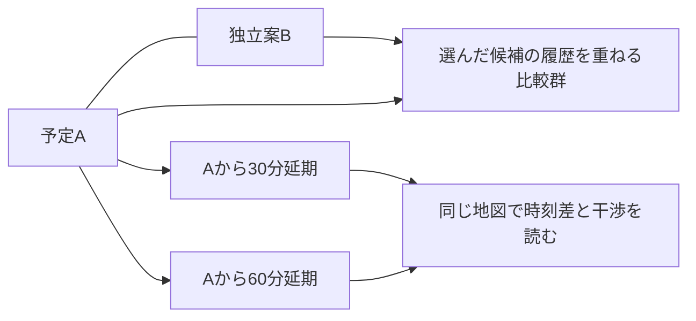

# Q420-00 調査用の読み物

依頼版：0.55.0。基準main：`4e3e4db0d047af9479bcd68bfc2553eeb71efcc9`。
これは採用済みmainの比較基準で、下記抜粋は今回の候補本文です。未統合候補の比較元と、最終保存/統合SHAは区別してください。SHAが不明でも本文を読めますが、最新mainを確認したとは扱いません。

**今回の焦点は Q420-00 です。共通入口の初回開始例は、別の課題へ切り替える指示ではありません。全体の目的を踏まえ、必要なら問いの分割や優先順にも異論を返してください。**

これは自動生成された課題別の読書束です。現在の正本は記載した元パス。MarkdownのリンクはGit内の資料束の位置から辿れるように変換しています。単独添付では未同梱先へアクセスできると仮定せず、元パスから必要資料を求めてください。図の文字説明は含みますが、画面の操作確認や原図の視認を代替しません。


---

## 根拠：docs/research/README.md — ## どう読むと研究の判断材料が得られるか

## どう読むと研究の判断材料が得られるか

資料束にはこの節と次のPR13差分、[BRIEF](../BRIEF.md)の目的と判断条件、[UI_WALKTHROUGH](../UI_WALKTHROUGH.md)の行程、今回の問い、具体材料、返却の助けを収録する。発行・Git管理の手順は本READMEに置き、研究本文の前へ全て複写しない。共通本文を全課題へ含めるのは、入力だけ、気象だけ、保存だけを最適化して用途を壊すことを防ぐためである。原ニーズと現在案を分け、原図や原Excelが必要な結論は追加実体へ戻る。

例えばQ01ではWeibullの一般解説より、既存の製品径と膜厚幾何の不一致が何を意味し、同じ計画のモデル比較をどう変えるかを調べる。Q03では95%楕円を描くだけでなく、少数標本や多峰性で禁止域への関係がどう読めるかを考える。Q05ではDBの選定だけでなく、新予報で更新した後に旧図を読み直す人が何を再現できるかを設計する。原案を守るために問題を狭くする依頼ではない。


---

## 根拠：docs/research/README.md — ## PR13から来た読者へ：何が変わったか

## PR13から来た読者へ：何が変わったか

現在の採用mainはPR29統合後のM420 `4e3e4db0d047af9479bcd68bfc2553eeb71efcc9`。0.43は参考FE/BEの器を比較する設計候補で、現private repoを実装正本とし、参考構成を取り入れる。public参考先の許可branchへの反映は人間が手動commitする。0.43時点では実装移行は未着手だった。0.45ではReact/TypeScript/Viteと薄いPython APIをprivate正本に追加し、直接入力・保存GFSによる二つのn=1の比較と保存再閲覧を接続した。0.46ではD-185により、0.45の簡略な比較画面を後続UIの基準にせず、育ててきた0.40.1 r2の打上げ計画・詳細・気象分析・季節検討の具体的な画面を共通platformへ持ち込み、入力・保存・実計算との接点を同時に修正した。0.47ではその画面を保ち、実GFSの配布観測・取得計画・明示取得/適用・取得中の入力保持を接続し、一飛行の保存再閲覧まで有限に確認した。0.48では固定した一つの気象場と一元量の仮分布から、対応標本・延期比較・経験50/90/95%範囲・全着地点の禁止域判定・同じ群の入力/履歴・保存再閲覧をつないだ。これは仮定した入力幅への感度試算であり、較正済みの気象/機体誤差や三用途全体の完成ではない。原画面を抽象的な効用へ置き換える作業でも、全画面の無変更移植を実接続の前提にする作業でもない。現行操作はCOMMANDS C-09、実APIはIMPLEMENTATION_NOTES、現在の有限受入と未確認はS36、0.46までの記録はS35へ戻る。公開へ渡す差分と科学採用は別に確かめる。現在の接続方針は[接続設計7.3](../../INTEGRATION_DESIGN.html#gui-integration460)、器の比較は[7.2](../../INTEGRATION_DESIGN.html#framework-candidate)へ戻る。0.44でQ420-00 rev7の2MDと完全ZIPを受領した。報告が明記する依頼0.42・固定M420と、実配布した添付集合全体の独立確認は区別する。採否と有限検証は[Codexの受領評価](../../../references/research_returns/Q420-00/2026-09-29-r7/CODEX_REVIEW.md)から辿る。現行生成束は未発行候補で、既発行束を置き換えたと推定しない。以下のM401/C2は0.42研究束の作成時の比較元で、現在の統合SHAや実配布基準と混同しない。

0.42作成当時の基準mainはPR28統合後の `55100867df2bef615c3131228c7c75adf31c9833`、未統合の比較元は0.41/PR29 C2 `d8aa7ed7c385616824121f3f234ad5c9226ba782`だった。0.42候補はその依頼内容を改めたもので、当時に未来の保存/統合SHAを先取りしていなかった。

| 以前の理解から変えるところ | 現在の意味と読む場所 |
|---|---|
| 管理を整え、GFSの小取得を始める段階だけではない | Python本体は保存GFSから一飛行を計算できる。現在の入力・モデル・数値法は[ENV-CURRENT](../../ENVIRONMENT_CONTRACT.md#ENV-CURRENT)。0.48では固定場・一元量の実標本集合を画面へ接続した。気象のばらつき、製品情報等からの結合入力、過去場は未接続 |
| 次の主成果を固定した原版比較や16飛行へ自動的に戻さない | 近未来の予報利用、過去飛行照合、数年〜十年程度の長期計画を支える完成像から次作業を選ぶ。[CONTEXT第1〜4節](../../../PROJECT_CONTEXT.md)、[PLAN第10章](../../PROJECT_PLAN.md) |
| 画面があることと、分析システムの成立を分ける | 2D/3D、候補・延期系列、詳細な群選択、図の保存を人工データで検討した。0.45で直接入力・保存GFS・二結果比較・保存再閲覧を接続した。0.46はその実接点を既存の具体画面へ統合し、0.47は実GFSの取得・明示適用を接続した。0.48では固定場・一元量の仮分布による実標本、禁止域群の詳細と保存再閲覧を接続した。人工分散との区別を維持し、入力レシピ/結合標本、較正済みの気象/機体MC、他の取得経路、三用途を通じる実計算/保存の完成は未了。[接続設計](../../INTEGRATION_DESIGN.html) |
| 上昇率を直接入れる／製品から導く、は異なる物理モデルの名前ではない | 同じモデルへ入る経路を選べる必要がある。元量と導出量を分け、必要でない入力を強制しない。製品版と直接指定の所有を残す |
| 原Excelや風資料は、採用済み科学仕様ではない | Excel原ZIP・分析、風原PDFとレビューを保存済み。式の単位・適用、同時分布を復元できない要約、旧計画の時点を確認する。研究の入口は各課題に限定して示す |
| 保存担当の旧制限を再適用しない | Codexが保存・commit・Draft PRと実績を担当し、人間がmainを統合する。Chatの研究回答は提案であり、main採用や科学受入ではない |

初期モデルは外気温追随の等温を許し、後続の熱・慣性・Re依存等を交換可能にする。等温は全飛行で温度一定という意味ではない。簡易経路を残し、得られない未知量を増やす高度化を目的にしない。無料・特別資格不要は基本の情報源要件だが、匿名限定ではなく登録・同意を区別する。Google写真3Dは任意の試作経路で、基本2Dを有料契約必須へ替えていない。


---

## 根拠：docs/research/BRIEF.md — 全文

---
document_id: BJP-RESEARCH-BRIEF
revision: 0.55.0
as_of: 2026-09-30
role: 研究担当が全体の必要と判断条件を共有する文脈
---

<!-- LOGIC:RESEARCH-BRIEF:BEGIN -->
# 何のために、このシミュレーターを作るのか

[更新:0.59.0] [確認:0.59.0] — RESEARCH-BRIEF / REV-590-DEPENDENCY-RESEARCH-BRIEF

目指すのは、**スペースバルーンのプロジェクトのあらゆる段階で役立つ分析ツール**である。軌道を一本描けることや、計算手法を多く選べることだけでは足りない。利用者が、候補の違いを理解し、気になる結果の理由へ戻り、条件を変えて再検討し、その根拠を後で読み直せるようにしたい。落下分散はその中心にある。平均的にどこへ落ちるかに加え、どの範囲へ広がり、避けたい場所へ入る標本が何によって生じ、変更によって判断がどう変わるかを知りたい。

この依頼では、Codexの案を詳しく説明し直すだけでなく、**この目的に対して何を問うべきか、今の問いや設計が適切かを、研究担当にも判断してほしい。** 既存の画面、課題分割、実装順、Codexと人間が挙げた具体案は、良い方法を探す材料である。制約や採用済み方針と区別して、別案が勝る状況まで考えてほしい。

本書は0.42.0で編集した研究文脈を保持し、科学仕様の第二の正本ではない。現在の発行・受領と実装の進展は[研究入口](../README.md)へ戻る。作成当時の比較元mainはM401 `55100867df2bef615c3131228c7c75adf31c9833`、当時の改訂前0.41候補はPR29/C2 `d8aa7ed7c385616824121f3f234ad5c9226ba782`。実際に渡されたGitコピーの統合版とは区別する。画面と操作の実像は[操作の読み物](../UI_WALKTHROUGH.md)、依頼の入口は[research/README](../README.md)。本書を読んで目的をつかみ、操作の読み物で具体的な関係を見てから、[課題と根拠](../TASKS.md)へ進む。

**0.55の生成束を読む境界：** 本書と共通の研究入口・UI説明・課題本文に残る「現在」「未接続」は、その研究文脈を編集した時点の記述である。0.55では、育てたGUIで実GFSの本命/延期・仮分布の分散/干渉・受付応答消失からの復帰・保存再訪、および統計の関心から取得済み原日時2窓と未取得1窓を区別する実飛行比較までを有限確認した。原日時2例は多年の季節分布を代表せず、任意過去取得UI・較正済みの機体/気象誤差・科学精度の採用は未了である。現行の実装・操作・確認範囲は[指示書S36](../../../BOOTSTRAP_RUNBOOK.html#s36-result550)、[実装補足](../../IMPLEMENTATION_NOTES.md)、[コマンド](../../COMMANDS.md)へ戻る。今回の6冊は元資料との同期を行う未発行候補であり、旧研究の再発行・新回答の受領・科学仕様の採用ではない。以下の原意・問い・旧模型の記録を、現行実装の機能一覧へ書き換えない。

## 原意と、この資料の編集を見比べるために

以下は[CONTEXTに保存したユーザー原文](../../../PROJECT_CONTEXT.md)の短い抜粋である。以後の行程や表はCodexによる整理を含むので、両者を同じ強さの確定仕様として読まない。

> 「どのようなツールで可視化を行い，どのようなグラフや統計的分析を提供して，どのようなモデル選択ができて，パラメーターがあって，それに対する分布などをどのように割り当て，モンテカルロシミュレーションとどうつなげるか．それらはどのような分析のためにどう役立つのか．」（RPT-043）

> 「風資料はこのシミュレータープロジェクトとは別の目的のための資料なので，その内部で目指していることをそのまま取り入れることは間違いですが，良い問いの立て方と分析の具体例を提供する資料としてCodexに見せています．」（RPT-043）

> 「この指摘は確定した修正要求としてではなく，（どこにあるかわからない）最適な設計へ至る人間とCodexの間の議論のラリーの人間側からのパスだと捉えてほしい」（RPT-052）

したがって、必要なのは指定の部品や図を集めることではなく、分析を通して何を判断できるようにするかという全体の設計である。一方、どの提案も同じ重要度で自由に捨てられるわけではない。50/90/95%の範囲、干渉の把握、簡易モデルで始める道など、明示された必要は、捨てるなら元の必要をどう満たすかという再検討を要する。

## 1. 同じ人が、違う時期に違う問いを持つ

三用途は、別々の利用者を想定した製品の三分割ではない。同じ計画と利用者が、長期の企画、予報を使う準備、当日の対応、飛行後の分析へ進む。ただし、誰もが必ずこの順をたどるわけではない。機体と地点を既に知っている人は直接計算したいし、風だけを調べて説明用の図を保存する仕事も、それ自体で完結する。

| 利用者が置かれる状況 | 知りたいことと、その後の行動 | 比較で保つ必要のある意味 |
|---|---|---|
| まだ予報がない。今年または来年の7月に、ある場所・機体で上げる計画を考える | 過去数年〜十年程度の気象条件でどんな落下分散になるか。季節・時刻帯・場所・機体の候補を絞り、必要なら年による違いへ掘り下げる | 過去条件からの計画用分布であり、その年の7月の予報ではない。気象年・原日時の場・機体の標本は異なる階層 |
| 予報が利用でき、場所や機体がある程度決まった | 時刻、充填などを変えた少数候補を比べる。新予報が出たら同じ条件を再評価し、判断が変わった理由を読む | 条件変更と予報更新は違う比較。できる限り早い予報から当日まで、任意のタイミングで更新する。全飛行を支える気象期間が必要 |
| 当日の準備が遅れそう、あるいは落下域が望ましくない | 予定時刻からの遅れに対する分散列を見て、干渉や停止がどう変わるかを調べる。必要なら場所や別条件を再検討する | 延期は親案との時刻差を持つ。充填済みの同じ機体か、各時刻に充填し直す計画かで、保つ実量が異なる |
| 飛行済みで、予想と観測のずれを理解したい | 当時の予報・再解析・観測を並べ、ずれ始める段階と改善の候補を調べる | 当時知り得た情報による予測評価と、事後に判明した条件を使う診断を分ける。再解析も完全な真値ではない |
| 地域の風の特色を調べたい | 高度・季節・場所による風速、方向、ばらつきを比較し、図を持ち帰る。必要なら選んだ時期・場所を打上げ検討へ渡す | 気象だけの分析には機体を要求しない。気象有効時刻のマスクを、放球時刻や飛行中の全時刻へ無言で転用しない |

ユーザーが明示したのは、全段階の分析、予報・過去飛行・長期計画、落下分散を用いた比較、使える予報を早期から更新して使うことなどである。上表の具体的な行程や、計画を一つの容器で育てる構成は、それらからCodexが導いた設計仮説を含む。「三用途だから全画面を三組作る」「一つのprojectだからすべてを一画面に載せる」のどちらも、ここから自動的には決まらない。

根拠は[現在の方向](../../../PROJECT_CONTEXT.md#CTX-VISION)、原要求RPT-035/043/045/048、[完成像の利用場面](../../SIMULATOR_VISION.html#purpose-design300)。場面の分類と過去案の区別はその本文を読む。同じ計画の前後関係を調べるときは[季節選定から飛行後までの例](../../INTEGRATION_DESIGN.html#project-story)へ戻る。

## 2. この研究で大切にしたい、五つの必要

### 条件と結果の対応を、利用者の頭の中だけに置かない

候補比較の重要な用途は、同じ場所・時刻・気象・機体をそろえ、モデル仮定だけを変えた落下分散を見ることである。分散の違いから、どの仮定が判断へ効くかを知りたい。場所や日時も異なる実施案の比較は別に必要だが、変更した軸を読めなければ、差の理由が分からなくなる。

個別タブと同色の分散、比較群、条件の共通/相違表示は、この対応を覚え直す負担を減らすための現在案である。タブという部品を残すこと自体が目的ではない。候補を選んだだけで他案が見えなくなる、保存名だけで内容を推測して比較へ入れる、群にまとめたらモデル差が消える、といった案では、操作数が少なくても仕事は難しくなり得る。

複数モデルをまとめて眺めたい需要もあるが、領域の和集合、モデル別の履歴比較、根拠付き重みで作る確率混合は異なる。確率混合が難しいという理由で、比較への入口や再訪するまとまりまで失ってはならない。逆に、並べるだけで十分な場面へモデル確率の入力を要求する理由もない。[同地点モデル比較](../../SIMULATOR_VISION.html#model-compare290)、[標本の対応の意味](../../INTEGRATION_DESIGN.html#paired-meaning)が、その違いを扱う。

### 落下分散と禁止領域の関係を、すぐ判断の入口にできる

概要では50/90/95%の範囲を直感的に把握したい。平均落下位置だけでは、裾の広がりや複数の山、避けたい場所への入り方が分からない。KML/GeoJSON等で指定した禁止領域との干渉は、ユーザーが最重要とした用途である。干渉件数と地図から同じ群の詳細へ入り、「この群にはどの入力や飛行履歴が多いか」「条件を変えて確かめるべき効果は何か」を調べたい。

現在は着地点の標本と領域で干渉を判定する考え方であり、輪郭同士の見た目の重なりを確率へ変換しない。停止した試行を非干渉と数えることもしない。一方、停止群の高度な統計を常に主画面へ増やす要求ではない。着地統計の対象と全試行中の停止数を理解でき、必要な群へ進めればよい。

以前の「干渉した点を囲う」案から現在の点表示へ進んだ理由には、線の重なりによる地理の隠れがある。この履歴は、以後の領域表現を禁止する規則ではない。多数候補・細い禁止域・近接表示など、どの場面で何が読めるかを比較し、よりよい表現を提案してよい。50/90/95%の必要、干渉の母数、読みたい地理との関係を満たすことが重要である。[干渉の設計](../../SIMULATOR_VISION.html#landing-constraints)、[分布と診断](../../INTEGRATION_DESIGN.html#distribution)へ戻る。

### 手持ちの情報で始められ、知っている情報も無駄にしない

対象の代表はHe充填のゴム気球、約30 km、乾燥重量10 kg未満程度であり、固定上限ではない。手元には粗い飛行記録、製品表、Excelとその分析、公開研究がある。未知の係数を増やす精密化のために新しい実飛行・同定実験を要求せず、既存資料と一般性のある知見を利用する方針である。

例えばTawhiri型の簡易経路では、上昇率や破裂高度を直接持つ人へ、製品寸法・ガス量・膜厚を追加で要求する必要はない。しかし製品と充填条件が分かる人には、その情報から整合した率や閾値を導く補助計算が便利である。同じ実行モデルでも適した入力経路は違う。入力欄が最少なら常に使いやすいとも、詳しい情報を全部入力できれば良いとも言えない。

内外等温の初期モデルは後から拡張できる設計を前提に許容され、熱感度実験を今回の着手条件へ戻さない。等温は飛行全体で温度一定という意味ではない。後続の抗力・慣性・形状・破裂・降下などの効果は、組み合わせと必要量の依存で考える。現コードの拒否条件を将来の科学的不能へ読み替えず、詳しいモデルで何が分かり、そのために何を新しく知る必要があるかを比較してほしい。

組合せの見通しとして、既存設計は段階ごとの鉛直運動を、速度則を与える経路、瞬時の力釣合いから速度を得る経路、速度を状態に持つ慣性の経路に分ける。力を扱う経路では、定Cd/Re依存Cd、外気密度、ガス・体積・形状、破裂後の質量や傘の条件などが結び付く。指定高度の破裂と径の破裂では、必要な膨張計算も異なる。上昇を詳しくしたら降下も同じ方式にしなければならないわけではないし、対地速度を直接与える式へ外気鉛直風を重ねれば二重計上になり得る。これはすべて実装済みの選択肢ではなく、入力経路の三例だけでは見えにくい将来の互換性を考える材料である。新たな選択肢には「何を比較したいから必要か」を求め、既存の同値な式へ別名を付けて精度向上と数えない。

製品の平均破裂径と、膜厚等から導く代表径は、値を得る入口の違いを含む。製品表の±を標準偏差とみなしたり、径と膜厚を独立に振ったりしてよいとは限らない。ただし分布幅の根拠が未確定でも、仮定したCV等で感度を調べることは有用である。根拠付き分布と仮の幅を区別し、入力の依存と値域を保ちながら、その仮定で結論がどれほど変わるかを見せる道を閉じない。[モデル構成](../../ENVIRONMENT_CONTRACT.md#ENV-MODELS)、[入力経路](../../INTEGRATION_DESIGN.html#inputs)、[破裂入力](../../SIMULATOR_VISION.html#burst)が根拠となる。

### 粗く見てから深く調べる流れを、情報と計算の両面で成立させる

利用者は入力を変えながら概況を知り、気になった候補や群だけ詳しく調べたい。概要/詳細という二種類へ固定する要求ではなく、知りたいことと必要な精細度に応じて負担を変えたいという要求である。保存済み標本の選択や色・視点の変更なら、飛行を計算し直す必要は通常ない。詳細な履歴がなければ再計算が必要になる場合がある。その違いを設計したい。

処理を軽くする方法にも異なる代償がある。描画を減らす、集計を再利用する、読む履歴を絞る、MCを段階的に増やす、気象場を近似する、は同じ「高速化」ではない。例えば速く終わった飛行だけを先に描けば、飛行時間や停止理由で集団が偏る可能性がある。凍結気柱や統計代理場が安価でも、候補順位や干渉の裾を変えてしまうなら、その利用場面には不十分かもしれない。

逆に、全用途で常に最も高価な場と全履歴を要求すれば、時期や場所を粗く絞る道具として使いにくい。「どの判断なら近似で足り、何が気になったら次へ進むか」を、精度・取得・計算・保存・操作負担を結んで研究してほしい。現段階で応答秒数や最適MC数を測定済みではない。[段階的な分析](../../SIMULATOR_VISION.html#progressive-ui)、[標本の追加](../../INTEGRATION_DESIGN.html#progressive-sampling)、[費用と保存](../../SIMULATOR_VISION.html#cost-and-storage)へ戻る。

### 図と操作が、問いを発展させる手掛かりになる

提供された風統計資料の価値は、グラフが多いことより、目的に沿った問いを立て、要約から差や分布へ進める構成にある。年間×高度の強さ・方向・定常度を共通軸で読むと、どの層・季節が気になるかを見つけられる。月別のプロファイルや風配は平均で隠れる分布を示し、地域図は場所による違いを示す。同尺度で並んだ月別図には、頭の中で12枚を合成せず比較できる効用がある。圧力や時期をバーで連続にめくる操作には、変化をたどって気になる位置を探す効用がある。

ただし平均速さの場所幅が小さくても、風向が反対なら一地点で地域を代表できない。定常度が低いことも、地域内の方向差か、一地点の時間変化かで意味が異なる。図を連携させるとは、全操作を一律同期させることではなく、同じ問いを深めるために何を引き継ぎ、どこで対象や尺度を変えるかを決めることである。

原資料の地域、機体、暦区分、凍結気柱、数値結果を、そのまま本プロジェクトの要件や科学的正解にしてはならない。既集計DBから任意の年・時間帯・全同時分布を復元できるわけでもない。良い問いと表現の例として使い、限界は限界として扱う。[気象分析の完成像](../../SIMULATOR_VISION.html#climate-workspace)と[風資料レビュー](../../../references/WIND_REPORT_REVIEW.md)の第10〜13節を対応させる。実際の図や画面の読み方は[操作の読み物](../UI_WALKTHROUGH.md)へ進む。

## 3. 現在何があり、どこがまだ設計なのか

| 対象 | 現在の位置 | 研究担当がそこから判断してよいこと |
|---|---|---|
| Pythonの一飛行核 | 保存GFSを読み、選んだ現行モデルで一飛行を計算する実装がある。数値積分・根探索はSciPyを利用。全将来モデルや過去場の一般接続ではない | [ENV-CURRENT](../../ENVIRONMENT_CONTRACT.md#ENV-CURRENT)から実際の入力/返値/支持を確認し、内側を変える必要と外側へ加える責務を分ける |
| 比較・詳細・気象・2D/写真3Dの操作模型 | 人工標本・模式的な履歴等を用いて、操作や見え方を検討してきた。実写真への重畳の限定確認もある | 操作の関係と過去の修復理由を材料にできる。即時再描画を本体性能、人工輪郭を実気象の統計、写真meshを計算地形の精度とはみなさない |
| 全体の接続案 | 入力経路、元量の標本化、場、固定結果、分析、保存、jobの責務を[接続設計](../../INTEGRATION_DESIGN.html#journeys)で提案している | 0.45のReact画面・薄いFastAPI・n=1保存再閲覧の有限実装は[実装補足](../../IMPLEMENTATION_NOTES.md)へ戻る。0.46では育てた0.40.1 r2の用途別の具体画面を共通platformへ統合し、入力・保存・実計算との接点を並行して修正した（D-185）。0.47では実GFSの取得・明示適用と取得中の入力保持を接続した。0.48では固定場と一元量の仮分布による対応標本、延期・干渉群の比較と保存再閲覧を接続した。現在の有限受入はS36/D-187へ戻り、較正済みの気象/機体誤差や三用途全体の受入へ広げない。三用途・分散を覆う最終schema/API全体は未確定であり、境界や優先順の研究を継続する |
| 原資料と研究知見 | 風PDF、Excel原本と分析ZIP、気象ガイド、取得観測がある | 出典・対象・確認範囲へ戻れる。小取得の成功、著者の検査、条件付きの数値を、一般運用や科学的受入へ拡張しない |

情報源は無償・特別資格不要を基本とし、匿名利用と登録/同意は分けて確認する。NOAA-GFSを予報の方針とし、ERA5/JRA-3Qや当時のGFS予報を過去用途へ検討する。日本での使いやすさと任意領域による性能設計を重視するが、日本外を内部的に禁止する要求ではない。Google写真3Dは任意の試作経路で、基本の2D利用を有料契約必須に変えるものではない。

これらの既決方針への異論が生じたら、黙って置換せず、根拠と代償を伴う再検討案として返してよい。研究回答から採用、実装、実データによる精度確認まで完了したとは扱わない。権限・返却・保存の手順は[研究入口](../README.md)に置き、本書の目的説明へ混載しない。

## 4. 問題はつながっている：何を変えると隣が変わるか

課題を分けるのは仕事を進めるためであり、境界の外を見ないためではない。次の表は、現在見えている相互依存と未決を示す。ここにない重要な問いも探してほしい。

| 起点となる判断 | 隣へ及ぶ影響と、研究したい対立 | 深掘りの入口 |
|---|---|---|
| どのモデルと入力経路を選ぶか | 直接の率なら不要だったp/T/q、質量、Cd、形状等が必要になる。細かいモデルの効果が、その情報を用意する負担に見合うか。製品・直接値・補助計算のどれを元量として扱うか | [モデル構成](../../ENVIRONMENT_CONTRACT.md#ENV-MODELS)、[入力切替](../../INTEGRATION_DESIGN.html#input-changes)、Q410-01/04 |
| 何のばらつきを表すか | 機体ばらつき、予報に条件付く誤差、季節内の気象変動、モデル差、有限標本誤差は異なる。元量と派生量を二重に振らず、同じ場実現を飛行中に保つ必要がある | [不確かさ](../../SIMULATOR_VISION.html#uncertainty)、[分布](../../INTEGRATION_DESIGN.html#distribution)、Q410-01/02/03 |
| 何を同じ条件として比較するか | 物理実量を固定する、同じ分位を異なる分布へ写す、対応のない集合を比べる、では結論が違う。延期・モデル差・新旧予報を同じseedという理由だけで対にできない | [標本の対応](../../INTEGRATION_DESIGN.html#paired-meaning)、Q410-02/03/05 |
| どんな気象場を、どこまで用意するか | 地表〜約30 kmと数値試行の余裕、任意放球時刻、全飛行の時間支持が要る。早期予報と直前、過去一便と十年分析で経路や費用が変わる。高度な場と軽い代理場をどの判断で使い分けるか | [気象の準備](../../INTEGRATION_DESIGN.html#weather)、[現行GFS](../../WEATHER_DATA_GUIDE.md#WG-CURRENT)、[分散へ必要な情報](../../WEATHER_DATA_GUIDE.md#WG-DISPERSION)、Q410-02/04 |
| 50/90/95%と干渉をどう読むか | 多峰や少標本、重み、停止が輪郭と件数の意味を変える。描画が安定したことと、入力分布の正しさは別。平均が同じでも裾や禁止域への入り方で候補選択は変わり得る | [干渉](../../SIMULATOR_VISION.html#landing-constraints)、[段階標本](../../INTEGRATION_DESIGN.html#progressive-sampling)、Q410-03 |
| 何を後から調べ、再利用したいか | 任意群の履歴は全体分位だけでは復元できない。設定再利用、検討再開、固定図の配布、再計算一式は必要な実体が違う。保存量を減らす代わりに何ができなくなるか | [保存と再開](../../INTEGRATION_DESIGN.html#save-and-reopen)、[結果の寿命](../../INTEGRATION_DESIGN.html#lifetime)、Q410-05 |
| どの処理を待たずに操作したいか | 入力変更と旧job、取消と結果確定、少数MCと大規模集計、別PCの計算を区別する。画面を閉じても意味が残る構成と、導入・維持の小ささをどう両立するか | [サービス境界](../../INTEGRATION_DESIGN.html#service-boundary)、[構成候補](../../INTEGRATION_DESIGN.html#technology)、Q410-03/04/05 |
| 過去飛行の何を評価するか | 当時予測の評価と事後診断では、使える機体情報・気象・観測の扱いが違う。風だけ変えたつもりで破裂条件も変えれば原因説明が崩れる。記録が粗いとき何をなお学べるか | [過去飛行の分析](../../SIMULATOR_VISION.html#past-flight-workspace)、[三用途](../../INTEGRATION_DESIGN.html#journeys)、Q410-02/04/05 |

例として、充填済みの機体を30分延期するだけでも、入力側ではガス実量の保持、気象側では照会時刻と支持、MC側では標本の対応、画面側では親への差分、保存側では旧結果と新条件の識別が必要になる。どれか一つだけ正しくても、この一連の比較が成立するとは限らない。

一方、風だけを調べる仕事へ同じ機体入力やjob構造を強制するのも不自然である。共有すべきなのは同じ意味を持つ処理と根拠であって、項目名や画面の数を揃えることではない。こうした横断の反例を見つけたら、自分の担当へ押し込まず、隣の問いまたは課題分割の修正として返してほしい。

### 既にある対立材料を、研究の出発点にする

入力・破裂の例では、製品表の1500形に平均破裂径10.0 m、検査時膨張径6.3 mがある。一方、原Excel Bの基準膜厚130 µm、破裂厚5.0 µmを同じものとして用いても、基準を長さ2.2 m・径1.4 mの楕円体（等体積球径1.62764 m）にするか、直径2.2 mの球にするかで、換算径は約8.29939 m／11.21784 mになる（既存独立計算、原セルと式はVISION#burst）。製品平均径とこの幾何由来の代表径を同じ統計的事実とみなせるかが未決であり、一般的なWeibull式を再説明するだけでは解けない。細かな式・母数・逆モーメントの条件はQ410-01束に同梱する。

気象の例では、ある2地点の風が全時刻でそれぞれ(u,v)=(20,0)、(-20,0) m/sなら、平均速さの地点間幅は0でも移流方向は正反対になる。風資料の「速さの空間幅が小さい」という図から地域を一気柱で代表できると一般化できない（WIND_REPORT_REVIEW§13の解析例）。長期の軽量化案を評価するとき、同じ平均を再現するだけでなく候補の順位・干渉・層や時刻の関連をどれだけ保つかという問いへ進める。

過去飛行では、生の位置時系列が全便分あるとは限らず、要約表の速度・区間高度・所要時間が食い違う例がある。将来の豊かな観測に開いた設計と、今ある粗い記録で比較できる量の両方を考える。具体原セルと情報の欠落はUI_WALKTHROUGH§7へ置いた。これらの例は優先テーマを固定するものではなく、既にある証拠と未決を使って独立した問いを選ぶ材料である。

## 5. なぜ「ニーズから問い直す」を、依頼の中心に置くのか

これは抽象的な心掛けではなく、過去に設計を変える必要が生じた理由である。

**内部の分離を、画面の分離へ短絡した。** 0.30では入力・結果・比較を区別する設計から、タブと分散の対応まで外した。「主図一つ」という簡潔さの一般論から、年間・12か月比較も失った。各部品が動く検査は通っても、利用者が同じ比較へ戻り、違いを読む仕事は難しくなった。後の修正は旧部品への無条件な復帰ではなく、何の対応や比較軸を失ったかを根拠に行った。[完成像に残した再検討](../../SIMULATOR_VISION.html#why310worked)、DECISIONS D-169/170を読む。

**具体案を前提にし過ぎ、配置そのものを疑うのが遅れた。** 縦に区切った画面の中で局所改善を続けても、地図と必要な条件を読む面積が足りない場合があった。ユーザーの指摘は「横長領域を縦に積め」という固定仕様ではなく、同時に見る関係、スクロールの負担、役割に対する面積を考え直す刺激だった。研究でも、提示された案の中だけで係数や部品を最適化していないかを疑ってほしい。[配置への再検討](../../SIMULATOR_VISION.html#workflow350)とRPT-055〜057が根拠となる。

**局所成功を、続く仕事の成立へ広げた。** 写真3Dで名称を読めるようになった後、2Dへ戻ると地図が崩れる反例が出た。名称の検出や接続維持を確かめても、利用者が戻って候補・地物を比較し続けられるとは限らなかった。研究資料でも、各課題が答えられるだけで引継ぎ全体が良いと判定してはいけない。答えがどの判断を進め、その次に何が残るかを見る。[0.40.1の境界](../../SIMULATOR_VISION.html#workflow401)、DECISIONS D-179追記に当時の確認範囲を残している。

共通原則は[DC-JUDGMENT](../../DOCUMENT_CONTROL.md#DC-JUDGMENT)である。情報を結んで明記されていない必要も推測し、人間の知識・注意・負担と仕事の流れに照らしてその推測を疑い、案を作り、当初の意図へ戻して評価する。細部を満たしても全体が不自然な場合があり、違和感の理由を完全に言語化できるまで判断を禁止することも適切ではない。どの場面で何が引っ掛かり、どの別解釈なら変わるかを、観察と仮説として述べてよい。

ただし「人間なら当然」を根拠に明示された要求や科学的事実を上書きしない。出典で確かめたこと、資料から推測した必要、まだ判断できないことを区別する。批評の回数や否定の数、返却様式の欄が埋まったことを成果にしない。自分の案にも不利な利用場面を当て、変えた案をもう一度元の目的へ戻してほしい。

## 6. Chatに期待する仕事と、具体的な成果

最初の[Q420-00](../TASKS.md#q420-00)は全体の統合研究である。Q410-01〜05は入力・気象・統計・取得・保存の深掘り材料であり、この番号順を守る工程表ではない。まず必要と相互依存を捉え、利用者の判断や後の設計コストへ効き、今の開発を進められる問いを選び直す。その上で、**重要な判断を一つ以上、具体案と根拠によって前進させる**ことを求める。目的の復唱や「後で調べるべき項目」の長い一覧だけでは足りない。

例えば、入力が最優先だと判断したなら、三経路を表へ移すだけで終えず、同じ仮想機体を直接値/製品値で扱い、モデルや分布を変えたとき何が不足し、何を保持し、どんな比較が可能になるかまで具体化できる。気象の不確かさが先だと判断したなら、根拠不明だから停止するだけでなく、長期の場の選び方と予報誤差を分け、仮定した幅で何が分かるか、何の追加情報が結論を変えるかを示せる。保存が先なら、技術名の選択ではなく、新予報→延期→図の再閲覧という行程を通して、案の利点と破綻条件を比較できる。

現案を維持する結論でも構わない。その場合は、筋の良い代案に対して、どの利用場面・費用・制約で優れるから維持するのかが必要である。逆に大きく構成を変える案は、失われる効用や移行の負担も示してほしい。現UIの全操作や全原資料を読めなければ一切考えられない、とも扱わない。読めた根拠で具体化できる部分を進め、決めるために必要な不足だけを理由付きで返す。

一回の研究量は有限でよいが、考慮する全体像は狭めない。一次資料の調査、小さい式や数値例、比較図、保存/入力の例などを、選んだ問いに合う方法で作る。未来の全schema、全モデル、全十年の計算を完成させる依頼ではない。成果を[返却形式](../RESPONSE_TEMPLATE.md)へまとめるときは、何を新しく理解し、どの設計判断が変わり、Codexが次に何を具体化できるかを先に伝えてほしい。

<!-- LOGIC:RESEARCH-BRIEF:END -->


---

## 根拠：docs/research/UI_WALKTHROUGH.md — 全文

---
document_id: BJP-RESEARCH-UI
revision: 0.49.0
as_of: 2026-09-30
role: 操作できない研究担当へ、画面の関係・操作前後・判断の理由を伝える
---

<!-- LOGIC:RESEARCH-UI:BEGIN -->
# 画面を触れない研究者のための利用行程

[更新:0.59.0] [確認:0.59.0] — RESEARCH-UI / REV-590-DEPENDENCY-RESEARCH-UI

本書は、機能一覧では伝わらない**利用者が何を見比べ、何を変え、どこへ戻って判断するか**を説明する。[BRIEF](../BRIEF.md)の目的と合わせて読む。0.40.1 r2の一枚一枚の画面は、実用を想定して改善を重ねた具体的成果である。これを素材に共通platformへ統合し、入力・保存・実計算との未解決の接点を並行して直す。細部の変更はできるが、効用だけ抽出した別画面への再発明を移行とは呼ばない。変更案は元の画面・操作との対応と改善理由を示す。

0.46時点では、具体画面と実入力/固定結果/保存の接点を統合し、実n=1の候補・延期比較と写真3D→2D復帰を有限に確認した。これは本書で説明する人工分散の全機能移行や実MCの完成ではない。0.46の確認範囲は[指示書S35](../../../BOOTSTRAP_RUNBOOK.html#S35)。0.47では同じ具体画面に実GFSの取得計画・明示取得/適用・入力保持を接続し、保存再閲覧を有限に確認した。0.48では固定場・一元量の仮分布から作る実標本を、経験範囲、延期と干渉群の比較、同じ群の入力/履歴、保存再閲覧へ接続した。0.49では同じ画面を使う48/192実試行の費用を測り、実JRA期間集計の年間/地域図と保存再読を接続した。年/時間帯を選ぶ過去4D場や季節飛行は未接続で、下記の原模型の全操作を実資料で再現したことにはしない。現在実物と確認範囲は[S36](../../../BOOTSTRAP_RUNBOOK.html#S36)、実sourceとの対応は[SCREEN_PROVENANCE](../../../frontend/SCREEN_PROVENANCE.md)へ戻る。以下の原模型の観察日はそのまま保持する。

本書の行程説明の対象はGitに保存した0.40.1 r2模型。0.46〜0.49の有限接続によって、本書の機能全体が較正済みの気象/機体MCや過去場へ接続済みになったという意味ではない。0.45の二候補n=1接続は計算/保存の有限成果で、その簡略画面を後続GUIの基準にしない（D-185）。予報の入口・条件編集・延期ダイアログ・詳細・気象4画面・季節計画への遷移は2026-09-28に主担当が実画面を読み直した。写真3DはS34の以前の観察記録と設計本文に基づき、この再読ではキー接続していない。この原模型の観察時点では、過去飛行の比較と実標本の入力分布診断は画面として成立していなかった。0.48の一元量・選択群の実診断とは時点と対象を分ける。原模型は [VISIONの保存索引](../../SIMULATOR_VISION.html#model-archive)にあるZIPから戻れる。研究の開始にその展開や操作は要求しない。

**画面の人工データと本体計算を分けて想像する。** 現模型は操作の関係を試すもので、表示の即時変化は実気象MCの速度ではない。画面に残る「実計算」という表記も人工標本の再集計を指しており、実飛行核との接続済みと読まない。季節試算は放球点の人工気柱を固定する簡略計算で、飛行先の時空間場・地形着地・支持切れまで解いた結果ではない。これらの限界を実システムへどう置き換えるかが研究課題である。

## 原図を読むときの入口

初回に渡す風分析PDFでは、**物理頁35〜43の図14〜20・23**で「年間の高度差→月のプロファイル/風配→地域差」という比較の組合せを、**物理頁45・48の図25・29**で風から落下の問いへの移り方を見る。図の所在と読み方は下記第5節およびWIND_REPORT_REVIEW第11節へ対応させた。単に図の見た目を模倣するのではなく、軸・並べ方・色・要約の選択が何を発見しやすくし、何を隠すかを評価してほしい。初回に全付録を順読する必要はなく、統計代理場等を主題に選んだら原法の章へ進む。

0.40.1フィードバックPDFは入力・分布・保存への人間側の意見を図付きで示す。現在案への確定仕様ではない。UI配置の同時視認や色の重なり自体を主題に選ぶ場合は、本書だけで視覚評価したことにせず、対象を絞って模型の画面図またはHTMLを追加要求してよい。

## 1. 予定AとモデルBを同じ場所で比べる

利用者は「この場所・機体で上昇や破裂の仮定を変えると、落下域と禁止領域への干渉はどれくらい変わるか」を知りたい。AとBは、必ずしも二つの異なる打上げ企画ではない。**同じ計画に対するモデル差の比較**は主要な使い道である。一方、場所・充填・時刻自体を変更して運用候補を比べる使い方も必要になる。

現在の予報画面は、上から「共通の準備」「独立候補と比較群の選択」「注目候補の条件要約・件数・操作」「広い共有地図」「必要なら開く数値比較」の順に積む。地図の高さは画面に応じた自動値を持ち、下端を動かして変えられる。横長の地図を確保し、常時巨大な設定欄で地理を圧迫しないための案である。縦スクロールは許してよいが、条件とその結果が遠く離れて頭の中の照合を強いないかは批評対象になる。

| 同時に読むもの | 現在の表現 | 支えたい判断・残る問題 |
|---|---|---|
| どの候補を読んでいるか | A標準案、Bモデル比較、G1履歴比較等の入口。注目候補の名称・版と結果要約を地図直上に置く | 「注目」と「地図に表示」は別。他候補を残したままAの条件を読めることに価値がある |
| 着地位置の散らばり | 注目候補を50%内、50–90%、90–95%の帯で塗り、他候補は輪郭を主に表示。50/90/95%を個別切替 | 候補同士を全部濃く塗ると重なりが読めない。50/90/95%は直感的な中心情報で、平均一点だけへ縮めない。今の経験楕円が将来の数値法として採用済みではない |
| 地物との位置関係 | 通常地図／衛星・航空写真を切替。気象領域の境界、平均的な軌道・着地点、禁止領域、干渉点、停止点を関連付ける | 市街地や人工物を見る際は写真が有用。境界停止は着地と別の記号で見える必要がある |
| 数で読む必要のあるもの | 着地/全試行、干渉、停止・不明、平均着地座標や飛行時間等。詳細な分母は展開可能 | 例として人工Aは60着地/64試行、4停止。着地集合の95%域が64全体の95%を覆うとは言えない。停止を隠して狭い雲を良い結果と読ませない |

条件を開くと、現模型には名称・緯度経度・日時（JST表示）・ペイロード質量・簡易なモデル選択程度しかない。地図で地点を置く操作は通常のpan/zoomと区別し、数値入力も併用する。この少ないフォームは完成した機体入力ではない。製品データ、充填、上昇/破裂/下降の組合せ、固定値/分布、導出された量を、持っている情報に応じて使う入力設計が未了である。

**ここで研究が変え得ること。** 詳しい来歴を全欄の横へ常時並べれば正確でも、反復比較を妨げるかもしれない。逆に内部では別の入力・結果・分析だからと画面を完全に分けると、条件と分散の対応を利用者が記憶し直す。どの情報を同時に出し、どれを必要時に開き、更新中の旧結果をどう識別させるかを、例えば「Aの製品を変えて計算中にBを見る→旧Aを保存する」の場面で提案してほしい。

出典：[VISION workflow350](../../SIMULATOR_VISION.html#workflow350)、[workflow390](../../SIMULATOR_VISION.html#workflow390)、[接続設計 inputs](../../INTEGRATION_DESIGN.html#inputs)、CONTEXT RPT-038/045/048/050/057。

## 2. 遅れたときの分散を、一つの計画から続けて見る

予定9時のAに対して、9時30分、10時…と延期した場合の落下分散と干渉を、同じ地図で次々に確認したい。毎回候補を複製して全入力を手で照合するのは煩雑で、独立案の列に並べるだけでは「親から時刻だけ違う」関係が消える。

現案ではAを親とする延期系列を作り、独立案の横の関係と、親に従属する差分の関係を分ける。ダイアログは遅れ時間の集合を選び、作成・保持・削除と再計算/再利用の見通しを示してから適用する。模型には0.5時間刻みの近傍と、より先の整数時間があるが、これはUI試行の値であり気象データ間隔が放球をこの刻みに制限するという仕様ではない。実システムは任意放球時刻を、飛行全体を支持する連続場の内挿で扱う。



この図は意味の関係を示し、画面をそのまま描いたものではない。延期子も結果・詳細・表示切替を持つが、親変更に連動するのか、個別に編集して独立化するのかは表面上の見た目だけで解けない。

物理的にも「他条件は同じ」には二通りある。既に充填した同じ個体を待たせるならガス実量を保つのが自然な場合がある。別の時刻に同じ目標浮力になるよう充填し直す計画なら、ガス量が変わり得る。気象run更新も、時刻差だけの比較とは異なる。共通乱数を使う場合も、同じ物理実量を共有するのか同じ分位を対応させるのかで差の意味が違う。現案の「コピー」をそのまま保存契約へしないで、この区別が利用者に無理なく伝わる方法を考えたい。

出典：CONTEXT RPT-051、[接続設計 input-changes](../../INTEGRATION_DESIGN.html#input-changes)、[paired-meaning](../../INTEGRATION_DESIGN.html#paired-meaning)。

## 3. 干渉した群へ潜り、条件を変える手掛かりを探す

概要で分散が禁止領域に近づいたら、利用者は「どの標本が干渉し、何が違うのか」を調べたい。領域はKML/GeoJSON等で指定する想定。輪郭と領域の見かけの重なりだけで干渉数を決めず、結果に対する領域判定と、その結果のID群を保って詳細へ進む。

現案は全干渉点を地図に示し、件数から同じ群を詳細へ持ち込める。以前の「干渉点をまとめて囲う」案には、囲いが未干渉の地物まで巻き込み、別の確率輪郭のように見える問題があった。この失敗は新しい囲い方を全て禁止する根拠ではない。点が多く重なって位置関係が見えない場合には別表現が勝ち得るので、**全干渉の所在を読み取ること、確率域と混同しないこと**の両方から代案を評価する。

詳細画面では他候補を一旦退け、一候補と選択群に集中する。上部に全着地/干渉/非干渉/地図で囲む選択がある。通常の「この候補を詳しく」から初めて入ると全着地、概要の干渉件数から入るとその干渉ID群を読む、という違いが重要である。地図の多角形選択は、着地地点で対象IDを選び直す操作である。時刻を動かすたびに近くの別標本へ選択がすり替わるものではない。

| 見える組合せ | 操作と読み方 | 次の問い |
|---|---|---|
| 左の地図と右の経過時間グラフ、下の共通時刻バー | 選択群の着地と、バー時刻での飛行中位置を読む。右は高度、累積横移動、東/北変位、水平/鉛直速度等を切替 | 干渉群はどの高さ・時間から違い始めるか。地理選択で偏った結果を全体へ一般化していないか |
| 左を風の分布へ切替、右の履歴と共通バーを保つ | 同じ時刻の各標本位置での風速頻度と風配図を見る。バーを動かしながら変化を追う | 終点だけで分からない風の寄与を探れるか。生存中の標本が減る効果を風自体の変化と混同しないか |
| 選択群と全体/非選択群の特徴比較 | 現模型は破裂時刻・着地時刻の平均と10–90%等の小表のみ。入力/抽選/導出量の分布診断は未実装 | どのパラメータが干渉群に多いか、その仮説を対応する再計算で確かめられるか |

時間履歴の現模型は上昇/下降を色で区別し、選択群の平均線と時刻ごとの10–90%帯を描く。これは平均推定の信頼区間ではない。着地後の標本を時間風分布から外す場合、選択群総数とその時刻での有効数を別に読む必要がある。風配は来向で、移流先の地図矢印とは向きの約束が逆になる。現模型の詳細と気象分析では静穏の閾値や分母の扱いにも違いがあり、これを完成仕様として無意識に引き継がない。

「干渉群は破裂高度が低かった」という関連だけで原因は確定しない。機体・気象・計算停止・選択の効果が重なる。それでも関連図は、次に変える仮定を選ぶ有用な手掛かりになり得る。例えば径破裂モデルの破裂高度は導出結果で、比較のためそこだけ直接上書きすると別モデルになる。ガス量や径の元入力を変える、未知の分布幅を別シナリオで試す、別気象ケースで確かめる、は異なる次の操作である。研究には、入力分布の設定自体の診断、実抽選値の診断、着地/干渉群を条件付けた診断、導出量の診断を混同せず、変更可能な条件へ戻れる構成を提案してほしい。すべてを一画面に追加することが目的ではない。

比較群G1は、複数候補の全標本の経過時間グラフを重ねる入口として考えている。A/Bの集合を自動的に一つの確率分布へ混ぜるものではない。混合を必要とするなら目的とモデル重みを別に論じる。詳細から概要へ戻ったとき、候補の注目・表示・地図の文脈を失わせないことが、反復する分析では重要になる。

出典：[VISION analysis](../../SIMULATOR_VISION.html#analysis)、[landing-constraints](../../SIMULATOR_VISION.html#landing-constraints)、[接続設計 distribution-diagnostics](../../INTEGRATION_DESIGN.html#distribution-diagnostics)、CONTEXT RPT-045/048/051/067。

## 4. 写真3Dは、同じ結果と地上物を近くで読むためにある

俯瞰の2D地図で気になる場所を見つけ、写真3Dで地形・屋根・樹木の周辺へ近づき、回転・移動・拡大しながら、**地表に投影された落下域/禁止領域/軌道との関係**を読む。3Dは全体の俯瞰を飾る別画面ではない。近づくと輪郭全体は見えなくなるため、面の濃さ、境界線、候補の名前と所属を局所で読めることに意味がある。

現案は注目候補の輪郭間の帯、他候補の線、領域を同じ文脈で表示する。面内の名称hover、重なった対象を一つの吹出しで読むこと、名前の反復を避けることを試してきた。線上だけ反応し面内では分からない失敗や、3Dで確認後に2Dタイルが崩れる反証を経て修復した。成功は記録された範囲に限られ、UI全体の完全な受入ではない。

研究上大切なのは、この局所読取から2Dの候補比較や群の詳細へ同じ対象のまま戻れること。表示meshは、積分の着地判定に使う地形や気象の下端支持とは別である。屋根へ色が載ったことを物理的な衝突計算ができた証拠にしない。Googleキー/写真接続は任意で、基本解析を有料背景必須にしない。3Dの細部の再実装を今回研究へ必須にする意図もない。

出典：[VISION workflow401](../../SIMULATOR_VISION.html#workflow401)、[workflow390](../../SIMULATOR_VISION.html#workflow390)、S34の実写真/人間hover報告と訂正記録、CONTEXT RPT-063〜067。

## 5. 風そのものを読み、場所・季節の仮説を立てる

「この地域で、いつ・どの層の風が強く、向きが揃うか」を先に知りたい。機体がまだ決まっていなくても、風の分析だけで図を持ち帰ってよい。画面は共通の年範囲・気象時刻mask・領域を上に持ち、その母集団を保ちながら四つの問いを切り替える。現在の2020–2025年・JST03/09/15/21時・9格子は人工模型の例であり、本番の固定制限ではない。

| 問い | 同時に読む図・操作 | 読みたい差と、まとめ方の理由 |
|---|---|---|
| 年間の高度構造 | 横が暦の一年、縦が概算高度で、風速平均・平均風向・定常度・地点間の平均風速の幅を同じ軸で上下に並べる。月内4/2区分を切替 | 強いが向きが揃わない層と、強く一方向へ吹く層を混同しない。月目盛と同じ縦位置が図同士を結ぶ。各図を別のドロップダウンへ隠すとこの対応を失う |
| 季節による分布 | 月別高度プロファイルを12枚、共通軸で並べる。風配へ切替えると代表元格子と気圧面を選び、12月の極座標分布を同じ半径尺度で見る。月/半月/季節区分も検討 | 7月だけの詳細に入る前に、通年の特色と変化点を一目で捉える。気圧バーで層を変えても、月の並びを記憶し直さず追える |
| 地域差 | 同じ地理範囲の月別地図12枚。風速カラーマップ＋等長の平均移流方向矢印、または定常度。気圧面バーを全図で共有 | 大小の矢印へ風速を兼用させず、色と向きの役割を分ける。共通色尺度は月や高度の比較を支え、現在高度だけの尺度は小さい場所差を読みやすくする。切替時に尺度の意味が読める必要がある |
| 打上げへの影響 | 同一の人工飛行仮定で複数地点から平均到達点への直線を描く。色は到達点のRMS幅、選択地点だけ50/90/95%域。月/半月をバーで変える | 場所を粗く絞る場面。平均への直線は飛翔経路ではない。試算点を増やすNは、元気象格子の精細化と別。任意地点も地図/座標で指定し、個別計画へ進む |

この構成は風統計資料の図14/15/16/17/19/20/23/25/29を、問いの手本として読んだ結果である。元資料の研究目的・放球条件・数値・誤差モデルをそのまま採用する要求ではない。よい可視化とはグラフ種類を多く用意することではなく、比較すべき軸を揃え、違いを読むための操作と尺度を選ぶことだと解釈している。

現模型のプロファイルは前半/後半中央値と月全体10–90%帯、風配は来向16方位×速度階級、地域図の矢印は移流先、という別の集計を使う。これらの定義も研究対象である。平均スカラー風速、平均ベクトルの大きさ、方向の定常度、空間の幅、時間の幅を名前だけで一つにしない。元資料には説明と数値実体の不一致もあり、[風資料レビュー](../../../references/WIND_REPORT_REVIEW.md)の効用と限界を併読する。

**残る設計問題。** 夜/朝/昼/夕の区切りを固定JSTで作るか日照条件へ結ぶか、データの時間間隔とどう折り合うかは未決。正確な連続年や時間maskを使うために、まず重い全取得を強制するのも負担になる。安い概要で仮説を絞り、必要な原日時・層・場所へ進める設計を、気象場の取得/保存費用と合わせて考えたい。

出典：CONTEXT RPT-045/049/050/051、[VISION needs360](../../SIMULATOR_VISION.html#needs360)、[風レビュー§10–13](../../../references/WIND_REPORT_REVIEW.md)。

## 6. 予報のない今年7月に、既知の機体を飛ばしたらどうなるか

この問いには、風を先に調べる人と、既に機体・場所が決まっていて直接分散を見たい人の両方がいる。前節の地点を選んで季節計画へ進めるが、風の全画面を必須の通過点にはしない。共通計画画面へ入り、月/半月をバーで変えて同地点の季節差を読む。

季節の違いを見る間は、地図の視点・尺度と地点・機体など比較したい軸以外を保ち、分散がどちらへどれだけ動くかを追いたい。月ごとに自動で拡大率を変える案は、同じバーを備えていても比較を難しくする。これはRPT-062の必要に基づく設計条件であり、全画面遷移での視点保持を今回再検証済みという意味ではない。

本体では、準備済みの時期別結果をめくる操作と、新しい条件で計算を要求する操作をどう結ぶかが研究対象になる。バーを動かすたびに取得・MC待ちを強制する案と、全期間を無条件に先計算する案の両方に代償がある。気になる範囲だけ準備する、操作が止まってから計算する等も候補として、滑らかに変化を追う効用と待ち時間・保存量を比べてほしい。未計算を隣月の実結果であるかのように補間することは避ける。

気象画面からの遷移で、現模型は地点・年・気象集計時刻・選択季節を来歴として渡す。放球時刻は別に未設定である。例えば9時validの風を見ていたから9時に放球する、という自動変換はしない。元の気象図へ戻れることと、飛行計画を独立に保存・変更できることの両方が必要になる。

現模型の季節図が即時に動くのは人工の固定気柱を使うため。目指す実システムでは、過去年から選んだ**連続した原日時窓**を通じて飛ばす参照法と、時空間・層の関連を残した軽い代理法を比較したい。気圧面ごとの分布から独立に風を引けば簡単だが、不自然な層構造や時間変化を作り、落下域を過小/過大にする可能性がある。逆に10年×全窓×機体MCを常に全部解くと、粗い候補選定に過大な費用を掛けるかもしれない。

年を等重みにするか観測時刻を等重みにするか、欠測年の扱い、気象ケース内の機体MC数、放球時刻maskと飛行中に参照する全時刻の関係は、結果を何の分布として読むかに直結する。ここを保存設計の末端へ追いやらず、利用者へ何を見せたいかと一緒に決めたい。既存の層間相関による移動分散の式・二層例は[climate-path290](../../SIMULATOR_VISION.html#climate-path290)にあり、Q420-00とQ410-02の束にも含める。平均の一致だけで軽量化を受け入れない出発点として使える。長期経路案は[climate-path290](../../SIMULATOR_VISION.html#climate-path290)と[long-samples](../../INTEGRATION_DESIGN.html#long-samples)へ戻る。

## 7. 過去飛行と照合し、次の計画へ知見を戻す

ここは完成UIがなく、研究で補ってほしい空白である。「予報とほぼ同じ画面に再解析を足す」は出発案にすぎない。既知の放球条件と観測軌道を軸に、当時取得できた予報による予想と、ERA5/JRA-3Q等の再解析を用いる予想を比べる。事後に知った破裂高度や実上昇率も置き換えるなら、気象差だけの比較ではなくなる。

例えば、情報締切を持つ当時予想、同じ機体条件で気象だけを替えた診断、観測に合わせて破裂条件等を更新した事後診断を並べると、別の問いに答えられる。ただし三列を常に強制する仕様は未採用。観測の欠落や粗いログをどう示すか、時刻・地理・高度・イベントをどの図で比べれば次の改善を選べるか、モデルの当てはめと検証をどう分けるかを提案してほしい。再解析を真値として全誤差を機体へ帰属しない。

**既存記録の実例。** 原Excel分析ZIPの `revised_01a0b429/existing_data/workbook_audit.md` は、15便を生GNSS軌跡ではなく要約表として監査している。例えばG8には上昇「2.45 m/s、36→1065 m」があり、列見出しの10分を使うと1.715 m/sになる。監査は逆算420秒を実観測へ置き換えず、不整合のまま残した。また放球時刻は6便に時分があるがタイムゾーンがなく、ガス欄のmLと重量の範囲も未確定である。回収場所を着地点へ無条件に置き換えられない。これは今回原Excelを再計算した結果ではなく、保存済み監査本文を再読した具体例である。

したがって最初の過去照合案が「連続軌道を地図に重ね、予報と再解析の位置RMSEを出す」だけなら、現在ある情報では始められない。一方、この粗い記録だけを将来UIの上限にしてもいけない。原記録を欠落・単位仮説付きで保持し、比較可能な高度区間などへ限定する入口と、将来の時刻付き軌跡を受け入れる入口をどう両立させるかが具体的な設計課題になる。[Excelレビュー§2–5](../../../references/EXCEL_ANALYSIS_REVIEW.md)から原ZIPと監査本文へ戻れる。

研究を始めるために追加飛行や高精度な同定実験を要求しない方針がある。手元記録と公開知見で何が分かり、何が識別不能かを示し、識別不能なら複数仮定のまま次の判断を支える道を考える。

## 8. 図を渡す、条件を使い回す、計画全体を再開する

これらは同じ保存ではない。利用者は図を資料へ貼り、他人がブラウザだけで保存結果を読み、後日自分は条件を少し変えて計算し直したい。配布物で自由に囲み直して再集計することまでは必須ではないが、図の保存は必要とされている。

現模型にはPNG/SVG等の図保存、KML、保存候補を読む入口がある。それだけでproject・実気象・実標本・workerを含む保存/再開が完成したことにはならない。結果とそのときの条件を固定して読むのか、条件だけ再利用して新結果を作るのかを区別する。新予報に更新した後も旧図が当時の意味で読めること、別PCに移して不足した原場や履歴が分かることが、三用途を一つのプロジェクトとして使うために効く。

一方、内部の版ID・hash・job状態を全て常時UIに露出させても使いやすくならない。取消要求と実停止、編集中条件と表示結果、領域改訂による再判定は内部で正確に扱い、人間には今の判断に必要な差を見せたい。保存方式やフレームワークを推すときは、少数標本だけでなく「10年の場を参照し、複数モデルを比べ、図だけ他人へ渡し、翌月再開する」場面で費用と失敗を考えてほしい。

出典：CONTEXT RPT-047/067、[接続設計 save-and-reopen](../../INTEGRATION_DESIGN.html#save-and-reopen)、[lifetime](../../INTEGRATION_DESIGN.html#lifetime)、[service-boundary](../../INTEGRATION_DESIGN.html#service-boundary)。

## この説明に対しても、足りないものを指摘してほしい

本書はUIを操作できない読者へ意味を伝える編集であり、実物の全視覚品質や全状態遷移を再現していない。原模型の観察時点では、過去照合の画面、モデル組合せに応じた入力、入力/導出分布の診断、重い実計算の待機と漸進表示、全体project保存が空白だった。0.48でその一部を有限に接続した後も、製品/結合入力・導出量の診断、気象/過去場の実標本、三用途の大規模実行と持出しを含む保存は未完である。「書かれた画面を実装するだけ」ではこれらは埋まらない。

逆に、すべての不足を一度に完成させる必要もない。どの不足が次の設計を誤らせるのか、安く確かめられる提案は何か、既存案を捨てる利益が移行費用を上回るのはどこかを考える。[課題一覧](../TASKS.md)を再編してもよいので、具体的な場面で利用者の判断を一つ以上前進させる研究を求める。
<!-- LOGIC:RESEARCH-UI:END -->


---

## 根拠：docs/research/TASKS.md — ## 全体から焦点を選ぶ

## 全体から焦点を選ぶ

| 課題 | 研究で進める判断 | 位置付け | 回答を待たずにCodexができること |
|---|---|---|---|
| [Q420-00](../TASKS.md#q420-00) 全体理解と設計研究 | 何を判断できる道具が必要か。現案と課題分割を問い直すと、どの設計をどう変えるのが最も効くか | **最初の入口**。理解だけで終えず、選んだ焦点で具体的な設計判断を進める | 既存情報と実物の相違、未接続の行程、用途を満たさない反例を調べる |
| [Q410-01](../TASKS.md#q410-01) 入力・製品・破裂 | 手持ち情報からモデル差・機体条件差を意味の通る比較へ変える入力は何か | 00で重要と判断した場合の深掘り。入力契約の作り直しも含む | 現validatorへの直接入力、未対応理由、単位と来歴の具体例を作る |
| [Q410-05](../TASKS.md#q410-05) 保存・実行・構成 | 季節の企画から当日更新・振返りまで、編集・計算・再開をどう成立させるか | 入力・統計・気象の研究と往復する。01待ちの直列工程ではない | 固定結果と編集中の草案の契約例、読込/飛行/転送/RAMの実測を用意する |
| [Q410-03](../TASKS.md#q410-03) 輪郭・干渉・MC | 少ない標本や停止を含め、落下分散から次の条件を選べる表示と統計は何か | 02と接続し、判断を誤らせる場面から方法を選ぶ | 多峰/停止の反例と元標本へ追える条件を具体化する |
| [Q410-04](../TASKS.md#q410-04) 気象の支持・費用 | 最も早い予報利用から直前更新、過去照合、長期計画をどの取得構成で支えるか | 02の確率対象と往復し、取得・保存・計算の費用を変える | 保存GFSの再利用と地域/時刻入力の支持、取得・照会の実測を行う |
| [Q410-02](../TASKS.md#q410-02) 気象の不確かさ | どの不確かさが候補判断に効き、どの場実現・近似で表すべきか | 04の提供能力、03の表示/統計と一緒に検討する | 機体感度と気象誤差の表示/記録境界を調べ、仮の機体分布を感度試算として試せる |

Q410-01〜05のIDは以前の問いとの対応のため保持するが、この版では全体文脈を踏まえる深掘り研究である。最初から五課題を順に消化する指示ではない。共通の[研究背景](../BRIEF.md)と[UIの書面説明](../UI_WALKTHROUGH.md)を読み、問いの重なり・抜け・優先順位そのものを批評してよい。研究者が見つけた問題を、既存の課題名や現configの欄へ無理に収めない。

以下の場面・候補・具体物は研究を具体的に始める材料である。より有力な問いや代案があれば、元のニーズとその理由を示して組み替える。少数の有力案を深く比べることを勧めるが、案数や原資料数の上限ではない。**一回の返却の目安は作業の区切りであり、視野の制限でも、全将来設計の完了条件でもない。** 全文献や全製品の網羅を待たず、少なくとも一つの実質的判断を具体化し、結論を変え得る残りを明示して返す。資料不足はそれに依存する結論へ限定し、研究全体を停止させない。

<a id="q420-00"></a>


---

## 根拠：docs/research/TASKS.md — ## Q420-00：全体を理解し、最も効く設計判断を進める

## Q420-00：全体を理解し、最も効く設計判断を進める

**この依頼で進めたいこと：** スペースバルーンの全開発段階で使う分析道具として、現在案が利用者の何を助け、何を捉え損ねているかを独立に考える。現案を説明し直すだけでも、欠落を列挙して次の調査を指定するだけでも終えず、最も効果のある焦点を選び、具体的な設計を提案・比較して次の判断を進める。

**読む出発点：** [研究背景](../BRIEF.md)、[UIの書面説明](../UI_WALKTHROUGH.md)、[CONTEXT第1〜5節とRPT-042/043/048/049/052/055/067](../../../PROJECT_CONTEXT.md)、[完成像の目的・使用状況・モデル・分布・破裂・分析](../../SIMULATOR_VISION.html)、[接続設計](../../INTEGRATION_DESIGN.html)。資料束の原資料抜粋と来歴から、現在案の根拠と、Codexが既に加えた解釈を区別する。Excelは入力と式、風資料は問いと分析表現の具体材料であり、原著の目的や結論をそのまま本プロジェクトへ採用しない。未同梱の原図・式・本文が必要なら、結論への影響と必要箇所を特定する。

**考えてほしいこと：** 誰がどの場面で、何を比較して次に何を変えたいのかを自分の言葉で復元する。三用途、同地点モデル比較、落下分散と禁止領域、既知量からの入力、予報更新と延期、保存して続きを行うことを、一つの利用行程として考える。今の画面区分、入力三経路、研究五課題、接続順序がその必要を満たすとは仮定しない。保持すべき要求・科学上の区別と、改訂可能な案を分け、何が不明かも明示する。

その上で、全体に効く焦点を自分で選ぶ。例えば「同じ機体でモデルを替える比較がどこで成立しなくなるか」「未知の分布をどう扱えば候補判断を進められるか」「季節案を予報更新へ引き継ぐには何を保存するか」は出発例で、選択肢の限定ではない。必要な一次資料・式・小計算・場面図を使い、現在案と有力な代案がどこで勝ち負けするかを比較する。根拠が未確定でも設計仮説は提案できるが、科学的採用や実測済みの事実へ変換しない。

**返してほしいこと：** 利用者の必要をどう理解し直し、なぜその焦点を選んだかが、少なくとも一つの具体案と代案の比較につながる研究本文。利用者の入力から分析・次の判断までを具体場面で通し、他の用途や隣接設計に及ぼす影響、推奨が負ける条件を示す。既存のQ410-01〜05を維持・組替え・統合すべき理由は、その設計から導く。既に指定された反例に答えるだけでなく、自分の案にも有力な反例を当てる。図表・小計算は判断が見える形式を選び、すべてを提出する義務にしない。

**一回の返却の目安：** 全体理解に基づく焦点と、採否を議論できる具体的な設計判断が得られ、その限界・他への影響を説明できたところ。全体の復唱、技術名の列挙、次の調査リストだけならまだ足りない。実行環境がなければ未実行の設計例と条件付き推奨を返し、コードが動いたことやUIを操作したことにはしない。重大な不足で推奨が決められない場合も、何が分かれば案の優劣が変わるかを具体的な比較まで進める。

<a id="q410-01"></a>


---

## 根拠：docs/INTEGRATION_DESIGN.html — project-story

## 1.1 一つの打上げ計画を、季節選定から飛行後まで育てる

0.41では、上の三用途を別の画面として揃えるだけでなく、一つの計画を保存し、問いを変えながら同じ根拠へ戻れるかを設計の試金石にする。以下は日本の任意地点で7月に打ち上げる仮想例であり、実飛行の予定でも完成APIでもない。プロジェクトは検討の容器、候補は編集できる条件、結果は固定した実行の成果である。タブを保存の最小単位にはしない。

同じプロジェクトで、何を引き継ぎ、何を作り直すか
 | 判断する場面 | 画面と入力の接続 | 保持するもの / 新しく固定するもの

 | 冬：7月の場所・機体を絞る | 過去年・期間・放球時刻帯、JRA/ERAの製品、領域、機体を指定。風の年間図を調べる経路と、既知地点から直接落下分布を求める経路を選べる。 | 年と原日時窓の選び方・重み、機体レシピ、候補地点、採用/保留理由。風図の有効時刻マスクと放球時刻マスクは別に保存し、引継ぎ時に対応を確認する。

 | 予報期間：同じ機体で予定日を具体化 | 季節候補から場所・機体を明示コピーし、正確な日時と予報runを指定。気候の雲を予報の雲へ上書きせず、旧計画へ戻れる。 | 気候条件付き結果は保持。予報の情報締切・場・不確かさの方法を新しく固定。古い年の重みを予報memberへ流用しない。

 | 前日：新しい予報で見直す | 同じ候補条件でrunだけ更新。変更済み機体を使うなら、その差も比較欄へ出す。 | 旧runの結果と保存図を保持。新しい場の支持・取得状態を照合し、再実行。member番号が同じだけで新旧runの標本を同一と扱わない。

 | 当日：充填済みで30分延期 | 親候補の下に時刻差の子を作る。物理的に同じ充填済み機体なのか、各時刻の条件で充填し直す計画なのかを入力の近くで区別する。 | 前者は充填時の状態から確定したガス量を保持。後者は充填方針を保持し必要量を再導出。親を編集したら系列の未反映差を示し、「親の変更を反映して系列を更新」で同じ親版へ揃える。子が共有する地点・機体等を個別に変えるときは独立案にし、以後の親変更は継承しない。時差・実日時と参照親版を保持し、旧結果の実量は変更しない。

 | 飛行後：予想と観測を照合 | 同じ計画へ観測を追加し、当時の予測評価または事後診断を選ぶ。時刻・高度基準・有効区間を確認して共通の地図/履歴へ進む。 | 当時の入力と予測は保持。事後破裂高度等を使う診断は別条件。再解析も別の場として固定し、調整に使った便を独立評価へ数えない。

共通設定を一箇所に置く利点は転記の削減だが、変えた時にすべての結果が更新されたように見せてはいけない。作業用の既定値、候補が参照する版、実行時に固定した値を分ける。場所や領域を変えたら影響する草案と不足を示し、明示実行まで既存結果の出所を保つ。将来の構想ではなく、この五場面に対して編集前後の条件・結果・保存物を説明できることを次の接続条件にする。


---

## 根拠：docs/INTEGRATION_DESIGN.html — gui-integration460

## 7.3 育てた画面を素材に、共通基盤と実計算へ統合する

0.46の受入記録を作成した時点の履歴（RPT-072 / D-185）。0.49までの進展は本節下段、現行の操作・結果・未確認はS36を読む。当時の作業基準はPR30/0.45 C2 ce6a29accfad6865beca0b2dfe4f414e2bafb81a、採用mainはM420。統合作業中。具体画面と実入力/候補・延期比較/保存再閲覧、写真3Dから2Dへの復帰を有限に確認した。全機能の移植完了や管理検査/Git保存の完了ではなく、範囲と未確認はS35へ置く。

出発点は0.40.1 r2の具体画面。 予報計画・詳細解析・気象4画面・季節計画・3Dは、実用を想定して改善してきた素材である。そのHTML/CSS/描画と操作の関係を使い、同じplatformへ統合しながら入力・保存・実計算との接点を改修する。抽象的な効用から別画面を再発明せず、全画面の無変更移植を終えるまで実接続を待つ工程にも戻さない。

既存画面を使いながら、何を接続・修正するか
 | 具体的に引き継ぐ画面 | 同時に改修する接点 | 受入時に確かめること

 | 候補/比較群、親子の延期列、注目条件の帯、広い共有地図 | 編集できる実条件と固定結果、複数候補/延期の関係、表示選択と保存を共通計画へ結ぶ。二件という試験数を恒久上限にしない。 | Aを編集中にBや延期子へ移って戻り、旧結果と草案の差が読み取れる。元の画面構成が用途とともに認識できる。

 | 概要から同じ群の詳細へ潜り、地図・履歴・共通時刻を読む | 人工標本の選択群と実結果の標本IDを分離。実n=1へ架空の分散/干渉数を足さず、実履歴と停止理由を同じ表示体系へ渡す。 | 人工/実経路切替で点・帯・件数が混ざらない。詳細から戻って候補・表示対象・視点を失わない。

 | 独立した気象4画面と任意点からの季節計画 | 共通の領域・年/時刻mask・地点と来歴を保持。風の有効時刻maskを放球時刻と混同しない。実過去場が未接続の範囲は明示する。 | 各図の比較軸/凡例/同時表示を保ち、問いを切り替えても条件を再入力させない。

 | 2Dから同じ対象を近くで読む写真3D | 独立rendererの寿命・対象・視点の共有を管理。Googleキーは保存しない。 | UI継承の確認と、API接続を伴う写真meshの再受入を分ける。今回不要な再接続は行わない。

Reactの共通状態と旧命令的描画が同じDOM/状態を同時に所有しないよう、画面rootとcontrollerの寿命、入力/固定結果/選択の受渡しを切る。アプリ全体をiframeで囲むだけでは、共通条件と保存の統合にはならない。0.45の草案・固定run・保存/再閲覧の仕組みはこの接続部へ活用し、失敗時に人工計算へ自動fallbackしない。

原画面の見た目を科学モデルの採用根拠にはしない。実MC・過去場・入力分布・製品補助計算など未了の能力は、その接点を設計しながら段階的に実装する。今回の受入は原形との実画面比較、連続操作、人工/実結果の分離と保存再開の範囲で判断する。新しい画面が必要な用途は別途その理由を示す。

### 0.47：実気象と物理入力の準備から、分散比較へ

RPT-073/D-186。0.46の画面形を活かし、必要な場の準備と元入力の編集をつなぐ。気象は配布の観測、親/延期を含む必要時間窓、固定取得計画、完成資産、明示適用を分ける。利用者は取得を待つ間にも機体条件を考え直せるため、完了時に草案や旧比較を自動で替えない。取得条件の小overlayへ機能を詰めず、通常flowの作業段階と地図確認の往復を使う。現APIの正確な名前・保存形式は実装ノートへ戻す。

次の実標本接続では、機体の仮分布・共有する元実現値・気象誤差を同一視しない。同じ元試行をモデルや延期に適用し、停止を含む母数から経験域・干渉群・原因へ戻る。単一場の機体感度MCを校正済み予報確率にしない。過去場/長期の対象集合はこの一run取得のcache鍵と独立の責務を保つ。受入はS36の実物と批評へ戻し、取得成功だけで三用途を完成扱いしない。

### 0.48の有限な接続：同じ機体標本で延期・モデルを比べる

以下は0.47で絞った設計を0.48へ接続した境界。正確なAPIは実装ノート、観察した行程と未確認はS36が担当する。利用行程は、元入力の一つに理由を添えた仮の幅を指定→固定場で元標本を保存→親と延期/モデルへ同じ実現値を渡す→50/90/95%域と着地/干渉/停止を読む→同じ干渉群の入力と履歴へ降りる→全元標本で変更案を比較する、という一続きにする。

 | 決める境界 | 最初に持たせる意味 | 避ける誤り・後続への接続

 | 元入力と仮分布 | 初回は現validatorへ意味を閉じて展開できる一元量と、利用者が上下限/理由を入れる一様な感度幅に限定する。例えば等温のガス質量を直接指定する経路。固定値のn=1も残す。 | 一様分布を製品の物理的既定にしない。未指定のCVを補わない。搭載質量だけを振り下降質量を固定するなど、機体構成を壊す独立field抽選は開かない。製品径/厚み、充填/自由揚力は元量と導出状態の別resolverへ。

 | 対応する比較 | 抽選の元値/単位/根拠/重み/IDと各候補の完全config・解決器版を先に固定。延期には同じ充填済み機体のガス質量を渡す。モデルが使わない組合せは黙って定数計算せず、UIでは選び直しを求め、APIでは入力不成立として残す。 | seedだけを正本にしない。モデル順・表示順・完了順で抽選しない。同じ物理値を共有する比較と、異なる分布の同分位比較を区別する。分布の自動混合はしない。

 | 集合と実行 | 全予定行を永続受付し、既存一飛行queueへ空きに応じて投入。物理試行と再実行attemptを分け、同じ一飛行核/固定保存を使う。 | 上限4のqueueへ全数を一度に送って途中で行を失わない。取消/crashは物理停止と区別。コード変更後の旧planを新defaultで再解決しない。少数実測から時間・保存量を示し、巨大な別計算基盤を先に作らない。

 | 経験域と母数 | 着地L/予定N、干渉H/L、停止・未完を分ける。50/90/95%は実含有数/重みと方法名を保存。点・線・面・算出不可を表現し、同順位の重なりを残す。 | 描画履歴が空の試行も予定母数から消さない。面を出すための架空jitterを足さない。途中完了した群を無言で全体分布にしない。楕円は予測被覆/安全保証ではなく、曲線・多峰には限界を示す。

 | 指定領域と詳細 | 名前付き領域の版と全着地点で点判定し、重複域の和集合を二重計数しない。領域編集は同じ結果への再判定。詳細の同じ選択群で元入力と相付き履歴を全体と同軸比較する。0.48は指定一元量と固定configを対象とし、製品補助resolver由来の派生量は後続とする。 | 95%域外も点判定する。輪郭交差から干渉確率を作らない。群に多い値を因果と断定しない。変更案は旧干渉群だけでなく全元標本へ適用し、新しい流入も追う。

 | 気象と後続用途 | 初回は固定GFS場。weather realizationの識別と固定source参照を機体行から分けて保存する。 | 未評価の気象ばらつきをゼロと表現しない。queryごとの独立風乱数を追加しない。過去年/季節/時刻窓と重み・欠落理由を、単一取得cacheとは独立に足せる境界を保つ。

独立批評で絞った受入例：ガス質量を振る主例は同一等温機体の延期比較とする。定速モデルはガス量を使わないので、この一例でモデル比較も実証したとはしない。モデル比較には双方が使う破裂高度/下降基準速度等を別の共通入力例として選ぶ。分布の中心や幅を変更した案へ旧物理値を上書きすれば変更が無効になるため、同値共有の初回では分布変更を新計画・対応差なしとし、同分位の変換対応は別に採否する。点/線判定は実際の幾何を用い、一変量だから直線と決めない。層ごとの風で曲がる軌跡や多峰の反例も使う。

受入では、延期の時間窓、取消/再開、初期不成立で履歴なし、ゼロ着地、点/線/二峰、重複領域/穴、着地後の履歴平均除外を反例として先に置く。純粋な標本生成とconfig展開→既存核で少数集合→概要/干渉群/入力診断→保存後の再判定、の順に実物批評へ戻す。実装した式・分母はTHEORY、実階層はPROGRAM、操作/APIはCOMMANDS/実装ノートへ同じ変更で記す。

保存後の同じ問いへ戻る：選択した干渉群はsnapshot・候補・全試行ID・領域の内容へ束縛する。領域のJSON項目順は意味を変えない一方、座標・頂点順・IDの変更を無視して古い群を再利用しない。旧保存からの復元も、分析の保存応答も同じ内容比較へ寄せる。複数候補の応答が同時に届いても、比較集合の先着候補を後着で消さない。この接点の反例を、0.48の実UIと独立した実関数検査で修復した。

### 0.49：実データで判断できる図と費用を測る

D-188。予報側は48/192試行の待機・保存量を実測し、観測GETの失敗回復と、確定した選択集計の後に原履歴を有限件数ずつ読む境界を修復する。制限値を緩める前に、更新時の取得、試行ごとの場読込、保存原履歴と表示量の費用を分けて改善箇所を選ぶ。実測値と実際の成功/失敗はS36に置き、本書へ性能保証として複写しない。

過去風の入口は、提供されたJRA-3Q期間集計を固定analysisへ保存し、資料別adapterから既存の年間4図・地域比較へ渡す。問いは「いつ、どの層/地域が違うか」である。年/時刻選択や季節の落下分散へ進むには、その選択を支える元時刻・共同気象場が別に必要になる。期間平均を原recordsへ偽装せず、図/凡例/保存を共通化する範囲と資料の意味を分ける。草案を編集しても固定図を保持し、同じanalysisへ再び戻れることを一つの受入行程にする。


---

## 根拠：docs/SIMULATOR_VISION.html — models

03 / PHYSICAL CHOICES
## モデルは、比較したい効果に合わせて組み合わせる

「簡単／高度」の一つの切替では足りない。熱の閉じ方、抗力則、鉛直運動、破裂、降下を、成立する組合せの中で選ぶ。選択したモデルが必要な気象量・状態・入力を宣言し、不足を黙って別モデルで埋めない。

現行の入口と、完成像に含める改良幅
 | 選ぶ効果 | 現在の一飛行核で選べるもの | 後続の候補・設計上の条件

 | 簡易な飛行 | 実装あり一定上昇速度、指定破裂高度、密度補正した基準降下速度。Tawhiri型の簡易経路。 | 比較基準・少ない入力での検討に残す。原版と完全同一の計算だとは主張しない。

 | 浮力・抗力の上昇 | 実装あり内外等温・等圧、固定ガス量、球形、湿潤密度、定Cd、準定常。 | 候補定Cd／Re依存、準定常／慣性ありを独立の軸として組合せる。単に式を足さず状態とイベントを設計する。

 | 熱・ガスの状態 | 初期の等温近似。温度差の感度試験を着手条件にはしない。 | 候補必要になれば集中熱モデルやガス損失。必要入力・状態・物性の根拠と費用を追加して比較。空間熱分布を初期必須にしない。

 | 破裂 | 実装あり指定高度、またはガス体積からの径閾値。現行の径経路は等温上昇に限られる。 | 候補製品/直接平均径、膜厚換算から径分布、高度への直接分布を比較する。物理的元量を二重に摂動しない。

 | 降下 | 実装あり基準降下速度＋密度則、または有効質量＋CdA。 | 同じ下降特性を速度とCdAで二重指定しない。後続の展開・形状変化は別の状態/イベントとして追加する。

 | 風と地形 | 水平u/vへの追随、GFSモデル地形による終端。気象鉛直風は現行では加えない。 | 候補外気鉛直風、細密DEM、海陸・回収領域。表示地図、着地面、気象下端の地形を同一のものと扱わない。

実装ありは、モデルが実機精度として採用・検証済みという意味ではない。現在の具体選択はモデル契約 (ENVIRONMENT_CONTRACT.md#ENV-MODELS)、コードは flight/config.py と flight/models.py を参照する。


---

## 根拠：docs/SIMULATOR_VISION.html — distributions

04 / INPUTS & DEPENDENCE
## 条件として決める値と、ばらつく元量を分ける

すべての入力へ同じ「平均・σ」欄を置くと、従属する量を独立に振り、物理的に矛盾した気球を作ってしまう。モデル選択に応じて、利用者が決める公称条件、分布を置く元量、計算で決まる派生量を分ける。

 | 入力の種類 | 具体例 | 画面と保存に必要な意味

 | 選択する候補条件 | 場所、打上げ時刻、搭載物、充填方針、モデル構成 | どれを比較軸にし、他を何に固定したか

 | ばらつきの元量 | 充填/測定誤差、質量、破裂閾値、抗力・降下特性 | 対象量、単位、平均等の意味、分布、支持域、依存関係、根拠と未確定

 | 派生する量 | ガス量からの体積・径・浮力、膜厚閾値からの破裂径 | 変換式と仮定。親と子へ同じ不確かさを二重に足さない

 | モデルの違い | 定Cd／Re依存、規定率／力モデル、直接高度／物理的破裂 | モデル別結果と、共通にできる潜在量・できない量。重み未決なら確率混合にしない

分布の候補を、量の意味から選ぶ

固定値、実測の経験分布、正規・切断分布、対数正規、Weibullなどは道具の候補である。正値だからWeibull、標準偏差があるから正規と自動採用しない。下限・上限、裾、平均と中央値、切断後の平均、相関の根拠まで比較する。

入力では元量の分布、診断では派生する破裂高度や飛行時間の分布を確認する。共通の物理量から派生する相関は変換で保持し、追加の統計的相関は結合規則を定義する。根拠のない独立性も、明示した仮定として扱う。

個体や充填がばらつくことと、その分布の平均・σ・形をまだ知らないことも別である。後者は複数の幅・分布型のシナリオとして外側で比較し、仮定したσを観測から推定した値と表示しない。


---

## 根拠：docs/SIMULATOR_VISION.html — uncertainty

05 / ENSEMBLES & MONTE CARLO
## 一つの「散らばり」に、違う意味を混ぜない

### 予報に条件付いた幅

固定した情報時点・予報runの下で、不確かな気象と機体を表す。memberや過去予報の残差が候補。

### 過去年の気象変動

選んだ年・季節・時刻の母集団における幅。同じ天候の中の機体ばらつきとは階層を分ける。

### 仮定を動かす感度

根拠未確定の幅やモデルを変え、判断がどう変わるかを見る。現実の発生確率と称さない。

気象実現値を得る候補と、残る仕事
 | 候補 | 得られるもの | 取得・理論・評価の課題

 | 予報ensembleのmember | 一member内で時空間・物理量のつながった場 | 期間・高度・変数・欠配の支持を実取得で確認。GFSと同じ場・解像度と無条件に扱わず、spreadの校正も別に評価

 | 過去予報と参照場の残差 | lead、季節、地域等へ条件付ける誤差モデルの候補 | 当時利用可能な予報の保存、参照場の誤差、相関、標本数、別年/別便での検証が必要

 | 仮の摂動・感度幅 | 計算器の検査、仮定が結論へ効くかの診断 | 仮定であることを表示。実予報の校正済み分布へ昇格しない

 | 過去の原日時の場 | 長期の母集団を構成する気象ケース | 全層・近傍空間・時間のつながりを保つ。半月要約DBから元の同時場は復元できない

模式図：標本化と一飛行計算を分ける責務。計算結果ではない。

問い・比較固定する条件
変える条件
母集団・重み

分布と場物理的元量
相関・変換
run/member/年

実現値を作るseed・生成器版
具体値と実現値ID
対照の対応関係

一飛行を解く選んだ場と具体値
軌道・イベント
完了/停止と理由

比べて説明数値集計・分母
地図・診断・検証
選択と根拠の保存

GEFS等のensembleは予報不確かさを扱う候補であり、単一GFSと同じ製品ではない。[16] 再解析の不確かさも将来の検討対象で、ERA5 EDAには解像度差があり主にランダムな誤差を表すなどの限界がある。JRAとERAの差を、そのまま校正済みの確率分布にはしない。[17]

実現値は一飛行中で一貫させる。 微分方程式が場を問い合わせるたびに独立乱数を振らない。一memberを選んだら必要時刻・場所・高度を同じmemberから再構成する。元量の実現値を固定して、派生状態は物理モデルが時間発展させる。

分母・重み・計算回数から生じる落とし穴

識別の軸は「候補条件 × 気象ケース/member × 機体実現値 × モデル」。必ず全直積を実行する指定ではない。モデル間では共有できる実現値を対応させ、モデル順や表示の切替で抽選が変わらないようにする。NumPyのSeedSequence等を用い、workerの実行順でなく実現値IDとroot seedから系列を決め、並列数の変更・再開で標本を変えない設計が候補になる。[18]

全試行、着地、理由別停止、判定不能を保存する。強風側が領域外で止まった標本を除けば、見かけの落下雲が狭くなる。複数モデルの和集合と、根拠付き重みによる確率混合を分け、標本数の多いモデルを暗黙に高確率にしない。

例えば、対象集合の全予定非負重みを W（W > 0）、域内と確定した重みを a、域内/域外が未確定の重みを u とすれば、a/W〜(a+u)/W は計算未確定分に伴う割合の上下界として示せる。これは信頼区間でも校正された確率保証でもなく、完了例だけを分母にした割合とも異なる。物理的初期不成立など判定済みの結果をすべて u にせず、停止理由から確定/未確定を分ける。

MC回数を増やした際の要約値の安定は、数値的な標本誤差の確認。入力分布の正しさや予報誤差の校正ではない。場のmember spreadへ同じ誤差を重ねる二重計上も避ける。


---

## 根拠：docs/INTEGRATION_DESIGN.html — inputs

## 2. 同じモデルへ、持っている情報から入る

「定上昇率を使う」は実行モデルの選択、「上昇率を直接入力する」は入力経路の選択である。製品選択を必須の入口にせず、既知の値を直接使う経路と、機体情報から導く経路を並べる。

自分が与える値補助計算で得る値実行核が使う値

A · 上昇率と破裂高度を知っている
直接 上昇率、破裂高度ASL、下降基準速度。簡易密度か実気象密度かを選ぶ。

渡し先 constant_speed＋altitude＋rated_speed。

製品、膜厚、ガス量は不要。模型例の5 m/s・30,000 m・5 m/sは説明用値であり推奨条件ではない。

B · 製品と充填条件から簡易値を得る
元情報 製品版、膜/搭載質量、ガス、状態を伴う充填量。補助式と幾何を選ぶ。

導出 ガス質量、代表上昇率 v₀、代表破裂高度 H₀。解なし/適用外なら理由を返す。

渡し先 Aと同じ定速・高度モデルへ v₀, H₀ を渡す。力を追加加算せず、元情報と導出法は来歴として残す。

C · 同じ元情報で浮力上昇を使う
共有 Bのガス質量と質量構成。Cd等の不足だけを補う。

渡し先 isothermal_buoyancy。飛行中のp/T/qから体積・密度・速度を評価する。

上昇だけを比べる例ではBと同じ高度閾値 H₀ を使う。径閾値への変更は別の比較軸にし、同時変更なら両方を表示する。

Bの補助法は未実装・未採用。カードは入力の所有と渡し先を示す設計例であり、Excelの係数や標準大気の破裂高度を実気象での精度保証にしない。補助法由来の H₀ を固定して使う計算と、飛行中に径で破裂を検出する計算は異なる。

現実装が受け取れるモデルと値（M390時点の表を現configの受入条件と照合）

 | 実行する選択肢 | 本体が現在要求する具体値 | 使いやすい入力経路案と、まだない能力

 | 上昇：一定速度 | speed_m_s。水平風u/vを使う。 | 直接入力を必ず残す。任意の機体計算補助で得た値も、補助法・版・仮定を付けて渡せる。ペイロードだけから決定しない。

 | 上昇：等温浮力・定Cd | ガス質量、膜質量、搭載質量、Cd、ガス定数。周囲p/T/q/u/v。等圧・球形・ガス質量一定・準定常の仮定。 | 製品で膜質量等を補充し、充填量または自由浮力からガス質量を解く計算補助。基準状態と質量の含め方が必要。Re抗力・慣性・熱は未実装。

 | 破裂：指定高度 | altitude_m：幾何高度ASL。放球高度を超える。 | 直接高度、または別に選んだ膨張/破裂計算法から導いた高度。海抜か放球点からの高さかを入力時に明示する。導出法は未実装。

 | 破裂：直径閾値 | diameter_m。現在のvalidatorは等温浮力上昇とだけ組合せ可。 | 製品の平均破裂径は候補値。分布の幅は別指定。将来は膨張の計算を上昇速度則から分離すれば、一定速度＋径破裂も構成できるが、現在実行可とは表示しない。

 | 降下：基準速度 | 基準速度と密度モデル。weatherなら基準密度、exponentialならスケール高度。 | 基準速度を入力した高度・密度の意味を短く示す。Tawhiri型簡易経路は経験密度、実気象密度への変更は独立比較。

 | 降下：一定CdA | 降下時の有効質量、抗力面積CdA。周囲p/T/q。 | パラシュート品目と吊下げ構成から補充できる設計。直径だけからCdAを断定しない。残膜などを上昇時の総質量へ無条件に一致させない。

実装の根拠：flight/config.py (../balloon_sim/flight/config.py)、flight/models.py (../balloon_sim/flight/models.py)、ENV-CURRENT (ENVIRONMENT_CONTRACT.md#ENV-CURRENT)。tools/compose_model.pyの広い組合せ表は静的宣言の試作で、実行モデル一覧とは別。

### 同じ飛び方から、同じ機体とは決められない

Q420-00第7巡の反例では、現行の等温・準定常モデルに同じ軌道を与える複数の質量・Cd・破裂径の組合せがあるが、同じ搭載質量を追加すると予測が分かれる。軌道への一致だけで各物理量が判明したとはせず、既知の実測入力、仮定した入力、観測から制約した組合せを区別して残す。既知のガス量や質量まで不確かに戻したり、通常の直接入力へ校正手順を要求したりしない。

補助式による逆算は、準備時点で利用者が持つ基準状態と目標から行う。将来の各気象実現へ同じ目標上昇率を当ててガス量を毎回解き直すと、同一機体のばらつきを見るつもりが「気象を知って充填し直す」比較へ変わる。推定・換算値には元の値、基準状態、方法と適用範囲を結ぶ。入力切替時の換算は2.1へ戻る。式と再現範囲は0.44研究評価 (../references/research_returns/Q420-00/2026-09-29-r7/CODEX_REVIEW.md)へ戻る。

### 製品を変えても、過去の入力と結果は書き換えない

ユーザーは製品レコードを新規登録・複製・修正できる。製造元/品名、出典、版、単位、値の意味を保存し、結果は使用した版へ固定する。個別に直接指定した値を製品更新で黙って上書きしない。導出値は読取専用とし、隣から「直接指定へ切替」ができる。

標準L、現地L、ボンベ内容積は別の量である。充填時p/T・ガス組成・揚力に含める質量を保持し、内部のガス質量等へ一度変換する。飛行中の気象p/Tと充填時の状態は別。製品表の「±」を標準偏差へ、検査時膨張径を破裂径へ読み替えない。

補助計算の目的： 利用者の転記と入力負担を減らし、同じ機体から整合した値を得ること。元Excel分析は単位・質量・式の適用域を調べる資料であり、改訂Excelをそのまま本体の計算器として採用するものではない。製品径/直接径/膜厚由来径が同じ閾値に達するなら、同じ径イベントを使う。


---

## 根拠：docs/INTEGRATION_DESIGN.html — gaps

## 6. 模型のまま実計算へつなぐと壊れるところ

 | 現模型の仮定 | 壊れる理由 | 接続前に必要な修正

 | 質量などで人工履歴を変換して即座に再描画 | 実物理・気象の費用と、入力の意味を表していない。 | 必要入力の解決、明示実行、状態と旧結果の保持。表示操作と計算要求を分離。

 | 毎分の配列を添字で参照 | 本体記録は不等間隔。破裂では同じ時刻に上昇/下降の2行。 | 相・イベントを保つ共通時刻への表示用再標本化。着地後を補完しない。選択対象数を各時刻で示す。

 | 相内進行率で平均した模式経路 | 同じ経過時刻の平均でも、一つの実在飛行でもない。 | 時間平均、相別形状、代表標本を目的別に選ぶ。名称を保持し、3D高さはASL/AGL変換の根拠を持つ。

 | 地図背景と粗い計算地形が同じように見える | Googleの写真meshは現在のGFS終端地形と別。屋根への投影成功は接触解析成功ではない。 | 計算地形と閲覧背景を独立の来歴にする。視覚的干渉と計算判定を別表示。

 | 人工季節場は放球地点の気柱と固定履歴 | 飛行中の場所・時刻の変化、複数年の独立性や重みを代表できない。 | 原日時の連続場を参照法とし、代理場/凍結気柱は別の近似経路として、相関・順位/幅・費用を比較。

 | 全履歴・分類・分位をブラウザで都度作る | 多数標本/年数で転送と集計が増大し、描画先ごとに統計定義が分岐する。 | 標本表・分割履歴・集計cacheを保持し、共通の集計成果を段階取得。必要な群だけ読み、保存を省いた場合の詳細可否も示す。

 | 候補JSONを保存すれば全体が再開できる | 製品版・場実体・図の選択・親子・計算中状態が抜ける。 | 設定・固定結果・判定/集計版・保存図を区別。設定再利用/結果閲覧/再計算で必要な持出し内容を変える。

模型の確認入口：配布ZIP内 forecast/app.js の resultFor / transformedSamples / meanPathGeometry / historyTraces / windStatistics、season-adapter.js、scene-document.js。本体記録契約：IMPLEMENTATION_NOTES (IMPLEMENTATION_NOTES.md)「返値を読む順序」。0.40のhover追加はこの物理接続を実装したことにはならない。


---

## 根拠：docs/SIMULATOR_VISION.html — climate-path290

### 7.4a 季節の打上げ試算：原飛行窓と統計場の設計

「予報のない将来7月に、指定の機体で飛ばすなら」という問いには、対象年・期間・放球時刻・場所と機体から直接計画分散を求める。風の図から条件を選ぶのは任意の別経路。結果を今年固有の天気の予報とは表示しない。

使う気象の母集団・方法・有効数は短く示し、生成方式や重みの研究設定は詳細で確認/比較できるようにする。ここでUIから設定を減らしても、下記の科学的支持・依存・時間窓を省略するわけではない。旧三面模型 climate-ui/ は選択引継ぎの参考試作で、必須の手順からは外す。

#### 気象の実現値をどう作るか：参照方法と近似を分ける

 | 経路 | 一飛行に渡すもの | 役割と確認する費用

 | A 原日時の飛行窓 | 選んだ放球原日時から着地までを覆う、全層・領域・必要変数の時系列場。風/T/p/q/高さ/地表の同時性を保持。 | 最初の参照経路。取得・読出し容量が大きいが、近似の差を測る基準になる。

 | B 依存を保つ統計場 | 周辺分布と、層間・空間・時間・変数間の関係を持つ実現値。 | 多数試行の生成／保存を軽くできる候補。学習費用と物理整合が要る。周辺分布だけで完成とはしない。

 | C 凍結気柱 | 原日時の鉛直プロファイル、またはその統計生成物を、飛行中の空間・時間に固定。 | 粗い探索の候補。単純な鉛直則との組合せを明示。Bと同義ではなく、原気柱にも使える近似。

気象の取得・生成方法と、気球の物理モデルは独立の選択軸にする。まず同じ単純鉛直則でAとCを比べ、同じAで単純則と等温モデルを比べれば、どちらの変更が効いたかを分けやすい。モデルが要求する量を気象経路が満たさなければ、その組合せを理由付きで選択不可にする。

原風資料の付録Dは、風速の周辺分布とGaussian copulaによる層間依存、風向の統計化を含む凍結気柱の例である。単なる独立層抽選ではない。ただし一地点・冬の例を、そのまま任意領域・通年・時間変化する連続場の生成器にはできない。本文で使う風u/vと高度だけでは等温モデルに必要なT/p/q/地表の支持も揃わない。付録の結果を実際の散らばりの下限とする一般化は採用しない。詳細調査と一次文献[26–28]を参考ZIPの climate/review.md に記録する。

#### 同じ層ごとの分布でも、落下分散が変わる

説明用に、二つの層の東向き風をそれぞれ平均10、標準偏差5 m/sとし、各層に1800 s滞在するとする。東変位は X=1.8(U₁+U₂) km、平均36 km、分散は81(2+2ρ) km²。層間相関ρを−0.8／0／+0.8と変えるだけで、着地点の標準偏差は5.69／12.73／17.08 kmになる。独立化は過小評価にも過大評価にもなる。

解析式と各20万標本のMCを比較した人工例。実気象や球体の飛行を模擬した検証ではない。Python・数値JSON・PNG/SVGを参考ZIPへ同梱。

対象日時・重み・保存に必要な具体的条件

場の特徴を見るマスクは気象の有効時刻、飛行の候補を選ぶマスクは放球時刻に掛ける。7月31日夜に放球すれば8月1日の場も読む。午前放球でも午後の飛行を切らない。任意放球時刻に対して元時刻を跨ぐ補間と、地表〜約30 km以上の必要支持を事前に確認する。

年、原放球日時と飛行窓、機体実現値を別IDとして保存する。均等年→その年の有効窓→その窓の機体試行を均等にする案なら、試行重みは1/(Y n_y m_i)。これは比較用の母集団設定であり、未来の天候確率を保証しない。暦日を均等にする等の別目的では配分を変える。欠測で除いた窓と、年の重みの変更を記録し、停止後は着地集合で再正規化する。

独立でない近接日時を機体MC回数と足して「独立標本数」にしない。年別比較・一年ずつ除く比較で計画の頑健さを調べる。統計場は一飛行の実現値として固定し、場照会のたびに乱数を振らない。周辺分布を個別に当てはめた後へ、物理整合のないT/風を付け足さない。

当時の後続技術検証候補：RPT-050に基づく「二基盤の評価と共用設計の後に選ぶ」という順序は0.29/0.31当時のものであり、現在のQ410-02の初回研究およびPLAN第10.6節/S35の順序とは区別する。一地点・2季節程度・少数の原飛行窓を使い、任意放球時刻と月/日界、必要変数の支持、同一窓のモデル比較、停止と重みを一本につなぐ。人工画面へ実集計を一つずつ接続し、取得・読出し・積分・集計・描画の費用を分けて測る。少数の例は接続試験であり、10年統計の科学的受入とは分ける。


---

## 根拠：references/WIND_REPORT_REVIEW.md — ## 11. 0.31：指定9図の比較軸を再読し、再集計に必要な原標本を区別する

## 11. 0.31：指定9図の比較軸を再読し、再集計に必要な原標本を区別する

RPT-050により、p35/36/37/38/40/41/43/45/48（図14/15/16/17/19/20/23/25/29）を主担当と独立担当が画像と本文で読み直した。0.30の単月/一部グラフへの縮小は年間の相対比較を失っていた。全9図の製品画面への対応はVISION7.4、旧案比較と原図レビュー/読み取り専用DB照合は試験ZIP comparison-weather-review/ に保持する。

|原図|保つ情報・定義|0.31の操作案|
|---|---|---|
|14|平均スカラー風速と平均u/vの来向を年間×圧力軸で上下比較。低定常度の方向は灰色|全12か月/24半月を残す。循環方向色、概算高度と真の気圧面を区別|
|15|月ごと、前後半の中央値2線と月内p10–p90帯。中央値を平均へ変更しない|全12か月・共通軸、月帯は原標本から計算|
|16|R=平均ベクトル長/平均スカラー風速。弱風と方向の打消しは別|図14と同じ年間/高度軸で読む|
|17|来向頻度の多峰性を消さない。速度階級積上げは提供DB/同梱再描画例を参考に加える提案で、元PDFの生成方式と同定しない|12か月を並べ気圧バーでめくる。月全体/前半/後半、静穏率と分母を表示|
|19|地点ごとの期間平均速さの最大−最小。瞬時空間幅や時間標準偏差ではない|14/16と同じ比較軸、定義を併記|
|20|各地点の平均速さの色と平均ベクトルの等長矢印（移流先）|全12か月地図、固定範囲/色尺度、気圧バー|
|23|地域ごとのR、0–1。平均速度色とは異なる情報|20と同じ12か月枠、気圧バーと期間部分を共用|
|25|放球地点から平均着地点への実寸変位と場所差|時期バー、矢印色を散らばり指標へ。全輪郭で隠さず選択地点の輪郭を読む|
|29|一地点の季節ごとの平均と領域。元資料の楕円を一般的な多峰領域法として採用しない|時期バーで注目を変え、比較期間を薄く残す。分位割合と対象数を表示|

提供DBの通常風集計は570点×38面×24半月が中心で、年別/時刻別の原u/vを含まない。14/16/19/20/23の元集計は使える一方、半月の分位値から月全体のp10/p90を正確に再構成できない。風配は代表1点（43.267398834N,143.625E）に限定し87,552行。時刻別集計は300〜1000hPaの20面に限る。25/29に対応する簡易モデル結果は平均・共分散・距離分位などの要約量で、個々の着地点や飛行履歴ではない。これは資料の欠陥ではなく、元の分析目的に合わせた保存範囲である。

従って既集計DBを任意年/時刻/領域の製品操作に見せかけず、0.31の操作模型は6年ラベル×24半月×4時刻×8標本=4,608個の人工場、9点×16面のu/vを共通の原標本とする。季節の強風層、上層の反転/二峰、地域差を仕込み、同じ標本から速さ/方向/R/空間幅/分位/風配/移動例を求める。年/時刻maskの適用で再集計し、圧力・期間の表示操作は集計を再利用する。数字は実気象を表さず、処理時間も本体性能ではない。

図25/29の模型は層ごとに仮定した滞在時間×風の水平移動で、気球の運動/破裂/地形着地を解かない。経験的Mahalanobis半径の50/90/95%楕円は密度領域ではなく、多峰の間を覆い得る。この留保を画面と保存図にも持たせる。年・時刻を自由に絞れる本体には原場・来歴・支持・保存費用が必要であり、この要件は後続の取得/キャッシュ設計へ返す。


---

## 根拠：references/EXCEL_ANALYSIS_REVIEW.md — ## 5. 結論を採用せず残すべき境界

## 5. 結論を採用せず残すべき境界

- 著者のA質量参照不整合の指摘は具体セルへ戻れる。Kや23.6の由来、実験速度への適合は別で、23.6を18.9737へ即置換する根拠にはならない。
- 4便のMAE（校正共通式0.297、平均基準0.187 m/s）、9便25組の10分先高度MAE（214.2→182.6 m）は著者の限定解析結果。入力の意味/600秒/標準大気等の仮定を含み、着地点や全型式の精度ではない。今回再計算はしていない。
- Handbookの旧P0–P5、18–21章の「観測後更新を先に」は現在の工程を上書きしない。D-164/165以降は三用途の完成像から次の技術検証を選ぶ。15便を先に主成果へ固定しない。
- 同Handbook12章の追加測定案、technical_report10節の試験推奨を新しい実験依頼として採用しない。今回ユーザーが求めたのは手入力/導出とモデル接続の材料整理である。
- Kaymont表と今回プロジェクトの製品表を重さだけで同製品と結び付けない。径CV、膜CV、型式、試験条件の未確認を残す。
- Handbook17章の「積分器は置換しない」は当時の一般案。現本体はD-163によりSciPyで積分・根探索を行う。説明や比較コードをそのまま本体へ移植しない。
- 原著者の再現記録にはMicrosoft Excel本体と全HTML実表示/印刷の未確認がある。今回の保存/hash/リンク確認でその未確認を解消したとしない。


---

## 根拠：docs/SIMULATOR_VISION.html — sources

12 / SOURCES & BOUNDARIES
## 出典と、今回確認した範囲

製品仕様は公式資料を2026-09-23 UTC（作業は2026-09-24 JSTへ継続）に閲覧した。0.28の有限試作の同梱版/操作確認を第8節へ追加した。製品の導入・実気象性能・PDF出力の実証・背景地図レイヤ採用は未実施。モデル表は固定main eb53fe37954f58b26771cc2f5437d46ee3f32fcd のコードとENVを読んだ範囲であり、科学的な精度認定ではない。

- [1] Plotly: Interactive HTML Export (https://plotly.com/python/interactive-html-export/) — 対話HTMLとJS同梱。

- [2] Plotly: write_html API (https://plotly.com/python-api-reference/generated/plotly.io.write_html.html) — 自己完結/共通JSファイルの出力。

- [3] Plotly: Tile Map Layers (https://plotly.com/python/tile-map-layers/) — MapLibre、背景、外部HTTPを使わないwhite-bg。

- [4] Dash: Interactive Graphing (https://dash.plotly.com/interactive-graphing) — 図の選択/クリック/表示範囲イベント。

- [5] Dash: Background Callbacks (https://dash.plotly.com/background-callbacks) — 長い処理と追加backend。

- [6] Plotly: Static Image Export (https://plotly.com/python/static-image-export/) — Kaleido、Chrome、SVG/PDF出力依存。

- [7] Matplotlib: Backends (https://matplotlib.org/stable/users/explain/figure/backends.html) — PNG/PDF/SVG等の出力。

- [8] Streamlit: Caching and state (https://docs.streamlit.io/develop/api-reference/caching-and-state) / Architecture (https://docs.streamlit.io/develop/concepts/architecture/architecture) — 再実行と状態の寿命。

- [9] Leaflet API (https://leafletjs.com/reference.html) — GeoJSON、SVG/Canvas、地図操作。

- [10] MapLibre: Large GeoJSON datasets (https://maplibre.org/maplibre-gl-js/docs/guides/large-data/) — 大量データの表示方法。

- [11] OSM Tile Usage Policy (https://operations.osmfoundation.org/policies/tiles/) — 公開ラスタtileの取得/オフライン条件。

- [12] 地理院タイル一覧 (https://maps.gsi.go.jp/development/ichiran.html) / 測量成果利用の入口 (https://www.gsi.go.jp/LAW/2930-index.html) — 個別レイヤ選定時の条件確認先。

- [13] NIST: Weibull Distribution (https://www.itl.nist.gov/div898/handbook/eda/section3/eda3668.htm) — Gammaを用いる平均/標準偏差/CV。膜厚への適合根拠ではない。

- [14] SciPy: weibull_min (https://docs.scipy.org/doc/scipy/reference/generated/scipy.stats.weibull_min.html) — shape/loc/scale、分布評価と乱数生成。

- [15] SciPy: brentq (https://docs.scipy.org/doc/scipy/reference/generated/scipy.optimize.brentq.html) — 符号が異なる区間からの根探索。

- [16] NOAA EMC: GEFS (https://www.emc.ncep.noaa.gov/emc/pages/numerical_forecast_systems/gefs.php) — ensembleと再予報/校正の考え方。現在の全配信支持は別途実測する。

- [17] ECMWF: ERA5 uncertainty estimation (https://confluence.ecmwf.int/spaces/CKB/pages/111158117/ERA5+uncertainty+estimation) — 再解析のEDAと解像度/誤差表現の限界。

- [18] NumPy: Parallel random number generation (https://numpy.org/doc/stable/reference/random/parallel.html) — IDとseedによる再現可能な系列。物理的独立の根拠ではない。

2026-09-24 UTCの追加確認： [19] Hyndman (1996), HDR (https://robjhyndman.com/publications/computing-and-graphing-highest-density-regions/) と SciPy gaussian_kde (https://docs.scipy.org/doc/scipy/reference/generated/scipy.stats.gaussian_kde.html)：多峰と密度推定の制約。[20] ECMWF ERA5の有効時刻 (https://confluence.ecmwf.int/spaces/CKB/pages/85402030/ERA5+terminology+analysis+and+forecast+time+and+steps+instantaneous+and+accumulated+and+mean+rates+and+min+max+parameters)：製品別の時間間隔。風向は ECMWFのu/vと風向の定義 (https://confluence.ecmwf.int/spaces/CKB/pages/133262398/ERA5+How+to+calculate+wind+speed+and+wind+direction+from+u+and+v+components+of+the+wind)へ対応。原風PDF指定9図の描画と本文方法/付録Dを照合し、頁と統計定義を7.4へ記録した。四つの太陽相対時間帯の研究根拠は今回確定していない。
既存の資料：分散の用途契約 (ENVIRONMENT_CONTRACT.md#ENV-DISPERSION)、気象データガイド (WEATHER_DATA_GUIDE.md)、風資料の受入レビュー (../references/WIND_REPORT_REVIEW.md)。原Excelの今回の読取り範囲と演算例の証拠はS34/REFERENCE_LOGへ記録する。

2026-09-24の追加一次資料：[21] Leaflet配布版 (https://leafletjs.com/download.html)、dash-leaflet公式repo (https://github.com/emilhe/dash-leaflet) と EditControl実装 (https://raw.githubusercontent.com/emilhe/dash-leaflet/master/src/ts/components/EditControl.tsx)。[22] Dash clientside callbacks (https://dash.plotly.com/clientside-callbacks)、background callbacks (https://dash.plotly.com/background-callbacks)。[23] MDN same-originとfile URL (https://developer.mozilla.org/en-US/docs/Web/Security/Defenses/Same-origin_policy)。公式の機能と本プロジェクトの負担見積りを区別する。有限操作試作の版/hash/ライセンス/試験条件は試験ZIP、式はNIST/SciPy[13–15]の密度/モーメント定義と原Excelから独立に導出した。閲覧docsの版と実行SciPy 1.17.1は同一とみなさない。[24] Plotly.js: Static Image Export (https://plotly.com/javascript/static-image-export/)（2026-09-24閲覧）— downloadImageのPNG/SVG出力。SVGの全図種が完全ベクトルであるとは限らず、今回のscatter/bar/barpolarによる有限出力と区別する。

2026-09-24の確認：[25] 製造元の気象観測用ゴム気球規格表 (https://www.weatherballoon.co.jp/pages/japanese/standard%20list.html)と製品説明 (https://www.weatherballoon.co.jp/pages/japanese/1cosmo.html)。平均径と検査時径を区別し、未記載の幅を推定しない。[26] Clark et al., Schaake Shuffle (2004) (https://www.usgs.gov/publications/schaake-shuffle-a-method-reconstructing-space-time-variability-forecasted)、[27] Schefzik et al., Ensemble Copula Coupling (2013) (https://arxiv.org/abs/1302.7149)は依存保持の参考で、気球への有効性を実証したものではない。[28] 気象庁JRA-3Qモデル格子仕様 (https://www.data.jma.go.jp/jra/html/JRA-3Q/document/JRA-3Q_TL479_format_v1_ja.pdf)。原風資料の方法・付録Dを再読し、相関反例と入力仕様を照合。操作試作・数値診断の詳細と限界は参考ZIP内のREADME/review/resultsへ。本体モデルの今回の照合基準はmain M280 f4b6bb317499bb2ac4676ecd5567485e21bc4921。


---

## 根拠：docs/research/RESPONSE_TEMPLATE.md — 全文

---
document_id: BJP-RESEARCH-RESPONSE
revision: 0.42.0
as_of: 2026-09-28
role: 研究結果を設計判断へ受け入れる返却形式
---

<!-- LOGIC:RESEARCH-RESPONSE:BEGIN -->
# 研究結果の返し方

[更新:0.42.0] [確認:0.42.0] — RESEARCH-RESPONSE / REV-420-RESEARCH

返却物は、**利用者の必要をどう捉え、何を根拠に、どの設計をどう進めるか**が読める研究本文にする。以下は書き方の例であり、全欄を埋める採点表ではない。見出しや順番は変えてよく、同じ説明を繰り返す欄や不要な表は省く。来歴、重要な根拠、未読/未実行の区別は残す。図・小計算・コードは判断に役立つものを添え、秘密・APIキー・第三者の背景タイルは含めない。

Q420-00では、全体像の復唱や調査リストで終えず、自分で選んだ焦点について少なくとも一つの実質的な設計判断を具体案・代案・場面比較で進める。Q410-01〜05でも、与えられた小問の順番に従う必要はない。問いの分け方が適切でないなら、その理由と組み替えた問いを、今回進める設計へつなぐ。現案や人間の具体案を選ぶ場合も、その効用と代償を自分の根拠で説明する。

```markdown
# [課題ID]：今回進めた設計判断を表す題名

- 課題ID・依頼版：Q420-00 または Q410-01〜05 / 0.42.0
- 回答版・作成日：回答1 / YYYY-MM-DD
- 受け取った資料束：ファイル名、manifestにある内容識別（読めなければ未確認）
- 資料束の作成基準：採用済みmain、比較対象の未統合候補、依頼版（資料の記載から転記）
- 人間から渡されたGitコピーの統合SHA：値または未確認
- 実際に読めたもの：パス/節、原資料/派生抜粋の別
- 読めなかったもの・実行範囲：不足パス、Web/コード/画像確認の有無

## 1. 今回進める判断と、その理由

どの利用者の場面をどう改善する案か、今回の答えを先に述べる。
目的や不満の意味をどう理解したか、なぜその焦点が全体に効くかを具体的に説明する。
既存の問い・課題分割を変えた場合は、何を捉え損ねていたためかを示す。
保持した要求と科学上の区別、改訂した提案、まだ置いている仮定を分ける。
推奨が変わる条件は結論と近い場所へ書き、案を採用済み仕様とは扱わない。

## 2. 具体案を通して比較する

入力から分析・保存・次の判断まで、必要な範囲を一つの場面で通す。
現在案と有力な代案では、同じ場面で何が良くなり、どんな負担や不足が生じるかを比べる。
技術名や抽象的な利点だけでなく、利用者が見るもの、変えるもの、計算/保存するものを具体化する。
三用途すべてを同じ分量で説明する必要はないが、他用途や隣接設計への重要な影響は示す。

比較表、依存図、場面図、式、数値例は結論を説明しやすいものを選ぶ。
出題者の指定例を満たすだけで終えず、自分の推奨が負ける有力な反例にも当てる。
その結果どこを修正し、何がなお弱いかを述べる。未実行の設計例は実証と区別する。

## 3. 根拠と、戻す変更

重要な主張の近くに出典と確認範囲を示す。分量が多ければ根拠表を用いてよい。
repoは基準版とパス/節、原ZIPはmember名、PDFは物理頁と印刷頁を区別する。
Webは一次資料を優先し、該当位置・対象版・参照日を残す。
既存文書の記述、原資料で確かめた事実、自分の推論・仮定・計算を混ぜない。
数式・数値には単位・入力・仮定を添え、人工値と観測値を区別する。

どの担当本文や実装責務をどう変えるとよいか、今回の結論と対応させる。
同じ内容を変更一覧で繰り返す必要はない。現案を維持する判断にも理由を示す。
回答時点でrepoを変更/採用したとは書かず、現行版との差と採否はCodexへ戻す。
既定方針へ異論があれば明示し、黙って方針を変更しない。

## 4. 残る不確かさと再現

不足情報は、それによって保留する結論と、なお進められる判断に分ける。
次の調査が必要なら、何を調べるとどの案の優劣が変わるかを示す。
人間に情報を求める場合も、その情報を必要とする理由と具体対象を明示する。
付属物があればファイル名、生成方法、依存、実行/未実行を記す。なければ省略してよい。
実行していないコードから成功数を作らず、独立計算とExcel本体の再計算など異なる確認を分ける。
```

Codex側の受領後の確認は[研究入口](../README.md)に従う。返却文そのもの、根拠検査、採否、担当本文への反映は別の段階である。論文の発見や整理だけを、物理モデルの妥当性・現在コードへの適合・運用受入に置き換えない。同様に、指定した形式や既知の反例を満たしたことだけで、独立した設計研究が成立したとは判定しない。
<!-- LOGIC:RESEARCH-RESPONSE:END -->


## 必要になった場合に追加する原資料

次の資料はこの一冊に同梱したとみなさないでください。読めない場合は必要な箇所を要求します。

- docs/research/TASKS.md（Q410-01〜05の具体研究。焦点が決まったら対応packetも追加できる）
- docs/INTEGRATION_DESIGN.html（気象支持・標本対応・実行/保存の詳細）
- references/user_supplied/feedback_v_0_40_1.pdf（入力・分布・保存の人間側の考え、図付き原本）
- references/user_supplied/wind_analysis_report.pdf（指定9図はWIND_REPORT_REVIEW第10/11節から戻る）
- references/user_supplied/excel_analysis_20260920.zip（README.htmlから式と検証の適用範囲へ）
